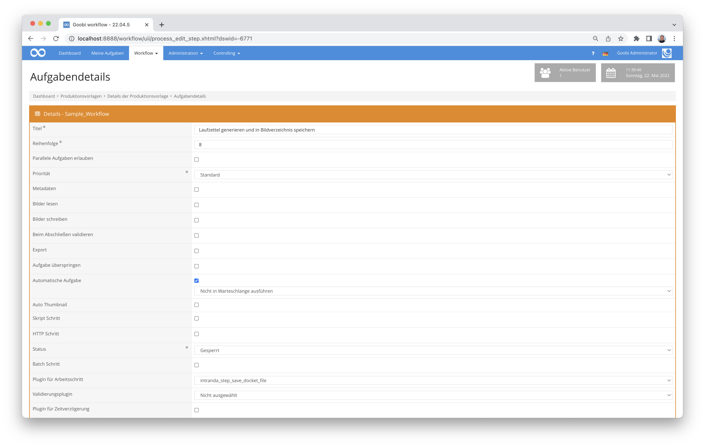

# Generierung von Laufzetteln

## Übersicht

Name                     | Wert
-------------------------|-----------
Identifier               | intranda_step_save_docket_file
Repository               | [https://github.com/intranda/goobi-plugin-step-save-docket-file](https://github.com/intranda/goobi-plugin-step-save-docket-file)
Lizenz              | GPL 2.0 oder neuer 
Letzte Änderung    | 25.07.2024 11:20:26


## Einführung
Dieses Plugin kann in beliebigen Aufgaben dafür verwendet werden, bei Abarbeitung der Aufgabe automatisch einen Laufzettel zu generieren und zu speichern. Das Plugin unterstützt PDF und TIFF-Dateien.


## Installation
Zur Installation des Plugins muss folgende Datei vorhanden sein:

```bash
/opt/digiverso/goobi/plugins/step/plugin-intranda-step-save-docket-file-base.jar
```

Um zu konfigurieren, wie sich das Plugin verhalten soll, können verschiedene Werte in der Konfigurationsdatei angepasst werden. Die Konfigurationsdatei befindet sich üblicherweise hier:

```bash
/opt/digiverso/goobi/config/plugin_intranda_step_save_docket_file.xml
```


## Konfiguration

### Konfiguration des Plugins
Die Konfiguration des Plugins ist folgendermaßen aufgebaut:

```xml
<config_plugin>
    <!--
        order of configuration is:
          1.) project name and step name matches
          2.) step name matches and project is *
          3.) project name matches and step name is *
          4.) project name and step name are *
    -->
    <config>
        <!-- which projects to use for (can be more then one, otherwise use *) -->
        <project>*</project>
        <step>*</step>

        <template file="/opt/digiverso/goobi/xslt/docket.xsl" />


        <!-- mimeType: image/tiff or application/pdf -->
        <!-- filename: name of the output file-->
        <!-- folder: name of the output folder, e.g. 'master' or 'media' -->

        <!--
        In the filename parameter, following variables can be used:
            {process} - inserts the whole process title
            {process_suffix} - inserts the suffix of the process title behind the first underscore

        Examples:
            process title: "media_abc_def"
            EPN_{process}_0000.tif -> EPN_media_abc_def_0000.tif
            EPN_{process_suffix}_0000.tif -> EPN_abc_def_0000.tif
        -->
        <output mimeType="image/tiff" filename="EPN_{process}_0000.tif" folder="master" />

        <!-- Set the number of dots per inch for the output file here. Common values are 300 or 600 -->
        <dotsPerInch>150</dotsPerInch>

    </config>
</config_plugin>
```

| Wert | Beschreibung |
| :--- | :--- |
| `project` |  Dieser Parameter legt fest, für welches Project der aktuelle `<config>` Block gelten soll. Verwendet wird hierbei der Name des Projektes. Dieser Parameter kann mehrfach pro `<config>` Block vorkommen. Wird der Wert auf `*` gesetzt, so werden alle Projekte berücksichtigt. |
| `step` | Dieser Parameter legt fest, für welche Arbeitsschritte der `<config>` Block gelten soll. Verwendet wird hier der Name des Arbeitsschritts. Dieser Parameter kann mehrfach pro `<config>` Block vorkommen. Wird der Wert auf `*` gesetzt, so werden alle Arbeitsschrite berücksichtigt. |
| `template` | Dieses Element gibt an, welches Laufzettel-Vorlage für die Generierung verwendet werden soll. Mit dem `file` Parameter wird ein absoluter Dateipfad zu einer existierenden `.xsl` Datei angegeben. |
| `output` | Dieses Element gibt an, wo und wie die Zieldatei gespeichert werden soll. Mit dem `folder` Parameter wird der entsprechende Unterordner innerhalb des `images` Ordners eines Projektes angegeben. Hier kann zum Beispiel `master` oder `media` ausgewählt werden. Mit dem Parameter `filename` wird der Dateiname angegeben. Die Dateiendung muss dabei zum angegebenen MimeType passen. Dieser wird mit dem Parameter `mimeType` konfiguriert und kann entweder auf `image/tiff` oder `application/pdf` gesetzt werden. Der `filename` Parameter erlaubt zusätzlich Variablen. Diese werden weiter unten im Detail erklärt. |
| `dotsPerInch` | Dieser Wert gibt die Auflösung des exportierten Dokumentes an. Die Einheit ist Pixel pro Zoll. Der Standardwert beträgt 150 DPI. |


### Output-Dateiname
Der Dateiname des generierten Laufzettels kann optional mit folgenden Parametern individuell festgelegt werden.

| Variable | Beschreibung |
| :--- | :--- |
| `{process}` | Fügt den gesamten zugehörigen Vorgangstitel an dieser Stelle in den Dateinamen ein. |
| `{process_suffix}` | Fügt den Teil hinter dem ersten Unterstrich (`_`) des zugehörigen Vorgangstitels an dieser Stelle in den Dateinamen ein. |

Beinhaltet ein Vorgangstitel keinen Unterstrich und wird dennoch `{process_suffix}` verwendet, so wird stattdessen der gesamte Vorgangstitel eingesetzt.

Beispiele:

| Wert in `filename=""` | Vorgangstitel | Output-Dateiname |
| :--- | :--- | :--- |
| `{process}_0000.tif` | `book_hertzbiography` | `book_hertzbiography_0000.tif` |
| `{process_suffix}_0000.tif` | `book_hertzbiography` | `hertzbiography_0000.tif` |
| `EPN_{process}_0000.tif` | `book_hertzbiography` | `EPN_book_hertzbiography_0000.tif` |
| `EPN_{process_suffix}_0000.tif` | `book_hertzbiography` | `EPN_hertzbiography_0000.tif` |
| `EPN_{process}_0000.tif` | `hertzbiography` | `EPN_hertzbiography_0000.tif` |
| `EPN_{process_suffix}_0000.tif` | `hertzbiography` | `EPN_hertzbiography_0000.tif` |


## Anwendung des Plugins

Im Falle einer automatischen Aufgabe wird das Plugin automatisch ausgeführt, sobald die entsprechende Aufgabe ausgeführt wird. Bei der entsprechenden Aufgabe gibt es in den Aufgabendetails eine zusätzliche Schaltfläche, mit der der Laufzettel jederzeit manuell erstellt werden kann.

Dieses Plugin kann auch so in den Workflow integriert werden, dass es automatisch ausgeführt wird. Eine manuelle Interaktion mit dem Plugin ist nicht notwendig. Zur Verwendung innerhalb eines Arbeitsschrittes des Workflows sollte es wie im nachfolgenden Screenshot konfiguriert werden.

