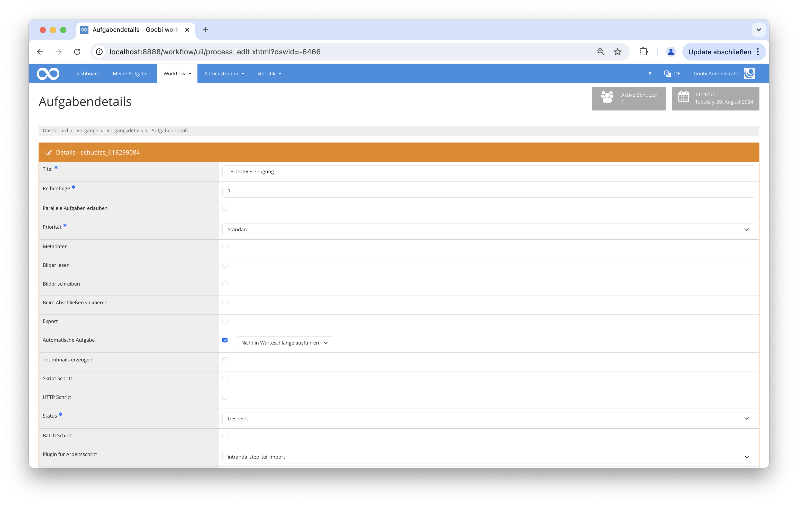

# Import von ECHO-Dateien als TEI

## Übersicht

Name                     | Wert
-------------------------|-----------
Identifier               | intranda_step_tei_import
Repository               | [https://github.com/intranda/goobi-plugin-step-tei-import](https://github.com/intranda/goobi-plugin-step-tei-import)
Lizenz              | GPL 2.0 oder neuer 
Letzte Änderung    | 21.08.2024 21:10:06


## Einführung
Das Plugin sucht zwischen den hinterlegten ECHO-XML-Dateien nach einer mit den gleichen MPIWG-ID. Diese Datei wird dann mittels einer hinterlegten XSL-Datei in eine TEI-Datei umgewandelt und innerhalb eines dafür definierten Ordners gespeichert. Danach wird diese TEI-Datei in den zugehörigen Goobi-Vorgang kopiert und dort innerhalb des _source-Unterordners gespeichert. Dabei werden die Bildverweise so angepasst, dass diese für den Goobi viewer passen werden. Innerhalb des Goobi viewer wird diese Datei anschließend als Download zur Verfügung stehen.

## Installation
Das Plugin besteht aus zwei Dateien:

```bash
goobi-plugin-step-tei-import.jar
plugin_intranda_step_tei-import.xml
```

Die Datei `goobi-plugin-step-tei-import.jar` enthält die Programmlogik und muss für den tomcat-Nutzer lesbar in folgendes Verzeichnis installiert werden:

```bash
/opt/digiverso/goobi/plugins/step/
```

Die Datei `plugin_intranda_step_tei_import.xml` muss ebenfalls für den tomcat-Nutzer lesbar sein und in folgendes Verzeichnis installiert werden:

```bash
/opt/digiverso/goobi/config/
```

## Überblick und Funktionsweise
Nachdem das Plugin installiert und konfiguriert wurde, kann es innerhalb eines Arbeitsschrittes von Goobi genutzt werden.

Dazu muss innerhalb der gewünschten Aufgabe das Plugin `plugin_intranda_step_tei_import` eingetragen werden. Des Weiteren muss die Checkbox für die Bearbeitung der Metadaten und die Automatische Aufgabe gesetzt sein.



## Konfiguration
Die Konfiguration des Plugins erfolgt innerhalb der Datei `plugin_intranda_step_tei_import.xml` wie hier aufgezeigt:

```xml
<config_plugin>
    <config>
        <!-- which projects to use for (can be more then one, otherwise use *) -->
        <project>*</project>
        <step>*</step>
        <StepName>intranda_step_tei import</StepName>
        <ErrorMessage>TEI file could not be found.</ErrorMessage>

        <!--This is the path to the XSL file for transforming ECHO files into TEI files: -->
        <xslFile>/opt/digiverso/tei/info/echo2tei2.xsl</xslFile>
    
        <!--This is the base path to the TEI files: -->
        <teiFolder>/opt/digiverso/tei/</teiFolder>
    
        <!--This is the base path to the ECHo XML files: -->
        <echoFolder>/opt/digiverso/sftpupload/upload/uploads/echo_xml/</echoFolder>
        
        <!-- rulesets for the MM files: -->
        <rulesetPath>/opt/digiverso/goobi/rulesets/mpi.xml</rulesetPath>
        
        <!-- Viewer base path: the individual pages lie here + "id no."/"page no"/-->
        <viewerPages>https://mpiviewer.intranda.com/viewer/image/</viewerPages>

        <!--This is the base path to the Goobi MM files: -->
        <goobiMMFolder>/opt/digiverso/goobi/metadata/</goobiMMFolder>
    
    </config>
</config_plugin>
```

### Allgemeine Parameter 
Der Block `<config>` kann für verschiedene Projekte oder Arbeitsschritte wiederholt vorkommen, um innerhalb verschiedener Workflows unterschiedliche Aktionen durchführen zu können. Die weiteren Parameter innerhalb dieser Konfigurationsdatei haben folgende Bedeutungen: 

| Parameter | Erläuterung | 
| :-------- | :---------- | 
| `project` | Dieser Parameter legt fest, für welches Projekt der aktuelle Block `<config>` gelten soll. Verwendet wird hierbei der Name des Projektes. Dieser Parameter kann mehrfach pro `<config>` Block vorkommen. | 
| `step` | Dieser Parameter steuert, für welche Arbeitsschritte der Block `<config>` gelten soll. Verwendet wird hier der Name des Arbeitsschritts. Dieser Parameter kann mehrfach pro `<config>` Block vorkommen. | 


### Weitere Parameter 
Neben diesen allgemeinen Parametern stehen die folgenden Parameter für die weitergehende Konfiguration zur Verfügung: 


Parameter               | Erläuterung
------------------------|------------------------------------
`xslFile`               | Hiermit wird der Pfad zur XSL-Datei hinterlegt. |
`teiFolder`             | Dieser Parameter definiert den Ordner, wo die TEI-Dateien erzeugt werden. |
`echoFolder`            | Dieser Parameter definiert den Ordner, wo die ECHO-XML-Dateien liegen. |
`rulesetPath`           | Dieser Parameter liefert den Pfad zum Regelsatz. |
`viewerPages`           | Hiermit wird die URL für den Goobi viewer festgelegt. |
`goobiMMFolder`         | Dieser Parameter definiert Pfad zummetadata Ordner. Er ist allein für Testingzwecke änderbar. |