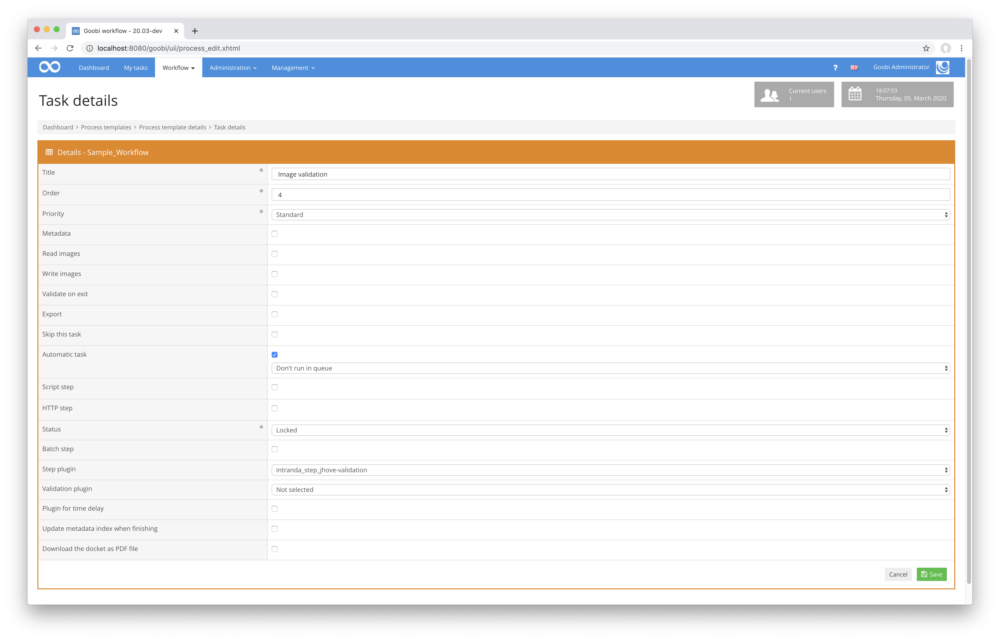

# Tif-Validierung

## Übersicht

Name                     | Wert
-------------------------|-----------
Identifier               | intranda_step_jhove-validation
Repository               | [https://github.com/intranda/goobi-plugin-step-tif-validation](https://github.com/intranda/goobi-plugin-step-tif-validation)
Lizenz              | GPL 2.0 oder neuer 
Letzte Änderung    | 04.12.2024 10:01:16


## Einführung
Diese Plugin dient zur Validierung von Bildern im Format `TIF` innerhalb von definierbaren Verzeichnissen. Die Validierung erfolgt dabei unter Zuhilfenahme der [Open-Source-Softwarebibliothek JHove ](https://jhove.openpreservation.org/) und ist weitreichend konfigurierbar.


## Installation
Zur Installation des Plugins muss zunächst die folgende Datei installiert werden:

```bash
/opt/digiverso/goobi/plugins/step/plugin_intranda_step_tif_validation-base.jar
```

Um zu konfigurieren, wie sich das Plugin verhalten soll, können verschiedene Werte in der Konfigurationsdatei angepasst werden. Die zentrale Konfigurationsdatei befindet sich üblicherweise hier:

```bash
/opt/digiverso/goobi/config/plugin_intranda_step_tif_validation.xml
```

Innerhalb diese Konfigurationsdatei ist unter anderem der Pfad zu der JHove-Konfiguration benannt. Im Falle des unten aufgeführten Beispiels ist dort der folgende Pfad angegeben:

```xml
<jhoveConfiguration>/opt/digiverso/goobi/config/jhove/jhove.conf</jhoveConfiguration>
```

Entsprechend müssen unter diesem Pfad daher auch folgende beiden Dateien installiert werden:

```xml
/opt/digiverso/goobi/config/jhove/jhove.conf
/opt/digiverso/goobi/config/jhove/jhoveConfig.xsd
```


## Überblick und Funktionsweise
Das Plugin wird üblicherweise vollautomatisch innerhalb des Workflows ausgeführt. Es ermittelt zunächst, ob sich innerhalb der Konfigurationsdatei ein Block befindet, der für den aktuellen Workflow bzgl. des Projektnamens und Arbeitsschrittes konfiguriert wurde. Wenn dies der Fall ist, werden die weiteren Parameter ausgewertet und die Checks gestartet. Ist einer der konfigurierten Checks nicht erfolgreich, so wird der konfigurierte oder alternativ der vorherige Arbeitsschritt in einen Fehlerstatus versetzt und die Validierungsmeldung in das Vorgangslog geschrieben. Sollen die Arbeitsschritte zwischen dem Validierungsschritt und dem benachrichtigten Schritt im Status auf `geschlossen` gesetzt werden, so sind diese für die Bearbeiter ebenfalls mit der Korrekturmeldung versehen und erlauben so eine Nachvollziehbarkeit des Problemfalls.

Dieses Plugin wird in den Workflow so integriert, dass es automatisch ausgeführt wird. Eine manuelle Interaktion mit dem Plugin ist nicht notwendig. Zur Verwendung innerhalb eines Arbeitsschrittes des Workflows sollte es wie im nachfolgenden Screenshot konfiguriert werden.




## Konfiguration
Die Konfiguration für das Plugin erfolgt innerhalb der zentralen Konfigurationsdatei. Sie sieht beispielhaft wie folgt aus:


```xml
<config_plugin>
    <config>
        <project>*</project>
        <step>*</step>
        <!-- folders to validate, can be multiple one (e.g. master, main etc. -->
        <folder>master</folder>
        <openStepOnError>Scanning</openStepOnError>
        <lockAllStepsBetween>true</lockAllStepsBetween>
        <jhoveConfiguration>/opt/digiverso/goobi/config/jhove/jhove.conf</jhoveConfiguration>
        <namespace uri="http://www.loc.gov/mix/v20" name="mix" />
        <namespace uri="http://schema.openpreservation.org/ois/xml/ns/jhove" name="jhove" />

        <!-- format is 'TIFF' -->
        <check>
            <xpath>string(//jhove:repInfo/jhove:format)</xpath>
            <wanted>TIFF</wanted>
            <error_message> Check format for "${image}": Expected value "${expected}", but found value "${found}".</error_message>
        </check>

        <!-- image is well-formed and valid-->
        <check>
            <xpath>//jhove:repInfo/jhove:status</xpath>
            <wanted value="Well-Formed and valid"></wanted>
            <error_message> Check status for "${image}": Expected value "${expected}", but found value "${found}".</error_message>
        </check> 
        
        <!-- compression type is 'Uncompressed' -->
        <check>
            <xpath>//mix:Compression/mix:compressionScheme</xpath>
            <wanted>Uncompressed</wanted>
            <error_message>Check compression scheme for "${image}": Expected value "${expected}", but found value "${found}".</error_message>
        </check>

        <!-- planar configuration -->
        <check>
            <xpath>//jhove:property[jhove:name='PlanarConfiguration']/jhove:values/jhove:value</xpath>
            <wanted>1</wanted>
            <error_message>Check planar configuration for "${image}": Expected value "${expected}", but found value "${found}".</error_message>
        </check>

        <!-- byte order -->
        <check>
            <xpath>//jhove:property[jhove:name='ByteOrder']/jhove:values/jhove:value</xpath>
            <wanted>little-endian</wanted>
            <error_message>Check compression scheme for "${image}": Expected value "${expected}", but found value "${found}".</error_message>
        </check>
        
        <!-- bit order is MSB-to-LSB  -->
        <check>
            <xpath>//jhove:property[jhove:name='FillOrder']/jhove:values/jhove:value</xpath>
            <wanted>1</wanted>
            <error_message>Check compression scheme for "${image}": Expected value "${expected}", but found value "${found}".</error_message>
        </check>

        <!-- color space -->
        <check>
            <xpath>//mix:PhotometricInterpretation/mix:colorSpace</xpath>
            <wanted>RGB</wanted>
            <error_message>Check compression scheme for "${image}": Expected value "${expected}", but found value "${found}".</error_message>
        </check>

        <!--Check color depth, allowed is 8,8,8 or 16,16,16-->
        <check>
            <xpath>string(//mix:samplesPerPixel[1])</xpath>
            <wanted>3</wanted>
            <error_message> Check color depth for "${image}": Expected value "${expected}", but found value "${found}".</error_message>
        </check>
        <check>
            <xpath>string(//mix:bitsPerSampleValue[1])</xpath>
            <wanted>8|16</wanted>
            <error_message> Check color depth for "${image}": Expected value is 8 or 16 but found value "${found}".</error_message>
        </check>
        <check>
            <xpath>string(//mix:bitsPerSampleValue[2])</xpath>
            <wanted>8|16</wanted>
            <error_message> Check color depth for "${image}": Expected value is 8 or 16 but found value "${found}".</error_message>
        </check>
        <check>
            <xpath>string(//mix:bitsPerSampleValue[2])</xpath>
            <wanted>8|16</wanted>
            <error_message> Check color depth for "${image}": Expected value is 8 or 16 but found value "${found}".</error_message>
        </check>

        <!-- Resolution checks -->

        <!-- values exist -->
        <check>
            <xpath>//mix:ImageAssessmentMetadata//mix:SpatialMetrics/mix:xSamplingFrequency/mix:numerator</xpath>
            <wanted>exists</wanted>
            <error_message>Check x-axis resolution": value not found".</error_message>
            <checkType>exists</checkType>
        </check>

        <check>
            <xpath>//mix:ImageAssessmentMetadata//mix:SpatialMetrics/mix:ySamplingFrequency/mix:numerator</xpath>
            <wanted>exists</wanted>
            <error_message>Check y-axis resolution": value not found".</error_message>
            <checkType>exists</checkType>
        </check>
        <check>
            <xpath>//mix:ImageAssessmentMetadata//mix:SpatialMetrics/mix:samplingFrequencyUnit</xpath>
            <wanted>exists</wanted>
            <error_message>Check resolution unit": value not found".</error_message>
            <checkType>exists</checkType>
        </check>        
        <!-- values are identical -->
        <check>
            <xpath>//mix:ImageAssessmentMetadata//mix:SpatialMetrics/mix:xSamplingFrequency/mix:numerator</xpath>
            <wanted></wanted>
            <error_message> Check resolution for "${image}": X- and Y-resolution differ.</error_message>
            <checkType>same</checkType>
            <otherXpath>//mix:ImageAssessmentMetadata//mix:SpatialMetrics/mix:ySamplingFrequency/mix:numerator</otherXpath>
        </check>
        <!-- at least 300 dpi -->
        <check>
            <xpath>//mix:ImageAssessmentMetadata//mix:SpatialMetrics/mix:xSamplingFrequency/mix:numerator</xpath>
            <wanted>300</wanted>
            <error_message>Check x-axis resolution": Expected value at least "${expected}", but found value "${found}".</error_message>
            <checkType>greater</checkType>
        </check>
        <check>
            <xpath>//mix:ImageAssessmentMetadata//mix:SpatialMetrics/mix:ySamplingFrequency/mix:numerator</xpath>
            <wanted>300</wanted>
            <error_message>Check y-axis resolution": Expected value at least "${expected}", but found value "${found}"".</error_message>
            <checkType>greater</checkType>
        </check>

        <!-- get expected resolution from process property -->
        <integrated_check name="resolution_check">
            <mix_uri>http://www.loc.gov/mix/v20</mix_uri>
            <!-- get the value from the property 'Resolution' -->
            <wanted value="{process.Resolution}">
            <!-- only when 'Resolution' contains a numeric value -->
                <condition value="{process.Resolution}" matches="^\d+" />
            </wanted>
            <!-- get the value from a different field, if 'Resolution' contains the value 'other' --> 
            <wanted value="{process.Special Resolution}">
                <condition value="{process.Resolution}" matches="other" />
            </wanted>
            <!-- default configuration that is used if none of the above conditions apply. 
            If no default configuration exists and no condition applies, the check is not executed.
            Can be a fixed value or a range. -->
            <wanted>100.0-899.23</wanted>
            <error_message> Check resolution for "${image}": Expected value "${expected}", but found value "${found}".</error_message>
        </integrated_check>

        <!-- resolution values for x-axis and y-axis are the same-->
        <integrated_check name="resolution_check">
            <mix_uri>http://www.loc.gov/mix/v20</mix_uri>
            <wanted>1</wanted>
            <error_message> Check resolution for "${image}": x-axis and y-axis differ.</error_message>
            <checkType>same</checkType>
        </integrated_check>

        <!-- resolution is at least 300 dpi-->
        <integrated_check name="resolution_check">
            <mix_uri>http://www.loc.gov/mix/v20</mix_uri>
            <wanted>300</wanted>
            <error_message> Check resolution for "${image}": must be at least "${expected}" dpi, but found value "${found}".</error_message>
            <checkType>greater</checkType>
        </integrated_check>

    </config>
</config_plugin>
```

### Allgemeine Parameter 
Der Block `<config>` kann für verschiedene Projekte oder Arbeitsschritte wiederholt vorkommen, um innerhalb verschiedener Workflows unterschiedliche Aktionen durchführen zu können. Die weiteren Parameter innerhalb dieser Konfigurationsdatei haben folgende Bedeutungen: 

| Parameter | Erläuterung | 
| :-------- | :---------- | 
| `project` | Dieser Parameter legt fest, für welches Projekt der aktuelle Block `<config>` gelten soll. Verwendet wird hierbei der Name des Projektes. Dieser Parameter kann mehrfach pro `<config>` Block vorkommen. | 
| `step` | Dieser Parameter steuert, für welche Arbeitsschritte der Block `<config>` gelten soll. Verwendet wird hier der Name des Arbeitsschritts. Dieser Parameter kann mehrfach pro `<config>` Block vorkommen. | 


### Weitere Parameter 
Neben diesen allgemeinen Parametern stehen die folgenden Parameter für die weitergehende Konfiguration zur Verfügung: 


Die Parameter innerhalb der zentralen Konfigurationsdatei des Plugins haben folgende Bedeutungen:

Parameter         | Erläuterung
------------------|----------------------------------------
`folder` | Mit diesem Parameter können Verzeichnisse festgelegt werden, deren Inhalte validiert werden sollen. Dieser Parameter kann wiederholt vorkommen. Mögliche Werte hierfür sind z.B. `master`, `media` oder auch individuelle Ordner wie `photos` und `scans`.
`openStepOnError` | Dieser Parameter legt fest, welcher Arbeitsschritt des Workflows erneut geöffnet werden soll, wenn ein Fehler innerhalb der Validierung auftritt. Wird dieser Parameter nicht verwendet, so aktiviert das Plugin stattdessen einfach den vorherigen Arbeitsschritt des Validierungsschritts.
`lockAllStepsBetween` | Mit diesem Parameter wird festgelegt, ob die Arbeitsschritte des Workflows zwischen dem Validierungsschritt und demjenigen, der innerhalb des Parameters `openStepOnError` angegeben wurde, wieder auf auf den Status gesperrt gesetzt werden sollen, so dass diese Arbeitsschritte ein erneutes Mal durchlaufen (`true`) werden müssen. Wird der Wert hingegen auf `false` gesetzt, so wird der Status der dazwischen liegenden Schritte nicht verändert, so dass die Arbeitsschritte auch nicht noch einmal durchlaufen werden.
`jhoveConfiguration` | Mit diesem Parameter wird angegeben, wo sich die Konfigurationsdatei für JHove befindet.
`check` | Innerhalb eines jeden Elements check wird festgelegt, was JHove genau validieren soll. Hier wird beispielsweise festgelegt, welches Dateiformat erwartet wird. Für den erwarteten Wert kann innerhalb des Elements `<wanted>` eine direkte Eingabe auch als Bereich erfasst werden. Ebenso ist es hier auch möglich, eine Variable zu verwenden, die durch den Variablen-Replacer ersetzt wird (z.B. `{process.Resolution}`. Zugehörig ist hierbei ebenso, welche Fehlermeldung im Falle einer fehlerhaften Validierung ausgegeben werden soll. In der Fehlermeldung können folgende Variablen genutzt werden: `${wanted}` für den exakten Inhalt aus dem Feld `<wanted>`, `${expected}` für den aufgelösten erwarteten Wert, `${found}` für den gefundenen Wert und `${image}` für den Dateinamen. Das Feld `<wanted>` kann wiederholt und mit dem Unterlement `<condition>` versehen werden. Dann wird der Check nur ausgeführt, wenn die konfigurierte Bedingung zutrifft. Im Feld `<checkType>` kann angegeben werden, wie genau die Prüfung ausgeführt wird. Der Defaultwert ist dabei `equals`, der gefundene Wert muss exakt mit dem konfigurierten Wert übereinstimmen. Die Option `multiple` prüft, ob der gefundene Wert ein vielfaches der konfigurierten Zahl ist. Bei `lesser` oder `greater` muss der gefundene Wert größer bzw. kleiner als der konfiguriert Wert sein, `exists` und `not exists` prüft auf die Existenz eines beliebigen Wertes und `same` prüft, ob der Wert mit einem anderen Wert übereinstimmt. Hierzu muss der andere Wert in `otherXpath` angegeben werden.