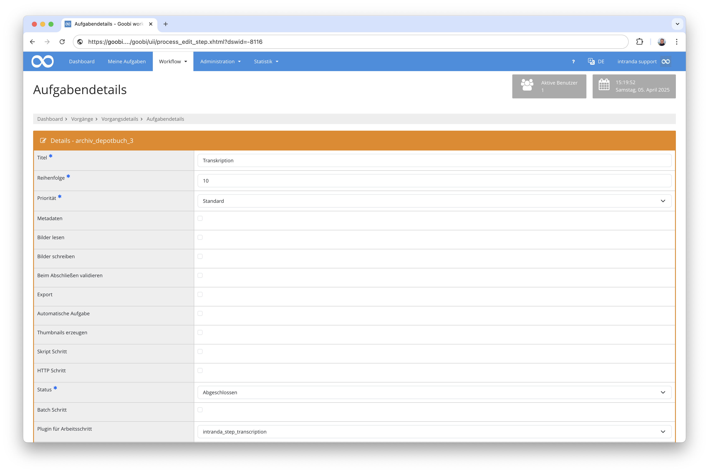
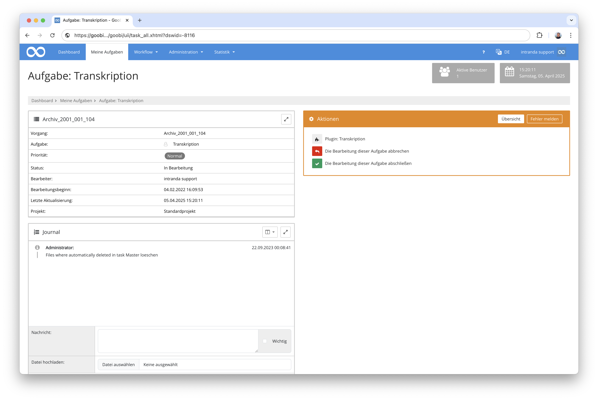

# Transkription von Bildinhalten

## Übersicht

Name                     | Wert
-------------------------|-----------
Identifier               | intranda_step_transcription
Repository               | [https://github.com/intranda/goobi-plugin-step-transcription](https://github.com/intranda/goobi-plugin-step-transcription)
Lizenz              | GPL 2.0 oder neuer 
Letzte Änderung    | 25.07.2024 11:19:07


## Einführung
Das Transkriptions-Plugin erlaubt es dem Benutzer, die txt-OCR Ergebnisse eines Goobi-Vorgangs zu bearbeiten. Dabei werden nebeneinander ein Bild und ein Rich-Text-Editor angezeigt, in dem der Text erfasst werden kann.


## Installation
Zur Nutzung des Plugins müssen diese beiden Dateien an folgende Orte kopiert werden:

```bash
/opt/digiverso/goobi/plugins/step/plugin-intranda-step-transcription-base.jar
/opt/digiverso/goobi/plugins/GUI/plugin-intranda-step-transcription-gui.jar
```

Die Konfiguration des Plugins findet innerhalb dessen Konfigurationsdatei `plugin_intranda_step_transcription.xml` statt. Diese wird unter folgendem Pfad erwartet:

```bash
/opt/digiverso/goobi/config/plugin_intranda_step_transcription.xml
```


## Überblick und Funktionsweise
Zur Inbetriebnahme des Plugins muss dieses für einen oder mehrere gewünschte Aufgaben im Workflow aktiviert werden. Dies erfolgt wie im folgenden Screenshot aufgezeigt durch Auswahl des Plugins `intranda_step_transcription` aus der Liste der installierten Plugins.



Sowie ein Nutzer anschließend eine Aufgabe annimmt, die dieses Plugin enthält, kann er dieses aus der Aufgabe heraus betreten.



Nachdem der Nutzer das Plugin betreten hat, kann er dort zwischen den Bilddateien blättern. Zur jeweilig angezeigten Seite wird dabei im rechten Bereich ein Rich-Text-Editor angezeigt, der die eventuell bereits vorhandene Transkription bzw. die ggf. vorhandenen OCR-Ergebnisse anzeigt. In diesem Editor kann nun das bisherige Ergebnis korrigiert oder auch ein ganz neuer Text transkribiert werden.


**ACHTUNG:** Bitte beachten Sie, dass dieses Plugin lediglich eine einfache Transkription von Seiteninhalten erlaubt. Hierbei ist keine Erfassung von Koordinaten für Absätze, Zeilen oder Wörter möglich.


## Konfiguration
Die Konfiguration des Plugins ist folgendermaßen aufgebaut:

```xml
<config_plugin>
    <!--
        order of configuration is:
          1.) project name and step name matches
          2.) step name matches and project is *
          3.) project name matches and step name is *
          4.) project name and step name are *
    -->

    <config>
        <!-- which projects to use for (can be more then one, otherwise use *) -->
        <project>*</project>
        <step>*</step>

        <!-- which folder to use (master|main|jpeg|source|...) -->
        <imageFolder>master</imageFolder>

        <!-- display button to finish the task directly from within the entered plugin -->
        <allowTaskFinishButtons>true</allowTaskFinishButtons>
    </config>

</config_plugin>
```

Die Parameter innerhalb dieser Konfigurationsdatei haben folgende Bedeutungen:

| Wert | Beschreibung |
| :--- | :--- |
| `project` | Dieser Parameter legt fest, für welches Projekt der aktuelle Block `<config>` gelten soll. Verwendet wird hierbei der Name des Projektes. Dieser Parameter kann mehrfach pro `<config>` Block vorkommen. |
| `step` | Dieser Parameter steuert, für welche Arbeitsschritte der Block `<config>` gelten soll. Verwendet wird hier der Name des Arbeitsschritts. Dieser Parameter kann mehrfach pro `<config>` Block vorkommen. |
| `imageFolder` | Legen Sie hier fest, aus welchem Verzeichnis die Bilder angezeigt werden sollen. Mögliche Werte hierfür sind z.B. `master`, `media` oder auch individuelle Ordner wie `photos` und `scans`. |
| `allowTaskFinishButtons` | Mit diesem Parameter kann ermöglicht werden, dass in der regulären Plugin-Oberfläche bereits Buttons zum Abschließen der Aufgabe angezeigt werden sollen, so dass das Plugin nicht zunächst verlassen werden muss. |