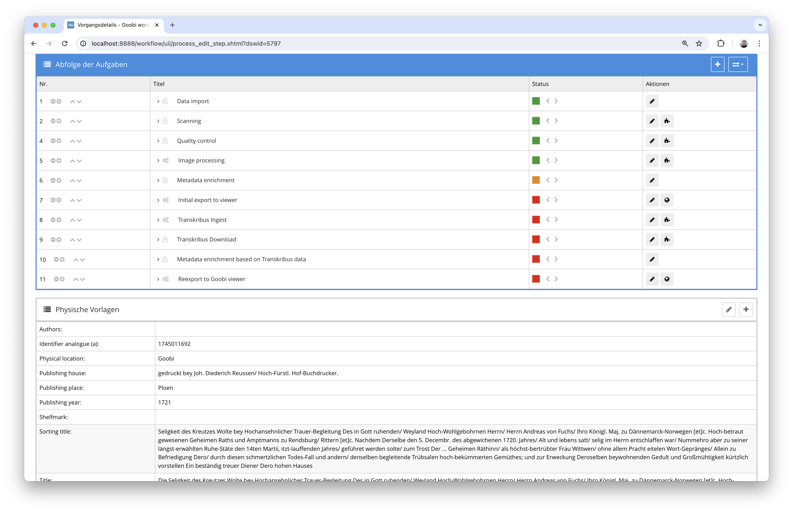
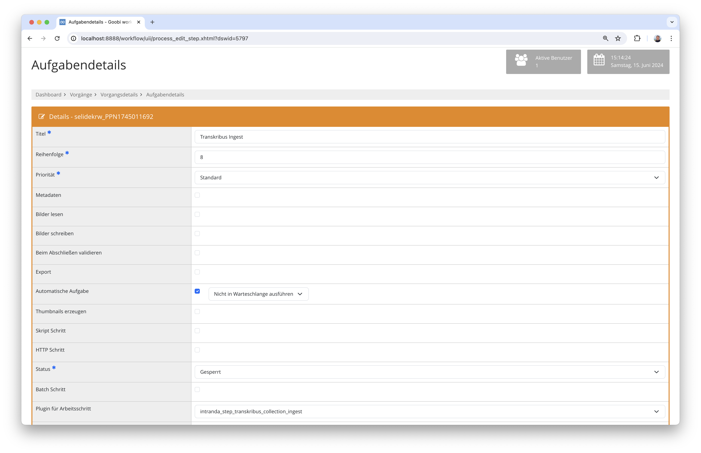

# Einspielen und Download aus Transkribus Collections

## Übersicht

Name                     | Wert
-------------------------|-----------
Identifier               | plugin-step-transkribus-collection
Repository               | [https://github.com/intranda/goobi-plugin-step-transkribus-collection](https://github.com/intranda/goobi-plugin-step-transkribus-collection)
Lizenz              | GPL 2.0 oder neuer 
Letzte Änderung    | 13.07.2024 09:56:47


## Einführung
Die vorliegende Dokumentation beschreibt die Installation, Konfiguration und den Einsatz des Step-Plugins für das Einspielen von Bildern in Transkribus Collections sowie den späteren Download der annotierten Ergebnisse als ALTO-Dateien.

## Installation
Um das Plugin nutzen zu können, müssen folgende Dateien installiert werden:

```bash
/opt/digiverso/goobi/plugins/step/plugin-step-transkribus-collection.jar
/opt/digiverso/goobi/config/plugin_intranda_step_transkribus_collection.xml
```

Nach der Installation des Plugins kann dieses innerhalb des Workflows für die jeweiligen Arbeitsschritte ausgewählt und somit automatisch ausgeführt werden. Ein Workflow könnte dabei beispielhaft wie folgt aussehen:



Für das Einspielen der Bilder in eine Transkribus-Collection muss das Werk über einer öffentlich erreichbaren METS-Datei mit dem Plugin `intranda_step_transkribus_collection_ingest` in Transkribus eingespielt werden.



Wenn das Werk innerhalb von Transkribus wie gewünscht bearbeitet wurde, kann dieses mit dem Plugin `intranda_step_transkribus_collection_download` wieder heruntergeladen werden.


## Überblick und Funktionsweise
Dieses Plugin spielt nach dessen Aufruf die METS-Datei bei Transkribus ein und nimmt eine Document-ID entgegen. Diese wird in Goobi als Eigenschaft mit dem Namen `Transkribus Document ID` für den späteren Download gespeichert. 

Nach der Bearbeitung des Werkes in Transkribus kann in einem weiteren Arbeitsschritt der Download der Ergebnisse aus Transkribus angestoßen werden. Hierfür wird erneut die die Document-ID aus der Eigenschaft verwendet und die Daten innerhalb des ALTO-Verzeichnisses im Ordner `ocr` gespeichert.


## Konfiguration
Die Konfiguration des Plugins erfolgt in der Datei `plugin_intranda_step_transkribus_collection.xml` wie hier aufgezeigt:

```xml
<config_plugin>
    <!--
        order of configuration is:
          1.) project name and step name matches
          2.) step name matches and project is *
          3.) project name matches and step name is *
          4.) project name and step name are *
	-->
    
    <config>
        <!-- which projects to use for (can be more then one, otherwise use *) -->
        <project>*</project>
        <step>*</step>
        
        <!-- Login name for Transkribus user -->
        <transkribusLogin>user</transkribusLogin>
        
        <!-- Password for Transkribus user -->
        <transkribusPassword>password</transkribusPassword>
        
        <!-- URL for the Transkribus API to use -->
        <transkribusApiUrl>https://transkribus.eu/TrpServer/rest/</transkribusApiUrl>
        
        <!-- Name of the Collection where the documents shall be added to -->
        <transkribusCollection>280768</transkribusCollection>
       
        <!-- URL where the public available METS files can be downloaded -->
        <!-- Use the complete URL here with VariableReplacer expressions like this: -->
        <!-- https://viewer.goobi.io/viewer/sourcefile?id=$(meta.CatalogIDDigital) -->
        <metsUrl>https://dibiki.ub.uni-kiel.de/viewer/sourcefile?id=$(meta.CatalogIDDigital)</metsUrl>
        
		<!-- define a delay between the ingest trigger and the finishing of the ingest in Transkribus -->
        <ingestDelay>5000</ingestDelay>

		<!-- define a delay between the export trigger and the actual download of the exported results -->
        <downloadDelay>10000</downloadDelay>
        
    </config>

</config_plugin>

```

### Allgemeine Parameter 
Der Block `<config>` kann für verschiedene Projekte oder Arbeitsschritte wiederholt vorkommen, um innerhalb verschiedener Workflows unterschiedliche Aktionen durchführen zu können. Die weiteren Parameter innerhalb dieser Konfigurationsdatei haben folgende Bedeutungen: 

| Parameter | Erläuterung | 
| :-------- | :---------- | 
| `project` | Dieser Parameter legt fest, für welches Projekt der aktuelle Block `<config>` gelten soll. Verwendet wird hierbei der Name des Projektes. Dieser Parameter kann mehrfach pro `<config>` Block vorkommen. | 
| `step` | Dieser Parameter steuert, für welche Arbeitsschritte der Block `<config>` gelten soll. Verwendet wird hier der Name des Arbeitsschritts. Dieser Parameter kann mehrfach pro `<config>` Block vorkommen. | 


### Weitere Parameter 
Neben diesen allgemeinen Parametern stehen die folgenden Parameter für die weitergehende Konfiguration zur Verfügung: 


Parameter               | Erläuterung
------------------------|-----------
`transkribusLogin`      | Geben Sie hier den Nutzernamen für Transkribus an.
`transkribusPassword`   | Geben Sie hier das Passwort für Transkribus an.
`transkribusApiUrl`     | Verwenden Sie hier die API-URL von Transkribus. Diese lautet üblicherweise `https://transkribus.eu/TrpServer/rest/`
`transkribusCollection` | Tragen Sie hier die ID der Transkribus-Collection ein, in die die Dokumente eingespielt werden sollen.
`metsUrl`               | Definieren Sie hier die URL zu der METS-Datei. Hierbei kann innerhalb der URL mit dem Variablen-System von Goobi gearbeitet werden, so dass die URL mit den richtigen Parametern ausgestattet wird.
`ingestDelay`           | Legen Sie hier einen Delay in Millisekunden fest, der für den Ingest der Daten gewartet werden soll, um anschließend die Document-ID von Transkribus abzufragen.
`downloadDelay`         | Legen Sie hier einen Delay in Millisekunden fest, der nach dem Auslösen des Exports und dem tatsächlichen Download gewartet werden soll.