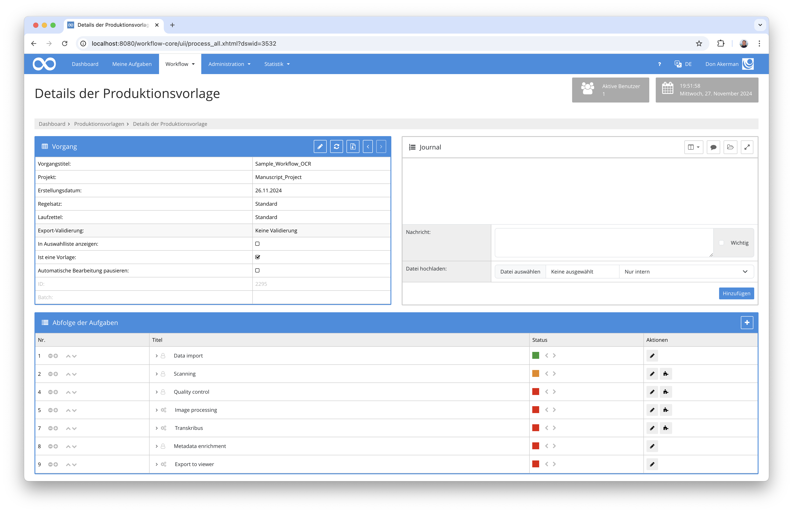
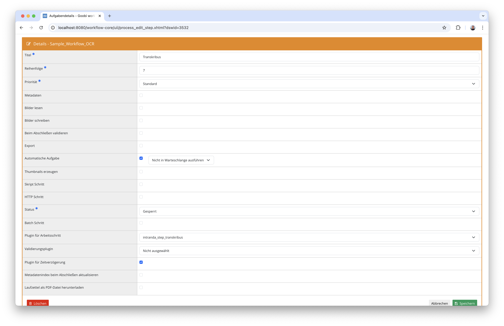
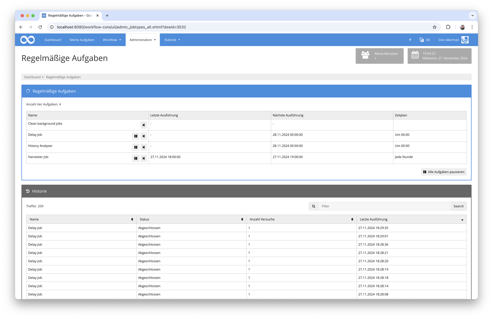
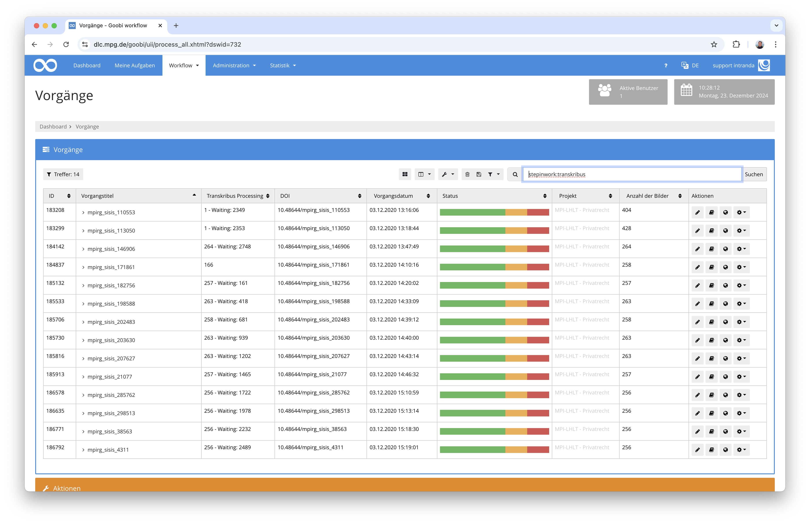

# OCR mittels Transkribus

## Übersicht

Name                     | Wert
-------------------------|-----------
Identifier               | intranda_step_transkribus
Repository               | [https://github.com/intranda/goobi-plugin-step-transkribus](https://github.com/intranda/goobi-plugin-step-transkribus)
Lizenz              | Proprietary commercial 
Letzte Änderung    | 23.12.2024 10:38:52


## Einführung
Die vorliegende Dokumentation beschreibt die Installation, Konfiguration und den Einsatz des Step-Plugins für die OCR-Durchführung mittels Transkribus.

## Installation
Um das Plugin nutzen zu können, müssen folgende Dateien installiert werden:

```bash
/opt/digiverso/goobi/plugins/step/plugin-step-transkribus-base.jar
/opt/digiverso/goobi/config/plugin_intranda_step_transkribus.xml
```

Nach der Installation des Plugins kann dieses innerhalb des Workflows für den jeweiligen Arbeitsschritt ausgewählt und damit automatisch ausgeführt werden. Ein Workflow könnte dabei beispielhaft wie folgt aussehen:



Dabei muss der Arbeitsschritt so konfiguriert werden, dass das Plugin ausgewählt wird und die Checkbox für die Zeitverzögerung gesetzt sein.




## Überblick und Funktionsweise
Das Plugin ist so konzipiert, dass es beim Start zunächst alle Bilder eines Vorgangs zu Transkribus hochlädt und den Arbeitsschritt anschließend in Bearbeitung läßt. Im Dateisystem innerhalb des Unterverzeichnisses `ocr` des Vorgangs wird dabei eine Datei `processing.json` erzeugt, die einen genauen Status der jeweiligen Seiten abbildet. Diese sieht beispielhaft so aus:

```json
{
  "uuid" : "468ec642-10ab-4748-952d-07fa1d89dff5",
  "model" : "36202",
  "pages" : [ {
    "image" : "/opt/digiverso/goobi/metadata/2298/images/buch3_03_media/00000010.jpg",
    "alto" : "/opt/digiverso/goobi/metadata/2298/ocr/buch3_03_alto/00000010.xml",
    "transkribusId" : "13121160",
    "failCounter" : 0,
    "downloadCounter" : 4,
    "numberInQueue" : 0,
    "status" : "FINISHED"
  }, {
    "image" : "/opt/digiverso/goobi/metadata/2298/images/buch3_03_media/00000011.jpg",
    "alto" : "/opt/digiverso/goobi/metadata/2298/ocr/buch3_03_alto/00000011.xml",
    "transkribusId" : "13121161",
    "failCounter" : 0,
    "downloadCounter" : 4,
    "numberInQueue" : 0,
    "status" : "FINISHED"
  }, {
    "image" : "/opt/digiverso/goobi/metadata/2298/images/buch3_03_media/00000012.jpg",
    "alto" : "/opt/digiverso/goobi/metadata/2298/ocr/buch3_03_alto/00000012.xml",
    "transkribusId" : "13121162",
    "failCounter" : 0,
    "downloadCounter" : 4,
    "numberInQueue" : 0,
    "status" : "FINISHED"
  } ],
  "lastCheck" : "2024-11-27T19:21:04",
  "created" : "2024-11-27T19:17:55"
}
```

Periodisch ruft Goobi im Hintergrund alle Delay-Plugins auf, so auch dieses. Bei jedem automatischen Aufruf und auch jedem manuellen Aufruf über die administrative Oberfläche für die regelmäßigen Aufgaben, versucht das Plugin die noch nicht abgeschlossenen Seiten herunterzuladen.



Im Fall, dass alle Seiten heruntergeladen werden konnten, wird der Arbeitsschritt geschlossen und der Workflow fortgesetzt. Im Fehlerfall hingegen, ändert der Schritt seinen Status zu einem Fehler weist entsprechende Fehlermeldungen im Journal auf.


## Einfacher Einblick in den Fortschritt
Während der Transkribus-Verarbeitung aktualisiert das Plugin den genauen Fortschritt innerhalb der Datei `processing.json`. Zusätzlich wird jedoch außerdem 
der Fortschritt der Verarbeitung als Vorgangseigenschaft mit dem Namen `Transkribus Processing` gespeichert. Diese Eigenschaft sich sich innerhalb der tabellarischen Vorgangsliste einblenden, indem Nutzer diese als zusätzliche Spalte für die Anzeige konfigurieren.


In der so angezeigten Darstellung läßt sich anschließend gut überblicken, wie der genaue Status der Verarbeitung ist. Befinden sich mehrere Vorgänge in der Verarbeitung, wird dabei nicht nur die Anzahl der noch zu verarbeitenden Bilder angezeigt sondern ebenso die Anzahl der Transkribus-Jobs, die vor der Verabeitung des Vorgangs erst noch verarbeitet werden und auf deren Abschluß gewartet werden muss.




## Einblick in die genauen Details des Fortschritts
Für den Fall, dass der genaue Fortschritt gegutachtet werden soll, kann dieser im Unterordner `ocr` des Vorgangs eingesehen werden. Dort befindet sich ein Verzeichnis mit den erzeugten ALTO-Dateien sowie die oben bereits erwähnte Datei `processing.json`.

Ein einfaches Script, dass den Pfad zu dem jeweiligen Verzeichnis des gewünschten Vorgangs öffnet, sieht so so aus und könnte unter `/usr/local/sbin/ocr-folder.sh` abgelegt werden:

```bash
#!/bin/sh
cd /opt/digiverso/goobi/metadata/$1/ocr/
$SHELL
```


## Intervention im Fehlerfall
Sollte der Fall eintreten, dass eine Seite nicht richtig hochgeladen, verarbeitet oder heruntergeladen wird, empfiehlt es sich, abhängig vom Fehlerfall folgendermaßen vorzugehen:

### Bild noch einmal komplett neu verarbeiten
Wenn einzelne Bilder in der Verarbeitung gescheitert sind, können sie noch einmal komplett neu verarbeitet werden, ohne dass die anderen Bilder aus dem gleichen Verzeichnis davon betroffen sind. Dazu geht man am besten so vor:

- Öffnen der entsprechenden `processing.json`-Datei aus dem `ocr`-Verzeichnis des Vorgangs
- Setzen des Wertes in `status` auf `RETRY` für das entsprechende Bild
- Den Arbeitsschritt im Workflow wieder auf `In Bearbeitung` setzen
- Manuell aus der administrative Oberfläche für die regelmäßigen Aufgaben den Delay-Job neu starten


### Ergebnis noch einmal herunterladen
Sollte es zu einem Problem mit dem Herunterladen der Ergebnisse gekommemn sind, weil beispielsweise die Internetanbindung verlorgen gegangen ist und die Anzahl der Download-Versuche das konfigurierte Maximum überschritten wurde, kann man die ausgewählten Bilder neu vom Transkribus-Server herunterladen lassen:

- Öffnen der entsprechenden `processing.json`-Datei aus dem `ocr`-Verzeichnis des Vorgangs
- Setzen des Wertes in `status` auf `RUNNING` für das entsprechende Bild
- Den Arbeitsschritt im Workflow wieder auf `In Bearbeitung` setzen
- Manuell aus der administrative Oberfläche für die regelmäßigen Aufgaben den Delay-Job neu starten

Sind viele Bilder davon betroffen, dass sie fälschlicherweise im Status `CANCELED` sind, läßt sich dies für einen Vorgang wie folgt einfach ändern:

```bash
sed -i "s/CANCELED/RUNNING/g" /opt/digiverso/goobi/metadata/12345678/ocr/processing.json
```

## Konfiguration
Die Konfiguration des Plugins erfolgt in der Datei `plugin_intranda_step_transkribus.xml` wie hier aufgezeigt:

```xml
<config_plugin>
    <!--
        order of configuration is:
          1.) project name and step name matches
          2.) step name matches and project is *
          3.) project name matches and step name is *
          4.) project name and step name are *
	-->
    
    <config>
        <!-- which projects to use for (can be more then one, otherwise use *) -->
        <project>*</project>
        <step>*</step>
        
       	<!-- URL for the licence server application api -->
		<url>https://lic.intranda.com/api</url>
	
		<!-- Login and Password for the licence server -->
		<login>customer</login>
		<password>user</password>
    
    	<!-- name of the property to read the model ID from -->
    	<model>Transkribus Model</model>

		<!-- defaul model ID to use in case of missing process property -->
    	<model-default>36202</model-default>
    	
		<!-- how often should a file be re-uploaded to Transkribus in the event of an error?  -->
    	<max-failed>10</max-failed>

    	<!-- how many times should an attempt be made to download a result file before it is deemed to have failed? -->
    	<max-download>100</max-download>
    
    </config>

</config_plugin>

```

### Allgemeine Parameter 
Der Block `<config>` kann für verschiedene Projekte oder Arbeitsschritte wiederholt vorkommen, um innerhalb verschiedener Workflows unterschiedliche Aktionen durchführen zu können. Die weiteren Parameter innerhalb dieser Konfigurationsdatei haben folgende Bedeutungen: 

| Parameter | Erläuterung | 
| :-------- | :---------- | 
| `project` | Dieser Parameter legt fest, für welches Projekt der aktuelle Block `<config>` gelten soll. Verwendet wird hierbei der Name des Projektes. Dieser Parameter kann mehrfach pro `<config>` Block vorkommen. | 
| `step` | Dieser Parameter steuert, für welche Arbeitsschritte der Block `<config>` gelten soll. Verwendet wird hier der Name des Arbeitsschritts. Dieser Parameter kann mehrfach pro `<config>` Block vorkommen. | 


### Weitere Parameter 
Neben diesen allgemeinen Parametern stehen die folgenden Parameter für die weitergehende Konfiguration zur Verfügung: 


Parameter         | Erläuterung
------------------|----------------------------------------
`url`             | URL für den Lizenzserver von intranda
`login`           | Login für den Lizenzserver von intranda
`password`        | Passwort für den Lizenzserver von intranda
`model`           | Zu verwendende Vorgangseigenschaft, in der die Transkribus-Model-ID hinterlegt ist. Üblicherweise heisst diese Eigenschaft `Transkribus Model`
`model-default`   | Zu verwendende Transkribus-Model-ID im Fall, dass im Vorgang keine Eigenschaft mit einem Wert vorhanden ist. Beispiel: `36202`
`max-failed`      | Anzahl der maximalen neuen Versuche, falls eine OCR für eine Seite nicht durchgeführt werden kann. Der Arbeitsschritt verbleibt beim Überschreiten der Versuche im Fehlerstatus.
`max-download`    | Anzahl der maximalen Versuche, das Ergebnis der OCR von Transkribus herunterzuladen. Der Arbeitsschritt verbleibt beim Überschreiten der Versuche im Fehlerstatus.


## Konfiguration der Zeitsteuerung
Da das Plugin als Delay-Plugin entworfen wurde, wird es durch den Scheduler von Goobi periodisch aufgerufen, um neue abgeschlossenen Seiten aus Transkribus abzufragen. Für diese periodische Abfrage greift dabei die Zeitsteuerung des `dailyDelayJob`. Diese kann mit der folgenden Syntax allerdings in der Konfigurationsdatei `goobi_config.properties` auch anders konfiguriert werden: 

```toml
# Ausführung täglich um Mitternacht 
dailyDelayJob=0 0 0 * * ? 

# Ausführung alle 15 Minuten
dailyDelayJob=0 */15 * * * ?

# Ausführung jede Stunde
dailyDelayJob=0 0 */1 * * ? 
```