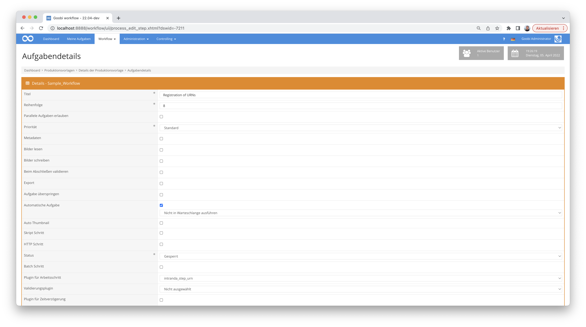

# Erzeugung von Uniform Resource Names (URN)

## Übersicht

Name                     | Wert
-------------------------|-----------
Identifier               | intranda_step_urn
Repository               | [https://github.com/intranda/goobi-plugin-step-urn](https://github.com/intranda/goobi-plugin-step-urn)
Lizenz              | GPL 2.0 oder neuer 
Letzte Änderung    | 25.07.2024 11:18:17


## Einführung
Die vorliegende Dokumentation beschreibt die Installation, die Konfiguration und den Einsatz des Step Plugins für die Generierung von Uniform Resource Names in Goobi workflow.


## Installation
Das Plugin besteht aus der folgenden Datei:

```bash
plugin-intranda-step-urn-base.jar
```

Diese Datei muss in dem richtigen Verzeichnis installiert werden, so dass diese nach der Installation an folgendem Pfad vorliegt:

```bash
/opt/digiverso/goobi/plugins/step/plugin-intranda-step-urn-base.jar
```

Daneben gibt es eine Konfigurationsdatei, die an folgender Stelle liegen muss:

```bash
/opt/digiverso/goobi/config/plugin_intranda_step_urn.xml
```

## Überblick und Funktionsweise
Das Plugin wird üblicherweise vollautomatisch innerhalb des Workflows ausgeführt. Es ermittelt zunächst, ob bereits ein Uniform Resource Name (URN) vorhanden ist. Sollte noch kein URN vorhanden sein, wird ein neuer URN registriert. Falls schon ein URN in den Metadaten vorhanden ist, wird versucht die Metadaten des URNs zu aktualisieren.

Dieses Plugin wird in den Workflow so integriert, dass es automatisch ausgeführt wird. Eine manuelle Interaktion mit dem Plugin ist nicht notwendig. Zur Verwendung innerhalb eines Arbeitsschrittes des Workflows sollte es wie im nachfolgenden Screenshot konfiguriert werden.




## Hinweis
Dieses Plugin verwendet eine leicht abgewandelte Tabellenstruktur als das alte URN Plugin. Bei einem Update muss sichergestellt werden, dass die Spalte urn in der entsprechenden Tabelle existiert. Des weiteren muss sichergestellt werden, dass z.B. für Ankerelemente, deren URN vor der Aktualisierung generiert wurde, auch ein URN in der Datenbank steht.


## Konfiguration
Die Konfiguration des Plugins erfolgt über die Konfigurationsdatei `plugin_intranda_step_urn.xml` und kann im laufenden Betrieb angepasst werden. Im folgenden ist eine beispielhafte Konfigurationsdatei aufgeführt:

```xml
<?xml version="1.0" encoding="UTF-8"?>
<config_plugin>
	<!-- order of configuration is:
    1.) project name and step name matches
    2.) step name matches and project is *
    3.) project name matches and step name is *
    4.) project name and step name are *
  -->

	<config>
		<!-- which projects to use for (can be more then one, otherwise use *) -->
		<project>*</project>
		<step>*</step>

		<!-- name of the API user -->
		<apiUser>user</apiUser>

		<!-- password of the API user -->
		<apiPassword>password</apiPassword>

		<!-- URI of the URN API, must use httos -->
		<apiUri>https://api.nbn-resolving.org/v2/</apiUri>

		<!-- namespace in which new URNs shall be created -->
		<!-- example urn:nbn:de:gbv:{SIGEL} -->
		<namespace>urn:nbn:de:{SIGEL}</namespace>

		<!-- infix that you want to use (optional) -->
		<infix>goobi-</infix>

        <!-- optional Element generationMethod,
			increment if you want to use incrementation (300,301,302...) to generate the part after the infix
			timestamp if you want to use a timestamp (2042-09-23-06-30-15) to generate the part after the infix
			the default method is increment!
		  -->
		<generationMethod>timestamp</generationMethod>

        <!-- optional Element checksum,
			false if you don't want URNs with a Checksum
			true if you want URNs with a Checksum.the default value is false;
		-->
		<checksum>false</checksum>

		<!-- example URN urn:nbn:de:gbv:48-goobi-20220404122233
        the "-" after the namespace string is always added! -->

		<!--target url the newly generated urn will forward to. {pi.urn} will be
			replaced with the newly minted urn -->
		<url>https://viewer.example.org/viewer/resolver?urn={pi.urn}</url>

		<!--Generate URN for the work (e.g. for Monograph, Manuscript, Volume, etc.)  -->
		<work>true</work>

		<!--Generate URN for the anchor Element -->
		<anchor>false</anchor>

		<!--Elements listed here will receive a URN. If work is set to true the
			work element will receive a URN, even if it is not listed here -->
    <!--
		<allowed>
			<type>Monograph</type>
		</allowed>
    -->

		<!-- metadata name for urns in METS-bloc "_urn" -->
		<typeNameMets>_urn</typeNameMets>

		<!--metadata name for URNs in MODS-bloc. -->
		<typeNameMods>URN</typeNameMods>

		<!--Shall the plugin create URNs in the MODS-bloc. The rule set entries
			of certain elements may have to be altered, if you wish to use this -->
		<createModsUrns>false</createModsUrns>
	</config>
</config_plugin>
```

| Parameter | Erläuterung |
| :--- | :--- |
| `project` | Dieser Parameter legt fest, für welches Projekt der aktuelle Block `<config>` gelten soll. Verwendet wird hierbei der Name des Projektes. Dieser Parameter kann mehrfach pro `<config>` Block vorkommen. |
| `step` | Dieser Parameter steuert, für welche Arbeitsschritte der Block `<config>` gelten soll. Verwendet wird hier der Name des Arbeitsschritts. Dieser Parameter kann mehrfach pro `<config>` Block vorkommen. |
| `apiUser` | Der Name des API-Nutzers. |
| `apiPassword` | Das Passwort des API-Nutzers. |
| `apiUri` | In diesem Parameter muss die URL der API hinterlegt werden. In der Regel kann der Standardeintrag `https://api.nbn-resolving.org/v2/` übernommen werden.  |
| `namespace` | Der Namensraum in dem der neue URNs angelegt werden. |
| `infix` | Infix, der in die generierten URNs nach dem Namensraum eingefügt wird. Eine neue URN hätte die Form `{namespace}{infix}{generatedValue}`. Der Infix ist optional. |
| `generationMethod` | Das Plugin bietet momentan 2 Optionen zur Generierung eines URN an. `timestamp` und `increment`. Der Standardwert ist `increment`. Wenn Sie `timestamp` verwenden, wird der Zeitpunkt der Generierung des URN in der Form `2022-12-23-12-00-35` hinter dem Infix angehangen. Falls Sie sich für increment entscheiden, wird ein Zähler (1,2, ...301,302,..) verwendet. |
| `checksum` | Hier kann spezifiziert werden, ob eine Prüfziffer generiert werden soll (`true`) oder nicht (`false`). |
| `url`   | Die URL unter der das digitalisierte Werk in Zukunft zur Verfügung steht. In der Regel wird die Veröffentlichungs-URL einem Muster folgen, z.B. `https://viewer.example.org/viewer/resolver?urn={pi.urn}`. Der Platzhalter {pi.urn} wird vom Plugin, durch den neuen URN ersetzt. |
| `work` | Schalter, der das Setzen von Werks-URNs aktiviert (Monographie, Manuscript, Volume, usw.). |
| `anchor` |Schalter, der das Setzen von URNs für das Ankerelement aktiviert. |
| `allowed -> type` | Hier können Sie Elemente aufzählen, für die ein URN generiert werden soll. Für jedes Element muss ein `<type>ElementName</type>` Eintrag im `<allowed>` Element angelegt werden. <br/>**Hinweis:** Wenn Sie anchor oder work auf true setzen, erhalten das Ankerelement und das Werkelement eine URN, auch wenn ihre Typnamen nicht in der Liste aufgeführt werden. |
| `typeNameMets` | Gibt den Metadatentyp an, unter dem METS-URNs erfasst werden sollen. Hier sollte die Vorgabe nicht verändert werden. |
| `typeNameMods`  | Gibt den Metadatentyp an, unter dem MODS-URNs erfasst werden sollen. Hier sollte die Vorgabe nicht verändert werden.  |
| `createModsUrns`  | Wenn Sie URNs im MODS-Block schreiben wollen, setzen Sie diesen Schalter auf `true`. Bedenken Sie jedoch, dass es eventuell notwendig ist die Regelsätze einzelner Strukturelemente anzupassen.  |