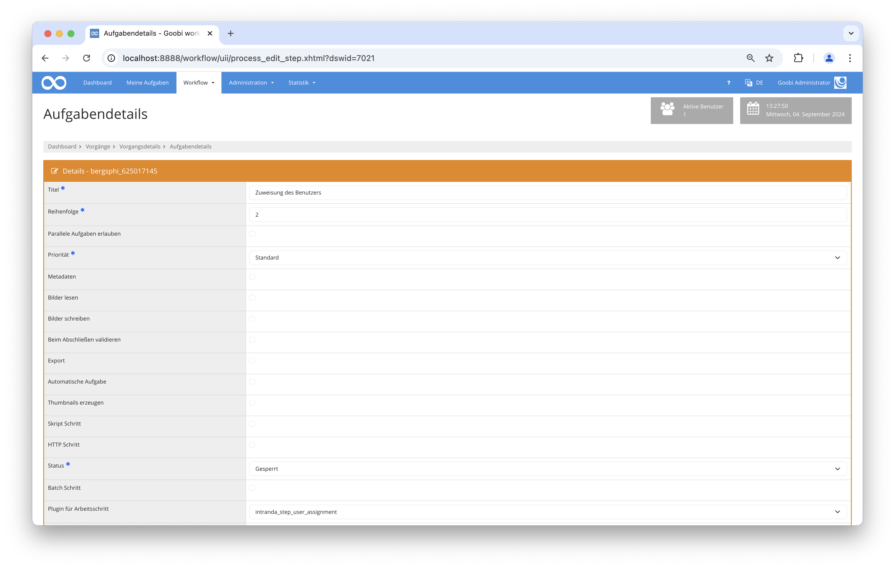
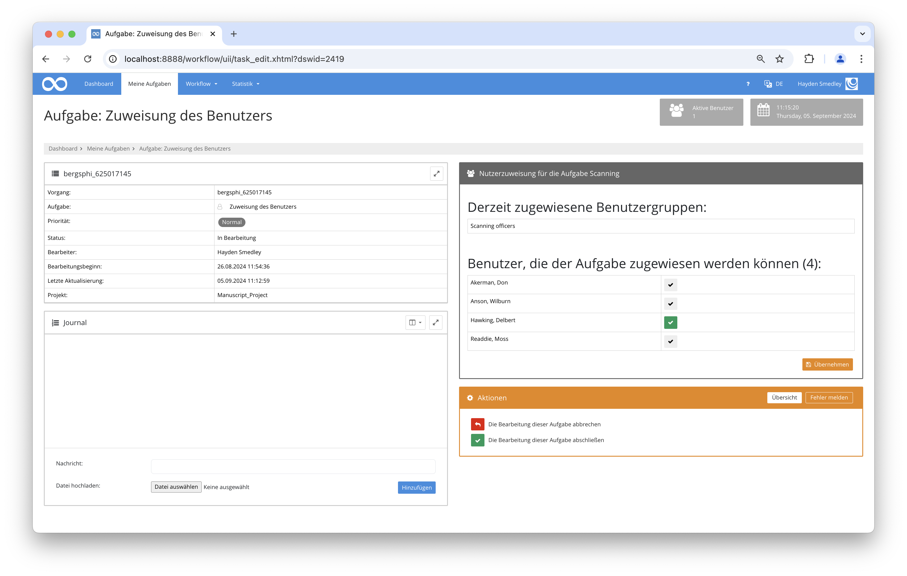

# Benutzerzuweisung

## Übersicht

Name                     | Wert
-------------------------|-----------
Identifier               | intranda_step_user_assignment
Repository               | [https://github.com/intranda/goobi-plugin-step-user-assignment](https://github.com/intranda/goobi-plugin-step-user-assignment)
Lizenz              | GPL 2.0 oder neuer 
Letzte Änderung    | 23.08.2024 12:05:40


## Einführung
Diese Dokumentation erläutert das Plugin zur Zuweisung von Benutzern an bestimmte Aufgaben im Workflow.

## Installation
Um das Plugin nutzen zu können, müssen folgende Dateien installiert werden:

```bash
/opt/digiverso/goobi/plugins/step/plugin-step-user-assignment-base.jar
/opt/digiverso/goobi/config/plugin_intranda_step_user_assignment.xml
```

Für die Verwendung des Plugins muss dieses in einem Arbeitsschritt ausgewählt sein:



Nach der Ausführung des Plugins sieht die Oberfläche des Plugins folgendermaßen aus:



## Überblick und Funktionsweise
Zuerst müssen in der Konfigurationsdatei die jeweiligen individuellen Werte eingetragen werden. Anschließend kann das Plugin ausgeführt werden. Dabei sammelt es zunächst alle angegebenen Parameter und lädt anschließend alle Benutzer. Diesen können dann Aufgaben in der Benutzeroberfläche des Plugins zugewiesen werden.

## Konfiguration
Die Konfiguration des Plugins erfolgt in der Datei `plugin_intranda_step_user_assignment.xml` wie hier aufgezeigt:

```xml
<config_plugin>
	<config>
		<!-- which process template name (can be more then one, otherwise use *) -->
		<workflow>Book workflow</workflow>
		<!-- configure the step name where the assignement shall be done (e.g. user assignement step) -->
		<assignmentStep>Decider step</assignmentStep>
		<!-- configure the step name for which the users shall be assigned (e.g. Scanning)-->
		<targetStep>Scanning</targetStep>
	</config>
	
	<config>
		<workflow>Archive workflow</workflow>
		<assignmentStep>Scanning decision step</assignmentStep>
		<targetStep>Book scanning</targetStep>
	</config>
	
	<config>
		<workflow>Archive workflow</workflow>
		<assignmentStep>QA decision step</assignmentStep>
		<targetStep>Final QA</targetStep>
	</config>
	
	<config>
		<workflow>Other workflow</workflow>
		<assignmentStep>Scanning decision step</assignmentStep>
		<targetStep>Scanning</targetStep>
	</config>
	
</config_plugin>

```

### Allgemeine Parameter 
Der Block `<config>` kann für verschiedene Projekte oder Arbeitsschritte wiederholt vorkommen, um innerhalb verschiedener Workflows unterschiedliche Aktionen durchführen zu können. Die weiteren Parameter innerhalb dieser Konfigurationsdatei haben folgende Bedeutungen: 

| Parameter | Erläuterung | 
| :-------- | :---------- | 
| `project` | Dieser Parameter legt fest, für welches Projekt der aktuelle Block `<config>` gelten soll. Verwendet wird hierbei der Name des Projektes. Dieser Parameter kann mehrfach pro `<config>` Block vorkommen. | 
| `step` | Dieser Parameter steuert, für welche Arbeitsschritte der Block `<config>` gelten soll. Verwendet wird hier der Name des Arbeitsschritts. Dieser Parameter kann mehrfach pro `<config>` Block vorkommen. | 


### Weitere Parameter 
Neben diesen allgemeinen Parametern stehen die folgenden Parameter für die weitergehende Konfiguration zur Verfügung: 


Parameter               | Erläuterung
------------------------|------------------------------------
`workflow`              | Der Name der Produktionsvorlage, die genutzt wird.|
`assignmentStep`        | Der Arbeitsschritt, in dem das Plugin aktiv wird, um Benutzer für den nächsten Schritt (`targetStep`) zuzuweisen. |
`targetStep`            | Der Arbeitsschritt, welcher der Benutzer zugewiesen wird.|