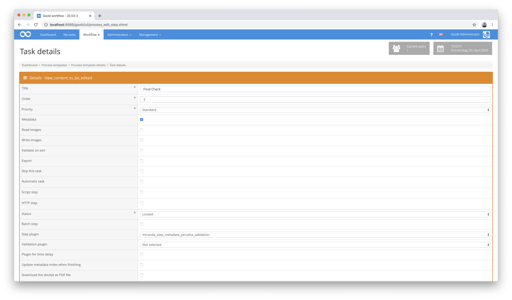
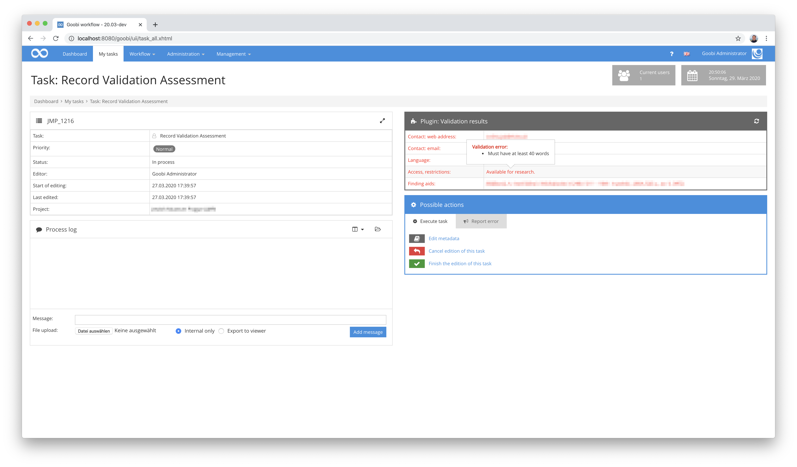

# Metadaten-Validierung innerhalb einer Aufgabe

## Übersicht

Name                     | Wert
-------------------------|-----------
Identifier               | intranda_step_metadata_yerusha_validation
Repository               | [https://github.com/intranda/goobi-plugin-step-yerusha-validation](https://github.com/intranda/goobi-plugin-step-yerusha-validation)
Lizenz              | GPL 2.0 oder neuer 
Letzte Änderung    | 25.07.2024 11:51:25


## Einführung
Diese Plugin dient zur Validierung von Metadaten aus der Goobi-METS-Datei und visualisiert die Validierungsergebnisse innerhalb einer angenommenen Aufgabe. Die Arbeitsweise des Plugins setzt voraus, dass eine Konfigurationsdatei vorhanden ist, wie sie für das folgende Workflow-Plugin benötigt wird: [Generisches Import Plugin für Excel-Dateien inklusive Validierung](https://docs.goobi.io/goobi-workflow-plugins-de/workflow-plugins/goobi-plugin-workflow-excelimport).


## Installation
Zur Nutzung des Plugins müssen diese beiden Dateien an folgende Orte kopiert werden:

```bash
/opt/digiverso/goobi/plugins/step/plugin_intranda_step_yerusha-validation-base.jar
/opt/digiverso/goobi/plugins/GUI/plugin_intranda_step_yerusha-validation-gui.jar
```

Die Konfiguration des Plugins basiert auf derjenigen des [Excel-Plugins mit Anzeige von Validierungsergebnissen](https://docs.goobi.io/goobi-workflow-plugins-de/workflow-plugins/goobi-plugin-workflow-excelimport) und wird unter folgendem Pfad erwartet:

```bash
/opt/digiverso/goobi/config/plugin_intranda_workflow_excelimport.xml
```


## Überblick und Funktionsweise
Zur Inbetriebnahme des Plugins muss dieses für einen oder mehrere gewünschte Aufgaben im Workflow aktiviert werden. Dies erfolgt wie im folgenden Screenshot aufgezeigt durch Auswahl des Plugins `intranda_step_metadata_yerusha_validation` aus der Liste der installierten Plugins.



Das Plugin wird unmittelbar nach dem Betreten einer Aufgabe ausgeführt und geöffnet. Die Ergebnisse der durchgeführten Validierung sind innerhalb der Aufgabe sofort sichtbar. Beim Bewegen der Maus oberhalb der einzelnen Fehler, ist jeweils ebenfalls eine detaillierte Fehlermeldung ersichtlich, wie sie innerhalb der Konfigurationsdatei festgelegt wurde.



Wurde die Aufgabe so konfiguriert, dass ein Betreten des Metadateneditors von Goobi erlaubt ist, und wurden darin Änderungen an den Metadaten vorgenommen, so kann die Validierung anschließend jederzeit erneut durchgeführt werden. Auch im Falle einer Änderung der Validierungsregeln innerhalb der Konfigurationsdatei ist eine solche neue Ausführung der Validierung durchaus hilfreich.


## Konfiguration
Die Konfiguration des Plugins basiert auf derjenigen des Excel-Plugins mit Anzeige von Validierungsergebnissen. [Ihr Aufbau wird hier näher erläutert. ](https://docs.goobi.io/goobi-workflow-plugins-de/workflow-plugins/goobi-plugin-workflow-excelimport#general-configuration-of-the-plugin)Sie ist folgendermaßen aufgebaut:

```xml
<config_plugin>

    <!-- which file types shall be allowed for uploading these -->
    <allowed-file-extensions>/(\\.|\\/)(xls|xlsx)$/</allowed-file-extensions>

    <qaStepName>Quality assurance</qaStepName>

    <config>
        <!-- publication type to create -->
        <publicationType>Collection</publicationType>
        <!-- which digital collection to use -->
        <collection>General</collection>
        <rowIdentifier>2</rowIdentifier>
        <!-- define in which row the header is written, usually 1 -->
        <rowHeader>3</rowHeader>
        <!-- define in which row the data starts, usually 2 -->
        <rowDataStart>4</rowDataStart>
        <!-- define in which row the data ends, usually 20000 -->
        <rowDataEnd>100</rowDataEnd>
        <identifierHeaderName>1</identifierHeaderName>

        <metadata ugh="CatalogIDDigital" identifier="1" required="true" requiredErrorMessage="Field is required" pattern="^[A-Z]*-\\d*$" patternErrorMessage="Needs to be of the Format AAA-000" />
        <metadata ugh="Country" identifier="2" required="true" requiredErrorMessage="Field is required" list="/opt/digiverso/goobi/config/plugin_intranda_workflow_excelimport_ISO3166-1.txt" listErrorMessage="Content not in list of valid options"/>
        <metadata ugh="Institution" identifier="3" required="true" requiredErrorMessage="Field is required" />
        <metadata ugh="InstitutionOfficial" identifier="4" required="true" requiredErrorMessage="Field is required" />
        <metadata ugh="LanguageInstitution" identifier="4a" required="true" requiredErrorMessage="Field is required" list="/opt/digiverso/goobi/config/plugin_intranda_workflow_excelimport_ISO639-2.txt" listErrorMessage="Content not in list of valid options"/>
        <metadata ugh="ContactPostal" identifier="5a"  required="true" requiredErrorMessage="Field is required" />
        <metadata ugh="ContactPhone" identifier="5b" required="true" requiredErrorMessage="Field is required" pattern="^[\\d-+() ]*$" patternErrorMessage="May only contain numbers, +, -, ( and )"/>
        <metadata ugh="ContactWeb" identifier="5c" required="true" requiredErrorMessage="Field is required" pattern="^(https?|ftp|file)://[-a-zA-Z0-9+&amp;@#/%?=~_|!:\,.;]*[-a-zA-Z0-9+&amp;@#/%=~_|]" patternErrorMessage="Must be valid web address"/>
        <metadata ugh="ContactEmail" identifier="5d" required="true" requiredErrorMessage="Field is required" pattern="(?:[a-z0-9!#$%&amp;'*+/=?^_`{|}~-]+(?:\\.[a-z0-9!#$%&amp;'*+/=?^_`{|}~-]+)*|\&quot;(?:[\\x01-\\x08\\x0b\\x0c\\x0e-\\x1f\\x21\\x23-\\x5b\\x5d-\\x7f]|\\\\[\\x01-\\x09\\x0b\\x0c\\x0e-\\x7f])*\&quot;)@(?:(?:[a-z0-9](?:[a-z0-9-]*[a-z0-9])?\\.)+[a-z0-9](?:[a-z0-9-]*[a-z0-9])?|\\[(?:(?:25[0-5]|2[0-4][0-9]|[01]?[0-9][0-9]?)\\.){3}(?:25[0-5]|2[0-4][0-9]|[01]?[0-9][0-9]?|[a-z0-9-]*[a-z0-9]:(?:[\\x01-\\x08\\x0b\\x0c\\x0e-\\x1f\\x21-\\x5a\\x53-\\x7f]|\\\\[\\x01-\\x09\\x0b\\x0c\\x0e-\\x7f])+)\\])$" patternErrorMessage="Must be valid Email address"/>
        <metadata ugh="ReferenceNumber" identifier="6a" required="true" requiredErrorMessage="Field is required" />
        <metadata ugh="ReferenceNumberType" identifier="6b" required="true" requiredErrorMessage="Field is required" />
        <metadata ugh="TitleDocMain" identifier="7" required="true" requiredErrorMessage="Field is required" />
        <metadata ugh="TitleDocMainOfficial" identifier="8" required="true" requiredErrorMessage="Field is required"/>
        <metadata ugh="TitleDocMainLanguage" identifier="8a" required="true" requiredErrorMessage="Field is required" list="/opt/digiverso/goobi/config/plugin_intranda_workflow_excelimport_ISO639-2.txt" listErrorMessage="Content not in list of valid options"/>
        <metadata ugh="Creator" identifier="9" required="true" requiredErrorMessage="Field is required" />
        <metadata ugh="DateOfOrigin" identifier="10" either="11" eitherErrorMessage="Either this or 11 must have content" pattern="(^\\d{4}$|^\\d{4}/\\d{4}$|^\\d{4}-\\d{2}$|^\\d{4}-\\d{2}/\\d{4}-\\d{2}$)" patternErrorMessage="Invalid date Format"/>
        <metadata ugh="DateNote" identifier="11" either="10" eitherErrorMessage="Either this or 10 must have content"/>
        <metadata ugh="DocLanguage" identifier="12" required="true" requiredErrorMessage="Field is required" list="/opt/digiverso/goobi/config/plugin_intranda_workflow_excelimport_ISO639-2.txt" listErrorMessage="Content not in list of valid options"/>
        <metadata ugh="Extent" identifier="13" required="true" requiredErrorMessage="Field is required"/>
        <metadata ugh="MaterialDescription" identifier="14a" required="true" requiredErrorMessage="Field is required" pattern="(^[Aa]udio$|^[Cc]artographic [Mm]aterial$|^[Gg]raphic [Mm]aterial$|^[Pp]hotographic [Ii]mages$|^[Tt]extual [Mm]aterial$|^[Mm]oving [Ii]mages$)" patternErrorMessage="Must be one of Audio\, Cartographic Material\, Graphic Material\, Photographic Images\, Textual Material\, Moving Images"/>
        <metadata ugh="MaterialDescription" identifier="14b" requiredFields="14a" requiredFieldsErrormessage="May only have content if 14a is filled" pattern="(^[Aa]udio$|^[Cc]artographic [Mm]aterial$|^[Gg]raphic [Mm]aterial$|^[Pp]hotographic [Ii]mages$|^[Tt]extual [Mm]aterial$|^[Mm]oving [Ii]mages$)" patternErrorMessage="Must be one of Audio\, Cartographic Material\, Graphic Material\, Photographic Images\, Textual Material\, Moving Images"/>
        <metadata ugh="MaterialDescription" identifier="14c" requiredFields="14a; 14b" requiredFieldsErrormessage="May only have content if 14a and 14b are filled" pattern="(^[Aa]udio$|^[Cc]artographic [Mm]aterial$|^[Gg]raphic [Mm]aterial$|^[Pp]hotographic [Ii]mages$|^[Tt]extual [Mm]aterial$|^[Mm]oving [Ii]mages$)" patternErrorMessage="Must be one of Audio\, Cartographic Material\, Graphic Material\, Photographic Images\, Textual Material\, Moving Images"/>
        <metadata ugh="Condition" identifier="15" required="true" requiredErrorMessage="Field is required" pattern="(^[Gg]ood$|^[Pp]oor$)" patternErrorMessage="Needs to be either good or poor"/>
        <metadata ugh="ScopeContent" identifier="16" required="true" requiredErrorMessage="Field is required" wordcount="400" wordcountErrorMessage="Must have at least 400 words" />
        <metadata ugh="ArchivalHistory" identifier="17" required="true" requiredErrorMessage="Field is required" wordcount="50" wordcountErrorMessage="Must have at least 50 words"/>
        <metadata ugh="AdministrativeHistory" identifier="18" required="true" requiredErrorMessage="Field is required" wordcount="100" wordcountErrorMessage="Must have at least 100 words"/>
        <metadata ugh="AccessLocations" identifier="19a" />
        <metadata ugh="AccessPersons" identifier="19b" />
        <metadata ugh="AccessCorporate" identifier="19c" />
        <metadata ugh="AccessSubject" identifier="19d" />
        <metadata ugh="Arrangement" identifier="20" wordcount="50" wordcountErrorMessage="Must have at least 50 words"/>
        <metadata ugh="AccessRestrictions" identifier="21" wordcount="40" wordcountErrorMessage="Must have at least 40 words"/>
        <metadata ugh="FindingAids" identifier="22" wordcount="40" wordcountErrorMessage="Must have at least 40 words"/>
        <metadata ugh="FindingAidsLink" identifier="22a" pattern="^(https?|ftp|file)://[-a-zA-Z0-9+&amp;@#/%?=~_|!:\,.;]*[-a-zA-Z0-9+&amp;@#/%=~_|]" patternErrorMessage="Must be valid web address"/>
        <metadata ugh="Copies" identifier="23" />
        <metadata ugh="Originals" identifier="24" />
        <metadata ugh="AuthorOfDescription" identifier="25" />
    </config>
</config_plugin>
```