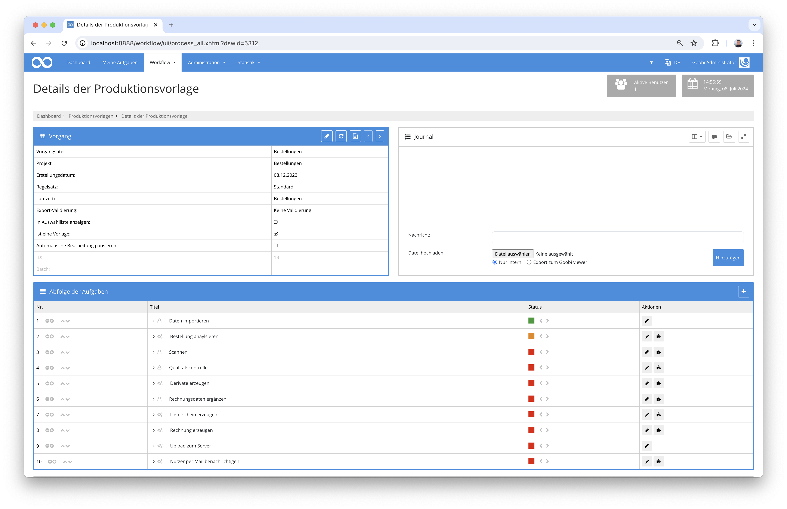
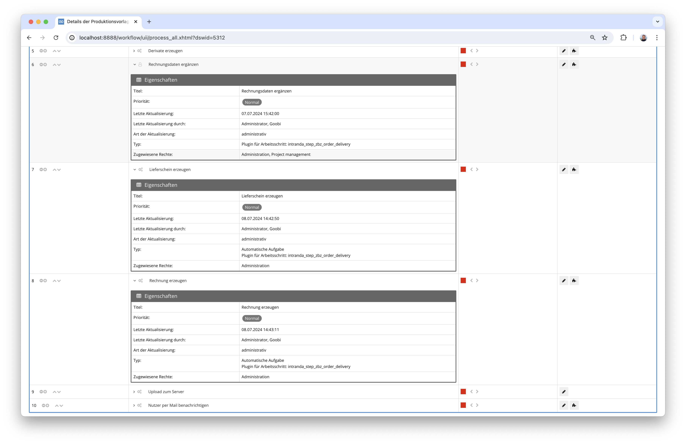
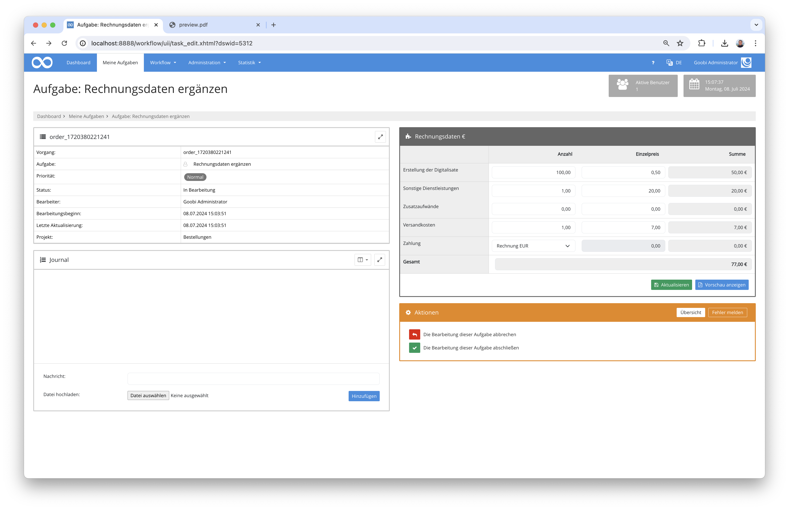

# Rechnungen und Lieferscheine für Nutzerbestellungen

## Übersicht

Name                     | Wert
-------------------------|-----------
Identifier               | intranda_step_zbz_order_delivery
Repository               | [https://github.com/intranda/goobi-plugin-step-zbz-order-delivery](https://github.com/intranda/goobi-plugin-step-zbz-order-delivery)
Lizenz              | GPL 2.0 oder neuer 
Letzte Änderung    | 13.07.2024 09:56:41


## Einführung
Die vorliegende Dokumentation beschreibt die Installation, Konfiguration und den Einsatz des Step-Plugins für die Erzeugung von Lieferscheinen und Rechnungen für Nutzerbestellungen an der Zentralbibliothek Zürich.

## Installation
Um das Plugin nutzen zu können, müssen folgende Dateien installiert werden:

```bash
/opt/digiverso/goobi/plugins/step/plugin-step-zbz-order-delivery-base.jar
/opt/digiverso/goobi/plugins/GUI/plugin-step-zbz-order-delivery-gui.jar
/opt/digiverso/goobi/config/plugin_intranda_step_zbz_order_delivery.xml
/opt/digiverso/goobi/xslt/delivery_invoice.xsl
/opt/digiverso/goobi/xslt/delivery_note.xsl
/opt/digiverso/goobi/xslt/delivery_preview.xsl
/opt/digiverso/goobi/xslt/letterhead.png
/opt/digiverso/goobi/xslt/preview.png
```

Nach der Installation des Plugins kann dieses innerhalb des Workflows für die jeweiligen Arbeitsschritte ausgewählt und somit teilweise manuell und teilweise automatisch ausgeführt werden. Ein Workflow könnte dabei beispielhaft wie folgt aussehen:



In diesem beispielhaften Workflow ist das Plugin insgesamt in drei Arbeitsschritten eingebunden. Der erste dieser Arbeitsschritte stellt dabei eine Nutzeroberfläche für die manuelle Bearbeitung durch einen Nutzer zur Verfügung, um zusätzliche Rechnungdaten erfassen zu lassen. Die beiden anderen Arbeitsschritte hingegen rufen das Plugin jeweils automatisch auf und erzeugen dabei einen Lieferschein und eine Rechnung im Dateisystem.




## Überblick und Funktionsweise
Das Plugin ist so konzipiert, dass es einen Lieferschein und eine Rechnung als PDF-Dateien auf der Basis von einer XSL-Transformation generiert. Die hierfür verwendeten Daten stammen einerseits aus Eigenschaften, die während der Bestellung durch den Nutzer an Goobi übertragen wurden (z.B. Adressinformationen, Kontaktdaten usw.). Andererseits werden für die Berechnung der abzurechnenden Kosten weitergehende Daten durch einen Bearbeiter in Goobi erfasst. Die Erfassung dieser Daten erfolgt dabei in einem manuellen Arbeitsschritt in den folgenden Formular:



Hier können die zusätzlichen Daten eingetragen und angepasst werden. Auch ist es an dieser Stelle möglich, nach Eingabe der zusätzlichen Rechnungsdaten eine Vorschau der künftigen Rechnung generieren zu lassen.


Nach Abschluß des Arbeitsschritts zur Datenerfassung kann das Plugin weitere Male im Workflow eingebunden werden, um PDF-Dateien gemäß der Layoutvorgaben aus den xsl-Dateien zu generieren.

Im weiteren Verlauf des Workflows können diese generierten PDF-Dateien, deren Speicherpfad und Benennung innerhalb der Konfigurationsdatei festgelegt werden können, z.B. an den Nutzer per E-Mail versendet werden.

## Konfiguration
Die Konfiguration des Plugins erfolgt in der Datei `plugin_intranda_step_zbz_order_delivery.xml` wie hier aufgezeigt:

```xml
<config_plugin>
    <!--
        order of configuration is:
          1.) project name and step name matches
          2.) step name matches and project is *
          3.) project name matches and step name is *
          4.) project name and step name are *
	-->
    
    <config>
        <!-- which projects to use for (can be more then one, otherwise use *) -->
        <project>*</project>
        <step>*</step>
        
        <!-- use debug mode if the temporary xml shall be saved in the Goobi tmp folder -->
		<debugMode>true</debugMode>
		
		<!-- Name of xsl file inside of the goobi xslt-folder that shall be used for the PDF generation -->
		<xslt>delivery_note.xsl</xslt>

		<!-- into which folder shall the generated PDF be stored, possible values are master|media|jpeg|source|delivery|invoice|... 
			make sure that the folder is configured inside of goobi_config.properties like this:
			
			process.folder.images.delivery={processtitle}_delivery
			process.folder.images.invoice={processtitle}_invoice	
		-->
		<resultFolder>delivery</resultFolder>
        
		<!-- Name of result pdf file that shall be generated -->
		<resultFile>delivery_note.pdf</resultFile>
    </config>

	<config>
        <!-- which projects to use for (can be more then one, otherwise use *) -->
        <project>*</project>
        <step>Rechnung</step>
		
        <!-- use debug mode if the temporary xml shall be saved in the Goobi tmp folder -->
		<debugMode>true</debugMode>
		
		<!-- Name of xsl file inside of the goobi xslt-folder that shall be used for the PDF generation -->
		<xslt>delivery_invoice.xsl</xslt>

		<!-- into which folder shall the generated PDF be stored, possible values are master|media|jpeg|source|delivery|invoice|... 
			make sure that the folder is configured inside of goobi_config.properties like this:
			
			process.folder.images.delivery={processtitle}_delivery
			process.folder.images.invoice={processtitle}_invoice	
		-->
		<resultFolder>delivery</resultFolder>
        
		<!-- Name of result pdf file that shall be generated -->
		<resultFile>delivery_invoice.pdf</resultFile>
    </config>

	<config>
        <!-- which projects to use for (can be more then one, otherwise use *) -->
        <project>*</project>
        <step>Rechnungsdaten ergänzen</step>
        
        <!-- use debug mode if the temporary xml shall be saved in the Goobi tmp folder -->
		<debugMode>true</debugMode>
		
		<!-- Name of xsl file inside of the goobi xslt-folder that shall be used for the PDF generation -->
		<xslt>delivery_preview.xsl</xslt>

		<!-- into which folder shall the generated PDF be stored, possible values are master|media|jpeg|source|delivery|invoice|... 
			make sure that the folder is configured inside of goobi_config.properties like this:
			
			process.folder.images.delivery={processtitle}_delivery
			process.folder.images.invoice={processtitle}_invoice	
		-->
		<resultFolder>delivery</resultFolder>
        
		<!-- Name of result pdf file that shall be generated -->
		<resultFile>delivery_preview.pdf</resultFile>
    </config>

</config_plugin>

```

### Allgemeine Parameter 
Der Block `<config>` kann für verschiedene Projekte oder Arbeitsschritte wiederholt vorkommen, um innerhalb verschiedener Workflows unterschiedliche Aktionen durchführen zu können. Die weiteren Parameter innerhalb dieser Konfigurationsdatei haben folgende Bedeutungen: 

| Parameter | Erläuterung | 
| :-------- | :---------- | 
| `project` | Dieser Parameter legt fest, für welches Projekt der aktuelle Block `<config>` gelten soll. Verwendet wird hierbei der Name des Projektes. Dieser Parameter kann mehrfach pro `<config>` Block vorkommen. | 
| `step` | Dieser Parameter steuert, für welche Arbeitsschritte der Block `<config>` gelten soll. Verwendet wird hier der Name des Arbeitsschritts. Dieser Parameter kann mehrfach pro `<config>` Block vorkommen. | 


### Weitere Parameter 
Neben diesen allgemeinen Parametern stehen die folgenden Parameter für die weitergehende Konfiguration zur Verfügung: 


Parameter         | Erläuterung
------------------|----------------------------------------
`debugMode`       | Mit diesem Parameter läßt sich festlegen, dass bei der Generierung einer Rechnung oder eines Lieferscheins eine XML-Datei innerhalb des tmp-Ordners von Goobi abgelegt wird, die einen Einblick in die Berechnungsgrundlage für die Rechnung darstellt.
`xslt`            | Geben sie hier den Namen der `xsl-Datei` an, die für die Erzeugung der PDF-Datei verwendet werden soll.
`resultFolder`    | Legen Sie hier das Verzeichnis fest, wo die PDF-Datei gespeichert werden soll.
`resultFile`      | Definieren Sie hier den Namen der zu generierenden PDF-Datei.