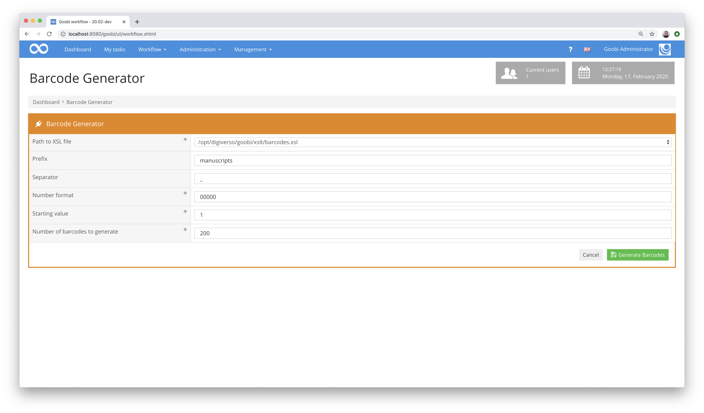
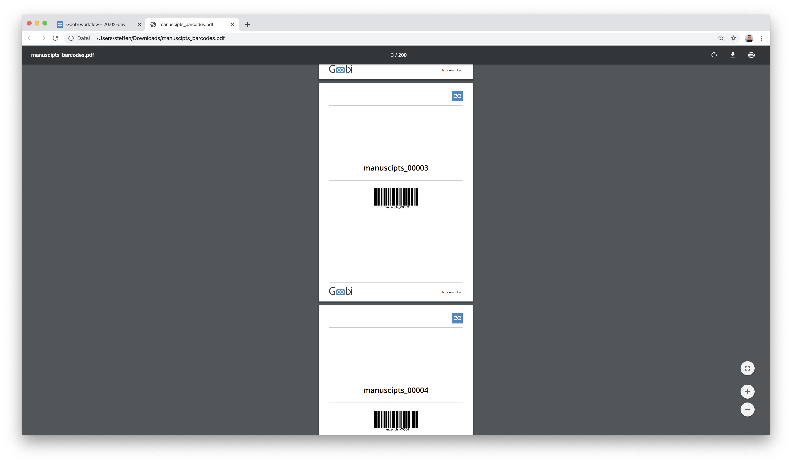

# Barcode Generator

## Übersicht

Name                     | Wert
-------------------------|-----------
Identifier               | intranda_workflow_barcode_generator
Repository               | [https://github.com/intranda/goobi-plugin-workflow-barcode-generator](https://github.com/intranda/goobi-plugin-workflow-barcode-generator)
Lizenz              | GPL 2.0 oder neuer 
Letzte Änderung    | 24.07.2024 20:12:06


## Einführung
Dieses Workflow-Plugin dient zur flexiblen Generierung von Barcodes in einer mehrseitigen PDF-Datei. Hierzu kann der Nutzer in einer Nutzeroberfläche verschiedene Werte konfigurieren und festlegen, welche Anzahl an Barcodes mit welchem Präfix und welchem Zähler erzeugt werden sollen. Zugleich kann festgelegt werden, welche `xsl-Datei` für de Generierung der `PDF-Datei` verwendet werden soll, so dass ein großes Maß an Freiheit hinsichtlich der optischen Gestaltung besteht.


## Installation
Zur Installation des Plugins müssen folgende beiden Dateien installiert werden:

```bash
/opt/digiverso/goobi/plugins/workflow/plugin-intranda-workflow-barcode-generator-base.jar
/opt/digiverso/goobi/plugins/GUI/plugin-intranda-workflow-barcode-generator-gui.jar
```

Um zu konfigurieren, wie sich das Plugin verhalten soll, können verschiedene Werte in der Konfigurationsdatei angepasst werden. Die Konfigurationsdatei befindet sich üblicherweise hier:

```bash
/opt/digiverso/goobi/config/plugin_intranda_workflow_barcode-generator.xml
```

Der Inhalt dieser Konfigurationsdatei sieht wie folgt aus:

```xml
<config_plugin>

    <!--  default value for the number format -->
    <format>00000</format>

    <!--  default value for the amount of barcodes to be generated -->
    <amount>200</amount>

    <!--  default value the first barcode number -->
    <start>1</start>

    <!--  default value the first barcode number -->
    <prefix></prefix>

    <!--  default separator to use between prefix and counter,
    if the prefix is empty this separator does not get used -->
    <separator>_</separator>

    <!-- path to xslt file for barcode generation,
    this value can exist multiple times and gets displayed as dropdown list -->
    <xslt-path>/opt/digiverso/goobi/xslt/barcodes.xsl</xslt-path>

</config_plugin>
```

## Überblick und Funktionsweise
Wenn das Plugin korrekt installiert und konfiguriert wurde, ist es innerhalb des Menüpunkts Workflow zu finden. Nach dem Betreten können in der Oberfläche die oben beschriebenen Parameter noch einmal individuell angepasst werden.



Nach dem Klick auf den Button Barcodes generieren steht eine PDF-Datei zum Download bereit. Eine PDF-Datei mit der hier aufgeführten Referenzkonfiguration sieht beispielsweise folgendermaßen aus:



Zur Veranschaulichung der Bedienung steht hier ein Screencast für die Benutzung des Plugins zur Verfügung.

[Screencast zur Benutzung des Plugins](https://www.youtube.com/watch?v=Eh8H4k1sKvE)


## Konfiguration

### Allgemeine Konfiguration des Plugins
Die Konfiguration des Plugins erfolgt innerhalb der oben bereits erwähnten Konfigurationsdatei. Dort können für verschiedene Felder Defaultwerte definiert werden. Diese lauten wie folgt:

| Wert | Beschreibung |
| :--- | :--- |
| `format` | Dieser Parameter legt fest, ob die Zähler mit führenden Nullen aufgefüllt werden sollen. Der Wert `00000` beispielsweise legt fest, dass alle Zahlen zumindest mit fünf Stellen angezeigt werden. |
| `amount` | Dieser Parameter legt fest, wieviele Barcodes festgelegt werden. |
| `start` | Soll der Zähler für die Barcodes bei einem bestimmten Startwert beginnen, so kann dieser hier festgelegt werden. |
| `prefix` | Dieser Parameter definiert einen Präfix, der dem Zähler mit einem Unterstrich `_` vorangestellt wird. |
| `separator` | Mit diesem Parameter kann ein Trennzeichen angegeben werden, dass zwischen Präfix und dem Zähler verwendet werden soll. Sollte der Präfix hingegen nicht angegeben sein, wird das Trennzeichen nicht verwendet. |
| `xslt-path` | Der Parameter `xslt-path` erlaubt die Definition beliebig vieler xsl-Dateien. Die hier konfigurierten Dateien werden dem Nutzer anschließend innerhalb der Nutzeroberfläche zur Auswahl angeboten. |


### Layout der Barcodes
Die Generierung der Barcodes erfolgt auf der Basis sogenannter [XSLT Transformation](https://www.w3schools.com/xml/xsl_transformation.asp). Dazu wird auf der Basis einer XSL-Datei eine PDF-Datei generiert und anschließend zum Download angeboten. Die Festlegung, wie die zu generierende PDF-Datei aussehen soll und welche Inhalte sie wie anzeigt erfolgt innerhalb einer solchen XSL-Datei. Genau wie auch die anderen XSL-Dateien, die Goobi workflow bereits für die Generierung der Laufzettel verwendet, sollten die XSL-Dateien im Idealfall im zentralen Verzeichnis `xslt` von Goobi liegen. Dieses befindet sich üblicherweise hier:

```bash
/opt/digiverso/goobi/xslt/
```

In diesem Ordner befinden sich zumeist mehrere solcher XSL-Dateien. Die Referenzdatei für den Aufbau der generierten Barcodes befindet sich in dieser ebenfalls im Rahmen der Plugin-Installation installierten Datei:

```bash
/opt/digiverso/goobi/xslt/barcodes.xsl
```

Sie verfügt über den folgenden Inhalt:

```xml
<?xml version="1.0" encoding="iso-8859-1"?>
<xsl:stylesheet xmlns:xsl="http://www.w3.org/1999/XSL/Transform" xmlns:fo="http://www.w3.org/1999/XSL/Format"
    xmlns:goobi="http://www.goobi.io/logfile" version="1.1" exclude-result-prefixes="fo">
    <xsl:output method="xml" indent="yes" />
    <xsl:template match="goobi:process">
        <fo:root xmlns:fo="http://www.w3.org/1999/XSL/Format">

            <!-- general layout -->
            <fo:layout-master-set>
                <fo:simple-page-master master-name="page" page-width="14.8cm" page-height="21.0cm" margin-left="1cm" margin-top="0.7cm"
                    margin-right="1cm">
                    <fo:region-body />
                </fo:simple-page-master>
            </fo:layout-master-set>

            <!-- run through each item to generate a new page with a barcode -->
            <xsl:for-each select="goobi:item">
                <fo:page-sequence master-reference="page">
                    <fo:flow flow-name="xsl-region-body" font-family="opensans, unicode">

                        <!-- Institution logos -->
                        <fo:block text-align="right">
                            <fo:external-graphic src="/opt/digiverso/goobi/xslt/logo_favicon.png" content-width="10mm" top="0cm"/>
                        </fo:block>

                        <!-- Separator -->
                        <fo:block border-top-width="1pt" border-top-style="solid" border-top-color="#cccccc" margin-top="7pt" />

                        <!-- identifier as readable text -->
                        <fo:block text-align="center" font-weight="bold" font-size="20pt" margin-top="160pt">
                            <xsl:value-of select="." />
                        </fo:block>

                        <!-- Separator -->
                        <fo:block border-top-width="1pt" border-top-style="solid" border-top-color="#cccccc" margin-top="20pt" margin-bottom="20pt" />

                        <!-- Barcode generation -->
                        <xsl:variable name="barcode" select="." />
                        <fo:block text-align="center">
                            <fo:instream-foreign-object>
                                <barcode:barcode xmlns:barcode="http://barcode4j.krysalis.org/ns" message="{$barcode}">
                                    <barcode:code128>
                                        <barcode:module-width>0.21mm</barcode:module-width>
                                        <barcode:height>20mm</barcode:height>
                                    </barcode:code128>
                                </barcode:barcode>
                            </fo:instream-foreign-object>
                        </fo:block>

                        <!-- Separator -->
                        <fo:block border-top-width="1pt" border-top-style="solid" border-top-color="#cccccc" margin-top="195pt" margin-bottom="10pt" />

                        <!-- Goobi logo -->
                        <fo:block-container position="fixed" left="1cm" top="19.5cm">
                            <fo:block>
                                <fo:external-graphic src="/opt/digiverso/goobi/xslt/logo.png" content-width="22mm" />
                            </fo:block>
                        </fo:block-container>

                        <!-- Goobi URL -->
                        <fo:block-container position="fixed" left="11.85cm" top="20.0cm">
                            <fo:block font-size="7pt">
                                https://goobi.io
                            </fo:block>
                        </fo:block-container>

                    </fo:flow>
                </fo:page-sequence>
            </xsl:for-each>
        </fo:root>
    </xsl:template>
</xsl:stylesheet>
```