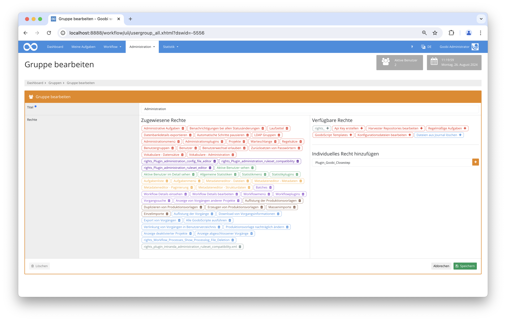
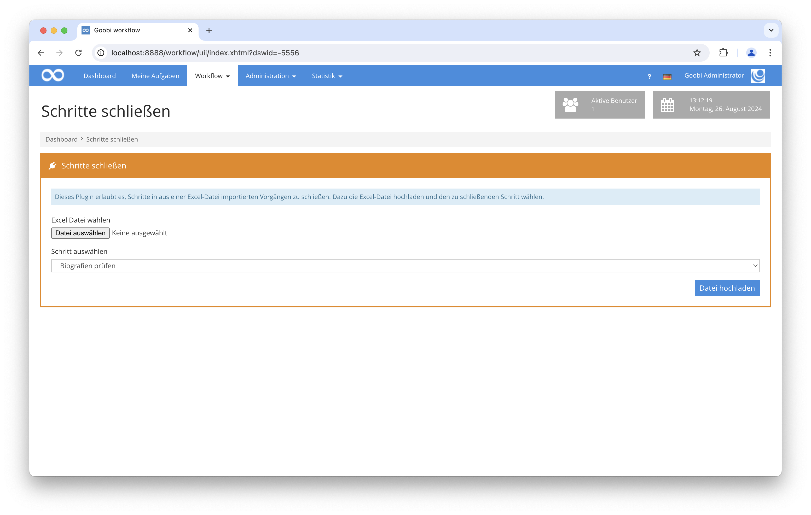

# Arbeitsschritte schließen

## Übersicht

Name                     | Wert
-------------------------|-----------
Identifier               | intranda_workflow_close_step
Repository               | [https://github.com/intranda/goobi-plugin-workflow-close-step](https://github.com/intranda/goobi-plugin-workflow-close-step)
Lizenz              | GPL 2.0 oder neuer 
Letzte Änderung    | 04.09.2024 08:54:38


## Einführung
Dieses Workflow-Plugin ermöglicht es, einen bestimmten Schritt in mehreren Vorgängen gleichzeitig zu schließen. Die dafür zur Verfügung stehenden Schritte werden vorher in einer Konfigurationsdatei festgelegt und stehen später auf der Web-Oberfläche zur Auswahl. Die Vorgänge, in denen der ausgewählte Schritt geschlossen werden soll, werden per Datei-Upload festgelegt. 

## Installation
Zur Installation müssen folgende Dateien installiert werden:

```bash
/opt/digiverso/goobi/plugins/workflow/plugin_intranda_workflow_closestep.jar
/opt/digiverso/goobi/plugins/GUI/plugin_intranda_workflow_closestep-GUI.jar
```

Um für das Plugin die schließbaren Schritte festzulegen, muss folgende Konfigurationsdatei angelegt und angepasst werden:

```bash
/opt/digiverso/goobi/config/plugin_intranda_workflow_closestep.xml
```

Für eine Nutzung dieses Plugins muss der Nutzer über die korrekte Rollenberechtigung verfügen.

Bitte weisen Sie daher der Gruppe die Rolle `Plugin_Goobi_Closestep` zu.



## Überblick und Funktionsweise
Wenn das Plugin korrekt installiert und konfiguriert wurde, ist es innerhalb des Menüpunkts `Workflow` zu finden.



Zunächst wird eine Excel-Datei im `XLS`- oder im `XLSX`-Format hochgeladen, um die gewünschten Vorgänge festzulegen. Diese beinhaltet eine Auflistung aller IDs der gewünschten Vorgänge.

Am einfachsten bekommen Sie eine solche Datei, wenn Sie auf der Seite `Vorgänge suchen` eine Liste mit den von Ihnen gewünschten Vorgängen zusammenstellen und das Ergebnis von der Seite `Vorgänge` in eine Excel-Datei exportieren.

**Wichtig:** Achten Sie darauf, dass `Alle Felder auswählen` ausgewählt ist, da sonst die Datei die erforderlichen IDs nicht in der zweiten Spalte beinhaltet und nicht kompatibel zu diesem Plugin ist.

Als nächstes wird der zu schließende Schritt ausgewählt. Dafür steht ein Drop-Down-Menü zur Verfügung, welches alle in der Konfigurationsdatei angegebenen Schritte anbietet.

Klicken Sie nun auf `Datei hochladen`.

Wenn die Excel-Datei keine Vorgangs-IDs beinhaltet, wird nun eine entsprechende Fehlermeldung angezeigt.

Ansonsten erscheint nun eine Liste mit allen Vorgängen. Je nach dem, ob ein Schritt geschlossen werden kann, bereits geschlossen ist, oder aus bestimmten Gründen nicht geschlossen werden kann, wird nun eine passende Box angezeigt. Gibt es Fehlermeldungen, so ist die Liste an Fehlermeldungen innerhalb eines Vorgangs ausklappbar.

Wenn es schließbare Schritte gibt, werden diese mit einem Klick auf "Schritte schließen" geschlossen und die Boxen für die entsprechenden Schritte ändern sich von "Kann geschlossen werden" zu "Ist geschlossen".

Sie können optional die Liste der Status- und Fehlerbeschreibungen als Excel-Datei herunterladen.


## Konfiguration
Die Konfiguration des Plugins erfolgt in der Datei `plugin_intranda_workflow_closestep.xml` wie hier aufgezeigt:

```xml
<config_plugin>
	<maximum_megabyte_per_file mb="5" />
	<!-- The status may be LOCKED, OPEN, INWORK, DONE, ERROR or DEACTIVATED -->
	<step_to_close name="Biografien prüfen">
		<condition stepname="Einspielen der Images" status="OPEN" />
		<condition stepname="Archivierung" status="DONE" />
	</step_to_close>
	<step_to_close name="Qualitätskontrolle">
		<condition stepname="Einspielen der Images" status="OPEN" />
		<condition stepname="Archivierung" status="DONE" />
	</step_to_close>
	<step_to_close name="Export in viewer">
		<condition stepname="Archivierung" status="DONE" />
		<condition stepname="Einspielen der Images" status="DONE" />
		<condition stepname="Bibliographische Aufnahme" status="DONE" />
	</step_to_close>
</config_plugin>
```

Die folgende Tabelle enthält eine Zusammenstellung der Parameter und ihrer Beschreibungen:

Parameter               | Erläuterung
------------------------|------------------------------------
| `config_plugin` | Dies ist das Hauptelement in der Konfigurationsdatei und muss genau einmal vorkommen. Es beinhaltet alle Konfigurationen. |
| `maximum_megabyte_per_file` | Die maximal erlaubte Dateigröße in Megabyte kann hier im Parameter `mb` festgelegt werden. Überschreitet der Datei-Upload diese Größe, wird eine Fehlermeldung zurückgegeben. |
| `step_to_close` | Diese Codeblöcke zeichnen jeweils genau einen Schritt aus, der auf der Benutzeroberfläche zum Schließen zur Auswahl stehen soll. Der Parameter `name` gibt den Namen des zu schließenden Schritts an. |
| `condition` | Mit diesen Unterelementen von `step_to_close` lassen sich die Vorbedingungen zum Schließen des jeweiligen Schritts angeben. Dafür wird mit den Parametern `stepname` und `status` der geforderte Zustand eines anderen Schritts angegeben. Der Status wird immer groß geschrieben. |

Der in `stepname` angegebene Schritt ist ein anderer Schritt, der in jedem Vorgang existieren muss, in dem der vom Nutzer ausgewählte Schritt geschlossen werden soll. Dieser muss zusätzlich in einem bestimmten Status sein. Dieser wird aus folgender Liste ausgewählt:

| Status | Bezeichnung |
| :--- | :--- |
| `DEACTIVATED` | Deaktiviert |
| `DONE` | Abgeschlossen |
| `ERROR` | Fehler |
| `INWORK` | In Bearbeitung |
| `LOCKED` | Gesperrt |
| `OPEN` | Offen |