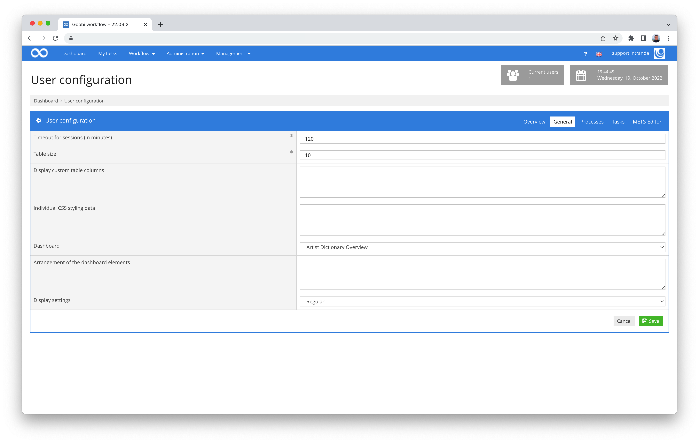
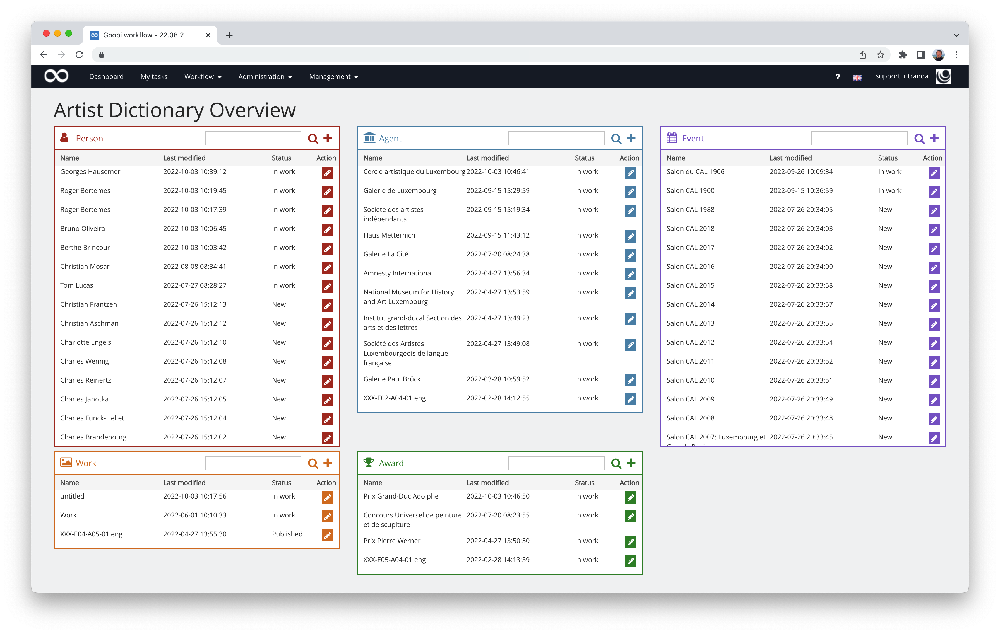
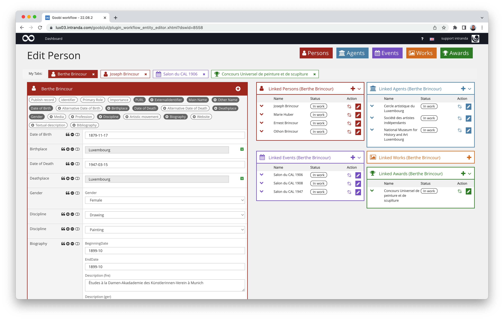

# Entitäten Editor - Artist Dictionary

## Übersicht

Name                     | Wert
-------------------------|-----------
Identifier               | intranda_workflow_entity_editor
Repository               | [https://github.com/intranda/goobi-plugin-workflow-entity-editor](https://github.com/intranda/goobi-plugin-workflow-entity-editor)
Lizenz              | GPL 2.0 oder neuer 
Letzte Änderung    | 25.07.2024 10:48:22


## Einführung
Die vorliegende Dokumentation beschreibt die Installation, Konfiguration und den Einsatz zweier Plugins, die gemeinsam das Artist Dictionary stellen.

Mithilfe dieser Plugins für Goobi können Informationen zu Künstlern und deren Vernetzung angelegt und bearbeitet werden.


## Installation
Bei diesem Plugin handelt es sich um ein Workflow- sowie ein Dashboard-Plugin. Die Komponenten der Plugins müssen zunächst in folgende Verzeichnisse kopiert werden:

```bash
/opt/digiverso/goobi/plugins/dashboard/plugin-intranda-dashboard-entity-base.jar
/opt/digiverso/goobi/plugins/GUI/plugin-intranda-dashboard-entity-gui.jar
/opt/digiverso/goobi/plugins/GUI/plugin-intranda-workflow-entity-editor-gui.jar
/opt/digiverso/goobi/plugins/workflow/plugin-intranda-workflow-entity-editor-base.jar
```

Daneben gibt es zwei Konfigurationsdateien, die üblicherweise an folgender Stelle liegen müssen:

```bash
/opt/digiverso/goobi/config/plugin_intranda_dashboard_entity.xml
/opt/digiverso/goobi/config/plugin_intranda_workflow_entity_editor.xml
```


## Überblick und Funktionsweise
Wenn das Plugin korrekt installiert und konfiguriert wurde, kann es als Dashboard in den Benutzereinstellungen ausgewählt werden:



Nach der erfolgten Auswahl steht das Dashboard für den Nutzer nach dem Login zur Verfügung:



Von hier aus kann die weitere Bearbeitung der Entitäten erfolgen:




## Konfiguration

### Konfiguration des Workflow-Plugins
Die Konfiguration des Plugins erfolgt über die Konfigurationsdatei `plugin_intranda_workflow_entity_editor.xml`. Im Folgenden ist eine beispielhafte Konfigurationsdatei aufgeführt:

```xml
<?xml version="1.0" encoding="UTF-8"?>
<config_plugin>
	<global>
		<vocabularyServerUrl>https://example.com/vocabulary/records/</vocabularyServerUrl>
		<sources>
			<vocabulary name="Source" id="6" searchfields="Citation" displayfields="Citation|PURL|Source Type" nameField="Citation[eng]|Citation[fre]|Citation[ger]" urlField="PURL" typeField="Source Type[eng]|Source Type[fre]|Source Type[ger]" />
			<!--new: Citation eng 	Citation ger 	Citation fre 	PURL 	Source Type eng 	Source Type ger 	Source Type fre -->
		</sources>
		<relations>
			<metadataName>Relationship</metadataName>
			<entityType>RelationEntityType</entityType>
			<beginningDate>BeginningDate</beginningDate>
			<endDate>EndDate</endDate>
			<processId>RelationProcessID</processId>
			<displayName>RelationName</displayName>
			<type>Type</type>
			<additionalData>AwardDegree</additionalData>
		</relations>

		<processTemplateId>6</processTemplateId>
		<exportPlugin>intranda_export_luxArtistDictionary</exportPlugin>
	</global>

	<type name="Person" plural="Persons" rulesetName="Person">
		<relations>
			<relation id="26" name="R01 Relationship Person - Person" reverse="false" destinationEntity="Person" />
			<relation id="26" name="R01 Relationship Person - Person" reverse="true" destinationEntity="Person" />
			<relation id="28" name="R03a Relationship Person - Collective agent" reverse="false" destinationEntity="Agent"/>
			<relation id="30" name="R04 Relationship Person - Event" reverse="false" destinationEntity="Event"/>
			<relation id="32" name="R06 Relationship Person - Work" reverse="false" destinationEntity="Work"/>
			<relation id="35" name="R09 Relationship Person - Award" reverse="false" destinationEntity="Award"/>
		</relations>

		<color>#df07b9</color>
		<icon>fa-user</icon>
		<identifyingMetadata languageOrder="ORIG, FR, DE, EN">PersonMainName/Firstname PersonMainName/Lastname</identifyingMetadata>

		<!-- Define, which input type should be used. Allowed values are:
		* checkbox: Checkbox
		* input: single line input field
		* textarea: multi line input area
		* select: dropdown with defined values
		* vocabularyList: dropdown with values from vocabulary
		* vocabularySearch: read only field with search button to get data from vocabulary
		* publish: toggle button to mark field as publishable
		* source: linked source
		* fileupload: file upload button
		* date: date field incl. date picker
		-->

		<displayMetadata>
			<field label="Publish record" metadata="Published" type="checkbox" required="true" />
			<field label="identifier" metadata="CatalogIDDigital" type="input" required="true" showInSearch="true" />
			<field label="Primary Role" metadata="PrimaryRole" type="vocabularyList" required="false">
				<vocabulary name="Person - Primary Role in Database" id="12" />
			</field>
			<field label="Importance" metadata="Importance" type="select" required="false" readonly="false">
				<value>1</value>
				<value>2</value>
				<value>3</value>
				<value>4</value>
				<value>5</value>
			</field>
			<field label="PURL" metadata="PURL" type="generated" required="false" readonly="true" showInSearch="true">
				<rule>http://example.com/viewer/resolver?id=${meta.CatalogIDDigital}</rule>
			</field>
			<field label="ExternalIdentifier" metadata="ExternalIdentifier" repeatable="true" group="true">
				<field label="identifier" metadata="Identifier" type="input" required="false" labelPosition="top" defaultValue="12345" />
				<field label="Publish field" metadata="Published" type="publish" required="true" labelPosition="none" defaultValue="Y" />
				<field label="Type" metadata="Type" type="select" required="false" labelPosition="top">
					<value>GND</value>
					<value>ISNI</value>
				</field>
				<field label="Source" metadata="Source" type="source" required="false" repeatable="true" group="true" />
			</field>
			<field label="Main Name" metadata="PersonMainName" repeatable="false" group="true" showInSearch="true">
				<field label="Firstname (orig)" metadata="FirstnameOrig" type="input" required="false" labelPosition="left" />
				<field label="Lastname (orig)" metadata="LastnameOrig" type="input" required="false" labelPosition="left" />
				<field label="Firstname (fre)" metadata="FirstnameFr" type="input" required="false" labelPosition="left" showInSearch="true"/>
				<field label="Lastname (fre)" metadata="LastnameFr" type="input" required="false" labelPosition="left" showInSearch="true"/>
				<field label="Firstname (ger)" metadata="FirstnameDe" type="input" required="false" labelPosition="left" showInSearch="true" />
				<field label="Lastname (ger)" metadata="LastnameDe" type="input" required="false" labelPosition="left" showInSearch="true" />
				<field label="Firstname (eng)" metadata="FirstnameEn" type="input" required="false" labelPosition="left" showInSearch="true" />
				<field label="Lastname (eng)" metadata="LastnameEn" type="input" required="false" labelPosition="left" showInSearch="true" />
				<field label="Numeration" metadata="Numeration" type="input" required="false" labelPosition="left" />
				<field label="Title" metadata="Title" type="input" required="false" labelPosition="left" />
				<field label="Publish field" metadata="Published" type="publish" required="true" />
				<field label="Source" metadata="Source" type="source" required="false" repeatable="true" group="true" />
			</field>
			<field label="Other Name" metadata="PersonOtherName" repeatable="true" group="true" showInSearch="false">
				<field label="Type" metadata="Type" type="vocabularyList" required="false" labelPosition="left" showInSearch="false">
					<vocabulary name="Person - Other Name Forms Type" id="3" />
				</field>
				<field label="Firstname (orig)" metadata="FirstnameOrig" type="input" required="false" labelPosition="left" showInSearch="false" />
				<field label="Lastname (orig)" metadata="LastnameOrig" type="input" required="false" labelPosition="left" showInSearch="false" />
				<field label="Firstname (fre)" metadata="FirstnameFr" type="input" required="false" labelPosition="left" showInSearch="false" />
				<field label="Lastname (fre)" metadata="LastnameFr" type="input" required="false" labelPosition="left" showInSearch="false" />
				<field label="Firstname (ger)" metadata="FirstnameDe" type="input" required="false" labelPosition="left" showInSearch="false" />
				<field label="Lastname (ger)" metadata="LastnameDe" type="input" required="false" labelPosition="left" showInSearch="false" />
				<field label="Firstname (eng)" metadata="FirstnameEn" type="input" required="false" labelPosition="left" showInSearch="false" />
				<field label="Lastname (eng)" metadata="LastnameEn" type="input" required="false" labelPosition="left" showInSearch="false" />
				<field label="Numeration" metadata="Numeration" type="input" required="false" labelPosition="left" />
				<field label="Title" metadata="Title" type="input" required="false" labelPosition="left" />
				<field label="Publish field" metadata="Published" type="publish" required="true" />
				<field label="Source" metadata="Source" type="source" required="false" repeatable="true" group="true" />
			</field>
			<field label="Date of Birth" metadata="BirthDateGroup" repeatable="false" group="true" showInSearch="true">
				<field label="Publish field" metadata="Published" type="publish" required="true" />
				<field label="Birthdate" metadata="Birthdate" type="input" required="false" labelPosition="none" showInSearch="true" />
				<field label="Source" metadata="Source" type="source" required="false" repeatable="true" group="true" />
			</field>
			<field label="Alternative Date of Birth" metadata="AltBirthDateGroup" repeatable="true" group="true">
				<field label="Publish field" metadata="Published" type="publish" required="true" />
				<field label="Birthdate" metadata="Birthdate" type="input" required="false" labelPosition="none" />
				<field label="Source" metadata="Source" type="source" required="false" repeatable="true" group="true" />
			</field>
			<field label="Birthplace" metadata="BirthplaceGroup" repeatable="true" group="true" showInSearch="true">
				<field label="Publish field" metadata="Published" type="publish" required="true" />
				<field label="Birthplace" metadata="Birthplace" type="vocabularySearch" required="false" labelPosition="none" showInSearch="true">
					<vocabulary name="Location" id="5" searchfields="Location" displayfields="Location|Authority URI|Authority Value" />
				</field>
				<field label="Source" metadata="Source" type="source" required="false" repeatable="true" group="true" />
			</field>
			<field label="Date of Death" metadata="DeathDateGroup" repeatable="false" group="true">
				<field label="Publish field" metadata="Published" type="publish" required="true" />
				<field label="DeathDate" metadata="DeathDate" type="input" required="false" labelPosition="none" />
				<field label="Source" metadata="Source" type="source" required="false" repeatable="true" group="true" />
			</field>
			<field label="Alternative Date of Death" metadata="AltDeathDateGroup" repeatable="true" group="true">
				<field label="Publish field" metadata="Published" type="publish" required="true" />
				<field label="AlternativeDeathDate" metadata="AlternativeDeathDate" type="input" required="false" labelPosition="none" />
				<field label="Source" metadata="Source" type="source" required="false" repeatable="true" group="true" />
			</field>
			<field label="Deathplace" metadata="DeathplaceGroup" repeatable="true" group="true">
				<field label="Publish field" metadata="Published" type="publish" required="true" />
				<field label="Deathplace" metadata="Deathplace" type="vocabularySearch" required="false" labelPosition="none">
					<vocabulary name="Location" id="5" searchfields="Location" displayfields="Location|Authority URI|Authority Value" />
				</field>
				<field label="Source" metadata="Source" type="source" required="false" repeatable="true" group="true" />
			</field>
			<field label="Gender" metadata="GenderGroup" repeatable="true" group="true">
				<field label="Gender" metadata="Gender" type="select" required="false" labelPosition="top">
					<value>Male</value>
					<value>Female</value>
					<value>Other</value>
				</field>
				<field label="Publish field" metadata="Published" type="publish" required="true" />
				<field label="Source" metadata="Source" type="source" required="false" repeatable="true" group="true" />
			</field>
			<field label="Media" metadata="Media" repeatable="true" group="true">
				<field label="Publish field" metadata="Published" type="publish" required="true" />
				<field label="File" metadata="File" type="fileupload" required="false" labelPosition="left" />
				<field label="Subject" metadata="Subject" type="vocabularyList" required="false" labelPosition="left">
					<vocabulary name="Audiovisual Media Subject" id="11" />
				</field>
				<field label="Type" metadata="Type" type="vocabularyList" required="false" labelPosition="left">
					<vocabulary name="Audiovisual Media Type" id="11" />
				</field>
				<field label="Source" metadata="Source" type="source" required="false" repeatable="true" group="true" />
			</field>
			<field label="Profession" metadata="ProfessionGroup" repeatable="true" group="true">
				<field label="Publish field" metadata="Published" type="publish" required="true" />
				<field label="BeginningDate" metadata="BeginningDate" type="date" required="false" labelPosition="top" />
				<field label="EndDate" metadata="BeginningDate" type="date" required="false" labelPosition="top" />
				<field label="Profession" metadata="Profession" type="vocabularyList" required="false" labelPosition="top">
					<vocabulary name="Profession" id="15" />
				</field>
				<field label="Source" metadata="Source" type="source" required="false" repeatable="true" group="true" />
			</field>
			<field label="Discipline" metadata="DisciplineGroup" repeatable="true" group="true">
				<field label="Publish field" metadata="Published" type="publish" required="true" />
				<field label="Discipline" metadata="Discipline" type="vocabularyList" required="false" labelPosition="none">
					<vocabulary name="Discipline" id="16" />
				</field>
				<field label="Source" metadata="Source" type="source" required="false" repeatable="true" group="true" />
			</field>
			<field label="Biography" metadata="BiographyGroup" repeatable="true" group="true">
				<field label="Publish field" metadata="Published" type="publish" required="true" />
				<field label="BeginningDate" metadata="BeginningDate" type="date" required="false" labelPosition="top" />
				<field label="EndDate" metadata="BeginningDate" type="date" required="false" labelPosition="top" />
				<field label="Description" metadata="ShortDescription" type="textarea" required="false" labelPosition="top" />
				<field label="Location" metadata="Location" type="vocabularySearch" required="false" labelPosition="top">
					<vocabulary name="Location" id="5" searchfields="Location" displayfields="Location|Authority URI|Authority Value" />
				</field>
				<field label="Type" metadata="Type" type="vocabularyList" required="false" labelPosition="top">
					<vocabulary name="Biography Type" id="17" />
				</field>
				<field label="Source" metadata="Source" type="source" required="false" repeatable="true" group="true" />
			</field>
			<field label="Website" metadata="Website" repeatable="true" group="true">
				<field label="Link" metadata="Link" type="input" required="false" />
				<field label="Publish field" metadata="Published" type="publish" required="true" />
			</field>
			<field label="Textual description" metadata="TextualDescription" repeatable="true" group="true">
				<field label="Publish field" metadata="Published" type="publish" required="true" />
				<field label="Text" metadata="Text" type="textarea" required="false" labelPosition="none" />
			</field>
			<!--
			<field label="Author description" metadata="AuthorDescription" repeatable="true" group="true">
				<field label="Publish field" metadata="Published" type="publish" required="true" />
				<field label="Author" metadata="Author" type="input" required="false" />
			</field>
			-->
			<field label="Bibliography" metadata="Bibliography" repeatable="true" group="true">
				<field label="Publish field" metadata="Published" type="publish" required="true" />
				<field label="Citation" metadata="Citation" type="textarea" required="false" labelPosition="top" />
				<field label="Type" metadata="Type" type="vocabularyList" required="false" labelPosition="top">
					<vocabulary name="Bibliography Type" id="19" />
				</field>
				<field label="Link" metadata="Link" required="false" />
				<field label="SourceID" metadata="SourceID" required="false" />
			</field>
		</displayMetadata>
	</type>

	<type name="Agent" plural="Agents" rulesetName="Agent">
		<relations>
			<relation id="27" name="R02 Relationship Collective agent - Collective agent" reverse="false" destinationEntity="Agent" />
			<relation id="27" name="R02 Relationship Collective agent - Collective agent" reverse="true" destinationEntity="Agent"/>
			<relation id="29" name="R03b Relationship Collective agent - Person" reverse="false" destinationEntity="Person"/>
			<relation id="31" name="R05 Relationship Collective agent - Event" reverse="false" destinationEntity="Event"/>
			<relation id="33" name="R07 Relationship Collective agent - Work" reverse="false" destinationEntity="Work" />
			<relation id="26" name="R10 Relationship Collective agent - Award" reverse="false" destinationEntity="Award"/>
		</relations>

		<color>#e81c0c</color>
		<icon>fa-university</icon>
		<!--always english -->
		<identifyingMetadata>MainName/NameEN</identifyingMetadata>

		<displayMetadata>
			<field label="Publish record" metadata="Published" type="checkbox" required="true" />
			<field label="identifier" metadata="CatalogIDDigital" type="input" required="true" />
			<field label="Primary Role" metadata="PrimaryRole" type="vocabularyList" required="false">
				<vocabulary name="Collective agent - Primary Role in Database" id="13" />
			</field>
			<field label="Importance" metadata="Importance" type="select" required="false" readonly="false">
				<value>1</value>
				<value>2</value>
				<value>3</value>
				<value>4</value>
				<value>5</value>
			</field>
			<field label="PURL" metadata="PURL" type="generated" required="false" readonly="true">
				<rule>http://example.com/viewer/resolver?id=${meta.CatalogIDDigital}</rule>
			</field>
			<field label="ExternalIdentifier" metadata="ExternalIdentifier" repeatable="true" group="true">
				<field label="identifier" metadata="Identifier" type="input" required="false" labelPosition="top" />
				<field label="Publish field" metadata="Published" type="publish" required="true" labelPosition="none" />
				<field label="Type" metadata="Type" type="select" required="false" labelPosition="top">
					<value>GND</value>
					<value>ISNI</value>
				</field>
				<field label="Source" metadata="Source" type="source" required="false" repeatable="true" group="true" />
			</field>
			<field label="Main Name" metadata="MainName" repeatable="false" group="true">
				<field label="Original" metadata="NameORIG" type="input" required="false" labelPosition="left" />
				<field label="French" metadata="NameFR" type="input" required="false" labelPosition="left" />
				<field label="German" metadata="NameDE" type="input" required="false" labelPosition="left" />
				<field label="English" metadata="NameEN" type="input" required="false" labelPosition="left" />
				<field label="Publish field" metadata="Published" type="publish" required="true" />
				<field label="Source" metadata="Source" type="source" required="false" repeatable="true" group="true" />
			</field>
			<field label="Other Name" metadata="OtherName" repeatable="true" group="true">
				<field label="Type" metadata="Type" type="vocabularyList" required="false" labelPosition="left">
					<vocabulary name="Collective Agent - Other Name Forms Type" id="4" />
				</field>
				<field label="Original" metadata="NameORIG" type="input" required="false" labelPosition="left" />
				<field label="French" metadata="NameFR" type="input" required="false" labelPosition="left" />
				<field label="German" metadata="NameDE" type="input" required="false" labelPosition="left" />
				<field label="English" metadata="NameEN" type="input" required="false" labelPosition="left" />
				<field label="Publish field" metadata="Published" type="publish" required="true" />
				<field label="Source" metadata="Source" type="source" required="false" repeatable="true" group="true" />
			</field>
			<field label="Foundation date" metadata="FoundationDateGroup" repeatable="false" group="true">
				<field label="Publish field" metadata="Published" type="publish" required="true" />
				<field label="Date" metadata="FoundationDate" type="input" required="false" labelPosition="none" />
				<field label="Source" metadata="Source" type="source" required="false" repeatable="true" group="true" />
			</field>
			<field label="Closing date" metadata="ClosingDateGroup" repeatable="true" group="true">
				<field label="Publish field" metadata="Published" type="publish" required="true" />
				<field label="date" metadata="ClosingDate" type="input" required="false" labelPosition="none" />
				<field label="Source" metadata="Source" type="source" required="false" repeatable="true" group="true" />
			</field>
			<field label="Media" metadata="Media" repeatable="true" group="true">
				<field label="Publish field" metadata="Published" type="publish" required="true" />
				<field label="File" metadata="File" type="fileupload" required="false" labelPosition="left" />
				<field label="Subject" metadata="Subject" type="vocabularyList" required="false" labelPosition="left">
					<vocabulary name="Audiovisual Media Subject" id="11" />
				</field>
				<field label="Type" metadata="Type" type="vocabularyList" required="false" labelPosition="left">
					<vocabulary name="Audiovisual Media Type" id="11" />
				</field>
				<field label="Source" metadata="Source" type="source" required="false" repeatable="true" group="true" />
			</field>
			<field label="Discipline" metadata="DisciplineGroup" repeatable="true" group="true">
				<field label="Publish field" metadata="Published" type="publish" required="true" />
				<field label="Discipline" metadata="Discipline" type="vocabularyList" required="false" labelPosition="none">
					<vocabulary name="Discipline" id="16" />
				</field>
				<field label="Source" metadata="Source" type="source" required="false" repeatable="true" group="true" />
			</field>
			<field label="Biography" metadata="BiographyGroup" repeatable="true" group="true">
				<field label="Publish field" metadata="Published" type="publish" required="true" />
				<field label="BeginningDate" metadata="BeginningDate" type="date" required="false" labelPosition="top" />
				<field label="EndDate" metadata="BeginningDate" type="date" required="false" labelPosition="top" />
				<field label="Description" metadata="ShortDescription" type="textarea" required="false" labelPosition="top" />
				<field label="Location" metadata="Location" type="vocabularySearch" required="false" labelPosition="top">
					<vocabulary name="Location" id="5" searchfields="Location" displayfields="Location|Authority URI|Authority Value" />
				</field>
				<field label="Type" metadata="Type" type="vocabularyList" required="false" labelPosition="top">
					<vocabulary name="Biography Type" id="17" />
				</field>
				<field label="Source" metadata="Source" type="source" required="false" repeatable="true" group="true" />
			</field>
			<field label="Website" metadata="Website" repeatable="true" group="true">
				<field label="Link" metadata="Link" type="input" required="false" />
				<field label="Publish field" metadata="Published" type="publish" required="true" />
			</field>
			<field label="Textual description" metadata="TextualDescription" repeatable="true" group="true">
				<field label="Publish field" metadata="Published" type="publish" required="true" />
				<field label="Text" metadata="Text" type="textarea" required="false" labelPosition="none" />
			</field>
			<!--
			<field label="Author description" metadata="AuthorDescription" repeatable="true" group="true">
				<field label="Publish field" metadata="Published" type="publish" required="true" />
				<field label="Author" metadata="Author" type="input" required="false" />
			</field>
		-->
		</displayMetadata>
	</type>

	<type name="Event" plural="Events" rulesetName="Event">
		<relations>
			<relation id="30" name="R04 Relationship Person - Event" reverse="true" destinationEntity="Person"/>
			<relation id="31" name="R05 Relationship Collective agent - Event" reverse="true" destinationEntity="Agent"/>
			<relation id="34" name="R08 Relationship Event - Work" reverse="false" destinationEntity="Work"/>
		</relations>

		<color>#19b609</color>
		<icon>fa-calendar</icon>
		<identifyingMetadata>MainName/NameEN</identifyingMetadata>

		<displayMetadata>
			<field label="Publish record" metadata="Published" type="checkbox" required="true" />
			<field label="identifier" metadata="CatalogIDDigital" type="input" required="true" />
			<field label="Event type" metadata="EventType" type="vocabularyList" required="false">
				<vocabulary name="Event Type" id="21" />
			</field>
			<field label="PURL" metadata="PURL" type="generated" required="false" readonly="true">
				<rule>http://example.com/viewer/resolver?id=${meta.CatalogIDDigital}</rule>
			</field>
			<field label="Recurring event" metadata="RecurringEventGroup" repeatable="false" group="true">
				<field label="Original" metadata="NameORIG" type="input" required="false" labelPosition="left" />
				<field label="French" metadata="NameFR" type="input" required="false" labelPosition="left" />
				<field label="German" metadata="NameDE" type="input" required="false" labelPosition="left" />
				<field label="English" metadata="NameEN" type="input" required="false" labelPosition="left" />
				<field label="Recurring event" metadata="RecurringEvent" type="checkbox" required="true" />
			</field>
			<field label="Main Name" metadata="MainName" repeatable="false" group="true">
				<field label="Original" metadata="NameORIG" type="input" required="false" labelPosition="left" />
				<field label="French" metadata="NameFR" type="input" required="false" labelPosition="left" />
				<field label="German" metadata="NameDE" type="input" required="false" labelPosition="left" />
				<field label="English" metadata="NameEN" type="input" required="false" labelPosition="left" />
				<field label="Publish field" metadata="Published" type="publish" required="true" />
				<field label="Source" metadata="Source" type="source" required="false" repeatable="true" group="true" />
			</field>
			<field label="Other Name" metadata="OtherName" repeatable="true" group="true">
				<field label="Type" metadata="Type" type="vocabularyList" required="false" labelPosition="left">
					<vocabulary name="Collective Agent - Other Name Forms Type" id="4" />
				</field>
				<field label="Original" metadata="NameORIG" type="input" required="false" labelPosition="left" />
				<field label="French" metadata="NameFR" type="input" required="false" labelPosition="left" />
				<field label="German" metadata="NameDE" type="input" required="false" labelPosition="left" />
				<field label="English" metadata="NameEN" type="input" required="false" labelPosition="left" />
				<field label="Publish field" metadata="Published" type="publish" required="true" />
				<field label="Source" metadata="Source" type="source" required="false" repeatable="true" group="true" />
			</field>
			<field label="Duration" metadata="Duration" repeatable="false" group="true">
				<field label="Publish field" metadata="Published" type="publish" required="true" />
				<field label="Beginning date" metadata="BeginningDate" type="date" required="false" labelPosition="top" />
				<field label="End date" metadata="EndDate" type="date" required="false" labelPosition="top" />
				<field label="Source" metadata="Source" type="source" required="false" repeatable="true" group="true" />
			</field>
			<field label="Media" metadata="Media" repeatable="true" group="true">
				<field label="Publish field" metadata="Published" type="publish" required="true" />
				<field label="File" metadata="File" type="fileupload" required="false" labelPosition="left" />
				<field label="Subject" metadata="Subject" type="vocabularyList" required="false" labelPosition="left">
					<vocabulary name="Audiovisual Media Subject" id="11" />
				</field>
				<field label="Type" metadata="Type" type="vocabularyList" required="false" labelPosition="left">
					<vocabulary name="Audiovisual Media Type" id="11" />
				</field>
				<field label="Source" metadata="Source" type="source" required="false" repeatable="true" group="true" />
			</field>
			<field label="Website" metadata="Website" repeatable="true" group="true">
				<field label="Link" metadata="Link" type="input" required="false" />
				<field label="Publish field" metadata="Published" type="publish" required="true" />
			</field>
			<field label="Textual description" metadata="TextualDescription" repeatable="true" group="true">
				<field label="Publish field" metadata="Published" type="publish" required="true" />
				<field label="Text" metadata="Text" type="textarea" required="false" labelPosition="none" />
			</field>
			<!--
			<field label="Author description" metadata="AuthorDescription" repeatable="true" group="true">
				<field label="Publish field" metadata="Published" type="publish" required="true" />
				<field label="Author" metadata="Author" type="input" required="false" />
			</field>
		-->
		</displayMetadata>
	</type>

	<type name="Work" plural="Works" rulesetName="Work">
		<relations>
			<relation id="32" name="R06 Relationship Person - Work" reverse="true" destinationEntity="Person"/>
			<relation id="33" name="R07 Relationship Collective agent - Work" reverse="true" destinationEntity="Agent"/>
			<relation id="24" name="R08 Relationship Event - Work" reverse="true" destinationEntity="Event"/>
			<relation id="37" name="R11 Relationship Work - Award" reverse="false" destinationEntity="Work"/>
		</relations>

		<color>#900688</color>
		<icon>fa-picture-o</icon>
		<identifyingMetadata>TitleGroup/TitleEN</identifyingMetadata>

		<displayMetadata>
			<field label="Publish record" metadata="Published" type="checkbox" required="true" />
			<field label="identifier" metadata="CatalogIDDigital" type="input" required="true" />
			<field label="Work type" metadata="WorkType" type="vocabularyList" required="false">
				<vocabulary name="Work Type" id="23" />
			</field>
			<field label="PURL" metadata="PURL" type="generated" required="false" readonly="true">
				<rule>http://example.com/viewer/resolver?id=${meta.CatalogIDDigital}</rule>
			</field>
			<field label="ExternalIdentifier" metadata="ExternalIdentifier" repeatable="true" group="true">
				<field label="identifier" metadata="Identifier" type="input" required="false" labelPosition="top" />
				<field label="Publish field" metadata="Published" type="publish" required="true" labelPosition="none" />
				<field label="Type" metadata="Type" type="select" required="false" labelPosition="top">
					<value>GND</value>
					<value>ISNI</value>
				</field>
				<field label="Source" metadata="Source" type="source" required="false" repeatable="true" group="true" />
			</field>
			<field label="Title" metadata="TitleGroup" repeatable="false" group="true">
				<field label="Original" metadata="TitleORIG" type="input" required="false" labelPosition="left" />
				<field label="French" metadata="TitleFR" type="input" required="false" labelPosition="left" />
				<field label="German" metadata="TitleDE" type="input" required="false" labelPosition="left" />
				<field label="English" metadata="TitleEN" type="input" required="false" labelPosition="left" />
				<field label="Publish field" metadata="Published" type="publish" required="true" />
				<field label="Source" metadata="Source" type="source" required="false" repeatable="true" group="true" />
			</field>
			<field label="Alternative title" metadata="AltTitleGroup" repeatable="true" group="true">
				<field label="Type" metadata="Type" type="vocabularyList" required="false" labelPosition="left">
					<vocabulary name="Alternative Title Type" id="24" />
				</field>
				<field label="Original" metadata="TitleORIG" type="input" required="false" labelPosition="left" />
				<field label="French" metadata="TitleFR" type="input" required="false" labelPosition="left" />
				<field label="German" metadata="TitleDE" type="input" required="false" labelPosition="left" />
				<field label="English" metadata="TitleEN" type="input" required="false" labelPosition="left" />
				<field label="Publish field" metadata="Published" type="publish" required="true" />
				<field label="Source" metadata="Source" type="source" required="false" repeatable="true" group="true" />
			</field>
			<field label="Media" metadata="Media" repeatable="true" group="true">
				<field label="Publish field" metadata="Published" type="publish" required="true" />
				<field label="File" metadata="File" type="fileupload" required="false" labelPosition="left" />
				<field label="Subject" metadata="Subject" type="vocabularyList" required="false" labelPosition="left">
					<vocabulary name="Audiovisual Media Subject" id="11" />
				</field>
				<field label="Type" metadata="Type" type="vocabularyList" required="false" labelPosition="left">
					<vocabulary name="Audiovisual Media Type" id="11" />
				</field>
				<field label="Source" metadata="Source" type="source" required="false" repeatable="true" group="true" />
			</field>
			<field label="Website" metadata="Website" repeatable="true" group="true">
				<field label="Link" metadata="Link" type="input" required="false" />
				<field label="Publish field" metadata="Published" type="publish" required="true" />
			</field>
		</displayMetadata>


	</type>
	<type name="Award" plural="Awards" rulesetName="Award">

		<relations>
			<relation id="35" name="R09 Relationship Person - Award" reverse="true" destinationEntity="Person"/>
			<relation id="36" name="R10 Relationship Collective agent - Award" reverse="true" destinationEntity="Agent" />
			<relation id="37" name="R11 Relationship Work - Award" reverse="true" destinationEntity="Work"/>
		</relations>

		<color>#05b8cd</color>
		<icon>fa-trophy</icon>
		<identifyingMetadata>TitleGroup/TitleEN</identifyingMetadata>

		<displayMetadata>
			<field label="Publish record" metadata="Published" type="checkbox" required="true" />
			<field label="identifier" metadata="CatalogIDDigital" type="input" required="true" />
			<field label="Award Type" metadata="AwardType" type="vocabularyList" required="false">
				<vocabulary name="Award Type" id="25" />
			</field>
			<field label="PURL" metadata="PURL" type="generated" required="false" readonly="true">
				<rule>http://example.com/viewer/resolver?id=${meta.CatalogIDDigital}</rule>
			</field>
			<field label="Title" metadata="TitleGroup" repeatable="false" group="true">
				<field label="Original" metadata="TitleORIG" type="input" required="false" labelPosition="left" />
				<field label="French" metadata="TitleFR" type="input" required="false" labelPosition="left" />
				<field label="German" metadata="TitleDE" type="input" required="false" labelPosition="left" />
				<field label="English" metadata="TitleEN" type="input" required="false" labelPosition="left" />
				<field label="Publish field" metadata="Published" type="publish" required="true" />
				<field label="Source" metadata="Source" type="source" required="false" repeatable="true" group="true" />
			</field>
			<field label="Alternative title" metadata="AltTitleGroup" repeatable="true" group="true">
				<field label="Type" metadata="Type" type="vocabularyList" required="false" labelPosition="left">
					<vocabulary name="Alternative Title Type" id="24" />
				</field>
				<field label="Original" metadata="TitleORIG" type="input" required="false" labelPosition="left" />
				<field label="French" metadata="TitleFR" type="input" required="false" labelPosition="left" />
				<field label="German" metadata="TitleDE" type="input" required="false" labelPosition="left" />
				<field label="English" metadata="TitleEN" type="input" required="false" labelPosition="left" />
				<field label="Publish field" metadata="Published" type="publish" required="true" />
				<field label="Source" metadata="Source" type="source" required="false" repeatable="true" group="true" />
			</field>
			<field label="Media" metadata="Media" repeatable="true" group="true">
				<field label="Publish field" metadata="Published" type="publish" required="true" />
				<field label="File" metadata="File" type="fileupload" required="false" labelPosition="left" />
				<field label="Subject" metadata="Subject" type="vocabularyList" required="false" labelPosition="left">
					<vocabulary name="Audiovisual Media Subject" id="11" />
				</field>
				<field label="Type" metadata="Type" type="vocabularyList" required="false" labelPosition="left">
					<vocabulary name="Audiovisual Media Type" id="11" />
				</field>
				<field label="Source" metadata="Source" type="source" required="false" repeatable="true" group="true" />
			</field>
			<field label="Website" metadata="Website" repeatable="true" group="true">
				<field label="Link" metadata="Link" type="input" required="false" />
				<field label="Publish field" metadata="Published" type="publish" required="true" />
			</field>
			<field label="Textual description" metadata="TextualDescription" repeatable="true" group="true">
				<field label="Publish field" metadata="Published" type="publish" required="true" />
				<field label="Text" metadata="Text" type="textarea" required="false" labelPosition="none" />
			</field>
			<!--
			<field label="Author description" metadata="AuthorDescription" repeatable="true" group="true">
				<field label="Publish field" metadata="Published" type="publish" required="true" />
				<field label="Author" metadata="Author" type="input" required="false" />
			</field>
			-->
		</displayMetadata>

	</type>
</config_plugin>
```

Mit dieser Konfigurationsdatei kann man einstellen, welche Felder und Informationen zu bestimmten Kategorien wie `Künstler` oder `Auszeichnung` festgehalten werden sollen. Generell existieren verschiedene `Types` (Entitäten wie `Künstler` oder `Auszeichnung`), deren Inhalt zwischen den `displayMetadata` Elementen durch `field`-Elemente näher definiert werden.


### Das Element field
Der `field`-Element befindet sich innerhalb von jedem `displayMetadata`-Element. Ein solches Element beschreibt, welche Daten (`fields`) dort eingetragen werden können. Das Element `artist` enthält z.B. Felder wie `Name`, `Geburtsort` und `Geburtsdatum`.

| Parameter | Erläuterung |
| :--- | :--- |
| `label` | Wie das Feld im Plugin angezeigt wird. |
| `metadata` | Wie es in der Datenbank existiert. |
| `type` | Welche Eingabemöglichkeit dieses Feld bietet. |
| `required` | Ob es ausgefüllt werden muß. |
| `repeatable` | Ob es mehrfach hinzugefügt werden kann. |
| `group` | Ob es eine Gruppe ist und Unterfelder besitzt. |
| `labelPosition` | Wo es angezeigt werden soll in der Nutzeroberfläche. |

Mögliche `type`-Angaben sind:

| Type | Erläuterung |
| :--- | :--- |
| `checkbox` | Eine Checkbox zum Auswählen |
| `input` | Ein Textfeld |
| `vocabularyList` | Auswahl aus einer im Plugin definierten Liste |
| `source` | Eine Quellenangabe |
| `generated` | Eine automatisch generierte Angabe basierend auf einer Regel |
| `fileUpload` | Eine hochgeladene Datei |


### Konfiguration des Dashboards
Die Konfigurationsdatei `plugin_intranda_dashboard_entity.xml` muss für künftige Funktionserweiterungen grundsätzlich im Dateisystem vorhanden sein. Bisher werdern aus ihr jedoch noch keine Optionen ausgewertet, so dass sie so aussehen kann:

```xml
<?xml version="1.0" encoding="UTF-8"?>

<config_plugin>
</config_plugin>
```