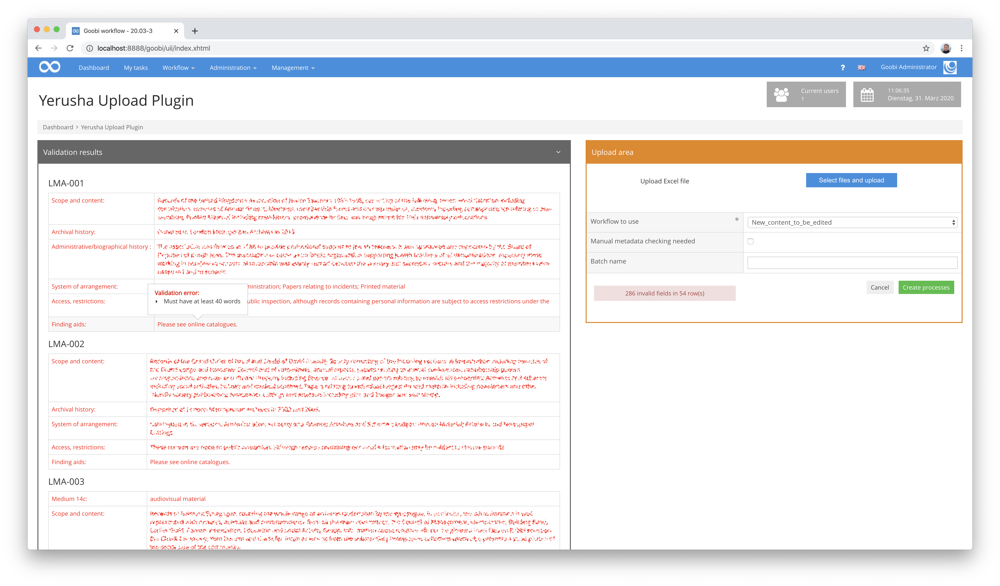

# Generisches Import Plugin für Excel-Dateien inklusive Validierung

## Übersicht

Name                     | Wert
-------------------------|-----------
Identifier               | intranda_workflow_excelimport
Repository               | [https://github.com/intranda/goobi-plugin-workflow-excel-import](https://github.com/intranda/goobi-plugin-workflow-excel-import)
Lizenz              | GPL 2.0 oder neuer 
Letzte Änderung    | 24.07.2024 20:14:01


## Einführung
Dieses Workflow-Plugin wurde implementiert, um neben der reinen Importroutine ebenfalls eine individuelle Nutzeroberfläche zur Verfügung stellen zu können, die eine umfangreiche Rückmeldung über die Validierung der der Inhalte gibt, bevor diese tatsächlich importiert werden.


## Installation
Um zu konfigurieren, wie das Import Plugin eine Excel-Datei importiert, können verschiedene Werte in der Konfigurationsdatei angepasst werden. Die Konfigurationsdatei befindet sich hier:

```bash
/opt/digiverso/goobi/config/plugin_intranda_workflow_excelimport.xml
```

## Konfiguration
Der Inhalt der Konfigurationsdatei sieht wie folgt aus:

```xml
<config_plugin>

    <!-- which file types shall be allowed for uploading these -->
    <allowed-file-extensions>/(\\.|\\/)(xls|xlsx)$/</allowed-file-extensions>

    <qaStepName>Quality assurance</qaStepName>

    <config>
        <!-- publication type to create -->
        <publicationType>Collection</publicationType>
        <!-- which digital collection to use -->

        <collection>General</collection>
        <rowIdentifier>2</rowIdentifier>
        <!-- define in which row the header is written, usually 1 -->
        <rowHeader>3</rowHeader>
        <!-- define in which row the data starts, usually 2 -->
        <rowDataStart>4</rowDataStart>
        <!-- define in which row the data ends, usually 20000 -->
        <rowDataEnd>100</rowDataEnd>

        <identifierHeaderName>1</identifierHeaderName>
        <!-- This block defines which column is mapped to which metadatum and what kind of validation it will be checked against
        Format: <metadata {list of attributes}/>

        Possible attributes include:
            - ugh: the name of the metadatum as defined in the ruleset
            - identifier: this metadatum will be associated with the column containing this in the row configured as <rowIdentifier> above

        Further there are a variety of possible validation criteria:
            - required: if this is set to true every cell of this metadatum will be expected to have some content
            - pattern: the contents of this attribute are interpreted as a regular expression, every cell of this metadatum is checked against it, note that in these regular expressions "," and "\" have to be escaped by "\", e.g. the expression for a single digit would be "\\d"
            - list: content of this attribute is expected to be the path to a plain text file with one expression per line, cells of this metadatum are checked to match one line of this file, cells may contain several elements of the list separated by "; "
            - either: checks that either this metadatum or the one provided by its identifier in this attribute have content
            - requiredFields: allows to configure fields that must have content before this metadatum is allowed to have content, takes a list of identifiers separated by "; "
            - wordcount: checks that a certain number of words are in the field

        Additionally it is possible to configure specific error messages for every validation criterion which are then displayed as a Mouse over Text in the validation area for any fields that failed a validation:
            - requiredErrorMessage: displayed if cell has no content despite being "required
            - patternErrorMessage: dispayed if cell contents do not match provided regex "pattern"
            - listErrorMessage: displayed if cell contents are not in provided "list"
            - eitherErrorMessage: displayed if neither this cell or the one configured as "either" have content
            - requiredFieldsErrorMessage: displayed if a cell had contents despite at least one of the ones listed as "requiredFields" being empty
            - wordcountErrorMessage: displayed if a cell has less Words than required
-->
        <metadata ugh="CatalogIDDigital" identifier="1" required="true" requiredErrorMessage="Field is required" pattern="^[A-Z]*-\\d*$" patternErrorMessage="Needs to be of the Format AAA-000" />
        <metadata ugh="Country" identifier="2" required="true" requiredErrorMessage="Field is required" list="/opt/digiverso/goobi/config/plugin_intranda_workflow_excelimport_ISO3166-1.txt" listErrorMessage="Content not in list of valid options"/>
        <metadata ugh="Institution" identifier="3" required="true" requiredErrorMessage="Field is required" />
        <metadata ugh="InstitutionOfficial" identifier="4" required="true" requiredErrorMessage="Field is required" />
        <metadata ugh="LanguageInstitution" identifier="4a" required="true" requiredErrorMessage="Field is required" list="/opt/digiverso/goobi/config/plugin_intranda_workflow_excelimport_ISO639-2.txt" listErrorMessage="Content not in list of valid options"/>
        <metadata ugh="ContactPostal" identifier="5a"  required="true" requiredErrorMessage="Field is required" />
        <metadata ugh="ContactPhone" identifier="5b" required="true" requiredErrorMessage="Field is required" pattern="^[\\d-+() ]*$" patternErrorMessage="May only contain numbers, +, -, ( and )"/>
        <metadata ugh="ContactWeb" identifier="5c" required="true" requiredErrorMessage="Field is required" pattern="^(https?|ftp|file)://[-a-zA-Z0-9+&amp;@#/%?=~_|!:\,.;]*[-a-zA-Z0-9+&amp;@#/%=~_|]" patternErrorMessage="Must be valid web address"/>
        <metadata ugh="ContactEmail" identifier="5d" required="true" requiredErrorMessage="Field is required" pattern="(?:[a-z0-9!#$%&amp;'*+/=?^_`{|}~-]+(?:\\.[a-z0-9!#$%&amp;'*+/=?^_`{|}~-]+)*|\&quot;(?:[\\x01-\\x08\\x0b\\x0c\\x0e-\\x1f\\x21\\x23-\\x5b\\x5d-\\x7f]|\\\\[\\x01-\\x09\\x0b\\x0c\\x0e-\\x7f])*\&quot;)@(?:(?:[a-z0-9](?:[a-z0-9-]*[a-z0-9])?\\.)+[a-z0-9](?:[a-z0-9-]*[a-z0-9])?|\\[(?:(?:25[0-5]|2[0-4][0-9]|[01]?[0-9][0-9]?)\\.){3}(?:25[0-5]|2[0-4][0-9]|[01]?[0-9][0-9]?|[a-z0-9-]*[a-z0-9]:(?:[\\x01-\\x08\\x0b\\x0c\\x0e-\\x1f\\x21-\\x5a\\x53-\\x7f]|\\\\[\\x01-\\x09\\x0b\\x0c\\x0e-\\x7f])+)\\])$" patternErrorMessage="Must be valid Email address"/>
        <metadata ugh="ReferenceNumber" identifier="6a" required="true" requiredErrorMessage="Field is required" />
        <metadata ugh="ReferenceNumberType" identifier="6b" required="true" requiredErrorMessage="Field is required" />
        <metadata ugh="TitleDocMain" identifier="7" required="true" requiredErrorMessage="Field is required" />
        <metadata ugh="TitleDocMainOfficial" identifier="8" required="true" requiredErrorMessage="Field is required"/>
        <metadata ugh="TitleDocMainLanguage" identifier="8a" required="true" requiredErrorMessage="Field is required" list="/opt/digiverso/goobi/config/plugin_intranda_workflow_excelimport_ISO639-2.txt" listErrorMessage="Content not in list of valid options"/>
        <metadata ugh="Creator" identifier="9" required="true" requiredErrorMessage="Field is required" />
        <metadata ugh="DateOfOrigin" identifier="10" either="11" eitherErrorMessage="Either this or 11 must have content" pattern="(^\\d{4}$|^\\d{4}/\\d{4}$|^\\d{4}-\\d{2}$|^\\d{4}-\\d{2}/\\d{4}-\\d{2}$)" patternErrorMessage="Invalid date Format"/>
        <metadata ugh="DateNote" identifier="11" either="10" eitherErrorMessage="Either this or 10 must have content"/>
        <metadata ugh="DocLanguage" identifier="12" required="true" requiredErrorMessage="Field is required" list="/opt/digiverso/goobi/config/plugin_intranda_workflow_excelimport_ISO639-2.txt" listErrorMessage="Content not in list of valid options"/>
        <metadata ugh="Extent" identifier="13" required="true" requiredErrorMessage="Field is required"/>
        <metadata ugh="MaterialDescription" identifier="14a" required="true" requiredErrorMessage="Field is required" pattern="(^[Aa]udio$|^[Cc]artographic [Mm]aterial$|^[Gg]raphic [Mm]aterial$|^[Pp]hotographic [Ii]mages$|^[Tt]extual [Mm]aterial$|^[Mm]oving [Ii]mages$)" patternErrorMessage="Must be one of Audio\, Cartographic Material\, Graphic Material\, Photographic Images\, Textual Material\, Moving Images"/>
        <metadata ugh="MaterialDescription" identifier="14b" requiredFields="14a" requiredFieldsErrormessage="May only have content if 14a is filled" pattern="(^[Aa]udio$|^[Cc]artographic [Mm]aterial$|^[Gg]raphic [Mm]aterial$|^[Pp]hotographic [Ii]mages$|^[Tt]extual [Mm]aterial$|^[Mm]oving [Ii]mages$)" patternErrorMessage="Must be one of Audio\, Cartographic Material\, Graphic Material\, Photographic Images\, Textual Material\, Moving Images"/>
        <metadata ugh="MaterialDescription" identifier="14c" requiredFields="14a; 14b" requiredFieldsErrormessage="May only have content if 14a and 14b are filled" pattern="(^[Aa]udio$|^[Cc]artographic [Mm]aterial$|^[Gg]raphic [Mm]aterial$|^[Pp]hotographic [Ii]mages$|^[Tt]extual [Mm]aterial$|^[Mm]oving [Ii]mages$)" patternErrorMessage="Must be one of Audio\, Cartographic Material\, Graphic Material\, Photographic Images\, Textual Material\, Moving Images"/>
        <metadata ugh="Condition" identifier="15" required="true" requiredErrorMessage="Field is required" pattern="(^[Gg]ood$|^[Pp]oor$)" patternErrorMessage="Needs to be either good or poor"/>
        <metadata ugh="ScopeContent" identifier="16" required="true" requiredErrorMessage="Field is required" wordcount="400" wordcountErrorMessage="Must have at least 400 words" />
        <metadata ugh="ArchivalHistory" identifier="17" required="true" requiredErrorMessage="Field is required" wordcount="50" wordcountErrorMessage="Must have at least 50 words"/>
        <metadata ugh="AdministrativeHistory" identifier="18" required="true" requiredErrorMessage="Field is required" wordcount="100" wordcountErrorMessage="Must have at least 100 words"/>
        <metadata ugh="AccessLocations" identifier="19a" />
        <metadata ugh="AccessPersons" identifier="19b" />
        <metadata ugh="AccessCorporate" identifier="19c" />
        <metadata ugh="AccessSubject" identifier="19d" />
        <metadata ugh="Arrangement" identifier="20" wordcount="50" wordcountErrorMessage="Must have at least 50 words"/>
        <metadata ugh="AccessRestrictions" identifier="21" wordcount="40" wordcountErrorMessage="Must have at least 40 words"/>
        <metadata ugh="FindingAids" identifier="22" wordcount="40" wordcountErrorMessage="Must have at least 40 words"/>
        <metadata ugh="FindingAidsLink" identifier="22a" pattern="^(https?|ftp|file)://[-a-zA-Z0-9+&amp;@#/%?=~_|!:\,.;]*[-a-zA-Z0-9+&amp;@#/%=~_|]" patternErrorMessage="Must be valid web address"/>
        <metadata ugh="Copies" identifier="23" />
        <metadata ugh="Originals" identifier="24" />
        <metadata ugh="AuthorOfDescription" identifier="25" />
    </config>
</config_plugin>
```


## Überblick und Funktionsweise
Nach der Installation und Inbetriebnahme des Plugins, steht dieses innerhalb des Menüs `Workflow` zur Verfügung. Nach dem Aufruf kann hier hier eine Excel-Datei hochgeladen werden, so dass anschließend alle Validierungsmeldungen sofort ersichtlich werden. Im Anschluß daran, kann entschieden werden, ob die Vorgänge trotz eventueller Validierungsmeldungen dennoch in Goobi erzeugt werden sollen, oder ob der Import abgebrochen werden soll.




## Konfiguration

### Allgemeine Konfiguration des Plugins
Einige Konfigurationen des Plugins gelten allgemein für alle zu importierenden Datensätze. Diese lauten wie folgt:

| Wert | Beschreibung |
| :--- | :--- |
| `allowed-file-extensions` | Der Eintrag `allowed-file-extensions` wird verwendet, um das Hochladen von Dateien bestimmter Formate zu ermöglichen. Es enthält einen regulären Ausdruck, der mit dem Namen der hochzuladenden Datei verglichen wird. Wenn diese nicht übereinstimmen, kann die Datei nicht hochgeladen werden. |
| `qaStepName` | Der Eintrag `qaStepName` ist der Name des Qualitätssicherungsschrittes in goobi. |
| `publicationType` | Der Eintrag `publicationType` ist der Typ des Strukturelements, das die von diesem Plugin generierten Prozesse als oberste Ebene enthalten werden. |
| `collection` | Der Eintrag `collection` ist der Name der Sammlung, zu der die von diesem Plugin generierten Prozesse hinzugefügt werden. |
| `rowIdentifier` | Der Eintrag `rowIdentifier` bestimmt, in welcher Zeile das Plugin nach Text sucht, der die Spalten identifiziert. |
| `rowHeader` | Der Eintrag `rowHeader` bestimmt, in welcher Zeile das Plugin nach dem Namen sucht, der mit dieser Spalte angezeigt werden soll. |
| `rowDataStart` | Der Eintrag `rowDataStart` teilt dem Plugin mit, welche Zeile die erste ist, die den zu parsenden Inhalt enthält. |
| `rowDataEnd` | Der Eintrag `rowDataEnd` teilt dem Plugin mit, welche Zeile die letzte mit Inhalt ist. Zeilen davor können leer sein. |


### Konfiguration der einzelnen Metadatenfelder
Für jedes einzelne Metadatum kann festgelegt werden, wie dieses importiert werden soll. Jedes Feld entspricht hierbei einem Inhalt einer Zelle in einer Excel-Spalte. Folgende Werte sind hierbei möglich.

| Wert | Beschreibung |
| :--- | :--- |
| `identifier` | Dies teilt dem Plugin mit, auf welche Spalte sich dieser Eintrag bezieht (z.B. `1`, `2`, `4a` oder `14b`). |
| `ugh` | Dies teilt dem Plugin mit, in welches Metadatum die Spalte geschrieben werden soll (z.B. `CatalogIDDigital`, `Country or Institution`). Darüber hinaus kann man sich wünschen, dass das Plugin die Felder in einer Spalte auf bestimmte Merkmale überprüft, dafür gibt es weitere optionale Werte: |
| `required` | wenn dieser den Wert `true` hat, weiß das Plugin, dass ein Eintrag in dieser Spalte erforderlich ist, und markiert Zeilen, in denen es keine gibt (nur der Wert `true` hat eine Wirkung, andere werden ignoriert). |
| `wordcount` | Das Plugin prüft, wie viele Wörter sich in dieser Spalte befinden und markiert Zeilen, in denen weniger als die hier benötigten Wörter vorhanden sind (z.B. `50` oder `100`). |
| `either` | Wenn dies den Wert einer anderen Spaltenkennung hat (z.B. `1`, `2`, `4a` oder `14b`), wird das Plugin überprüfen, ob eine von ihnen einen Inhalt hat oder beide markieren. |
| `requiredFields` | ähnlich wie bei beiden, wird dies verwendet, um dem Plugin mitzuteilen, dass eine andere Spalte Inhalt haben muss, bevor es in dieser Spalte erlaubt ist, Wert muss der Bezeichner einer anderen Spalte sein (z.B. `1`, `2`, `4a` oder `14b`). |
| `list` | dieser Eintrag wird verwendet, um sicherzustellen, dass dieses Metadatum aus einer Liste erlaubter Wörter stammt, der Wert muss der Ort einer Textdatei sein, die die erlaubten Wörter enthält, Zeilen mit Inhalten, die nicht auf der Liste stehen, werden markiert (z.B. `1`, `2`, `4a` oder `14b`). |
| `pattern` | dieser Eintrag erlaubt es, reguläre Ausdrücke zu verwenden, um ein Metadatum zu vergleichen, der Wert ist der reguläre Ausdruck, mit dem der Inhalt dieser Spalte verglichen wird, Zeilen, die nicht übereinstimmen, werden markiert (z.B. `^\\d{4}$`, um zu überprüfen, ob das Metadatum aus genau 4 Stellen besteht). |

**Achtung:** Bitte beachten Sie, dass Spalten, die nicht in der Excel-Datei vorhanden sind (z.B. `14d`), vom Plugin ignoriert werden, aber hier konfiguriert werden müssen.