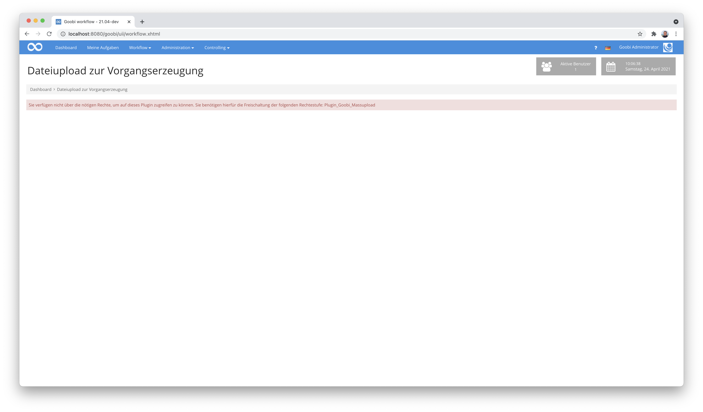
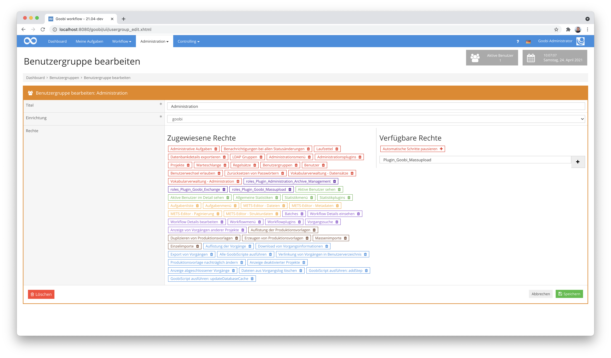
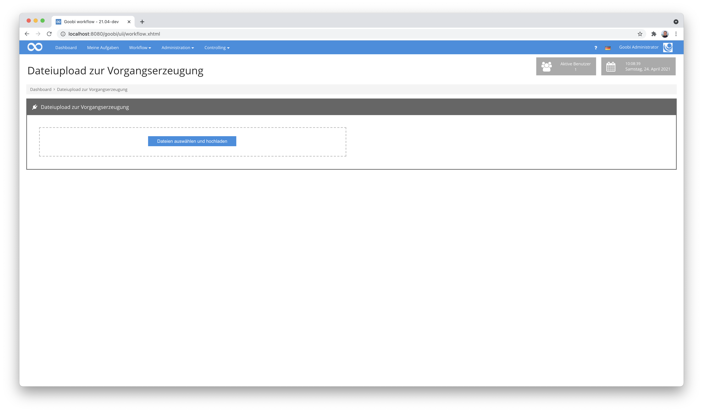

# Vorgangserstellung durch Dateiupload

## Übersicht

Name                     | Wert
-------------------------|-----------
Identifier               | intranda_workflow_fileUploadProcessCreation
Repository               | [https://github.com/intranda/goobi-plugin-workflow-file-upload-process-creation](https://github.com/intranda/goobi-plugin-workflow-file-upload-process-creation)
Lizenz              | GPL 2.0 oder neuer 
Letzte Änderung    | 25.07.2024 10:59:28


## Einführung
Dieses Workflow-Plugin erlaubt einen Massenupload von Dateien, auf deren Basis automatisch Goobi-Vorgänge erzeugt werden. Die zu verwendende Produktionsvorlage kann hierbei ebenso wie der zu erzeugende Publikationstyp über eine Konfiguration festgelegt werden. Zusammengehörige Dateien werden nach dem Erzeugen des Vorgangs automatisch zugewiesen.


## Installation
Zur Installation des Plugins müssen folgende beiden Dateien installiert werden:

```bash
/opt/digiverso/goobi/plugins/workflow/plugin-intranda-workflow-fileUploadProcessCreation-base.jar
/opt/digiverso/goobi/plugins/GUI/plugin-intranda-workflow-fileUploadProcessCreation-gui.jar
```

Um zu konfigurieren, wie sich das Plugin verhalten soll, können verschiedene Werte in der Konfigurationsdatei angepasst werden. Die Konfigurationsdatei befindet sich üblicherweise hier:

```bash
/opt/digiverso/goobi/config/plugin_intranda_workflow_fileUploadProcessCreation.xml
```


## Überblick und Funktionsweise
Für eine Nutzung dieses Plugins muss der Nutzer über die korrekte Rollenberechtigung verfügen.



Bitte weisen Sie daher der Gruppe die Rolle `Plugin_Goobi_Massupload` zu.




Wenn das Plugin korrekt installiert und konfiguriert wurde, ist es innerhalb des Menüpunkts `Workflow` zu finden.



An dieser Stellen können nun Dateien hochgeladen werden. Nach der Analyse der Dateinamen erzeugt Goobi die entsprechenden Vorgänge automatisch.


## Konfiguration
Der Inhalt dieser Konfigurationsdatei sieht wie folgt aus:

```xml
<config_plugin>

    <!-- which file types shall be allowed for uploading these -->
    <allowed-file-extensions>/(\.|\/)(gif|jpe?g|png|tiff?|jp2|pdf)$/</allowed-file-extensions>

    <!-- which process template shall be used to create the new processes -->
    <processTemplateName>ImportWorkflow</processTemplateName>

    <!-- which publication type shall be used inside of the created METS files -->
    <metadataDocumentType>Monograph</metadataDocumentType>

    <!-- define a naming schema for the file names to be matched for the process creation -->
    <namingSchema>/.*(BA_\\d+[_-](\\d+)).*\\.jpg/</namingSchema>

</config_plugin>
```

Die Konfiguration des Plugins gestaltet sich wie folgt:

| Wert | Beschreibung |
| :--- | :--- |
| `allowed-file-extensions` | Mit diesem Parameter wird festgelegt, welche Datein hochgeladen werden dürfen. Hierbei handelt es sich um einen regulären Ausdruck. |
| `processTemplateName` | Mit diesem Parameter kann definiert werden, welche Produktionsvorlage für die zu erzeugenden Vorgänge verwendet werden sollen. |
| `metadataDocumentType` | Legen Sie hiermit fest, welcher Publikationstyp innerhalb der METS-Datei verwendet werden soll für die neu zu erzeugenden Vorgänge. |
| `namingSchema` | Definieren Sie hier einen regulären Ausdruck, der auf das Benennungsschema der hochgeladenen Dateien zutreffen soll. Dieser ist maßgeblich für die Erzeugung der Vorgänge sowie die Zusammengehörigkeit der Bilder zu den Vorgängen. |