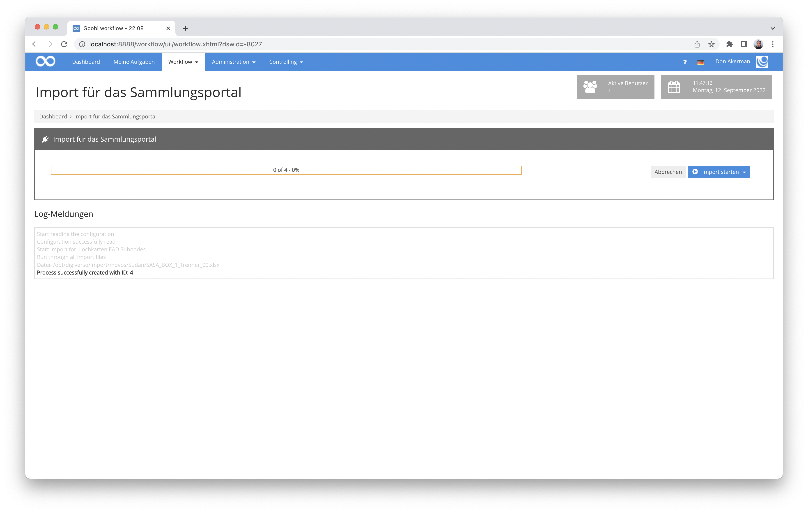

# Massenimport aus Excel-Dateien mit EAD-Anreicherung

## Übersicht

Name                     | Wert
-------------------------|-----------
Identifier               | intranda_workflow_hu_importer
Repository               | [https://github.com/intranda/goobi-plugin-workflow-hu-importer](https://github.com/intranda/goobi-plugin-workflow-hu-importer)
Lizenz              | GPL 2.0 oder neuer 
Letzte Änderung    | 25.07.2024 10:57:59


## Einführung
Dieses Workflow Plugin für Goobi workflow erlaubt einen Massenimport von Metadaten aus Excel-Dateien, wobei nicht nur Vorgänge in Goobi erzeugt werden, zu denen jeweils eine METS-Datei gehört. Zusätzlich wird ausserdem eine vorliegende EAD-Datei mit weiteren Knoten angereichert.

Dieses Plugin wurde für den Import von Daten der HU Berlin zur Anreicherung des Sammlungsportals entwickelt. In der Regel kommen bei einem solchen Import mindestens zwei verschiedene Exceldateien unterschiedlichen Typs zum Einsatz. Typ 1 spezifiziert dabei die Metadaten für das Objekt selbst (TopStruct mit Metadaten wie Haupttitel, Schlagworte usw.) und Daten für die Eigenschaften des Vorgangs (z.B. zukünftiger Name des Vorgangs). Der Typ 2 hingegen spezifiziert in der Regel diejenigen Strukturelemente, die als Unterelemente innerhalb der METS-Datei erzeugt werden sollen und welche Metadaten diese erhalten sollen (im Fall der HU Berlin z.B. Kapitel/Lochkarte, Name einer Mediendatei usw.).


## Installation
Das Plugin besteht aus folgenden Dateien:

```bash
plugin-intranda-workflow-hu-importer-base.jar
plugin-intranda-workflow-hu-importer-gui.jar
```

Die Datei `plugin-intranda-workflow-hu-importer-base.jar` muss in folgendes Verzeichnis kopiert werden:

```bash
/opt/digiverso/goobi/plugins/workflow/
```
Die Datei `plugin-intranda-workflow-hu-importer-gui.jar` muss in folgendes Verzeichnis kopiert werden:
```bash
/opt/digiverso/goobi/plugins/GUI
```

Daneben gibt es die Konfigurationsdatei `plugin_intranda_workflow_hu_importer.xml`, die in folgendem Ordner abgelegt werden muss:

```bash
/opt/digiverso/goobi/config/
```


## Überblick und Funktionsweise
Nach der Installation und Inbetriebnahme des Plugins steht dieses innerhalb des Menüs `Workflow` zur Verfügung. Nach dem Aufruf kann ein ImportSet ausgewählt werden und der Datenimport gestartet werden. Das Plugin wird versuchen im `metadataFolder` die Ordner `processed`und `failure` anzulegen. Es sollte also darauf geachtet werden, dass Goobi in diesem Ordner Schreibrechte hat. Wird eine Datei ohne Fehler eingelesen, wird Sie in den Ordner `processed` verschoben. Falls ein Fehler auftritt, landet sie im Ordner `failure`.

Das Plugin kann mit oder ohne EAD-Anbindung betrieben werden. Wenn die EAD-Anbindung für ein ImportSet nicht verwendet werden soll, müssen im entsprechenden `ImportSet` einfach die Attribute `eadType`, `eadFile` und `eadNode` weggelassen werden.

Die im `mediaFolder` liegenden Dateien werden während des Imports in die Verzeichnisse der erzeugten Vorgänge kopiert.




## Konfiguration
Die Konfiguration des Plugins erfolgt über die Konfigurationsdatei `plugin_intranda_workflow_hu_importer.xml` und kann im laufenden Betrieb angepasst werden. Im folgenden ist eine beispielhafte Konfigurationsdatei aufgeführt:

```xml
<config_plugin>

	<!--import set for excel files
	Attributes in [] are optional
		name: name of the import set, which will be displayed in the dropdonwnmenu
		metadataFolder: where are the documents located
		[mediaFolder]: where are the media files located
		workflow: the workflow that shall be used
		[project]: the goobi project that shall be used
		mappingSet: the mapping that shall be used by the import set
		publicationType: the publicationType that shall be used i.e. Monograph,...
		structureType: structureType the metadata will be mapped to
		[importSetDescription]: Path to xls-file with description of importset-files
		[descriptionMappingSet]: Mapping for the importsetdescription file
		[eadType]: Type of the EAD-entry
		[eadFile]: Name of the EAD-file/database
		[eadNode]:"ID of the parent node that this Imporset will use"
		[rowStart]: first row that will be read
		[rowEnd]: last row that will be read
		[processTitleMode]: specifies how the process naming shall be handled
	  -->
    <!-- EAD-> Lochkartei - Grabungsdokumentation Fritz und Ursula Hintze -->
    <importSet name="Lochkarten EAD Subnodes"
		metadataFolder="/opt/digiverso/import/mdvos/Sudan-Trenner/"
		mediaFolder ="/opt/digiverso/import/mdvos/Sudan-Bilder/"
		workflow="Sample_Workflow"
		project="Archive_Project"
		mappingSet="Lochkarten"
		publicationType="Divider"
		structureType="PunchCard"
		importSetDescription="/opt/digiverso/import/mdvos/Sudan-Beschreibungen/SASA_Trenner_Zuordnung.xlsx"
		descriptionMappingSet="Description"
		eadType="folder"
		eadFile="EAD-Store - Sudanarchäologie.xml"
		eadNode="f91585c7-9cd4-47f1-b9e4-5f26a6744fe3"
		eadSubnodeType="file"
		processTitleMode="EAD"
	/>

	<!-- mapping set -> set of fields that describe a mapping
		name = name of the MappingSet

		field - mapping for a row of an excel file
		Attributes in [] are optional
		column: column of the xls-file that will be mapped
        [label]; column header
        [mets] mets of metadata element
        type: person, metadata, media, structureType 
        [separator]: default value is ;
        [blankBeforeSeparator]: default value is false
        [blankAfterSeparator]: default value is false
        [ead] name of the ead metadata type
	-->
  <!-- Metadata for each structure element (Punchcard) to be created inside of process (Divider) -->
	<mappingSet name="Lochkarten">
		<field column="D" label="Inventar-Nr" type="metadata" mets="InventoryNumber"/>
		<field column="F" label="Titel" type="metadata" mets="TitleDocMain" ead="unittitle"/>
		<field column="I" label="Material" type="metadata" mets="MaterialDescription"/>
		<field column="J" label="Maße" type="metadata" mets="SizeSourcePrint"/>
		<field column="L,M" label="Datei recto, Datei verso" type="media"/>
		<field column="N" label="Strukturtyp" type="structureType" />
	</mappingSet>


	<!-- General description mapping for each process (Divider) -->
	<mappingSet name="Description">
		<field column="C" label="Dateiname" type="FileName" />
		<field column="E" label="Digitale Collection" type="metadata" mets="singleDigCollection" />
		<field column="F" label="Titel" type="metadata" mets="TitleDocMain"  ead="unittitle"/>
		<field column="H" label="Haupttitel (englisch)" type="metadata" mets="TitleDocMainEN" />
		<field column="J" label="Umfang" type="metadata" mets="physicalDescriptionExtent" />
		<field column="K" label="Datierung/Zeitangabe" type="metadata" mets="OriginationPeriod" ead="unitdate" />
		<field column="L" label="Entstehungsort" type="metadata" mets="PlaceOfOrigin" />
		<field column="M" label="Beteiligte Person 1" type="person" mets="Creator" gndColumn="O" />
		<field column="P" label="Beteiligte Person 2" type="person" mets="Creator" gndColumn="R" />
		<field column="T" label="Zusätzliche Informationen" type="metadata" mets="AdditionalInformation" />
		<field column="U" label="Schlagwort (lokal)" type="metadata" mets="SubjectLocal" />
		<field column="V" label="Formschlagwort" type="metadata" mets="SubjectForm" gndColumn="W" />
		<field column="X" label="Geographisches Schlagwort 1" type="metadata" mets="SubjectGeographic" gndColumn="Y" />
		<field column="Z" label="Geographisches Schlagwort 2" type="metadata" mets="SubjectGeographic" gndColumn="AA" />
		<field column="AB" label="Sachschlagwort 1" type="metadata" mets="SubjectTopic" gndColumn="AC" />
		<field column="AD" label="Sachschlagwort 2" type="metadata" mets="SubjectTopic" gndColumn="AE" />
		<field column="AF,AG" blankAfterSeparator="true" label="Geokoordinaten" type="metadata" mets="Coordinates" />
		<field column="AH" label="Sprache" type="metadata" mets="DocLanguage" />
	</mappingSet>

</config_plugin>
```


### Elementtypen
Das Plugin kennt zunächst die folgenden Elementtypen.

| Element | Beschreibung |
| :--- | :--- |
| `config_plugin`  | `config_plugin` ist das Hauptelement der Konfigurationsdatei und enthält alle anderen Elemente  |
| `importSet`  | Ein ImportSet beschreibt gleichartige Importvorgänge.   |
| `mappingSet`  |  Ein MappingSet besteht aus einer Menge von `field`-Elementen.|
| `field`  | `field`-Elemente sind Kindelemente von `mappingSet`. Jedes Element ordnet einer Spalte des Exceldokumentes eine Eigenschaft des zu erzeugenden Vorgangs oder dessen Metadaten zu.  |


### Element: importSet
| Attribut | Beschreibung |
| :--- | :--- |
| `name` | Name des ImportSets. Dieser wird später innerhalb der Nutzeroberfläche angezeigt. |
|`metadataFolder`| Hier muss angegeben werden, wo sich der Ordner mit den Dateien befindet, die mit dem im Attribut `mappingSet` spzefizierten MappingSet gemappt werden.|
|`mediaFolder`| Dieses optionale Attribut gibt an, wo sich die Mediendateien befinden. |
|`workflow`| Hier muss angegeben werden, welche Produktionsvorlage zum Anlegen der Vorgänge verwendet werden soll. |
|`project`| Hier kann angegeben werden, welchem Projekt der Vorgang zugeordnet werden soll. Das Attribut ist optional. Wird kein Projekt angegeben, wird das in der Produktionsvorlage spezifizierte Projekt verwendet. |
|`mappingSet`| Hier muss angegeben werden, mit welchen Mapping die Datei im `metadataFolder` verarbeitet werden sollen.|
|`publicationType`| Der Publikationstyp des Vorgangs (z.B. Monographie) |
|`structureType`| Der Strukturtyp der Elemente, die im Vorgang als Unterelement angelegt werden sollen (z.B. Kapitel oder Lochkarten). Jede Zeile eines Exceldokumentes des Typs 2 beschreibt dabei ein Element dieses Strukturtyps. |
|`importSetDescription`| Dieses optionale Attribut gibt an, wo sich die Datei mit den Metadaten zu den Vorgängen befindet. Ist der Parameter gesetzt, muss zu jeder Datei im `metadataFolder` eine Zeile in diesem Dokument spezifiziert sein. |
|`descriptionMappingSet`| Hier kann das MappingSet für die Datei mit der ImportSet-Beschreibung spezifiziert werden. Das Attribut ist optional.|
|`eadType`| Typ des EAD-Knotens (z.B. file). Das Attribut ist optional.|
|`eadFile`| Name der EAD-Datei/Datenbank. Das Attribut ist optional.|
|`eadNode`| ID des Parent-Knotens, unterhalb dessen der neue EAD-Knoten eingefügt werden soll. Das Attribut ist optional.|
|`rowStart`| Festlegung für die erste Zeile der Excel-Datei im metadataFolder, die ausgewertet werden soll. Das Attribut ist optional.|
|`rowEnd`| Festlegung für die letzte Zeile der Excel-Datei im metadataFolder, die ausgewertet werden soll. Das Attribut ist optional. Wird als Wert `0` angegeben, wird die vollständige Datei ausgewertet. |
|`processTitleMode`| Hier kann angegeben werden, wie die anzulegenden Vorgänge benannt werden sollen. Es stehen die Modi `FILENAME`, `UUID`, `XLSX` und `EAD` zur Auswahl. Standardmäßig wird der Modus `UUID` verwendet. Wenn der Modus `XLSX` verwendet wird, wird erwartet, dass im Konfigurationselement `descriptionMappingSet` ein `field` des Typs `ProcessName` vorhanden ist. Im Modus `FILENAME` wird der Dateiname als Vorgangsname verwendet. Im Modus `UUID` und `EAD` wird für den Vorgang eine UUID erzeugt. Im Falle des Modus `EAD`, wird diese UUID zudem als ID des Knotens im EAD-Baum genutzt. |
|`processPerRow`| Falls kein Wert innerhalb der Konfiguration von `importSetDescription` angegeben wurde und soll für jede Zeile der zu importierenden Excel-Datei ein Vorgang erstellt werden, muss dieses Attribut auf `true` gesetzt werden. |


### Die Elemente mappingSet und field
Ein Element des Typs `mappingSet` verfügt nur über das Attribut `name`. Damit kann es dann für das Mapping direkt angesprochen werden. Als Unterelemente sind beliebig viele Elemente `field` erlaubt.


| Attribut | Beschreibung |
| :--- | :--- |
|`column`| Spalte(n) die gemappt werden soll(en). Der eingelesene Werte wird dann dem Metadatum zugewiesen, das im Attribut `mets` definiert wurde. Alternativ kann der Inhalt der Zelle auch einer Vorgangseigenschaft wie beispielsweise dem Vorgangstitel zugeordnet werden, wenn als type `ProcessName` spezifiziert wird. Wenn mehrere Spalten in einem Wert abgebildet werden sollen, können diese einfach mit Komma getrennt aufgeführt werden (z.B. `A,B,AA`). Das Attribut ist obligatorisch. |
|`label`| Hier kann optional der Spaltentitel angegeben werden. Er wird vom Plugin nicht ausgewertet und dient nur der Dokumentation. |
|`mets`| Dieses Attribut legt fest, welchem Metadatentyp der eingelesene Wert zugeordnet werden soll. Zulässig sind hier alle Werte, die laut Regelsatz ein gültiges Metadatum für das entsprechende Strukturelements sind. |
|`type`| Dieser Parameter ist obligatorisch und kann die Werte: `person`, `metadata`, `media`, `copy`, `FileName` und `ProcessName`  annehmen. Die Werte werden unten näher erläutert. |
|`gndColumn`| Für Mappings deren Attribut `type` den Wert `metadata` oder `person` annimmt, kann hier die Spalte angegeben werden, in der sich eine Normdatenbank-URL befindet, die den Datensatz näher beschreibt (z.B. https://d-nb.info/gnd/118551310). Der Normdatensatz wird dann mit dem Metadatum verknüpft. |
|`separator`| Dieser Separator wird verwendet, wenn mehrere Elemente in einem Wert abgebildet werden sollen. Der Standardwert ist `;`.  Das Attribut ist optional.|
|`blankBeforeSeparator`| Falls der Inhalt mehrerer Spalten in einen Wert gemappt werden soll, kann hier bestimmt werden, ob ein Leerzeichen vor dem Separator gesetzt werden soll. Der Standardwert ist `false`.|
|`blankAfterSeparator`| Falls der Inhalt mehrerer Spalten in einen Wert abgebildet werden soll, kann hier bestimmt werden, ob ein Leerzeichen nach dem Separator gesetzt werden soll. Der Standardwert ist `false`. |
|`ead`| Wenn dieser Parameter gesetzt ist, wird der Inhalt der Zelle diesem EAD-Metadatentyp zugeordnet. |
|`target`| Wird nur unterstützt, wenn der in dem Attribut `type` als Wert `copy` verwendet wurde. Hier kann der Zielordner für die zu kopierenden Dateien angegeben werden. Hierbei wird das Goobi-Variablensystem unterstützt. |
|`structureType`| Wird nur unterstützt, wenn im Attribut `type` als Wert `media` verwendet wurde. Falls gewünscht ist, dass die Mediendateien einem spezifischen anzulegendem Strukturelement zugeordnet werden, wird hier der Typ des Strukturelementes hier festgelegt. |


### Werte des Type-Attributes
| Wert | Beschreibung |
| :--- | :--- |
|`metadata`| Ein Element vom Typ `metadata` wird dem im Attribut `mets` spezifizierten Metadatum in der METS-Datei zugeordnet |
| `person`| Hierbei handelt es sich um einen METS-Datentyp. Wenn der Typ `person` verwendet wird, sollte immer auch das Attribut `mets` gesetzt werden. |
|`media`| In der angegebenen Spalte müssen sich ein oder mehrere Dateinamen befinden. Der Seperator ist hierbei normalerweise `,`. Er kann aber bei Bedarf durch Verwendung des Attributes `separator` anders festgelegt werden. Es wird davon ausgegangen, dass sich die Datei im Verzeichnis `mediaFolder` befindet. Siehe hierzu bei der Konfiguration von `Importset`. |
|`copy` | In der angegebenen Spalte müssen sich ein oder mehrere Dateinamen befinden. Der Seperator ist hierbei normalerweise `,`. Er kann aber bei Bedarf durch Verwendung des Attributes `separator` anders festgelegt werden. Es wird davon ausgegangen, dass sich die Datei im Verzeichnis `mediaFolder` befindet. Siehe hierzu bei der Konfiguration von `Importset`. Die Dateien werden in den Ordner verschoben, der im Attribut `target` angegeben wird. Das `target`-Attribut unterstützt hierbei auch das Goobi-Variablensystem. |
|`FileName`| Dieser Typ muss verwendet werden, um die Spalte mit dem Dateinamen der Prozessbeschreibung anzugeben. Dieser Feldtyp ist also nur in einem `descriptionMappingSet` sinnvoll.  |
|`ProcessName` | Dieser Typ muss verwendet werden, um die Spalte mit dem zukünftigen Prozessnamen zu spezifizieren.  |
|`PublicationType` | Wird der Typ `PublicationType` verwendet, wird der Wert aus der Zelle als Publikationstyp genutzt. Wenn die Zelle leer ist, wird der im Attribut `ImportSet` festgelegte `PublicationType` verwendet. Der Typ wird nur für das Erzeugen des obersten Strukturelements eines Vorgangs verwendet.|
|`structureType`| Wird der Typ `structureType` verwendet, wird der Wert aus der Zelle, als Stukturtyp verwendet. Wenn die Zelle leer ist, wird der im Attribut `ImportSet` festgelegte `sturctureType` verwendet. Der Typ wird nur für das Erzeugen von Strukturelementen eines Vorgangs verwendet, also von dessen Unterelementen. Bezogen auf ein Buch entspricht dies beispielsweise den Titelblättern und Kapiteln. |