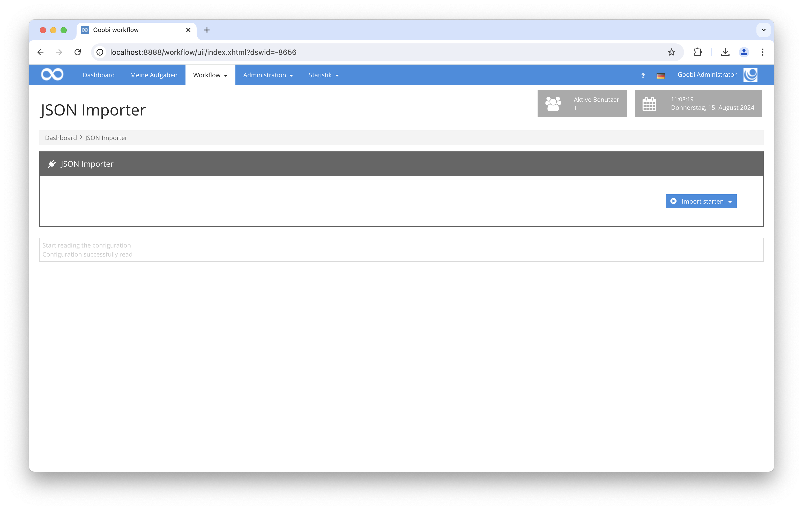

# Generisches Import-Plugin für JSON-Dateien

## Übersicht

Name                     | Wert
-------------------------|-----------
Identifier               | intranda_workflow_import_json
Repository               | [https://github.com/intranda/goobi-plugin-workflow-import-json](https://github.com/intranda/goobi-plugin-workflow-import-json)
Lizenz              | GPL 2.0 oder neuer 
Letzte Änderung    | 14.08.2024 19:06:00


## Einführung
Dieses dies die technische Dokumentation für das Workflow-Plugin für Goobi workflow, das dazu dient, Metadaten aus mehreren JSON-Dateien auszulesen und darauf Vorgänge zu erstellen.


## Installation
Zur Installation des Plugins müssen folgende beiden Dateien installiert werden:

```bash
/opt/digiverso/goobi/plugins/workflow/plugin-intranda-workflow-import-json-base.jar
/opt/digiverso/goobi/plugins/GUI/plugin-intranda-workflow-import-json-gui.jar
```

Um zu konfigurieren, wie sich das Plugin verhalten soll, können verschiedene Werte in der Konfigurationsdatei angepasst werden. Die Konfigurationsdatei befindet sich üblicherweise hier:

```bash
/opt/digiverso/goobi/config/plugin_intranda_workflow_import_json.xml
```



## Konfiguration
Der Inhalt der Konfigurationsdatei sieht wie folgt aus:

```xml
<config_plugin>
	<!-- folder that contains the json files -->
	<jsonFolder>/opt/digiverso/goobi/import/</jsonFolder>

	<!-- folder used to hold the downloaded images temporarily -->
	<importFolder>/opt/digiverso/goobi/tmp/</importFolder>

	<!-- which workflow to use -->
	<workflow>Sample_Workflow</workflow>

	<!-- which publication type to use -->
	<publicationType>Monograph</publicationType>

	<!-- URL types that hold downloadable resources, could be none or multiple -->
	<downloadableUrl>GizaPhotosMain</downloadableUrl>
	<downloadableUrl>GizaPrimaryDisplayMain</downloadableUrl>

	<!-- whether or not to save the partner url, DEFAULT false -->
	<partnerUrl save="true">
		<!-- at most one urlBase should be configured, DEFAULT "" -->
		<urlBase>giza.fas.harvard.edu</urlBase>
		<!-- there could be multiple urlParts-->
		<urlPart>$._type</urlPart>
		<urlPart>$._id</urlPart>
		<!-- at most one urlTail should be configured, DEFAULT "" -->
		<urlTail>full</urlTail>
		<!-- MetadataType that is to hold the value of the partner url -->
		<urlMetadata>GizaPartnerUrl</urlMetadata>
	</partnerUrl>

	<!-- same source could be used multiple times for different MetadataTypes -->
	<metadata source="$._source.id" target="TitleDocMain" />
	<metadata source="$._source.id" target="CatalogIDDigital" />
	<!-- source that does not start with $ or @ will be regarded as value -->
	<metadata source="Giza" target="singleDigCollection" />
	<!-- source that ends with [:] is an array -->
	<metadata source="$._source.allnumbers[:]" target="GizaAllNumbers" />

	<!-- group is for MetadataGroups, there could be multiple -->
	<!-- no need to add the [:] to the end of @source -->
	<!-- @type is the name of the MetadataGroupType -->
	<group source="$._source.sitedates" type="GizaSiteDatesGroup">
		<!-- source that starts with @ will be regarded as relative json path -->
		<metadata source="@.type" target="GizaSiteDateType" />
		<metadata source="@.date" target="GizaSiteDate" />
	</group>

	<!-- @altType is the name of an alternative MetadataGroupType, which will be used to create another MetadataGroup for all items that are filtered out. OPTIONAL. -->
	<!-- @key is the filtering key that is used to retrieve the value from the JSONObject. OPTIONAL. -->
	<!-- @value is used to compare with the value retrieved from the JSONObject. OPTIONAL. DEFAULT "". -->
	<!-- @method defines the logic for comparing values. Options are is, not, startsWith, endsWith, contains. OPTIONAL. DEFAULT 'is'. -->
	<group source="$._source.relateditems.modernpeople" type="ModernPeopleGroup" altType="_ModernPeopleGroupHidden" key="role" value="Excavator" method="is">
		<metadata source="@.role" target="GizaModernPeopleRole" />
		<!-- same source could be used multiple times for different MetadataTypes -->
		<metadata source="@.id" target="GizaModernPeopleId" />
		<metadata source="@.id" target="GizaModernPeopleId2" />
	</group>

	<!-- if no @altType is configured, then all items that are filtered out will not be imported. -->
	<group source="$._source.relateditems.ancientpeople" type="AncientPeopleGroup" key="role" value="Tomb Owner">
		<metadata source="@.role" target="GizaAncientPeopleRole" />
		<metadata source="@.id" target="GizaAncientPeopleId" />
	</group>

	<!-- child is for child DocStructs, there could be multiple -->
	<!-- no need to add the [:] to the end of @source-->
	<!-- the attributes @key, @value, @method are the same as in group -->
	<!-- there is NO @altType attribute for child, all items that are filtered out will not be imported -->
	<child source="$._source.relateditems.photos" type="GizaPhoto" key="number" value="KHM_AEOS_" method="startsWith">
		<!-- same source could be used multiple times for different MetadataTypes -->
		<metadata source="@.drs_id" target="GizaPhotosDrsId" />
		<metadata source="@.drs_id" target="CatalogIDDigital" />
	</child>

</config_plugin>
```

Die Konfiguration des Plugins gestaltet sich wie folgt:

| Wert | Beschreibung |
| :--- | :--- |
| `jsonFolder` | Pfad zum Verzeichnis, wo sich die JSON-Dateien befinden. |
| `importFolder` | Pfad zum Verzeichnis, wo die herunterzuladenden Bilder gespeichert werden sollen, bevor sie in die Vorgänge importiert werden. |
| `workflow` | Name des Produktionsvorlage, die verwendet werden soll. |
| `publicationType` | Publikationstyp für die anzulegenden Vorgänge. |
| `downloadableUrl` | Typs des Metadatums, in dem die URL angegeben ist, von der die Bilder herunterzuladen sind. Dieser Wert ist wiederholbar. |
| `metadata` | Aus jedem Tag wird ein Metadata-Objekt erzeugt. Das Attribut `@source` bezieht sich auf einen JSON-Pfad, wenn dieser mit `$` beginnt. Aus diesem Pfad wird der Wert des Metadatums ausgelesen. In diesem Falle bezieht sich das Attribut auf eine Liste, wenn es außerdem mit `[:]` endet. Wenn es weder mit `$` noch mit `@` startet, wird es hingeben selbst als Wert des Metadatums verwendet. Das Attribut `@target` konfiguriert den Namen des Metadatentyps. |
| `group` | Hier werden Metadatengruppen konfiguriert. Es gibt sechs Attribute, die nachfolgend erläutert werden. Unter einem `group`-Element können mehrere `metadata`-Elemente konfiguriert werden, deren `@source` Attribute mit `@` starten sollen.  |
| `child` | Hier werden Strukturelemente konfiguriert. Es gibt fünf Attribute, die nachfolgend erläutert werden. Unter einem `child`-Element können mehrere `metadata`-Elemente konfiguriert werden, deren `@source` Attribute mit `@` starten sollen. |


### Konfiguration der Attribute eines MetadataGroups
Die folgenden Attribute können in einem `group`-Element konfiguriert werden:

| Wert | Beschreibung |
| :--- | :--- |
| `@source` | JSON-Pfad zum Eltern-Element einer Liste. Startet mit einem `$`. |
| `@type` | Typ der Metadatengruppe. |
| `@altType` | Alternativer Typ der Metadatengruppe. Wenn der alternative Typ richtig konfiguriert wird, wird aus allen gefilterten Einträgen eine Metadatengruppe diesen Typs erzeugt. Wenn das Attribut nicht konfiguriert ist oder wenn der konfigurierte Typ nicht zu finden ist, werden alle gefilterten Einträge nicht importiert. Dieser Parameter ist optional. |
| `@key` | Schlüssel der JSON-Objekte für die Filterung. Dieser Parameter ist optional. |
| `@value` | Wert zum Vergleich beim Filtern. Dieser Parameter ist optional. |
| `@method` | Zu verwendende Logik für das Filtern. Möglichkeiten sind hierbei `is`, `not`, `startsWith`, `endsWith` und `contains`. Dieser Parameter ist optional. Der Default-Wert lautet `is`. |


### Konfiguration der Attribute eines DocStructs als Kind
Die folgenden Attribute können in einem `child`-Element konfiguriert werden:

| Wert | Beschreibung |
| :--- | :--- |
| `@source` | JSON-Pfad zum Eltern-Element einer Liste. Startet mit einem `$`. |
| `@type` | Typ des Strukturelements. |
| `@key` | Schlüssel der JSON-Objekte für die Filterung. Dieser Parameter ist optional. |
| `@value` | Wert zum Vergleich beim Filtern. Dieser Parameter ist optional. |
| `@method` | Zu verwendende Logik für das Filtern. Möglichkeiten sind hierbei `is`, `not`, `startsWith`, `endsWith` und `contains`. Dieser Parameter ist optional. Der DEFAULT-Wert lautet `is`. |


### Konfiguration des Metadatums für den URL des Partners
Es gibt eine Möglichkeit, ein Metadatum für die URL des Partners zu erzeugen und zu speichern. Die zu erzeugende URL wird wie folgt festlegt: `{urlBase}/{urlPart_1}/{urlPart_2}/.../{urlPart_k}/{urlTail}/`

| Wert | Beschreibung |
| :--- | :--- |
| `partnerUrl` | Das Attribut `save` konfiguriert ob ein Metadatum für die URL des Partners erzeugt werden soll. Der DEFAULT-Wert lautet `false`. |
| `urlBase` | Hier konfiguriert man den URL zum Server des Partners. Dieser Parameter ist optional. Maximal ein Treffer ist möglich. |
| `urlPart` | Hier werden die Teile der URL konfiguriert, deren Werte aus den JSON-Objekten an die `urlBase` nacheinander anhängen werden sollen. Dieser Parameter ist optional. Mehrere Treffer sind möglich. |
| `urlTail` | Hier wird der hintere Teil der URL konfiguriert. Dieser Parameter ist optional. Maximal ein Treffer ist möglich. |
| `urlMetadata` | Typ des Metadatums. |