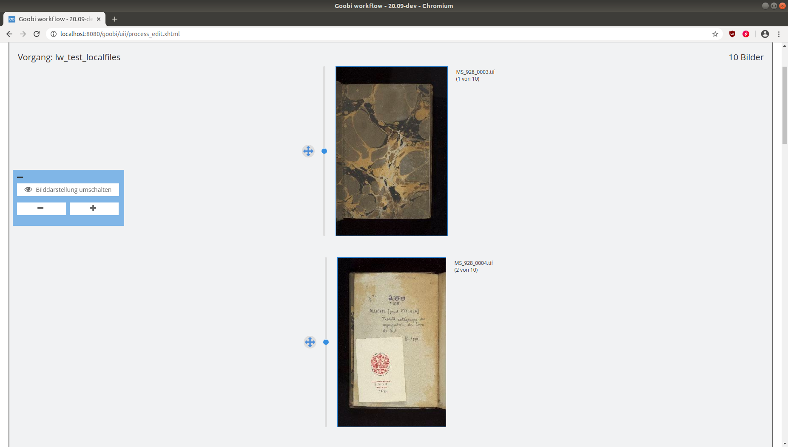
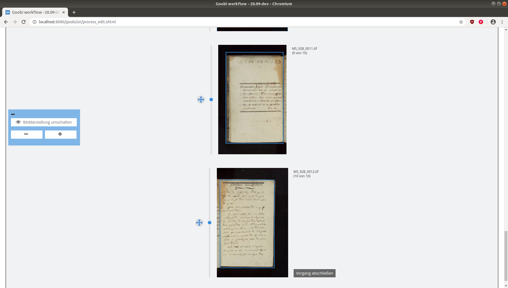

# LayoutWizzard workflow plugin

## Übersicht

Name                     | Wert
-------------------------|-----------
Identifier               | intranda_workflow_crop
Repository               | [https://github.com/intranda/goobi-plugin-workflow-layoutwizzard](https://github.com/intranda/goobi-plugin-workflow-layoutwizzard)
Lizenz              | GPL 2.0 oder neuer 
Letzte Änderung    | 25.07.2024 11:04:39


## Einführung
Dieses Workflow-Plugin erlaubt es, mehrere Bilder, die aus verschiedenen Goobi-Vorgängen stammen in einer gemeinsamen LayoutWizzard-Oberfläche zu bearbeiten. Dazu werden alle Vorgänge ermittelt, deren Workflow sich aktuell auf dem konfigurieren offenen Arbeitsschritt befinden, um für diese eine LayoutWizzard-Korrektur anzubieten.


## Installation
Zur Installation des Plugins müssen folgende beiden Dateien installiert werden:

```bash
/opt/digiverso/goobi/plugins/workflow/plugin-intranda-workflow-crop-base.jar
/opt/digiverso/goobi/plugins/GUI/plugin-intranda-workflow-crop-gui.jar
```

Um zu konfigurieren, wie sich das Plugin verhalten soll, können verschiedene Werte in der Konfigurationsdatei angepasst werden. Die Konfigurationsdatei befindet sich üblicherweise hier:

```bash
/opt/digiverso/goobi/config/plugin_intranda_workflow_crop.xml
```


## Überblick und Funktionsweise
Wenn das Plugin korrekt installiert und konfiguriert wurde, ist es innerhalb des Menüpunkts `Workflow` zu finden. Nach dem Betreten des Plugins wird dann eine LayoutWizzard-Preview-Ansicht geöffnet, die sehr ähnlich zu derjenigen des [Step-Plugins für den Layoutwizzard](https://docs.goobi.io/goobi-workflow-plugins-de/step/layoutwizzard/01_use/01_preview) gestaltet ist.



Die Bedienung dieses Plugins ist mit derjenigen des regulären LayoutWizzards innerhalb des Preview-Modus weitestgehend identisch. Der einzig nennenswerte Unterschied betriff hierbei lediglich die Aufführung der einzelnen Vorgänge, die jeweils visuell voneinander abgetrennt sind und durch einen einfachen Klick auf den zugehörigen Butten abgeschlossen werden können. Die Anzeige der Bilder aktualisiert sich daraufhin und zeigt anschließend den jeweils nächsten Vorgang an.




## Konfiguration
Der Inhalt der Konfigurationsdatei sieht wie folgt aus:

```xml
<config>
    <!-- this step must be open in a process for the process to appear in the plugin-->
    <allowed-step>
        LayoutWizzard
    </allowed-step>
    <singleImage>
        <cropFrame>
            <linewidth>2</linewidth>
            <linecolor>#00fa9a</linecolor>
            <fillcolor>#ffffff</fillcolor>
            <clickradius>20</clickradius>
            <fillcolor>#ffffff</fillcolor>
        </cropFrame>
        <spineMarker>
            <linewidth>2</linewidth>
            <linecolor>#ff0000</linecolor>
            <fillcolor>#ffffff</fillcolor>
            <clickradius>20</clickradius>
        </spineMarker>
    </singleImage>
    <!-- Config for appearance of images in preview mode -->
    <preview>
        <cropFrame>
            <linewidth>2</linewidth>
            <linecolor>#368EE0</linecolor>
            <fillcolor>#f1f2f3</fillcolor>
            <clickradius>20</clickradius>
            <fillcolor>#f1f2f3</fillcolor>
        </cropFrame>
        <spineMarker>
            <linewidth>2</linewidth>
            <linecolor>#ff0000</linecolor>
            <fillcolor>#f1f2f3</fillcolor>
            <clickradius>10</clickradius>
        </spineMarker>
    </preview>

    <previewCroppingOptions>
        <show>true</show>
    </previewCroppingOptions>
</config>
```