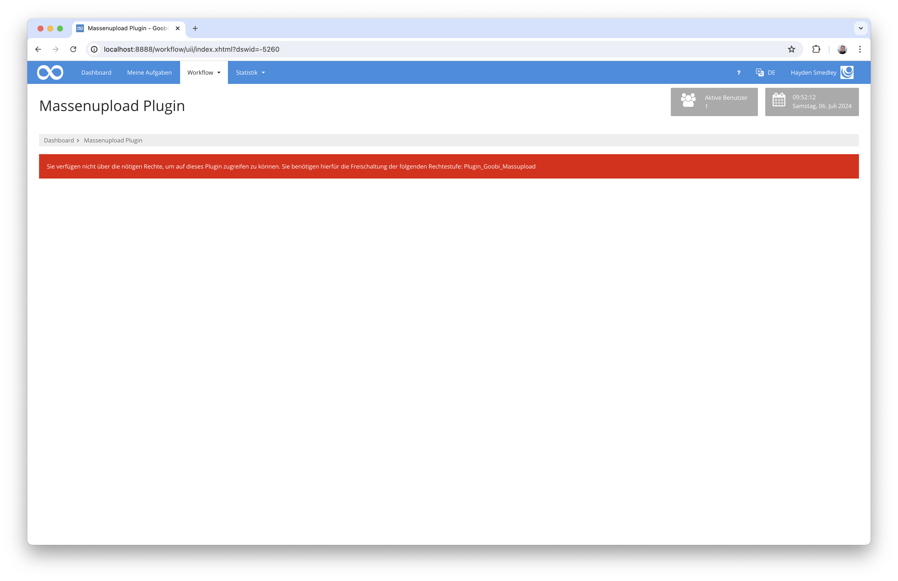
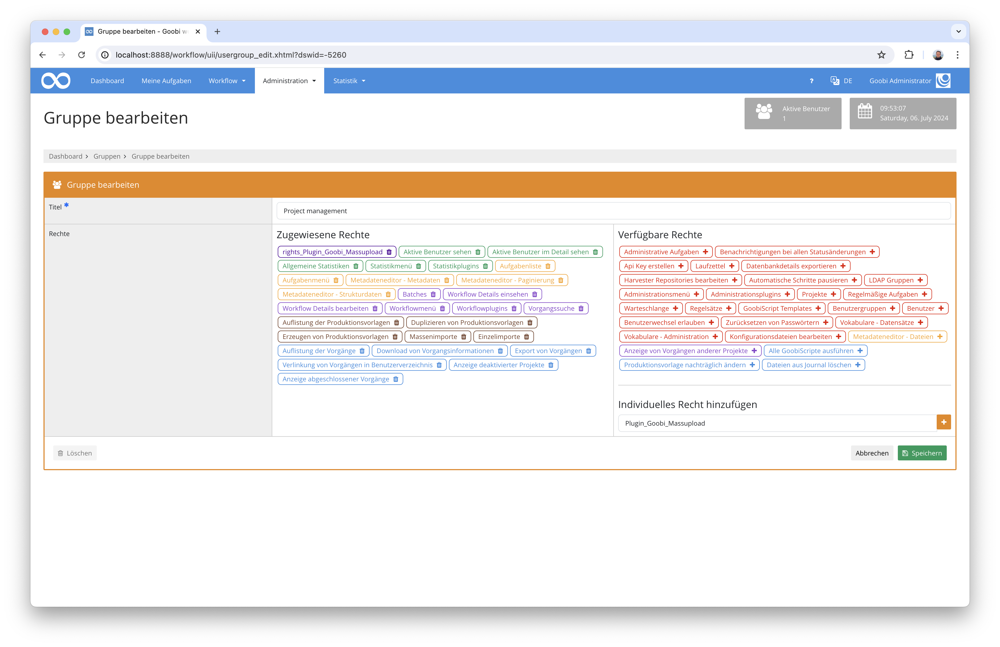
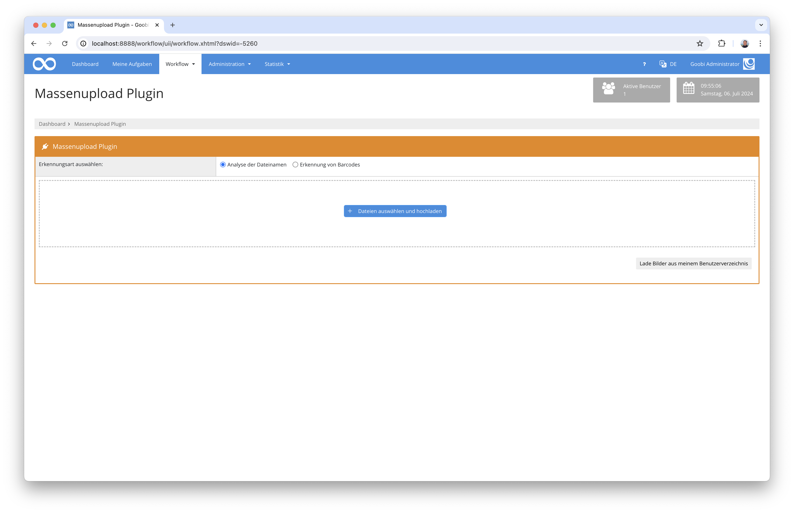
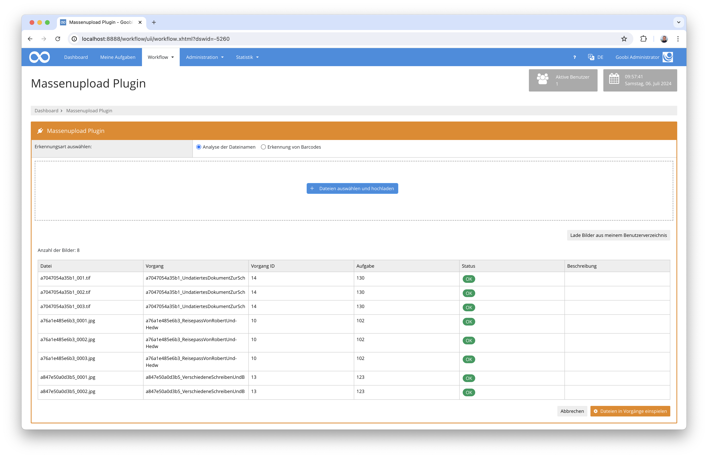
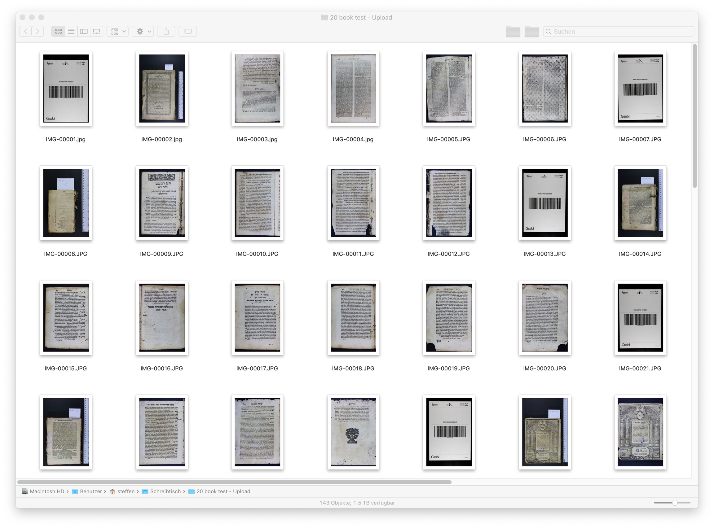

# Massenupload

## Übersicht

Name                     | Wert
-------------------------|-----------
Identifier               | intranda_workflow_massupload
Repository               | [https://github.com/intranda/goobi-plugin-workflow-mass-upload](https://github.com/intranda/goobi-plugin-workflow-mass-upload)
Lizenz              | GPL 2.0 oder neuer 
Letzte Änderung    | 13.07.2024 09:56:33


## Einführung
Dieses Workflow-Plugin erlaubt einen Massenupload von Dateien, die von Goobi workflow automatisch zu den richtigen Vorgängen zugeordnet werden sollen. Hierfür stellt das Plugin eine eigene Oberfläche zur Verfügung, die entweder einen Upload direkt über die Weboberfläche erlaubt oder alternativ ebenso Bilder aus dem Nutzerverzeichnis auslesen kann. Diese Bilder werden durch das Plugin auf ihren Namen geprüft, um daraus den zugehörigen Goobi-Vorgang zu ermitteln. Ist eine Ermittlung des Vorgangs eindeutig und befindet sich der ermittelte Goobi-Vorgang auch im konfigurierten Arbeitsschritt des Workflows, so werden die Bilder diesem zugeordnet und der Workflow weiter verarbeitet.

Neben der Zuordnung der Dateien auf Basis des Dateinamens ist ebenso konfigurierbar, dass stattdessen eine Bildanalyse erfolgen soll, die Barcodes liest. Damit ist es möglich, dass Bilder mehrere Vorgänge beispielsweise fortlaufend benannt sind und lediglich ein Trennblatt zwischen den Aufnahmen mit aufgenommen werden muss. Alle Bilder nach einem solchen Trennblatt mit identifizierbarem Barcode werden dem jeweiligen Vorgang zugewiesen, bis der nächste Barcode im Dateistapel ermittelt wird.

## Installation
Zur Installation des Plugins müssen folgende beiden Dateien installiert werden:

```bash
/opt/digiverso/goobi/plugins/workflow/plugin_intranda_workflow_massupload.jar
/opt/digiverso/goobi/plugins/GUI/plugin_intranda_workflow_massupload-GUI.jar
```

Um zu konfigurieren, wie sich das Plugin verhalten soll, können verschiedene Werte in der Konfigurationsdatei angepasst werden. Die Konfigurationsdatei befindet sich üblicherweise hier:

```bash
/opt/digiverso/goobi/config/plugin_intranda_workflow_massupload.xml
```

Für eine Nutzung dieses Plugins muss der Nutzer über die korrekte Rollenberechtigung verfügen.



Bitte weisen Sie daher der Gruppe die Rolle `Plugin_Goobi_Massupload` zu.




## Überblick und Funktionsweise
Wenn das Plugin korrekt installiert und konfiguriert wurde, ist es innerhalb des Menüpunkts `Workflow` zu finden.



An dieser Stellen können nun entweder Dateien hochgeladen oder aus dem Nutzerverzeichnis ausgelesen werden. Nach der Analyse der Dateinamen bzw. Bilder zeigt Goobi workflow an, welchen Vorgängen die eingespielten Bilder zugewiesen werden können.



Mit einem Klick auf den Button `Dateien in Vorgänge einspielen` werden die Bilder nun in die Verzeichnisse der ermittelten Vorgänge verschoben und der Workflow fortgeführt.

Bitte beachten Sie: Soll eine Erkennung von Barcodes erfolgen, um daraus die Vorgänge zu ermitteln, so ist wichtig, dass auch die Barcodes in ausreichender Größe und Qualität vorliegen, damit die Erkennung erfolgreich ist.




## Konfiguration
Die Konfiguration des Plugins erfolgt in der Datei `plugin_intranda_workflow_massupload.xml` wie hier aufgezeigt:

```xml
<config_plugin>

	<!-- which file types shall be allowed for uploading these -->
	<allowed-file-extensions>/(\.|\/)(gif|jpe?g|png|tiff?|jp2|pdf)$/</allowed-file-extensions>

	<!-- name of the folder inside of a users home directory to use as alternative for web upload -->
	<user-folder-name>mass_upload</user-folder-name>

	<!-- define the method how to detect the processes from the uploaded images the following methods are available:
		- "filename" to use the filenames for matching the right Goobi processes
		- "barcode" to detect barcodes inside of the images to assign to the right Goobi processes up to the next barcode page
		- "user" to let the user decide between filename or barcode detection -->
	<detection-type>filename</detection-type>

	<!-- copy images using goobi script in the background (true or false) -->
	<copy-images-using-goobiscript>false</copy-images-using-goobiscript>

	<!-- which workflow step has to be open to allow the upload into the process -->
	<allowed-step>Scanning</allowed-step>
	<allowed-step>Upload</allowed-step>

	<!-- which part of the files shall be used to find the right process (prefix, suffix or complete) -->
	<filename-part>prefix</filename-part>
	<filename-separator>_</filename-separator>

    <!-- define if the process title must contain the value or must match the exact title (contains or exact)  -->
    <match-type>contains</match-type>

    <!-- which part of the process title shall be used to match the right process (prefix, suffix or complete) - STILL UNUSED <processname-part>complete</processname-part>  -->
    <!-- <processname_separator>_</processname_separator> -->

</config_plugin>

```

Parameter                       | Erläuterung
--------------------------------|----------------------------------------
`allowed-file-extensions`       | Mit diesem Parameter wird festgelegt, welche Datein hochgeladen werden dürfen. Hierbei handelt es sich um einen regulären Ausdruck.
`user-folder-name`              | Wenn die Dateien aus dem Nutzerverzeichnis ausgelesen werden sollen, kann hier festgelegt werden, wie der Ornder innerhalb des Nutzerverzeichnisses heisst, aus dem die Dateien gelesen werden sollen.
`detection-type`                | Mit diesem Parameter wird festgelegt, ob die Zuordnung zu den Vorgängen auf Basis von Barcodes erfolgen soll oder ob diese anhand der Dateibenennungen erfolgen soll. Als Werte stehen hier für `filename` für die Nutzung der Dateinamen und `barcode` für die Barcodeerkennung zur Verfügung. Wird als Wert `user` angegeben, erhält der Nutzer einer Auswahlmöglichkeit in der Bedienoberfläche.
`copy-images-using-goobiscript` | Sofern der Datentransfer im Hintergrund über die Warteschlangenfunktionalität von GoobiScript erfolgen soll, kann dies hier festgelegt werden.
`allowed-step`                  | Legen Sie in diesem wiederholbaren Parameter fest, welcher Arbeitsschritt im ermittelten Vorgang sich gerade im Status `offen` befinden muss.
`filename-part`                 | Mit diesem Parameter kann festgelegt werden, wie die Zuordnung der Dateinamen zu den Vorgängen erfolgen soll.
`filename-separator`            | Geben Sie hier dasjenige Trennzeichen an, anhand dessen ein Prefix oder Suffix abgeschnitten werden soll. Somit kann festgelegt werden, dass z.B. aus einer Datei `kleiuniv_987654321_00002.tif` bei einer Zuordnung mittels`prefix`und dem Trennzeichen `_` ein Vorgang ermittelt werden soll, der `kleinuniv_987654321` heisst.
`match-type`                    | Legen Sie hier fest, ob der das Matching der Vorgänge mittels `exact` über einen exakten Namen erfolgen soll oder mittels `contains` ob der Vorgangsname den Wert lediglich enthalten soll.