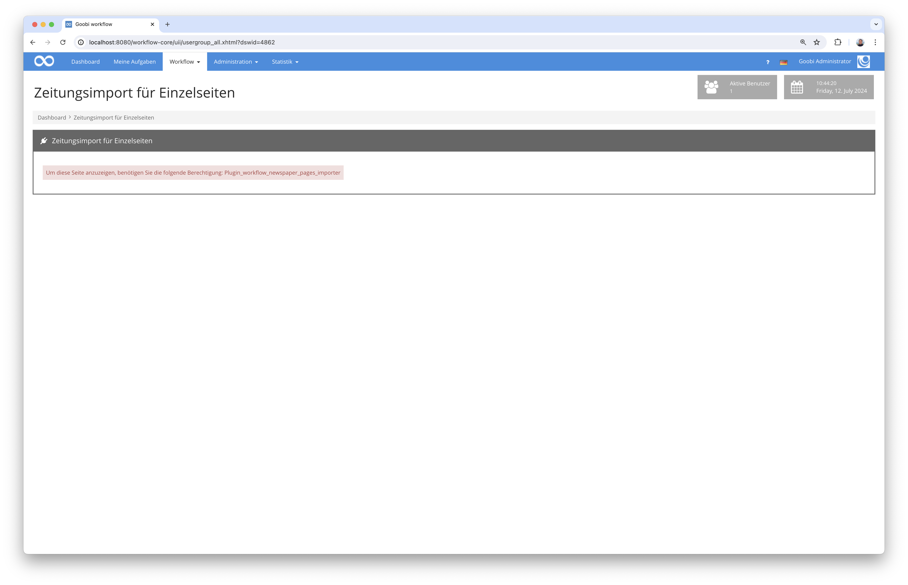
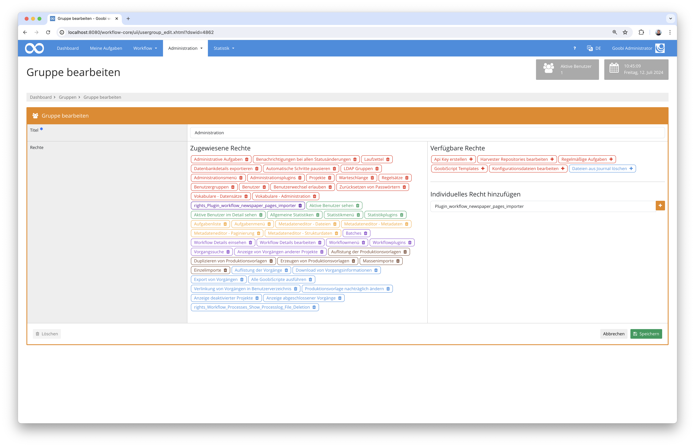
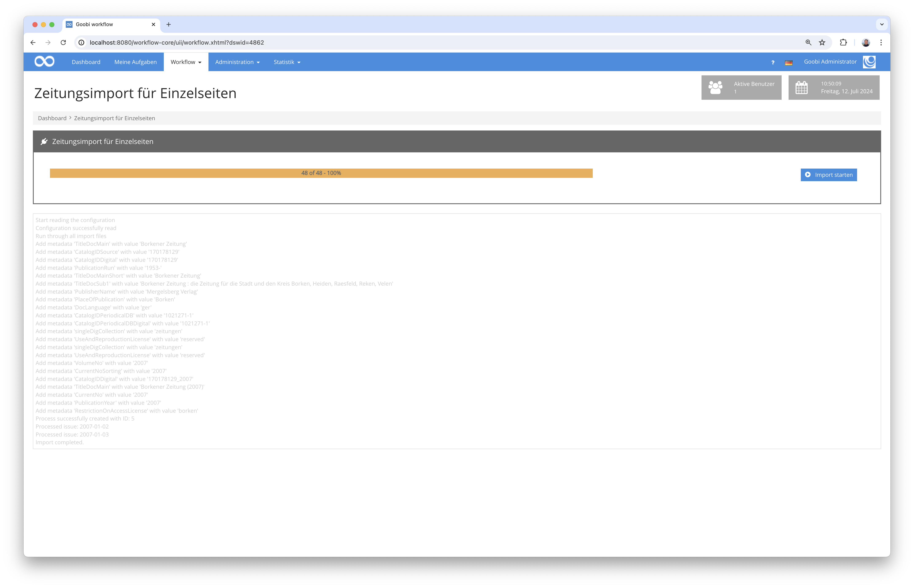

# Import von Zeitungsausgaben als Einzelseiten

## Übersicht

Name                     | Wert
-------------------------|-----------
Identifier               | intranda_workflow_newspaper_pages_importer
Repository               | [https://github.com/intranda/goobi-plugin-workflow-newspaper-pages-importer](https://github.com/intranda/goobi-plugin-workflow-newspaper-pages-importer)
Lizenz              | GPL 2.0 oder neuer 
Letzte Änderung    | 13.07.2024 09:56:26


## Einführung
Dieses Workflow-Plugin erlaubt einen Massenimport von Zeitungsausgaben, die als Einzelseiten vorliegen. Für jede in einem Ordner vorliegende Datei wird dabei anhand des Dateinamens das Ausgabendatum sowie die Ausgabennummer ermittelt. Anschließend werden Goobi-Vorgängen auf Jahresebene erzeugt und die Ausgaben samt Metadaten und Seitenzugehörigkeiten erzeugt.

## Installation
Zur Installation des Plugins müssen folgende beiden Dateien installiert werden:

```bash
/opt/digiverso/goobi/plugins/workflow/plugin-workflow-newspaper-pages-importer-base.jar
/opt/digiverso/goobi/plugins/GUI/plugin-workflow-newspaper-pages-importer-gui.jar
```

Um zu konfigurieren, wie sich das Plugin verhalten soll, können verschiedene Werte in der Konfigurationsdatei angepasst werden. Die Konfigurationsdatei befindet sich üblicherweise hier:

```bash
/opt/digiverso/goobi/config/plugin_intranda_workflow_newspaper_pages_importer.xml
```

Für eine Nutzung dieses Plugins muss der Nutzer über die korrekte Rollenberechtigung verfügen.



Bitte weisen Sie daher der Gruppe die Rolle `Plugin_workflow_newspaper_pages_importer` zu.




## Überblick und Funktionsweise
Wenn das Plugin korrekt installiert und konfiguriert wurde, ist es innerhalb des Menüpunkts `Workflow` zu finden.


Nach dem Betreten des Plugins kann der eigentliche Importvorgang gestartet werden. Hierbei wird innerhalb des konfigurierten Quellverzeichnisses nach vorhandenen Dateien gesucht und deren Namen überprüft. Das Benennungsschema innerhalb des Dateinamens muss dafür folgendermaßen aussehen:

```bash
yyyy-MM-dd_AAA.bbb
```

Die Zeichen stehen dabei für das folgende:

Zeichen  | Erläuterung
---------|----------------------------------------
 `yyyy`  | Angabe des vierstelligen Jahres
 `MM`    | Angabe des zweistelligen Monats, ggf. mit führender Null
 `dd`    | Angabe des zweistelligen Tages, ggf. mit führender Null
 `AAA`   | Numerische Ausgabennummer in drei Stellen, ggf. mit führenden Nullen
 `bbb`   | Dateiendung, wie z.B. `pdf`, `jpeg` oder `tif`  

Beispielhaft ein Verzeichnislisting für einen solchen Ordnerinhalt:

```bash
tree /opt/digiverso/import
/opt/digiverso/import
├── 1867-04-06_001.pdf
├── 1867-04-06_002.pdf
├── 1867-04-06_003.pdf
├── 1867-04-06_004.pdf
├── 1867-04-20_001.pdf
├── 1867-04-20_002.pdf
├── 1867-04-20_003.pdf
├── 1867-04-20_004.pdf
├── 1867-05-04_001.pdf
├── 1867-05-04_002.pdf
├── 1867-05-04_003.pdf
├── 1867-05-04_004.pdf
├── 1867-05-11_001.pdf
├── 1867-05-11_002.pdf
├── 1867-05-11_003.pdf
├── 1867-05-11_004.pdf
├── 1867-05-18_001.pdf
├── 1867-05-18_002.pdf
├── 1867-05-18_003.pdf
├── 1867-05-18_004.pdf
├── 1867-05-25_001.pdf
├── 1867-05-25_002.pdf
├── 1867-05-25_003.pdf
├── 1867-05-25_004.pdf
```



Während der Durchführung des Imports werden in Goobi für jedes Jahr ein Vorgang erzeugt, worin für jede Zeitungsausgabe jeweils ein Strukturelement mit den zugehörigen Daten, die aus den Dateinamen sowie aus den Werten der Konfiguration erzeugt wird. 


## Konfiguration
Die Konfiguration des Plugins erfolgt in der Datei `plugin_intranda_workflow_newspaper_pages_importer.xml` wie hier aufgezeigt:

```xml
<config_plugin>
	

	<set title="Block 1">

		<!-- which folder to use as import source -->
		<importFolder>/opt/digiverso/import/sample1/</importFolder>
		
		<!-- which workflow to use -->
		<workflow>Newspaper_workflow</workflow>
		
		<!-- prefix for the process title; will be extended by '_' and the year information -->
		<processtitle>mytitle_1234567</processtitle>
		
		<!-- prefix to use for the issue titles -->
		<issueTitlePrefix>Ausgabe vom</issueTitlePrefix>		
		<issueTitlePrefixMorning identifier="_a_">Morgenausgabe vom</issueTitlePrefixMorning>		
		<issueTitlePrefixEvening identifier="_b_">Abendausgabe vom</issueTitlePrefixEvening>		
	
		<!-- prefix for the page labels -->
		<pageNumberPrefix>Page </pageNumberPrefix>
	
		<!-- language to use for long date formatter in issue title -->
		<languageForDateFormat>de</languageForDateFormat>
	
	
		<!-- Whether or not to delete the images from the import folder once they are imported. OPTIONAL. DEFAULT false. -->
		<deleteFromSource>true</deleteFromSource>

		<!-- Configure here the metadata that shall be added to the anchor file or the volume part of the mets file. -->
		<!-- This tag accepts the following attributes:
			- @value: metadata value template, which may contain a variable defined by @var wrapped with _ from both sides
			- @type: metadata type
			- @var: variable that is ready to be used in @value. To use it, wrap it with _ from both sides and put it into the @value string. OPTIONAL.
						- Options are YEAR | MONTH | DAY | DATE | DATEFINE, where cases only matters for the references in @value string.
						- The only difference between DATE and DATEFINE are their representations of the date: DATE keeps the original format "yyyy-mm-dd" while DATEFINE takes a new one "dd. MMM. yyyy".
						- The value of an unknown variable will be its name.
						- For example, 
							- IF one defines a @var by "year", then it should be referenced in @value using "_year_"
							- IF one defines a @var by "YEAR", then it should be referenced in @value using "_YEAR_", although YEAR and year are actually the same option
							- IF one defines a @var by "unknown", then any occurrences of "_unknown_" will be replaced by "unknown"
							- IF one wants to have a @value template containing "_Year_" as hard-coded, then "Year" should be avoided to be @var. If in such cases such a 
							  variable is still needed, then one can define @var to be something like "yEaR".
			- @anchor: true if this metadata is an anchor metadata, false if not. OPTIONAL. DEFAULT false.
			- @volume: true if this metadata is a volume metadata, false if not. OPTIONAL. DEFAULT false.
			- @person: true if this metadata is a person metadata, false if not. OPTIONAL. DEFAULT false.
		 -->
		<metadata value="CHANGE_ME" type="TitleDocMain" anchor="true" volume="false" person="false" />
		<!-- The @volume attribute is by default false. -->
		<metadata value="CHANGE_ME" type="CatalogIDSource" anchor="true" person="false" />
		<!-- The @person attribute is by default false. -->
		<metadata value="CHANGE_ME" type="CatalogIDDigital" anchor="true" />
		
		<metadata value="CHANGE_ME" type="CurrentNoSorting" anchor="false" volume="true" />
		<!-- The @anchor attribute is by default false. -->
		<metadata value="zeitungen#livb" type="SubjectTopic" volume="true" />
		<metadata value="pt_zeitung" type="Publikationstyp" volume="true" />
		<metadata value="zeitungsherausgeber#livb" type="Classification" volume="true" />
		<metadata value="eli" type="ViewerInstance" volume="true" />
		
		<!-- Use @var to generate the final metadata values in the run. -->
		<metadata var="YEAR" value="Newspaper Volume _YEAR_" type="CatalogIDDigital" volume="true" />
		<metadata var="YEAR" value="Liechtensteiner Volksblatt (_YEAR_)" type="TitleDocMain" volume="true" />
		<metadata var="YEAR" value="_YEAR_" type="CurrentNo" volume="true" />
		<metadata var="YEAR" value="_YEAR_" type="PublicationYear" volume="true" />
	</set>
	
	<set title="Block 2">

		<!-- which folder to use as import source -->
		<importFolder>/opt/digiverso/import/sample2/</importFolder>
		
		<!-- which workflow to use -->
		<workflow>Newspaper_workflow</workflow>
		
		<!-- prefix for the process title; will be extended by '_' and the year information -->
		<processtitle>mytitle_1234567</processtitle>
	
		<!-- prefix for the page labels -->
		<pageNumberPrefix>Page </pageNumberPrefix>
	
		<!-- language to use for long date formatter in issue title -->
		<languageForDateFormat>de</languageForDateFormat>
	
		<!-- prefix to use for the issue titles -->
		<issueTitlePrefix>Ausgabe vom</issueTitlePrefix>
		<issueTitlePrefixMorning identifier="_a_">Morgenausgabe vom</issueTitlePrefixMorning>		
		<issueTitlePrefixEvening identifier="_b_">Abendausgabe vom</issueTitlePrefixEvening>		
	
		<!-- Whether or not to delete the images from the import folder once they are imported. OPTIONAL. DEFAULT false. -->
		<deleteFromSource>true</deleteFromSource>

		<!-- Configure here the metadata that shall be added to the anchor file or the volume part of the mets file. -->
		<!-- This tag accepts the following attributes:
			- @value: metadata value template, which may contain a variable defined by @var wrapped with _ from both sides
			- @type: metadata type
			- @var: variable that is ready to be used in @value. To use it, wrap it with _ from both sides and put it into the @value string. OPTIONAL.
						- Options are YEAR | MONTH | DAY | DATE | DATEFINE, where cases only matters for the references in @value string.
						- The only difference between DATE and DATEFINE are their representations of the date: DATE keeps the original format "yyyy-mm-dd" while DATEFINE takes a new one "dd. MMM. yyyy".
						- The value of an unknown variable will be its name.
						- For example, 
							- IF one defines a @var by "year", then it should be referenced in @value using "_year_"
							- IF one defines a @var by "YEAR", then it should be referenced in @value using "_YEAR_", although YEAR and year are actually the same option
							- IF one defines a @var by "unknown", then any occurrences of "_unknown_" will be replaced by "unknown"
							- IF one wants to have a @value template containing "_Year_" as hard-coded, then "Year" should be avoided to be @var. If in such cases such a 
							  variable is still needed, then one can define @var to be something like "yEaR".
			- @anchor: true if this metadata is an anchor metadata, false if not. OPTIONAL. DEFAULT false.
			- @volume: true if this metadata is a volume metadata, false if not. OPTIONAL. DEFAULT false.
			- @person: true if this metadata is a person metadata, false if not. OPTIONAL. DEFAULT false.
		 -->
		<metadata value="CHANGE_ME" type="TitleDocMain" anchor="true" volume="false" person="false" />
		<!-- The @volume attribute is by default false. -->
		<metadata value="CHANGE_ME" type="CatalogIDSource" anchor="true" person="false" />
		<!-- The @person attribute is by default false. -->
		<metadata value="CHANGE_ME" type="CatalogIDDigital" anchor="true" />
		
		<metadata value="CHANGE_ME" type="CurrentNoSorting" anchor="false" volume="true" />
		<!-- The @anchor attribute is by default false. -->
		<metadata value="zeitungen#livb" type="SubjectTopic" volume="true" />
		<metadata value="pt_zeitung" type="Publikationstyp" volume="true" />
		<metadata value="zeitungsherausgeber#livb" type="Classification" volume="true" />
		<metadata value="eli" type="ViewerInstance" volume="true" />
		
		<!-- Use @var to generate the final metadata values in the run. -->
		<metadata var="YEAR" value="Newspaper Volume _YEAR_" type="CatalogIDDigital" volume="true" />
		<metadata var="YEAR" value="Liechtensteiner Volksblatt (_YEAR_)" type="TitleDocMain" volume="true" />
		<metadata var="YEAR" value="_YEAR_" type="CurrentNo" volume="true" />
		<metadata var="YEAR" value="_YEAR_" type="PublicationYear" volume="true" />
	</set>
	
</config_plugin>

```

Parameter                | Erläuterung
-------------------------|----------------------------------------
 `importFolder`          | Mit diesem Parameter wird das Verzeichnis festgelegt, aus dem die Daten importiert werden sollen.
 `workflow`              | Dieser Parameter definiert den Namen der Produktionsvorlage von Goobi, auf dessen Basis die Vorgänge erzeugt werden sollen.
 `processtitle`          | Legen Sie hier fest, wie der Titel der anzulegenden Vorgänge lauten sollen. Ihnen wird beim Erzeugen der Vorgänge die Jahreszahl angefügt (z.B. `New_York_Times_123456789`).
 `pageNumberPrefix`      | Sollen den Seiten in der arabischen Paginierung ein Präfix vorangestellt werden, kann dieser hier definiert werden (z.B. `Seite`). 
 `languageForDateFormat` | Legen Sie hier die Sprache fest, die für die Generierung der Ausgabentitel verwendet werden soll (z.B. `de` oder `en`).
 `issueTitlePrefix`      | Soll vor dem ausführlichem Datum als Titel der Zeitungsausgaben ein Präfix vorangestellt werden, kann dieser hier angegeben werden (z.B. `Ausgabe vom`).
 `deleteFromSource`      | Im Fall, dass die zu importierenden Dateien nach dem Import aus dem Importverzeichnis gelöscht werden sollen, kann dies hier festgelegt werden. 
 `metadata`              |  Mit diesen Elementen kann festgelegt werden, welche Metadaten auf Zeitungs- und auf Bandebene für die anzulegenden Vorgänge eingesetzt werden sollen. Aus jedem hier angegebenen Element wird dabei ein eigenständiges Metadatum erstellt. Es akzeptiert sechs Attribute, wobei `value` und `type` obligatorisch sind, während `var`, `anchor`, `volume` und `person` optional sind. Weitere Einzelheiten finden sich in den Kommentaren innerhalb der Beispielkonfiguration.