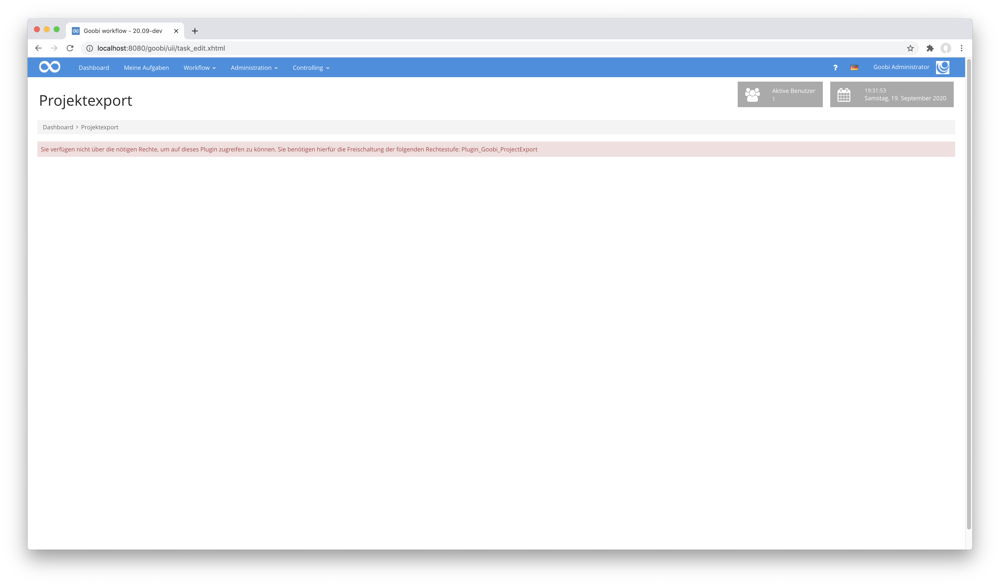
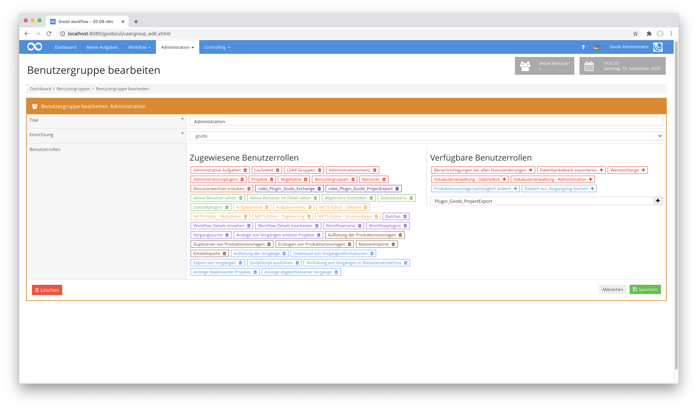
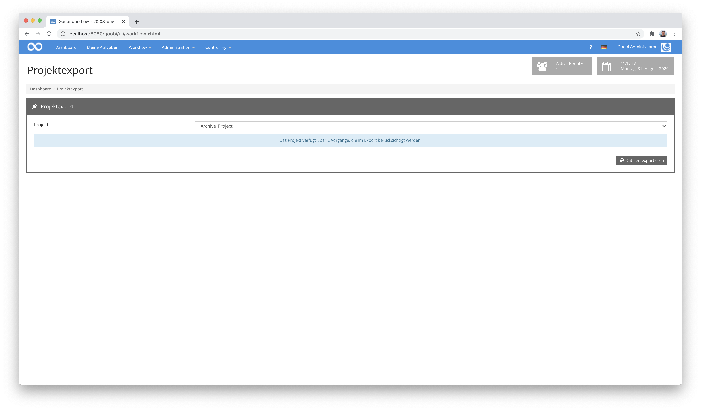
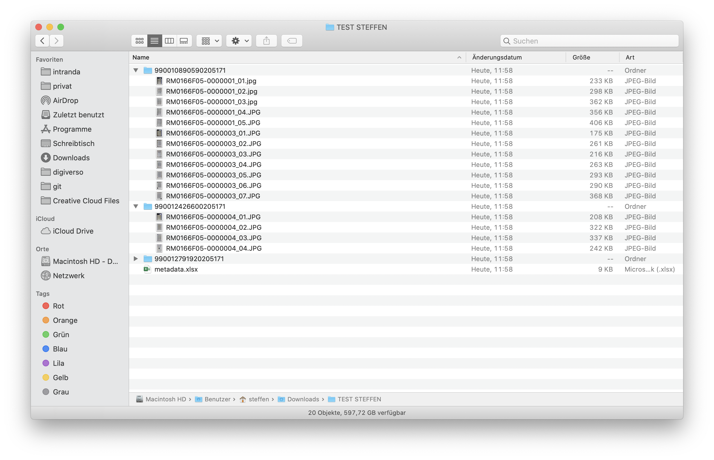
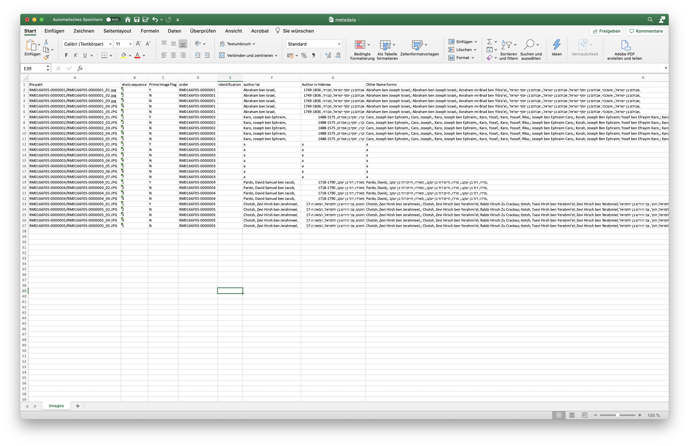

# Projektexport als Ordner mit Bildern und Excel-Datei

## Übersicht

Name                     | Wert
-------------------------|-----------
Identifier               | intranda_workflow_projectexport
Repository               | [https://github.com/intranda/goobi-plugin-workflow-project-export](https://github.com/intranda/goobi-plugin-workflow-project-export)
Lizenz              | GPL 2.0 oder neuer 
Letzte Änderung    | 25.07.2024 10:44:47


## Einführung
Dieses Workflow Plugin erlaubt einen sehr spezifischen Export eines gesamten Projektes. Hierfür prüft das Plugin zunächst, ob in allen Vorgängen des gewählten Projektes auch tatsächlich der konfigurierte Arbeitsschritt im Workflow bereits abgeschlossen wurde. Abhängig von dieser Prüfung erlaubt das Plugin anschließend einen Export aller Bilder eines definierten Bildverzeichnisses (z.B. die Master-Bilder) und einen Export definierter Metadaten innerhalb einer Excel-Datei. Der Aufbau der Excel-Datei ist dabei so, dass pro Bild die jeweiligen Metadaten redundant jeweils in einer eigenen Zeile aufgeführt sind.

Sollte die anfängliche Prüfung feststellen, dass der konfigurierte Arbeitsschritt im Workflow bereits für alle Vorgänge des Projekte abgeschlossen wurde, so wird der konfigurierte Export-Arbeitsschritt für alle Vorgänge des Projektes ebenfalls auf abgeschlossen gesetzt


## Installation
Zur Installation des Plugins müssen folgende beiden Dateien installiert werden:

```bash
/opt/digiverso/goobi/plugins/workflow/plugin-intranda-workflow-projectexport-base.jar
/opt/digiverso/goobi/plugins/GUI/plugin-intranda-workflow-projectexport-gui.jar
```

Um zu konfigurieren, wie sich das Plugin verhalten soll, können verschiedene Werte in der Konfigurationsdatei angepasst werden. Die Konfigurationsdatei befindet sich üblicherweise hier:

```bash
/opt/digiverso/goobi/config/plugin_intranda_workflow_projectexport.xml
```

Der Inhalt dieser Konfigurationsdatei sieht wie folgt aus:

```xml
<config_plugin>

    <config>
        <!-- name of the project, can be repeated. Use * for any project -->
        <project>*</project>
        <!-- check if all proceses of the project have finished this task -->
        <finishedStepName>Metadata enrichment</finishedStepName>
        <!-- close this step after the export was successful -->
        <closeStepName>Export</closeStepName>
        <!-- define which image folder (master|media|jpeg|source|...) shall be used for the export -->
        <imageFolder>media</imageFolder>
        <!-- write the export into this directory -->
        <exportDirectory>/opt/digiverso/viewer/hotfolder</exportDirectory>
        <!--  define if the export result shall be provided as zip file download -->
        <allowZipDownload>true</allowZipDownload>
    </config>

</config_plugin>
```

Für eine Nutzung dieses Plugins muss der Nutzer über die korrekte Rollenberechtigung verfügen.



Bitte weisen Sie daher der Gruppe die Rolle `Plugin_Goobi_ProjectExport` zu.




## Überblick und Funktionsweise
Wenn das Plugin korrekt installiert und konfiguriert wurde, ist es innerhalb des Menüpunkts `Workflow` zu finden und kann von dort gestartet werden. Verfügt man über die notwendigen Rechte zur Verwendung des Plugins, so kann nun eine Auswahl aus den zur Verfügung stehenden Projekten erfolgen.



Nach der Auswahl des gewünschten Projektes stehen je nach Konfiguration zwei Buttons zur Verfügung. Diese erlauben entweder die Ausführung des Exports in das gewünschte Zielverzeichnis oder den Download des gesamten Exportergebnisses als eine große zip-Datei.



Das Exportergebnis ist so aufgebaut, dass für jeden Vorgang ein Unterordner erzeugt wird innerhalb dessen sich die zugehörigen Bilder aus dem definierten Verzeichnnis befinden. Darüber hinaus wird ausserdem eine Excel-Datei erzeugt.



Innerhalb jeder Zeile dieser Excel-Datei befinden sich nun die jeweiligen Metadaten, die aus der METS-Datei gelesen wurden, wobei diese redundant für jedes Bild wiederholt aufgeführt werden.


## Konfiguration
Die Konfiguration des Plugins gestaltet sich wie folgt:

| Wert | Beschreibung |
| :--- | :--- |
| `config` | Der Block `config` kann beliebig oft vorkommen. Dadurch lassen sich mehrere individuelle Einstellungen für einzelne Projekte vornehmen. |
| `project` | Definieren Sie mit diesem Parameter, für welches Projekt die Konfiguration greifen soll. Hier können die Namen der Projekte wiederholbar aufgeführt werden. |
| `finishedStepName` | Mit diesem Parameter wird festgelegt, welcher Arbeitsschritt für alle Vorgänge des gewählten Projektes abgeschlossen sein soll, damit der Export-Arbeitsschritt abschließend für alle Vorgänge des Projektes ebenfalls nach Durchführung des Exports als abgeschlossen markiert wird. |
| `closeStepName` | Hier kann festgelegt werden, wie der Name desjenigen Arbeitsschrittes lautet, der nach Durchführung des Exports abgeschlossen wird. |
| `imageFolder` | Legen Sie hier fest, welches Verzeichnis für den Export verwendet werden soll. Typische Werte hierfür sind `master` oder `media`. |
| `exportDirectory` | Für jeden Konfigurationsblock kann ein Zielverzeichnis für den Export festgelegt werden. Alle Exporte erfolgen innerhalb des hier festgelegten Ordners. |
| `allowZipDownload` | Soll neben dem Export in das konfigurierte Verzeichnis ausserdem ein Download des gesamten Exports als eine Zip-Datei möglich sein, so kann dies hier aktiviert werden. |