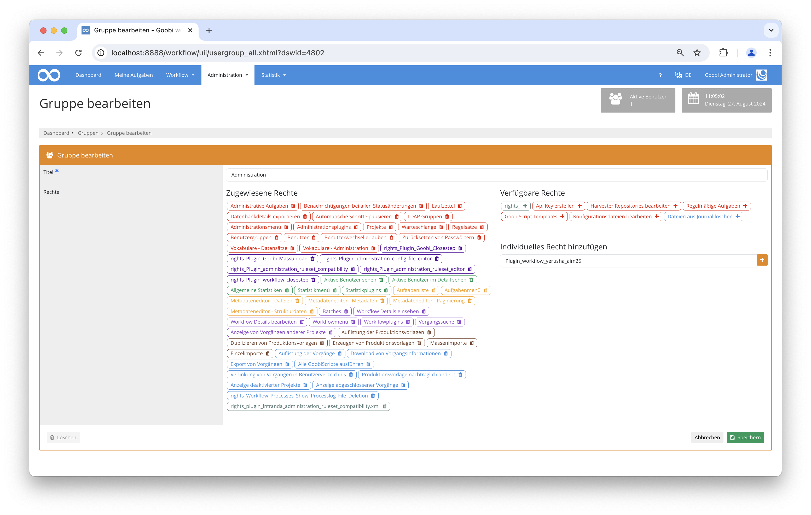
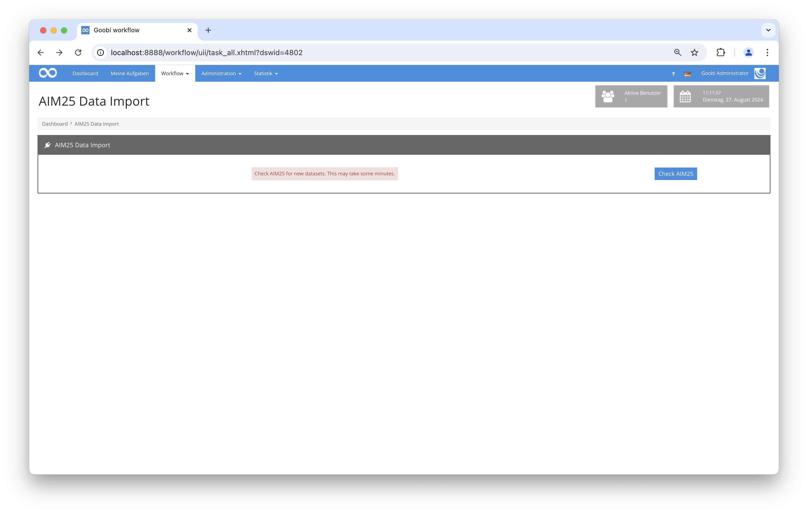

# Datenübernahme aus AIM25

## Übersicht

Name                     | Wert
-------------------------|-----------
Identifier               | intranda_workflow_yerusha_aim25
Repository               | [https://github.com/intranda/goobi-plugin-workflow-yerusha-aim25](https://github.com/intranda/goobi-plugin-workflow-yerusha-aim25)
Lizenz              | GPL 2.0 oder neuer 
Letzte Änderung    | 04.09.2024 09:12:39


## Einführung
Dies ist eine technische Dokumentation für das YerushaAim25 Goobi-Workflow-Plugin. Es überprüft AIM25 auf neue EAD-Datensätze, lädt diese herunter und erstellt Goobi-Vorgänge dafür.

## Installation
Um das Plugin verwenden zu können, müssen die folgenden Dateien installiert werden:


```bash
/opt/digiverso/goobi/plugins/workflow/plugin-workflow-yerusha-aim25-base.jar
/opt/digiverso/goobi/plugins/GUI/plugin-workflow-yerusha-aim25-gui.jar
/opt/digiverso/goobi/config/plugin_intranda_workflow_yerusha_aim25.xml
```

Um dieses Plugin zu verwenden, muss der Benutzer die entsprechende Rollenberechtigung haben.

Weisen Sie daher der Gruppe die Rolle `Plugin_workflow_yerusha_aim25` zu.



## Überblick und Funktionalität
Wenn das Plugin korrekt installiert und konfiguriert wurde, ist es unter dem Menüpunkt `Workflow` zu finden.



Auf der Seite des Plugins wird nach Klick auf die Schaltfläche die Liste der Datensätze in AIM25 abgefragt. Für alle Datensätze, für die noch keine Goobi-Vorgänge erstellt wurden, werden die Datensätze heruntergeladen und basierend auf der in der Konfigurationsdatei angegebenen Vorlage als Goobi-Vorgänge erzeugt. Dabei wird die EAD-Datei mit den angegebenen XPath-Ausdrücken durchsucht und entsprechende Metadaten für den Goobi-Vorgang erstellt.

## Konfiguration
Das Plugin wird in der Datei `plugin_intranda_workflow_yerusha_aim25.xml` wie folgt konfiguriert:

```xml
<?xml version="1.0" encoding="UTF-8"?>
<config_plugin>
     
    <!-- The template used for new processes  -->
    <templateTitle>AIM25_Workflow</templateTitle>

	<!-- digital collection  -->
    <digitalCollection>AIM_25</digitalCollection>
    
    <!-- Document type for imported documents  -->
    <documenttype isanchor="false">Collection</documenttype>

    <!-- For testing: if this is not empty, then only this number of datasets will be downloaded each time the plugin is carried out-->
    <importNumber>2</importNumber>

    <mapping>
        <metadata name="CatalogIDSource" xpath="//ead:eadid/@identifier" level="topstruct" xpathType="Attribute"/>
        <metadata name="Country" xpath="//ead:eadid/@countrycode" level="topstruct" xpathType="Attribute"/>
        <metadata name="originalInstitution" xpath="//ead:publisher" level="topstruct" xpathType="Element"/>
        <metadata name="InstitutionOfficial" xpath="//ead:publisher" level="topstruct" xpathType="Element"/>
        <metadata name="LanguageInstitution" xpath="//ead:language/@langcode" level="topstruct" xpathType="Attribute"/>
        <metadata name="ContactPhone" xpath="//ead:publicationstmt/ead:address/ead:addressline[starts-with(., 'Telephone')]" level="topstruct" xpathType="Element"/>
        <metadata name="ContactWeb" xpath="//ead:publicationstmt/ead:address/ead:addressline[starts-with(., 'http')]" level="topstruct" xpathType="Element"/>
        <metadata name="ContactEmail" xpath="//ead:publicationstmt/ead:address/ead:addressline[starts-with(., 'Email')]" level="topstruct" xpathType="Element"/>
        <metadata name="ContactPostal" xpath="//ead:publicationstmt/ead:address/ead:addressline[not(starts-with(., 'Email')) and not(starts-with(., 'http')) and not(starts-with(., 'Telephone'))]" level="topstruct" xpathType="Element"/>
        <metadata name="ReferenceNumber" xpath="//ead:eadid" level="topstruct" xpathType="Element"/>
        <metadata name="TitleDocMain" xpath="//ead:titlestmt/ead:titleproper" level="topstruct" xpathType="Element"/>
        <metadata name="_TitleDocMainOfficial" xpath="//ead:titlestmt/ead:titleproper" level="topstruct" xpathType="Element"/>
        <metadata name="CreatorYerusha" xpath="//ead:origination/ead:persname" level="topstruct" xpathType="Element"/>
        <metadata name="CreatorYerusha" xpath="//ead:origination/ead:name" level="topstruct" xpathType="Element"/>
        <metadata name="DateOfOrigin" xpath="//ead:unitdate/@normal" level="topstruct" xpathType="Attribute"/>
        <metadata name="DocLanguage" xpath="//ead:language/@langcode" level="topstruct" xpathType="Attribute"/>
        <metadata name="Extent" xpath="//ead:physdesc" level="topstruct" xpathType="Element"/>
        <metadata name="ScopeContent" xpath="//ead:scopecontent/ead:p" level="topstruct" xpathType="Element"/>
        <metadata name="ArchivalHistory" xpath="//ead:custodhist/ead:p" level="topstruct" xpathType="Element"/>
        <metadata name="AdministrativeHistory" xpath="//ead:bioghist/ead:note/ead:p" level="topstruct" xpathType="Element"/>
        <metadata name="originalAccessLocations" xpath="//ead:controlaccess/ead:geogname" level="topstruct" xpathType="Element"/>
        <metadata name="originalAccessPersons" xpath="//ead:controlaccess/ead:persname" level="topstruct" xpathType="Element"/>
        <metadata name="originalAccessCorporate" xpath="//ead:controlaccess/ead:corpname" level="topstruct" xpathType="Element"/>
        <metadata name="Arrangement" xpath="//ead:arrenagement/ead:p" level="topstruct" xpathType="Element"/>
        <metadata name="AccessRestrictions" xpath="//ead:accessrestrict/ead:p" level="topstruct" xpathType="Element"/>
        <metadata name="FindingAids" xpath="//ead:otherfindaid/ead:p" level="topstruct" xpathType="Element"/>
        <metadata name="Copies" xpath="//ead:altformavail/ead:p" level="topstruct" xpathType="Element"/>
        <metadata name="Originals" xpath="//ead:originalsloc/ead:p" level="topstruct" xpathType="Element"/>
        <metadata name="AuthorOfDescription" xpath="//ead:archdesc/ead:processinfo/ead:p[not(ead:date)]" level="topstruct" xpathType="Element"/>
    </mapping>

</config_plugin>
```

Die folgende Tabelle enthält eine Zusammenfassung der Parameter und deren Beschreibungen:

Parameter               | Erläuterung
------------------------|------------------------------------
|  `templateTitle` | Dieser Parameter gibt den Titel der Workflow-Vorlage an, die bei der Erstellung neuer Vorgänge verwendet wird.  |
|  `documenttype` | Dieser Parameter definiert den Goobi-Dokumenttyp für importierte Dokumente.  |
|`importFolder`| Ein Ordner, in dem Daten temporär gespeichert werden können. |
|`importNumber`   | Für Tests: Wenn dieser Wert nicht leer oder 0 ist, wird bei jedem Durchlauf des Plugins nur diese Anzahl von Datensätzen importiert.   |
|`mapping`  | XPath-Zuordnungen von den EAD-Dateien zu Goobi-Metadaten. |