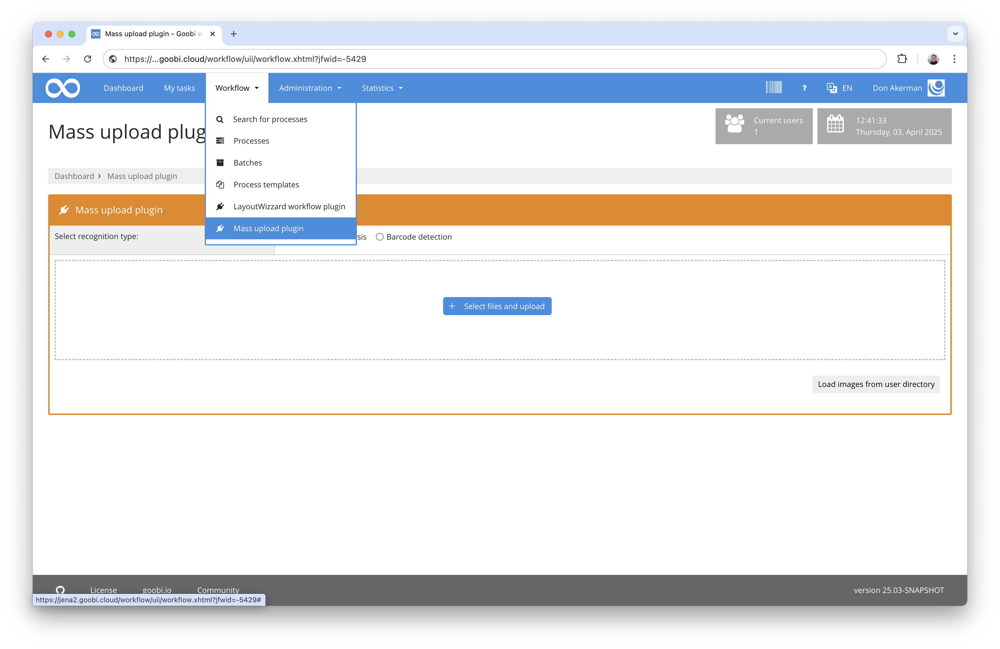
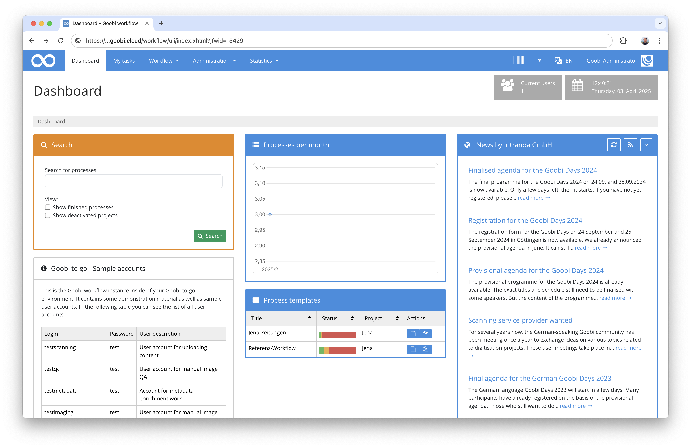
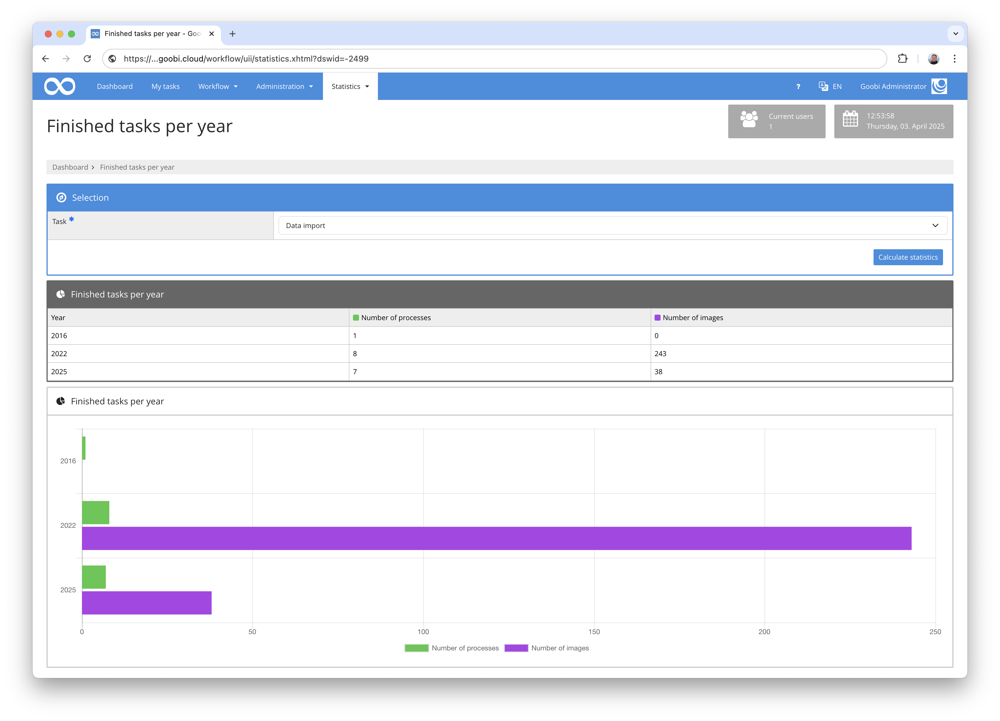

# Overview
On the following pages you will find documentation for various plug-ins and extensions for Goobi workflow. Please select the desired plugin from the table of contents on the left to access the documentation.

Please note that within Goobi workflow there are different types of plugins for the respective application scenarios.

## Export Plugins
Export plugins are used to export data from Goobi workflow to another system. They are executed either automatically as part of the workflow or manually by clicking on the corresponding icon in the process list. They are usually installed within this path:

```bash
/opt/digiverso/goobi/plugins/export/
```

Export plug-ins within Goobi are set up in such a way that they are selected from the list of step plug-ins within a workflow for a step and the `Export` checkbox is also activated. Usually, the checkbox `Automatic task` is also selected in order to have the exports executed automatically in the course of the workflow.


Some export plugins have their own configuration file. This file is generally named like the plugin itself and is usually located at the following path:

```bash
/opt/digiverso/goobi/config/
```

## Step Plugins
Step plugins are used to extend tasks within the Goobi workflow. Such plugins can be used, for example, to integrate individual functionality into the workflow that Goobi does not provide out-of-the-box. Examples of such plug-ins include special conversion plug-ins, entry masks, image manipulations, etc.

Such step plugins are installed in the folder:

```bash
/opt/digiverso/goobi/plugins/step/
```

If a plugin also has a user interface in addition to the actual functionality, the part of the user interface must also be installed in this folder:

```bash
/opt/digiverso/goobi/plugins/GUI/
```

Step plugins in Goobi are set up in such a way that they are selected as plugins within a task.


Please note that there are currently three different types within Step Plugins:

Type         | Description
------------ | --------------------------------
**No GUI**   | The plugin does not have its own user interface and is executed in the background on the server side. Example: A plugin for the automatic conversion of images into another file format.
**Part GUI** | The plugin brings along a part for a user interface and is visually integrated within a processed task as if it were part of the Goobi core. Here the user can interact with the user interface. Example: A plugin for uploading images within a task.
**Full GUI** | The plugin comes with a complete user interface. This is not directly integrated into the task. Instead, the user is offered a button to enter the plugin so that he can interact with it. Example: Plugin for image control.


Some Step Plugins have their own configuration file. This file is generally named like the plugin itself and is usually located at the following path:

```bash
/opt/digiverso/goobi/config/
```

## Opac Plugins
Opac plugins are used for communication with external data sources. Typical examples are plugins for the connection of library catalogues or databases. Depending on the data source, different implementations exist for this in order to correctly address the respective interface to be used.

Opac plugins are usually installed in this path:

```bash
/opt/digiverso/goobi/plugins/opac/
```

After installing such a plugin, it is available in the `Search in Opac` field within the Create Processes in Goobi screen.


## Import Plugins
Import plugins are used for the execution of larger mass imports. Unlike Opac plugins, they do not query from a single data source, process by process. Instead, import plugins usually import hundreds or thousands of data at the same time, often in different formats. Common examples here include import plugins for importing SQL dumps, Excel tables or other proprietary data sources.

The import plugins are installed in the folder:

```bash
/opt/digiverso/goobi/plugins/import/
```

These plugins are used in a separate mask for mass imports in which you select the different import mechanism and the desired plugin before selecting the data.


Some import plugins have their own configuration file. This is generally named like the plugin itself and is usually located at the following path:

```bash
/opt/digiverso/goobi/config/
```

## Administration Plugins
Administration plugins are available for some special use cases. The special feature is that these plugins are not functionally restricted. They are not explicitly integrated at a given point within the workflow nor are they executed at a defined moment. Instead, they usually have their own user interface and offer independent functionality as an extension of Goobi. Examples of this include administrative intervention in process data or the administration of controlled vocabularies.

The installation of the administration plugins takes place in the folder:

```bash
/opt/digiverso/goobi/plugins/administration/
```

‌Since most administration plugins have a user interface in addition to the actual functionality, this must also be installed into the following folder:

```bash
/opt/digiverso/goobi/plugins/GUI/
```


Some administration plugins have their own configuration file. This file is generally named like the plugin itself and is usually located at the following path:

```bash
/opt/digiverso/goobi/config/
```

## Workflow Plugins
The workflow plugins are technically very similar to the administration plugins. They can also offer an independent user interface for the provision of additional functionality. In contrast to the administration plug-ins, however, access to these plug-ins is also possible without administrative rights within Goobi, so that a larger group of users usually has access to these functions.

The workflow plug-ins are installed in the folder:

```bash
/opt/digiverso/goobi/plugins/workflow/
```

Since most workflow plugins have a user interface in addition to the actual functionality, it must also be installed in the following folders:

```bash
/opt/digiverso/goobi/plugins/GUI/
```



Some administration plugins have their own configuration file. This file is generally named like the plugin itself and is usually located at the following path:

```bash
/opt/digiverso/goobi/config/
```

## Dashboard Plugins
With the Dashboard Plugins it is possible to provide a special Dashboard with additional functionality instead of the standard start page. This could, for example, already display some statistical information that shows integration with other systems and also give an insight into the current monitoring.

The Dashboard Plugins are installed in the folder:

```bash
/opt/digiverso/goobi/plugins/dashboard/
```

The user interface of the dashboards must also be installed in the following folders:

```bash
/opt/digiverso/goobi/plugins/GUI/
```



Some Dashboard plugins have their own configuration file. This is generally named like the plugin itself and is usually located at the following path:

```bash
/opt/digiverso/goobi/config/
```

Please also note that individual dashboards must always be activated within the main configuration file goobi\_config.properties. This can be done as follows:

```bash
dashboardPlugin=intranda_dashboard_extended
```

## Statistics Plugins
The statistics plugins are available for the provision of individual statistics. Depending on which of these plugins are installed, a wide variety of statistical evaluations can be carried out, either as diagrams, tables or downloads in various formats.

The installation of the statistic plugins takes place in the folder:

```bash
/opt/digiverso/goobi/plugins/statistics/
```

The user interface of the statistic plugins must also be installed in the following folders:

```bash
/opt/digiverso/goobi/plugins/GUI/
```



## Validation Plugins
In Goobi, the validation plug-ins are used to ensure that data is available as required before completing a step. If the validation is not successful, the user cannot complete the task and therefore cannot remove it from his task list.

The validation plugins are installed in the folder:

```bash
/opt/digiverso/goobi/plugins/validation/
```

The validation plug-in must then be selected accordingly in the `Validation plug-in` field within the task for the required workflow step.


Some validation plugins have their own configuration file. This is generally named like the plugin itself and is usually located at the following path:

```bash
/opt/digiverso/goobi/config/
```

## REST Plugins
With the REST plugins, Goobi has another way for external systems to communicate with Goobi. In contrast to the Web API, however, communication here is via REST and takes place largely via JSON.

REST plugins are installed in the following folder:

```bash
/opt/digiverso/goobi/lib/
```

Like the Web-API plugins, the REST plugins do not have their own user interface. Also the access permission is controlled by the same configuration file and controls the access from selected IP addresses and authentication. For the REST Plugins the configuration is done in the following file:

```bash
/opt/digiverso/goobi/config/goobi_rest.xml
```

