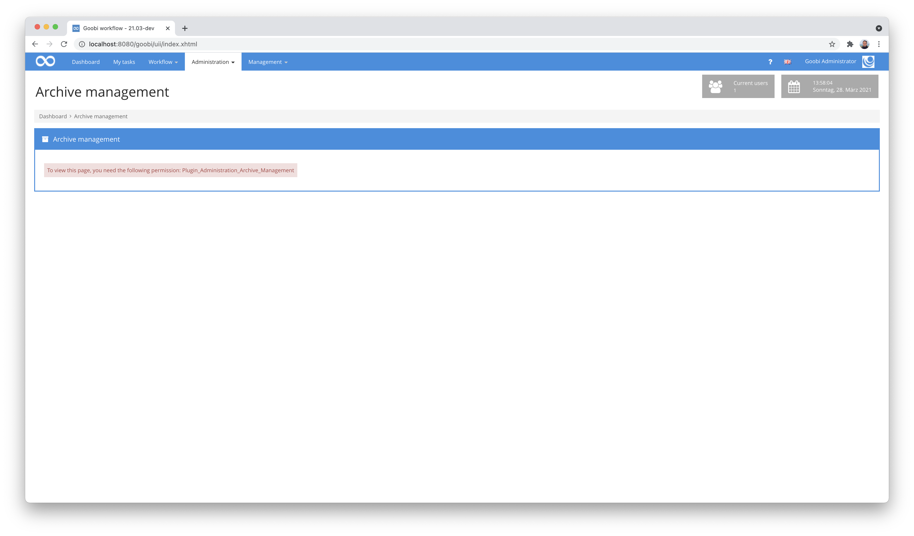
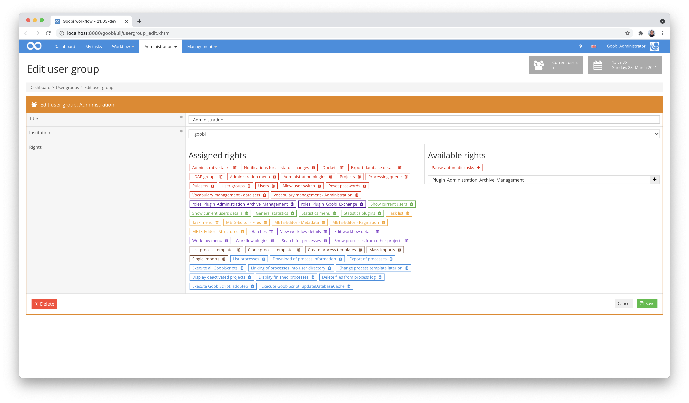
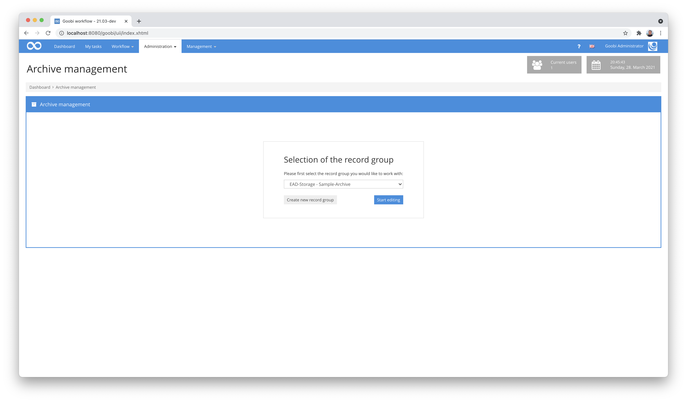
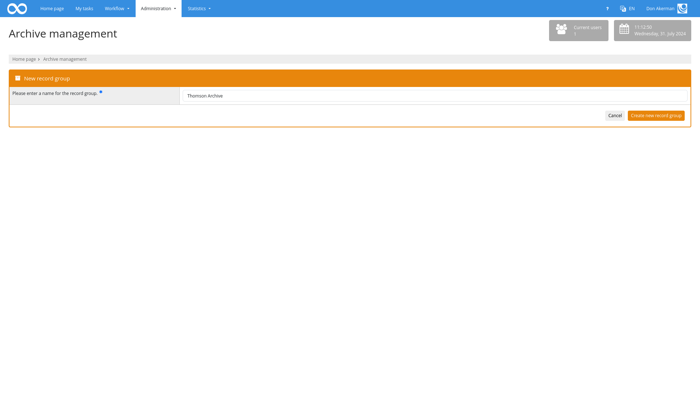
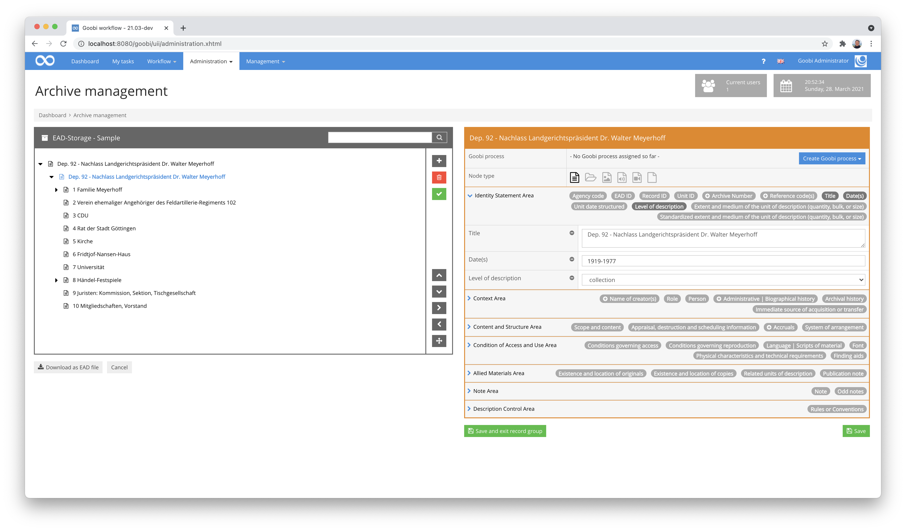
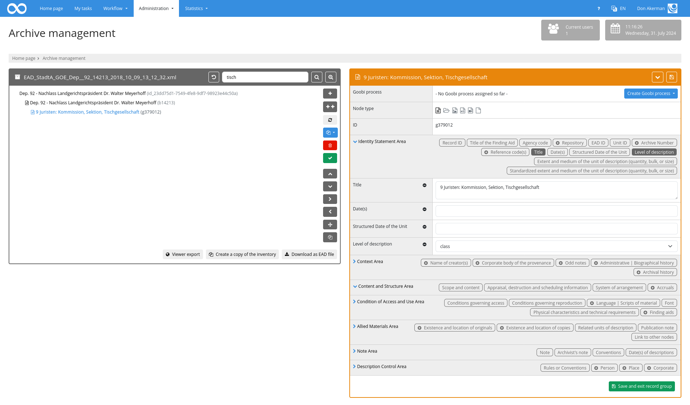
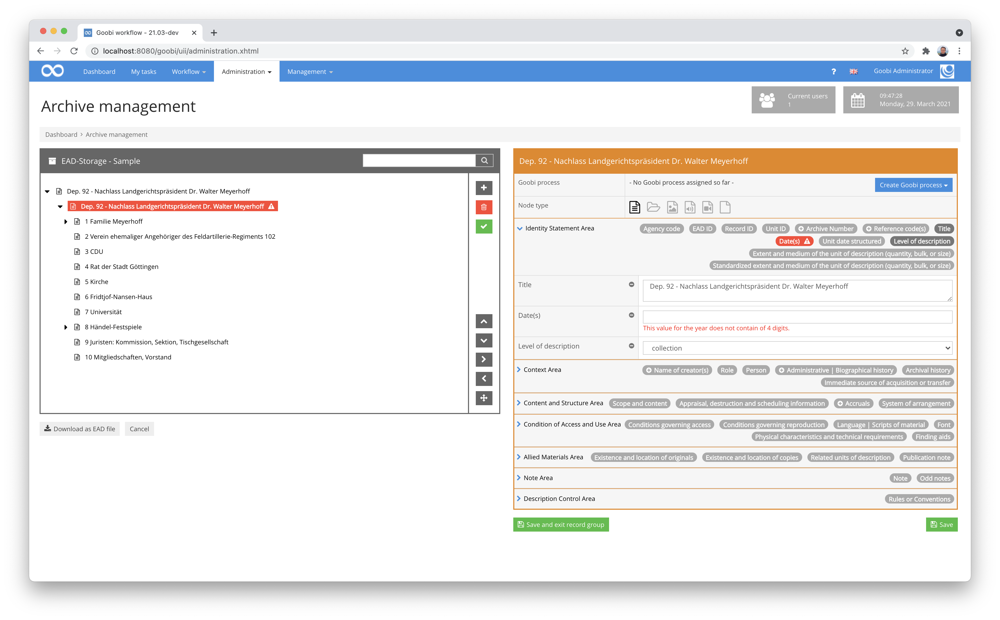

# Archive Management

## Overview

Name                     | Wert
-------------------------|-----------
Identifier               | intranda_administration_archive_management
Repository               | [https://github.com/intranda/goobi-plugin-administration-archive-management](https://github.com/intranda/goobi-plugin-administration-archive-management)
Licence              | GPL 2.0 or newer 
Last change    | 14.07.2024 11:04:38


## Introduction
This documentation describes the installation, configuration and use of the Administration Plugin for managing archive records from within Goobi workflow. In doing so, the data of several records is stored within standardized EAD files, allowing even small archives to manage their data in a standardised way without the need to start using third-party software for which a fee is charged.


## Installation

## Installing the plugin
The plugin consists in total of the following files to be installed

```bash
plugin_intranda_administration_archive_management.jar
plugin_intranda_administration_archive_management-GUI.jar
```

These files must be installed in the correct directories so that they are available in the following paths after installation:

```bash
/opt/digiverso/goobi/plugins/administration/plugin_intranda_administration_archive_management.jar
/opt/digiverso/goobi/plugins/GUI/plugin_intranda_administration_archive_management-GUI.jar
```

Furthermore, the plugin needs an additional configuration file, which must be located at the following location:

```bash
/opt/digiverso/goobi/config/plugin_intranda_administration_archive_management.xml
```

## Installing the BaseX database
The plugin reads and writes standardised EAD files. The XML database BaseX is used for this purpose, within which the EAD files are stored and indexed, so that this processing of the data can take place with high performance. The prerequisite for the installation of BaseX is Java 1.8. The commissioning of this database is carried out somewhat differently depending on the intended use, depending on whether the plugin is to be installed for productive operation or for further development.

[Installation for productive operation](page_01_00_en.md)

[Installation for developers](page_02_00_en.md)


## Overview and functionality
The plugin for editing archive records can be found below the menu item 'Administration'.


### Assigning the rights required to use the plugin
To use the plugin, the user must first have the right `Plugin_Administration_Archive_Management`. If this right has not yet been assigned, the user will receive the following notice:



The corresponding rights must therefore first be assigned to the respective user groups.



After the required rights have been assigned and, if necessary, a new login has been made, the plugin can be used.

### Selection of existing EAD file
After the plugin has been opened, a list of the available archive records is displayed first. Here, the user can select an archive file and start editing it.



Alternatively, a new archive file can also be created. In this case, the desired XML database within which the new archive file is to be created must first be selected. A name must also be assigned here.



After selecting the archive file to be edited, you will be forwarded to the editing screen. Here, the structure tree can be edited in the left-hand area. In the right-hand area, the details of the selected node can be edited..



Clicking on the buttons 'Cancel' or 'Save and exit archive group' takes you back to the page for selecting an archive file.

### Edit structure tree
In the left-hand area of the editing screen, the structure of the archive file can be edited. Here, all nodes including their hierarchy can be viewed at a glance. In front of each element is an icon with which the sub-elements of the node can be displayed or hidden. To select a node, it can be clicked on. It will then be highlighted and the details of the selected node will be displayed on the right. If a node is selected in the left-hand area of the edit screen, the buttons on the right-hand edge of the left-hand box can also be used to change the node. The following options are possible:

| Function | Explanation |
| :--- | :--- |
| `Insert new node` | With this button, a new node can be added as a sub-node to the end of the already existing sub-nodes. |
| `Delete node` | With this function the selected node including all sub-nodes can be deleted. This function cannot be used at the level of the main node. |
| `Execute validation` | With this function, a validation of the selected node can be carried out. Violations of the configured validation specifications are listed accordingly. |
| `Move up` | This button allows moving the selected node up within the same hierarchy level. |
| `Move down` | This button allows moving the selected node down within the same hierarchy level. |
| `Move down the hierarchy` | With this button it is possible to move the selected node to a lower hierarchy level. |
| `Move up the hierarchy` | With this button it is possible to move the selected node to a higher hierarchy level. |
| `Mode node to another location` | This function opens another editing screen that makes it possible to move the currently selected node to a completely different position in the hierarchy tree. The complete hierarchy is displayed so that the node can be selected within which the selected node is to be inserted as a sub-node. |



In the upper area of the hierarchy display, a search can also be made within the titles of the nodes. The nodes found, including the hierarchy, are displayed and highlighted in colour. To reset the search, it is sufficient to empty the content of the search term again and perform an empty search accordingly.

### Editing a selected node
If a node has been selected in the left-hand area, the details of the selected node are displayed in the right-hand area.

The right pane is divided into several categories. The topmost part of the right-hand pane shows the associated Goobi process and an option to create the docket. If no Goobi process has yet been created for the node, a new process can be created based on the configured production template. The selected node type is used as the document type according to the configuration. Depending on the configuration and the rule set used, the following options are available, for example:

* Folder
* File
* Image
* Audio
* Video
* Other

Below the document type, the individual metadata of the node are listed. They are divided into the following areas according to the ISAD\(G\) standard:

* Identity Statement Area
* Context Area
* Content and Structure Area
* Condition of Access and Use Area
* Allied Materials Area
* Note Area
* Description Control Area

Each of these areas can be opened and closed individually. Even if an area is collapsed, it is very easy to see which metadata is possible per area and which is already filled in. The individual metadata are displayed as differently highlighted badges. A dark background indicates that a value has already been entered for this metadata. A light background indicates that this field is still without content. If a field can be created repeatedly, the badge contains a plus icon.

When the details of a field are expanded, the individual metadata are displayed. By default, only those fields are displayed that already have a value. Further fields can be added by clicking on one of the badges. Fields can be removed by clicking on the minus icon.

### Validation of metadata
Both the button 'Download as EAD file' and the button 'Execute validation' ensure that the metadata are valid. The configured rules are applied and checked whether individual values violate them. If this is the case, the affected nodes are highlighted in colour in the left-hand area. If such an invalid node is selected, the affected badges are displayed with a red color and the configured error text is displayed in the metadata in addition to the border.



A failed validation does not prevent the archive file from being saved or Goobi processes from being created.

### Download the EAD file and save the data
The two buttons for `Download as EAD file` and `Save and exit archive group` create a new EAD based on the current state of the nodes. With the exception of the top node, each node is represented as an independent `<c>` element. The top node data is written within `<archdesc>` below the `<ead>` element.

In addition to the captured metadata, a new `create` or `modified event` including date and user information is created and added to the list of events. When the archive is saved, the current state is also automatically exported to the XML database.


## Configuration
After the installation has been completed, the configuration of the plugin and the corresponding interface can take place. This is described in detail on the following page:

[Configuration of the plugins](page_03_00_en.md)