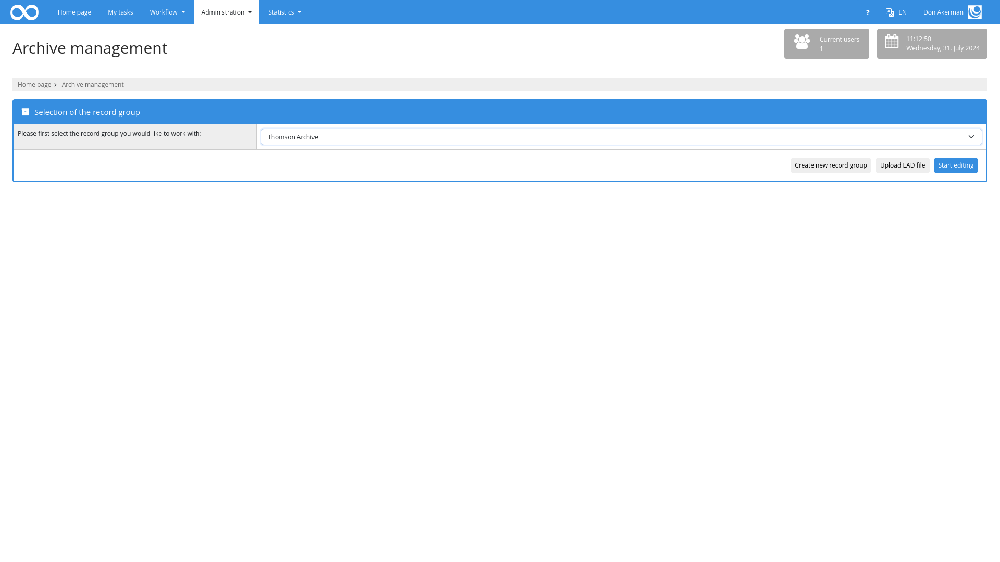
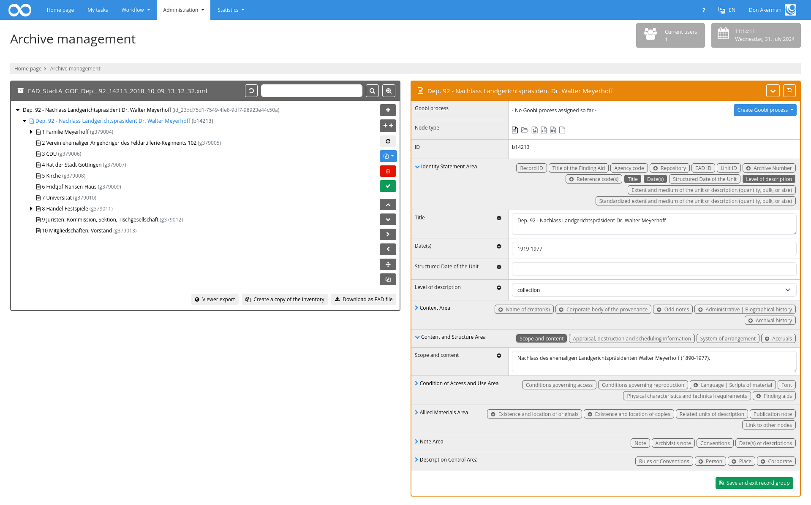
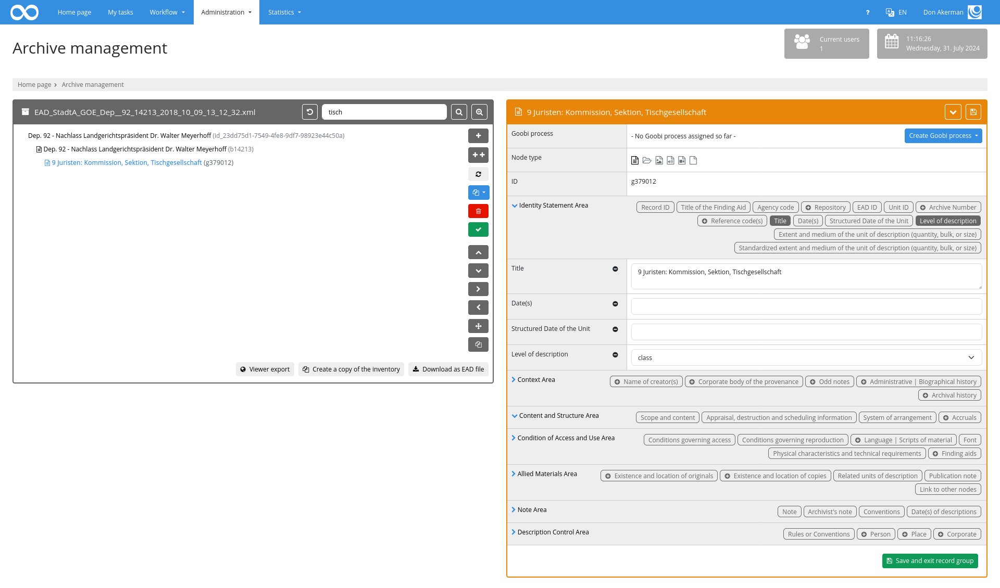

The following functions are available within the plugin for archive management:

## Selection of existing inventories
Once the plugin has been opened, a list of available archive holdings is displayed. Here the user can select an archive inventory and start editing it.

Alternatively, a new archive inventory can also be created. In this case, a name must first be assigned to the file. The name must be unique as it is used for identification. In addition, no special characters such as `:/\` should be used, as the name is also the basis for the file name of the EAD export.

The third option is to import an existing file. An EAD file can be selected and uploaded here. If no inventory with the name of the file exists yet, the file is imported as a new inventory and opened directly. If the name is already in use, the existing inventory can be overwritten with the content of the EAD-XML file after a query.

If the user has authorisation to create new inventories, a copy of an inventory can also be created using the corresponding button. This creates a new fonds and copies all nodes with all their metadata. The only exception here is the ID of the nodes. These are automatically created and assigned to the nodes. 

After selecting the archive to be edited, the user is forwarded to the editing screen. The structure tree can now be edited in the left-hand area. The details of the selected node can be edited in the right-hand area.

By clicking on the buttons `Cancel` (read rights) or `Save and exit archive` (write rights), you will be redirected to the page for selecting an archive.

## Edit structure tree
The structure of the archive file can be edited in the left-hand area of the editing screen. All nodes including their hierarchy can be viewed here at a glance. There is an icon in front of each element that can be used to display or hide the sub-elements of the node. To select a node, click on it. It is then highlighted in colour and the details of the selected node are displayed on the right-hand side. If a node has been selected in the left-hand area of the editing screen, the buttons on the right-hand edge of the left-hand box can also be used to change the node. The following options are available:

| Function | Explanation |
| :--- | :--- |
| `Insert new node` | This button can be used to add a new node as a sub-node to the end of the existing sub-nodes. |
| `Insert several subnodes at this point` | Opens a pop-up in which any number of nodes can be created.|
| `Update references` | Checks whether processes exist for the nodes in the inventory. This action updates the references if necessary. |
| `Create missing processes` | Generates processes for the selected node and all child nodes if no processes exist for these nodes. |
| `Delete node` | This allows you to delete the selected node including all sub-nodes.    **Attention:** This function cannot be used at the level of the main node. |
| `Perform validation` | This function can be used to validate the selected node. Violations of the configured validation specifications are listed accordingly. |
| `Move upwards` | This button allows you to move the selected node upwards within the same hierarchy level. |
| `Move downwards` | This button allows you to move the selected node down within the same hierarchy level. |
| `Move down the hierarchy` | This button can be used to move the selected node to a lower hierarchy level. |
| `Moving up the hierarchy` | This button can be used to move the selected node to a higher hierarchy level. |
| `Move node to another position` | This function opens another editing screen that allows you to move the currently selected node to a completely different position in the hierarchy tree. The entire hierarchy is displayed so that the node within which the selected node is to be inserted as a sub-node can be selected. |
| `Duplicate node` | Opens a popup in which a prefix or suffix can be specified for selected metadata (attributes `visible` and `showField`). The action duplicates the selected node and all child elements and adds the specified prefixes and suffixes to the new metadata.|

To generate several sub-nodes at once, the number of nodes to be created and their type must be defined. Various metadata can then be defined and entered in all new nodes. Either the same text can be used in all fields, an identifier can be generated or a text with a subsequent counter can be generated. The counter format and the start value can be defined here.
 

In the upper area of the hierarchy display, you can also search within the metadata of the nodes. The nodes found, including the hierarchy, are displayed and highlighted in colour. To reset the search, it is sufficient to empty the content of the search term again and perform an empty search accordingly. Alternatively, the button on the left-hand side of the search field can be used.

The advanced search can be used to the right of the field. Individual fields can be searched for here. Which fields are available can be controlled via the configuration file (attribute `searchable=‘true’` within `<metadata>`).

## Editing a selected node
If a node has been selected in the left-hand area, the details of the selected node are displayed in the right-hand area.

The right-hand area is divided into several categories. The corresponding Goobi process is displayed at the top of the right-hand section, along with an option to create the docket. If no Goobi process has yet been created for the node, a new process can be created on the basis of the configured production template. The selected node type is used as the document type in accordance with the configuration. Depending on the configuration and the rule set used, the following options are available, for example:

* Folder
* File
* Image / Picture
* Audio
* Video
* Other / Miscellaneous

The individual metadata of the node is listed below the document type. They are divided into the following areas in accordance with the ISAD(G) standard:

* Identification
* Context
* Content and internal organisation
* Conditions of access and use
* Related documents
* Annotations
* Cataloguing control

Each of these areas can be opened and closed individually. Even if an area is collapsed, it is very easy to recognise which metadata per area is possible and which is already filled in. The individual metadata are displayed as differently highlighted badges. A dark background indicates that a value has already been entered for this metadata. A light background indicates that this field is still empty. If a field can be created repeatedly, the badge contains a plus icon.

If the details of an area are expanded, the individual metadata is displayed. By default, only those fields that already have a value are displayed. Additional fields can be added by clicking on one of the badges. Fields can be removed again using the minus icon.

## Validation of the metadata
Both the `Download as EAD file` button and the `Execute validation` button ensure that the metadata is valid. The configured rules are applied and it is checked whether individual values violate them. If this is the case, the affected nodes are highlighted in colour in the left-hand area. If such an invalid node is selected, the affected badges are displayed in red and the configured error text is displayed in the metadata alongside the border.

A failed validation does not prevent the archive from being saved or Goobi processes from being created.

## Saving the data
Unless editing is only carried out in `read-only` mode, data is always saved automatically when you insert or delete nodes, switch to another node, export the data, create a copy of it or create links or end editing using `Save and exit`.

## Export and download
The two buttons for `Download as EAD file` and the `Viewer export` generate a new EAD based on the current status of the nodes. With the exception of the top node, each node is displayed as an independent `<c>` element. The data of the top node is written within the `<archdesc>` below the `<ead>` element. 

With viewer export, the generated file is written to the Goobi viewer hotfolder, whereas with download it can be saved locally. 

The generated file contains all metadata in the form in which it was specified in the configuration file. The content of the `xpath` attribute of the metadata is used. If there is no entry for a field, it is an intensive metadata that is not exported as an EAD.