If the archive management plugin is to be put into operation for test purposes or for further development, this can be done somewhat differently than under productive conditions. To do this, proceed as follows:

## Commissioning the BaseX database

First, the XML database BaseX must be downloaded from the BaseX website. The download can be done from here:

```text
https://basex.org/download/
```

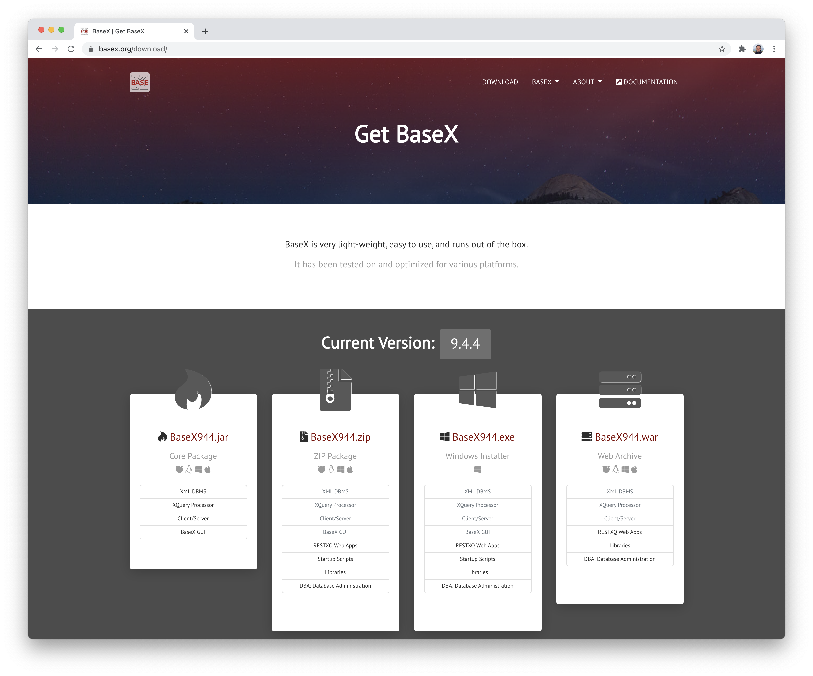

The easiest way to download from there is as a `ZIP package`, for example in version 9.4.4:

```text
http://files.basex.org/releases/9.4.4/BaseX944.zip
```

The downloaded zip file can now be unpacked. There, within the directory `bin`, the database can now be started with the command `./basexhttp`.

From a Linux or Mac terminal, all these steps would be called up as follows:

```bash
cd /opt/digiverso/
wget http://files.basex.org/releases/9.4.4/BaseX944.zip
unzip BaseX944.zip
cd basex/bin/
./basexhttp
```

The database server BaseX is now started and can be accessed via a web browser:

```text
http://localhost:8984/
```

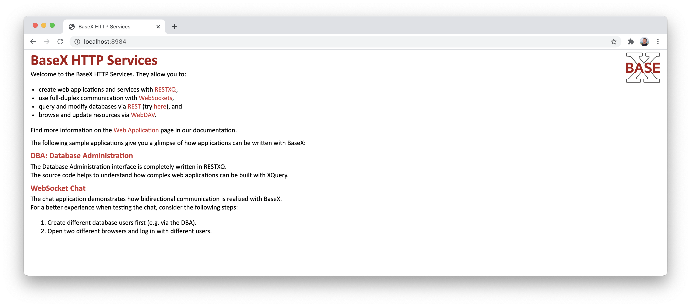

## Administer database and import EAD file

After BaseX has been downloaded and started, XML files can be imported as new databases. To do this, first open the menu item `Database Administration`, where a login can be made with these access data:

```text
Login:      admin
Password:   admin
```

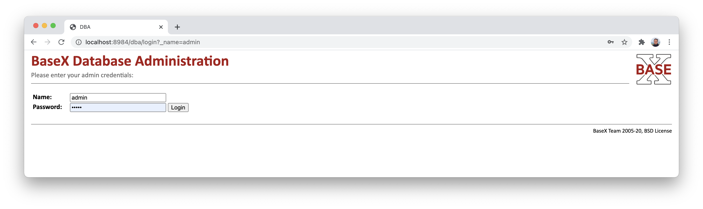

After the successful login, one gets an overview of the installed database, log files, etc.

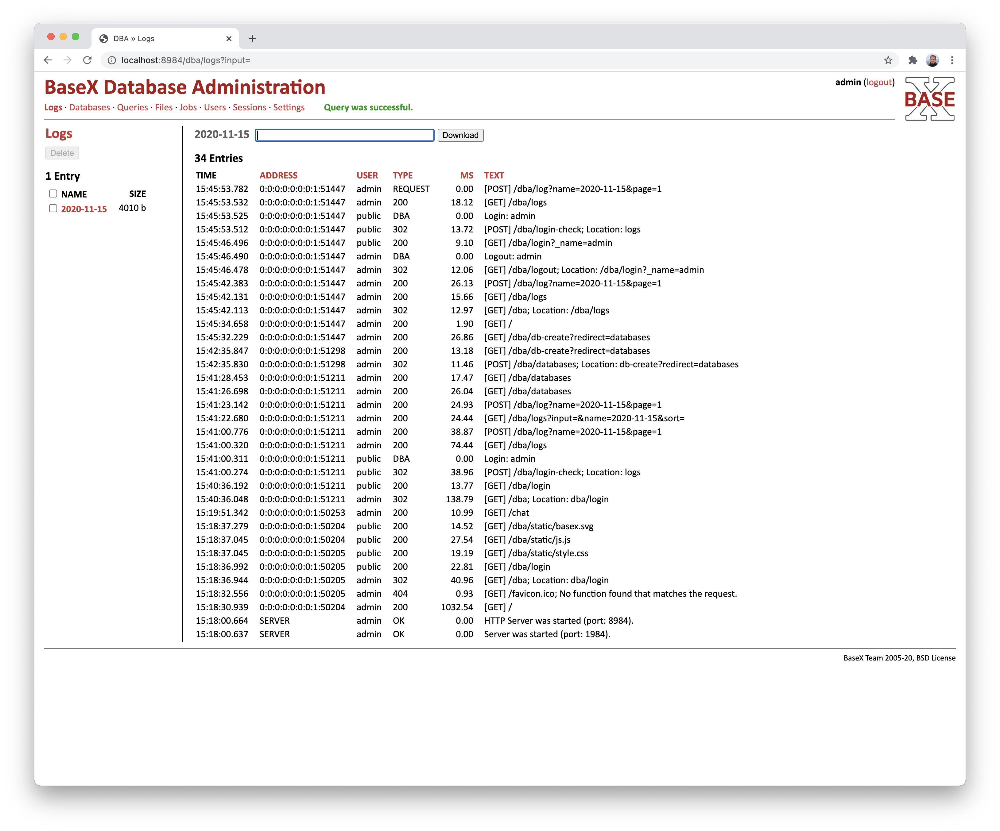

From there you can now go to the menu item `Databases` and then click on the button `Create`.

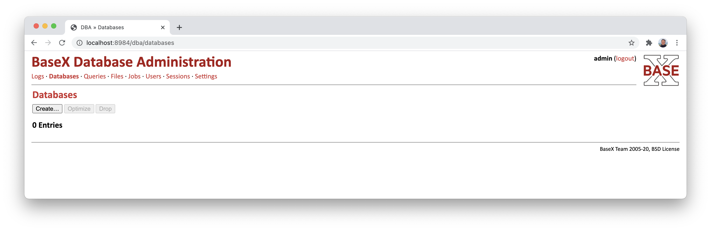

There you can now enter a `name` for the new database. Then the button `Create` must be clicked.

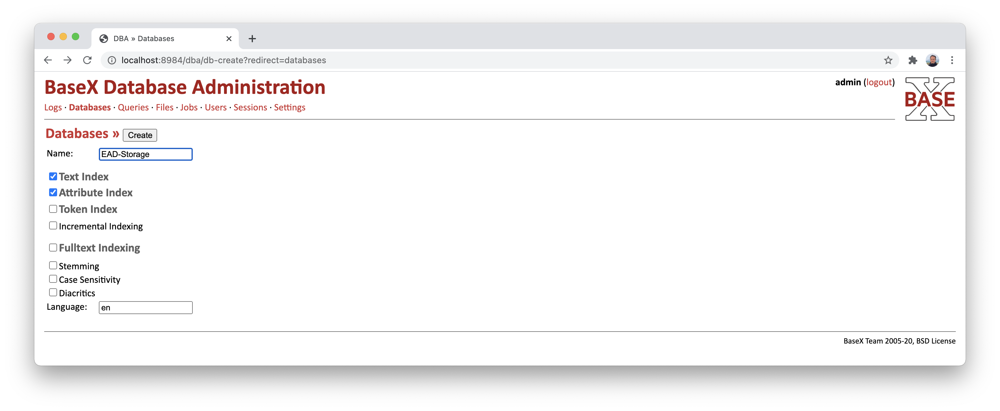

After the new database has been created, an XML file can be imported as content. To do this, click on the `Add` button.

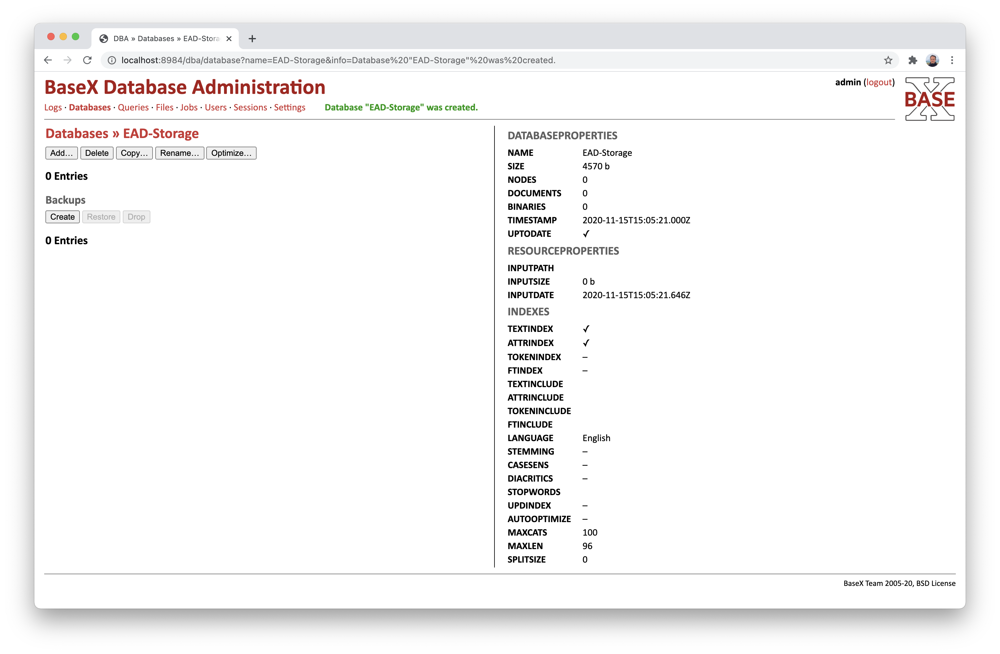

Here, an EAD file can be selected as an XML file and a path can be assigned under which this data stock is to be accessible. Then click on the 'Add' button.

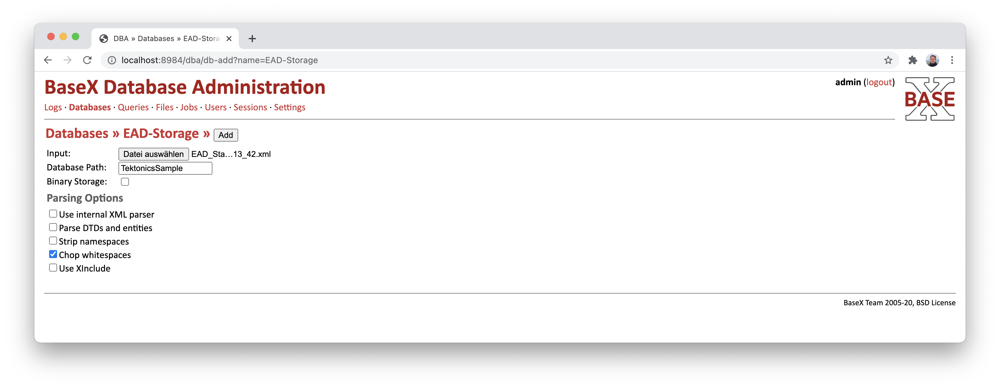

After importing the EAD file, the content is already available for the Goobi archive management plugin.

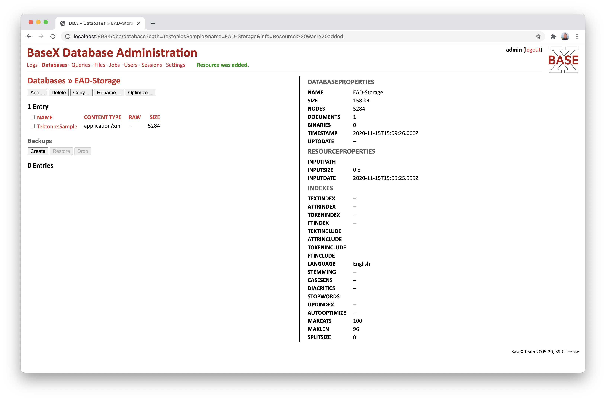

## Install archive management plugin for Goobi

After the database server has been started and filled with an EAD inventory, the archive management plugin can be put into operation. To do this, the archive management plugin must first be checked out.

```bash
git clone git@gitea.intranda.com:goobi-workflow/goobi-plugin-administration-archive-management.git
```

From the checked-out project, the three `*.xq` files must now be copied from the `plugin/src/main/resources/` directory into the `webapp` subfolder of BaseX.

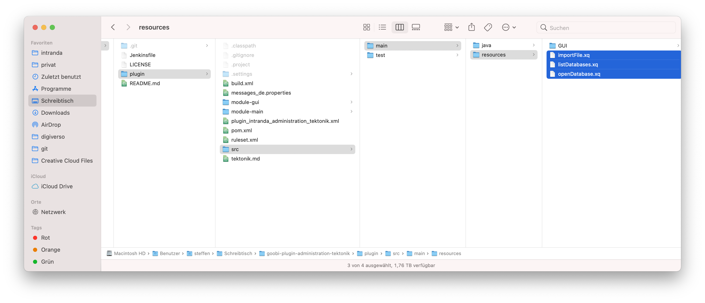

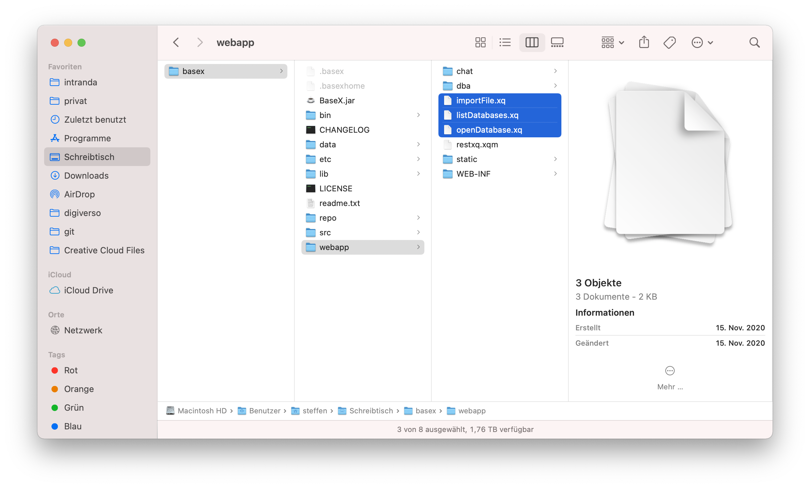

The plugin can then be compiled:

```bash
cd goobi-plugin-administration-archive-management/plugin/
mvn package
```

If necessary, you must first make an adjustment to the file `plugin/module-gui/pom.xml` for the user interface before compiling the plugin and comment out the following two lines there:

```markup
  <exclude>META-INF/tags/**/*.xhtml</exclude>
  <exclude>META-INF/intranda.taglib.xml</exclude>
```

After compiling the plugin, the two plugin files must be copied to the correct location:

```bash
cp plugin/module-gui/target/plugin_intranda_administration_archive_management-GUI.jar /opt/digiverso/goobi/plugins/GUI
cp plugin/module-main/target/plugin_intranda_administration_archive_management.jar /opt/digiverso/goobi/plugins/administration
```

In addition, the prepared configuration file from the `test/resources` directory can be used:

```bash
cp plugin/src/test/resources/plugin_intranda_administration_archive_management.xml /opt/digiverso/goobi/config
```

Depending on where the BaseX database was installed, two adjustments must still be made for writing EAD files in the file system. First, a folder must be created and given the appropriate rights so that EAD files can be saved in it. This folder could, for example, be as follows:

```bash
/opt/digiverso/basex/import/
```

In order to be able to access this specified directory, it must of course actually exist on the system and therefore be created if necessary:

```bash
mkdir /opt/digiverso/basex/import
```

This directory must now be configured correctly within two configuration files. First of all, the adjustment is made in configuration file `plugin_intranda_administration_archive_management.xml` so that the path is defined there:

```markup
<eadExportFolder>/opt/digiverso/basex/import</eadExportFolder>
```

In addition, the previously set up file `importFile.xq` must also be adjusted so that the following line in it refers to the correct path:

```bash
let $path := '/opt/digiverso/basex/import/' || $filename
```

## Use the archive management plugin within Goobi

After the plugin has been successfully installed in Goobi, the corresponding user group in Goobi must be given the necessary rights to be able to use the plugin. To do this, the users must have the right `Plugin_Administration_Archive_Management`.

## Editing xhtml files and taglib directly from the Goobi project in Eclipse

For development directly in the Goobi project in Eclipse, the following adjustments can be made.

* Copy the file `plugin_administration_archive_management.xhtml` into the `uii` folder
* Copying the folder `tags` and the file `intranda.taglib.xml` into the `WEB-INF` folder
* Adapt the file `web.xml` with this snippet:

```markup
<context-param>
   <param-name>javax.faces.FACELETS_LIBRARIES</param-name>
   <param-value>/WEB-INF/intranda.taglib.xml</param-value>
</context-param>
```