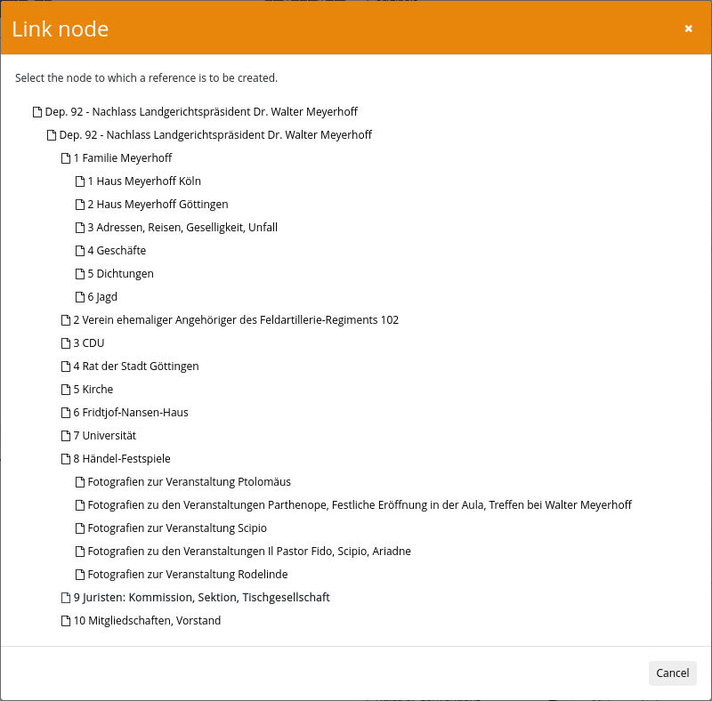
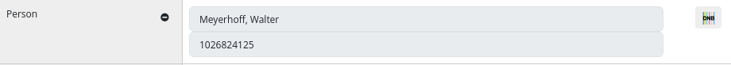

After installing the plugin and the associated database, the plugin must also be configured. This takes place within the configuration file `plugin_intranda_administration_archive_management.xml` and is structured as follows as an example:

```xml
<config_plugin>
    <export>
        <!-- export folder -->
        <folder>/opt/digiverso/viewer/hotfolder</folder>

        <!-- record group to export. Use the database names.
         The generated file name is the same as the name in goobi, spaces are replaced with underscore,
         '.xml' is added, if extensiion is missing.
         -->
        <file>112236_hub_edit.xml</file>
        <file>2215.xml</file>
        <file>EAD_Export_Koch_Foto_DDB_EAD.XML.xml</file>
    </export>

    <backup>
        <!-- backup folder -->
        <folder>/tmp/</folder>
        <!-- number of backups for each inventory -->
        <numberOfFiles>10</numberOfFiles>
        <!-- tool to create the backup files -->
        <tool>/usr/bin/mysqldump</tool>
        <!-- database password. The user name, database name, tables etc. can be recognised automatically, but the password must be entered.-->
        <!-- Leave empty if access is possible without authentication (e.g. configured in ~/.my.cnf)  -->
        <password></password>
    </backup>

    <config>
        <!-- define the name(s) of all archives for the plugin -->
        <archive>*</archive>
        <!-- default title for a new node -->
        <nodeDefaultTitle>Document</nodeDefaultTitle>

        <!-- configurations for generating process titles -->

        <!-- maximum length of the body token that will be used to generate a new process title -->
        <!-- the specifically set HEAD token and TAIL token will not be affected by this limit -->
        <!-- if the limit is positively configured, then CAMEL_CASE_LENGTH_LIMITED will be applied upon every body token, otherwise CAMEL_CASE will be applied -->
        <lengthLimit>0</lengthLimit>
        <!-- separator string that will be used to combine the tokens -->
        <separator>_</separator>

        <!-- use id from parent node instead of id from node -->
        <useIdFromParent>false</useIdFromParent>

        <!-- Optional title generation, if nothing is configured, process titles are built based on the node ID -->
        <!-- attribute value: contains a static text. If it is empty, it is assumed that a metadata value is being searched for -->
        <!-- attribute name: contains the metadata name to use -->
        <!-- attribute type: can be NORMAL (use text as it is), CAMEL_CASE (each word begins with an upper case letter), 
             AFTER_LAST_SEPARATOR (insert at the end), BEFORE_FIRST_SEPARATOR (insert in front) -->

        <!-- 
        <title name="shelfmarksource" type="NORMAL"    />
        <title name="static" type="CAMEL_CASE" value="STATIC TEXT"  />
        <title name="CatalogIDDigital" type="AFTER_LAST_SEPARATOR"    />
        -->

        <!-- // configurations for generating process titles // -->

        <!-- define metadata fields. All fields are displayed on the UI based on the level and the order within this file.
                - @name: contains the internal name of the field. The value can be used to translate the field in the messages files. The field must start with a letter and can not contain any white spaces.
                - @level: metadata level, allowed values are 1-7:
                    * 1: metadata for Identity Statement Area 
                    * 2: Context Area 
                    * 3: Content and Structure Area
                    * 4: Condition of Access and Use Area
                    * 5: Allied Materials Area
                    * 6: Note Area
                    * 7: Description Control Area
                - @xpath: contains a relative path to the ead value. The root of the xpath is either the <ead> element or the <c> element
                - @xpathType: type of the xpath return value, can be text, attribute, element (default)
                - @repeatable: defines if the field can exist once or multiple times, values can be true/false, default is false
                - @visible: defines if the field is displayed on the UI, values can be true/false, default is true
                - @showField: defines if the field is displayed as input field (true) or badge (false, default), affects only visible metadata
                - @fieldType: defines the type of the input field. Posible values are input (default), textarea, dropdown, multiselect, vocabulary, nodelink, gnd, geonames, viaf
                - @rulesetName: internal name of the metadata in ruleset. If missing or empty, field is not imported into process metadata
                - @importMetadataInChild: defines if the field is imported or skipped in processes for child elements 
                - @validationType: defines a validation rule, allowed values are unique, required, regex, date, list or any combined values (e.g. date+required)
                - @regularExpression defines a regular expression that gets used for validation type regex
                - validationError: message to display in case of validation errors
                - value: list of possible values for dropdown and multiselect lists
                - vocabulary: name of the vocabulary
                - searchParameter: distinct the vocabulary list by the given condition. Syntax is fieldname=value, field is repeatable
         -->

        <!-- internal fields, not visible on the UI -->
        <metadata
            xpath="./ead:control[@countryencoding='iso3166-1'][@dateencoding='iso8601'][@langencoding='iso639-2b'][@repositoryencoding='iso15511'][@scriptencoding='iso15924']/ead:eadid/@mainagencycode"
            xpathType="attribute" name="mainagencycode" level="1" repeatable="false" visible="false" />
        <metadata xpath="./ead:control/ead:recordid" xpathType="element" name="recordid" level="1" repeatable="false" fieldType="input" rulesetName="RecordID" />
        <metadata xpath="./ead:control/ead:filedesc/ead:titlestmt/ead:titleproper" xpathType="element" name="titleproper" level="1" repeatable="false" visible="true" />


        <metadata xpath="./ead:control/ead:maintenancestatus/@value" xpathType="attribute" name="maintenancestatus" level="1" repeatable="false" visible="false" />

        <metadata xpath="./ead:control/ead:maintenanceagency/ead:agencyname" xpathType="element" name="agencycode" level="1" repeatable="false" fieldType="input" />
        <metadata xpath="./ead:control/ead:maintenancehistory/ead:maintenanceevent" group="true" name="maintenancehistory" level="1" repeatable="true" visible="false" fieldType="group">
            <metadata xpath="ead:eventtype" xpathType="element" name="eventtype" level="1" repeatable="false" visible="false" />
            <metadata xpath="ead:agent" xpathType="element" name="agent" level="1" repeatable="false" visible="false" />
            <metadata xpath="ead:eventdescription" xpathType="element" name="eventdescription" level="1" repeatable="false" visible="false" />
            <metadata xpath="ead:eventdatetime" xpathType="element" name="eventdatetime" level="1" repeatable="false" visible="false" />
        </metadata>

        <!-- repository data group -->
        <metadata xpath="./ead:archdesc/ead:did/ead:repository" group="true" name="repository" level="1" repeatable="true" visible="true" fieldType="group" rulesetName="Repository">
            <metadata xpath="@label" xpathType="attribute" name="repositoryLabel" level="1" repeatable="false" visible="true" rulesetName="RepositoryLabel" />
            <metadata xpath="ead:address/ead:addressline" xpathType="element" name="repositoryaddressline" level="1" repeatable="true" visible="true" rulesetName="RepositoryAddress" />
            <metadata xpath="ead:extref/@href" xpathType="attribute" name="extrefhref" level="1" repeatable="true" visible="true" rulesetName="RepositoryLink" />
            <metadata xpath="ead:extref" xpathType="element" name="extref" level="1" repeatable="true" visible="true" rulesetName="RepositoryLinkName" />
        </metadata>


        <!--  Identity Statement Area -->

        <metadata xpath="./ead:control/ead:eadid" xpathType="element" name="eadid" level="1" repeatable="false" showField="false" fieldType="input" rulesetName="EADID" />

        <metadata xpath="(./ead:archdesc/ead:did/ead:unitid[not(@type)] | ./ead:did/ead:unitid[not(@type)])[1]" xpathType="element" name="unitid" level="1" repeatable="false" showField="false"
            fieldType="input" rulesetName="UnitID" />

        <metadata xpath="./ead:did/ead:unitid[@type='Vorl. Nr.']" xpathType="element" name="Number" level="1" repeatable="true" />
        <metadata xpath="./ead:did/ead:unitid[@type='shelfmark']" xpathType="element" name="Shelfmark" level="1" repeatable="true" rulesetName="shelfmarksource" validationType="unique">
            <validationError>Der Wert wurde an anderer Stelle bereits verwendet</validationError>
        </metadata>
        <metadata xpath="(./ead:archdesc/ead:did/ead:unittitle | ./ead:did/ead:unittitle)[1]" xpathType="element" name="unittitle" level="1" repeatable="false" fieldType="textarea"
            rulesetName="TitleDocMain" importMetadataInChild="false" searchable="true" showField="true" />
        <metadata xpath="(./ead:archdesc/ead:did/ead:unitdate | ./ead:did/ead:unitdate)" xpathType="element" name="unitdate" level="1" repeatable="false" rulesetName="PublicationYear"
            importMetadataInChild="false" validationType="date" searchable="true" showField="true">
            <validationError>Der Wert ist keine vierstellige Jahreszahl</validationError>
        </metadata>
        <metadata xpath="(./ead:archdesc/ead:did/ead:unitdatestructured | ./ead:did/ead:unitdatestructured)[1]" xpathType="element" name="unitdatestructured" level="1" repeatable="false"
            validationType="date" rulesetName="DateOfOrigin" showField="true" />
        <metadata xpath="(./ead:archdesc/@level | ./@level)[1]" xpathType="attribute" name="descriptionLevel" level="1" repeatable="false" fieldType="dropdown" validationType="list">
            <value>collection</value>
            <value>fonds</value>
            <value>class</value>
            <value>recordgrp</value>
            <value>series</value>
            <value>subfonds</value>
            <value>subgrp</value>
            <value>subseries</value>
            <value>file</value>
            <value>item</value>
            <value>otherlevel</value>
        </metadata>

        <metadata xpath="(./ead:archdesc/ead:did/ead:physdesc | ./ead:did/ead:physdesc)" xpathType="element" name="physdesc" level="1" repeatable="false"
            rulesetName="physdesc">
            <metadata xpath="ead:extent" xpathType="element" name="physdescextent" level="1" repeatable="false"
                rulesetName="physicalDescriptionExtent" />
            <metadata xpath="ead:dimensions" xpathType="element" name="physdescdimensions" level="1" repeatable="false"
                rulesetName="Format" />
        </metadata>

        <metadata xpath="(./ead:archdesc/ead:did/ead:physdescstructured/ead:physfacet | ./ead:did/ead:physdescstructured/ead:physfacet)" xpathType="element" name="physdescstructured" level="1"
            repeatable="false"
            rulesetName="physicalDescriptionExtent" />


        <!-- Context Area -->
        <metadata xpath="(./ead:archdesc/ead:did/ead:origination[@label='Creator']/ead:persname | ./ead:did/ead:origination[@label='Creator']/ead:persname)[1]" xpathType="element" name="origination"
            level="2" repeatable="true" rulesetName="Provenience" />
        <metadata xpath="(./ead:archdesc/ead:did/ead:origination[@label='Creator']/ead:corpname | ./ead:did/ead:origination[@label='Creator']/ead:corpname)[1]" xpathType="element"
            name="originationcorpname" level="2" repeatable="true" rulesetName="Provenience" />


        <metadata xpath="(./ead:archdesc/ead:odd | ./ead:odd)" xpathType="element" name="oddnote" level="2" repeatable="true" visible="true"  group="true" fieldType="group">
                <metadata xpath="ead:head" xpathType="element" name="role" level="2" repeatable="false" visible="true" fieldType="vocabulary">
                    <vocabulary>Rollen</vocabulary>
                </metadata>
                <metadata xpath="ead:p" xpathType="element" name="person" level="2" visible="true" repeatable="false" />
        </metadata>

        <metadata xpath="(./ead:archdesc/ead:bioghist/ead:p | ./ead:bioghist/ead:p)[1]" xpathType="element" name="bioghist" level="2" repeatable="true" fieldType="textarea"
            rulesetName="BiographicalInformation" />

        <metadata xpath="(./ead:archdesc/ead:custodhist/ead:p | ./ead:custodhist/ead:p)" group="true" name="custodhist" level="2" repeatable="true" visible="true" fieldType="group"
            rulesetName="InventoryHistoryGroup">
            <metadata xpath="ead:head" xpathType="element" name="AcquisitionMethod" level="2" repeatable="false" visible="false" fieldType="vocabulary" rulesetName="AcquisitionMethod">
                <vocabulary>AcquisitionMethod</vocabulary>
            </metadata>
            <metadata xpath="ead:list/ead:item" xpathType="element" name="AcquisitionAgent" level="2" repeatable="false" visible="false" fieldType="vocabulary" rulesetName="AcquisitionAgent">
                <vocabulary>Agents</vocabulary>
            </metadata>
            <metadata xpath="ead:p" xpathType="element" name="AcquisitionNotes" level="2" repeatable="false" visible="false" fieldType="textarea" rulesetName="AcquisitionNotes"/>
        </metadata>

        <!--
        <metadata xpath="(./ead:archdesc/ead:acqinfo/ead:p | ./ead:acqinfo/ead:p)[1]" xpathType="element" name="acqinfo" level="2" repeatable="false" fieldType="dropdown"
            rulesetName="AquisitionInformation">
            <value>value 1</value>
            <value>value 2</value>
            <value>...</value>
        </metadata>
        -->
        <!-- Content and Structure Area -->
        <metadata xpath="(./ead:archdesc/ead:scopecontent/ead:p | ./ead:scopecontent/ead:p)[1]" xpathType="element" name="scopecontent" level="3" repeatable="false" fieldType="textarea"
            rulesetName="ContentDescription" />
        <metadata xpath="(./ead:archdesc/ead:appraisal/ead:p | ./ead:appraisal/ead:p)[1]" xpathType="element" name="appraisal" level="3" repeatable="false" fieldType="textarea"
            rulesetName="AppraisalInformation" />
        <metadata xpath="(./ead:archdesc/ead:arrangement/ead:p | ./ead:arrangement/ead:p)[1]" xpathType="element" name="arrangement" level="3" repeatable="false" fieldType="textarea"
            rulesetName="Arrangement" />

        <!-- accruals group-->
        <metadata xpath="(./ead:archdesc/ead:accruals | ./ead:accruals)" group="true" name="accruals" level="3" repeatable="true" visible="true" fieldType="group" rulesetName="AccrualsGroup">
            <!--allowed
            sub fields are blockquote, chronlist, head, list, p, table-->
            <metadata xpath="ead:head" xpathType="element" name="accruals_head" level="3" repeatable="false" visible="true" rulesetName="Title" />
            <metadata xpath="ead:p" xpathType="element" name="accruals_p" level="3" repeatable="false" visible="true" rulesetName="Description" />
        </metadata>

        <!-- Condition of Access and Use Area -->
        <metadata xpath="(./ead:archdesc/ead:accessrestrict/ead:p | ./ead:accessrestrict/ead:p)[1]" xpathType="element" name="accessrestrict" level="4" repeatable="false" fieldType="dropdown"
            rulesetName="RestrictionOnAccessLicense" importMetadataInChild="true">
            <vocabulary>Access restrictions</vocabulary>
        </metadata>

        <metadata xpath="(./ead:archdesc/ead:userestrict/ead:p | ./ead:userestrict/ead:p)[1]" xpathType="element" name="userestrict" level="4" repeatable="false" fieldType="dropdown"
            importMetadataInChild="true" rulesetName="UseRestriction">
            <value>CC0 1.0</value>
            <value>CC BY 4.0</value>
            <value>CC BY-SA 4.0</value>
            <value>CC BY-ND 4.0</value>
            <value>CC BY-NC 4.0</value>
            <value>CC BY-NC-SA 4.0</value>
            <value>CC BY-NC-ND 4.0</value>
        </metadata>

        <metadata xpath="./ead:did/ead:langmaterial/ead:language" xpathType="element" name="langmaterial" level="4" repeatable="true" fieldType="textarea" rulesetName="DocLanguage"
            importMetadataInChild="false">
            <vocabulary>Languages</vocabulary>
        </metadata>

        <metadata xpath="(./ead:archdesc/ead:did/ead:langmaterial[@label='font'] | ./ead:did/ead:langmaterial[@label='font'])[1]" xpathType="element" name="font" level="4" repeatable="false"
            fieldType="multiselect" rulesetName="FontType" importMetadataInChild="false">
            <value>antiqua</value>
            <value>fracture</value>
            <value>handwritten</value>
            <value>mixed</value>
            <value>no text</value>
        </metadata>

        <metadata xpath="(./ead:archdesc/ead:phystech/ead:p | ./ead:phystech/ead:p)" xpathType="element" name="phystech" level="4" repeatable="false" fieldType="textarea" rulesetName="PhysTech" />
        <metadata xpath="(./ead:archdesc/ead:otherfindaid/ead:p | ./ead:otherfindaid/ead:p)" xpathType="element" name="otherfindaid" level="4" repeatable="true" fieldType="textarea"
            rulesetName="OtherFindAid" />

        <!-- Allied Materials Area -->

        <!-- Location of Originals group-->
        <metadata xpath="(./ead:archdesc/ead:originalsloc | ./ead:originalsloc)" group="true" name="originalsloc" level="5" repeatable="true" visible="true" fieldType="group"
            rulesetName="OriginalsLocationGroup">
            <metadata xpath="ead:head" xpathType="element" name="originalsloc_head" level="5" repeatable="false" visible="true" rulesetName="Title" />
            <metadata xpath="ead:p" xpathType="element" name="originalsloc_p" level="5" repeatable="false" visible="true" rulesetName="Description" />
        </metadata>

        <!-- Alternative Form Available group-->
        <metadata xpath="(./ead:archdesc/ead:altformavail | ./ead:altformavail)" group="true" name="altformavail" level="5" repeatable="true" visible="true" fieldType="group"
            rulesetName="CopyLocationGroup">
            <metadata xpath="ead:head" xpathType="element" name="altformavail_head" level="5" repeatable="false" visible="true" rulesetName="Title" />
            <metadata xpath="ead:p" xpathType="element" name="altformavail_p" level="5" repeatable="false" visible="true" rulesetName="Description" />
        </metadata>

        <metadata xpath="(./ead:archdesc/ead:separatedmaterial/ead:p | ./ead:separatedmaterial/ead:p)[1]" xpathType="element" name="separatedmaterial" level="5" repeatable="false"
            rulesetName="SeparatedMaterial" />
        <metadata xpath="(./ead:archdesc/ead:bibliography | ./ead:bibliography)[1]" xpathType="element" name="bibliography" level="5" repeatable="false" rulesetName="BibliographicCitation" />

        <metadata xpath="(./ead:archdesc/ead:relatedmaterial/ead:ref | ./ead:relatedmaterial/ead:ref)" xpathType="element" name="nodelink" fieldType="nodelink" level="5" repeatable="false" />

        <!-- replaced didnote-->
        <metadata xpath="(./ead:archdesc/ead:note/ead:p | ./ead:note/ead:p)[1]" xpathType="element" name="didnote" level="6" repeatable="false" fieldType="textarea" rulesetName="DidNote" />

        <!-- Description Control Area
  
        7.1 Information des Bearbeiters Archivist's Note
        7.2 Verzeichnungsgrundsätze Rules or Conventions
        7.3 Datum oder Zeitraum der Verzeichnung Date(s) of description
        -->

        <metadata xpath="./ead:processinfo/ead:p" xpathType="element" name="ArchivistNote" level="6" repeatable="false" fieldType="textarea" rulesetName="ArchivistNote" />
        <metadata xpath="./ead:control/ead:localtypedeclaration" xpathType="element" name="Conventions" level="6" repeatable="false" fieldType="vocabulary" rulesetName="Conventions">
            <vocabulary>Standards</vocabulary>
        </metadata>
        <metadata xpath="./ead:processinfo/ead:chronlist/ead:chronitem/ead:datesingle" xpathType="element" name="DescriptionDates" level="6" repeatable="false" fieldType="textarea"
            rulesetName="DescriptionDates" />

        <metadata xpath="./ead:archdesc/ead:processinfo/ead:list/ead:item" xpathType="element" name="editorName" level="7" repeatable="true" fieldType="textarea" visible="false" />

        <metadata xpath="./ead:control/ead:conventiondeclaration/ead:abbr" xpathType="element" name="conventiondeclaration" level="7" repeatable="false" fieldType="multiselect">
            <value>ISAD(G)</value>
            <value>NCARules</value>
            <value>ISO 8601</value>
            <value>DACS</value>
        </metadata>

        <!-- viaf sample
            <metadata xpath="./ead:did/ead:unitid[@type='shelfmark']" xpathType="element" name="Shelfmark" level="1" repeatable="true" rulesetName="shelfmarksource" validationType="unique"
                searchable="true" showField="true" fieldType="viaf"
                searchFields="210__a; 111__a; 100__a; 110__a; 150__a;
            151__a;"
                displayFields="001=NORM_IDENTIFIER; 0247_a=URI; 1001_a=NORM_NAME; 1001_d=NORM_LIFEPERIOD; 1001_q=NORM_SEX; 375__a=NORM_SEX;"
            >
                <validationError>Der Wert wurde an anderer Stelle bereits verwendet</validationError>
            </metadata>
        -->

        <!-- geonames sample
            <metadata xpath="./ead:archdesc/ead:processinfo/ead:list/ead:item" xpathType="element" name="editorName" level="7" repeatable="true" fieldType="geonames" visible="false" />
        -->
        <!-- gnd sample
            <metadata xpath="./ead:archdesc/ead:processinfo/ead:list/ead:item" xpathType="element" name="editorName" level="7" repeatable="true" fieldType="gnd" visible="false" />
        -->

        <!-- extend configured areas -->
        <!--
        <showGroup level="1" />
        <showGroup level="3" />
        -->

        <treeView>
            <!-- tree view: display/hide node id-->
            <showNodeId>false</showNodeId>
        </treeView>

        <!-- 
        possible namespaces: 
            ead2: urn:isbn:1-931666-22-9
            ead3: http://ead3.archivists.org/schema/
            ead4: https://archivists.org/ns/ead/v4 
        -->
        <eadNamespaceRead>http://ead3.archivists.org/schema/</eadNamespaceRead>
        <eadNamespaceWrite>http://ead3.archivists.org/schema/</eadNamespaceWrite>


        <!--
        <node name="folder" ruleset="Folder" icon="fa fa-folder-open-o" processTemplateId="944"/>
        <node name="file" ruleset="File" icon="fa fa-file-text-o" processTemplateId="928"/>
        <node name="image" ruleset="Picture" icon="fa fa-file-image-o" processTemplateId="928"/>
        <node name="audio" ruleset="Audio" icon="fa fa-file-audio-o" processTemplateId="928"/>
        <node name="video" ruleset="Video" icon="fa fa-file-video-o" processTemplateId="928"/>
        <node name="other" ruleset="Other" icon="fa fa-file-o" processTemplateId="928"/>
-->

        <node name="file" ruleset="File" icon="fa fa-file-text-o" processTemplateId="456" />
        <node name="folder" ruleset="Folder" icon="fa fa-folder-open-o" processTemplateId="456" />
        <node name="image" ruleset="Picture" icon="fa fa-file-image-o" processTemplateId="456" />
        <node name="audio" ruleset="Audio" icon="fa fa-file-audio-o" processTemplateId="456" />
        <node name="video" ruleset="Video" icon="fa fa-file-video-o" processTemplateId="456" />
        <node name="other" ruleset="Other" icon="fa fa-file-o" processTemplateId="456" />
    </config>
</config_plugin>
```


## General configuration
The connection to the Goobi viewer is configured in the `<export>` area. The location to which an export as EAD-XML is to be made and which inventories are to be exported are defined here. The export takes place automatically at regular intervals or can be started manually from the user interface.

In the second area `<backup>` an automatic backup of the individual inventories can be configured. A separate file is created for each inventory. You can define how many backups should be kept and which tool should be used to create the backups. If a password is required for database access, this can also be configured here.

This is followed by a repeatable `<config>` block. The repeatable `<archive>` element can be used to specify which files the `<config>` block should apply to. If there is to be a default block that applies to all documents, `*` can be used.

The `<processTemplateId>` is used to specify the production template on the basis of which the Goobi processes are to be created.


## Configuration of the generation of task titles
The parameters `<lengthLimit>` `<separator>` `<useIdFromParent>` and `<title>` are used to configure the naming of the task to be generated:

- The value `<lengthLimit>` sets a length limit for all tokens except the manually set prefix and suffix. The default setting is `0`, i.e. it does not limit the length.
- The parameter `<separator>` defines the separator to be used to combine all separate tokens. The default setting is `_`.
- The parameter `<useIdFromParent>` configures whose ID should be used to create the task title. If it is set to `true`, the ID of the parent node is used. Otherwise, the ID of the current node is used.
- The `<title>` parameter configures which metadata should be used for the title generation. The `value` attribute can contain a static text or the `name` attribute can contain the name of a metadata field. The `type` is used to control what should happen with the value `NORMAL` inserts the field unchanged, `CAMEL_CASE` replaces spaces and starts each word with a capital letter, `AFTER_LAST_SEPARATOR` always inserts the field at the end, `BEFORE_FIRST_SEPARATOR` always inserts it at the beginning. If no title has been configured, the process title is formed on the basis of the node ID.


## Configuration of the metadata fields
This is followed by a list of `<metadata>` elements. This controls which fields are displayed, can be imported, how they should behave and whether there are validation rules.


### Mandatory information
Each metadata field consists of at least the following mandatory information:

| Value | Description |
| :--- | :--- |
| `name` | This value is used to identify the field. It must therefore contain a unique name. If the value has not been configured separately in the messages files, it is also used as the label of the field. |
| `level` | This defines the area in which the metadata is inserted. The numbers 1-7 are permitted: `1. identification`, `2. context`, `3. content and internal organisation`, `4. conditions of access and use`, `5. related documents`, `6. notes`, `7. directory control`. |


### Optional information
There are also a number of other optional details:

| Value | Description |
| :--- | :--- |
| `xpath` | Defines an XPath expression that is used both for reading from existing EAD files and for writing the EAD file. In the case of the main element, the path is relative to the `<ead>` element; for all other nodes, it is always relative to the `<c>` element. |
| `@xpathType` | This defines whether the XPath expression returns an `element` \(default\), an `attribute` or a `text`. |
| `@visible` | This can be used to control whether the metadata is displayed in the mask or hidden. The field may contain the two values `true` \(default\) and `false`. |
| `@repeatable` | Defines whether the field is repeatable. The field may contain the two values `true` and `false` \(default\). |
| `@showField` | Defines whether the field is displayed open in the detail display, even if no value is yet available. The field may contain the two values `true` and `false` \(default\). |
| `@rulesetName` | A metadata from the rule set can be specified here. When a Goobi process is created for the node, the configured metadata is created. |
| `@importMetadataInChild` | This can be used to control whether the metadata should also be created in Goobi processes of child nodes. The field may contain the two values `true` and `false` \(default\). |
| `@fieldType` | Controls the behaviour of the field. Possible are `input` \(default\) , `textarea`, `dropdown`, `multiselect`, `vocabulary`, `nodelink`, `gnd`, `geonames`, `viaf` |
| `value` | This sub-element is only used for the two types ‘dropdown’ and ‘multiselect’ and contains the possible values that are to be available for selection. |
| `vocabulary` | This sub-element contains the name of the vocabulary to be used. It is only evaluated if `vocabulary`, `dropdown` or `multiselect` is set in the field type and no `<value>` elements have been configured. The selection list contains the main value of each record. |
| `searchParameter` | This repeatable subfield can be used to define search parameters with which the vocabulary is filtered, the syntax is `fieldname=value`. |
| `@validationType` | Here you can set whether the field should be validated. Different rules are possible, which can be combined. `unique` checks that the content of the field has not been used elsewhere, `required` ensures that the field contains a value. The type `regex` can be used to check whether the value filled in corresponds to a regular expression, `date` checks whether the value corresponds to an EDTF date and `list` tests whether the value used is contained in the configured list.
Several validation rules can also be combined, for example `unique+required`, `regex+required`, `regex+unique` or `date+required`. In this case, all specified rules must be fulfilled.|
| `@regularExpression` | The regular expression to be used for `regex` validation is specified here. IMPORTANT: the backslash must be masked by a second backslash. A class is therefore not defined by `\w`, but by `\w`. |
| `validationError` | This subfield contains a text that is displayed if the field content violates the validation rules. |
| `@searchable` | This can be used to control whether the metadata should be offered as a field in the advanced search. The field may contain the two values `true` and `false` \(default\). |


## Examples of different field configurations

### Simple input field
```xml
<metadata xpath="./ead:control/ead:maintenanceagency/ead:agencycode" xpathType="element" name="agencycode" level="1" repeatable="false" fieldType="input"/>
```


### Textfeld
```xml
<metadata xpath="(./ead:archdesc/ead:did/ead:unittitle | ./ead:did/ead:unittitle)[1]" xpathType="element" name="unittitle" level="1" repeatable="false" fieldType="textarea" rulesetName="TitleDocMain" importMetadataInChild="false" />
```


### Selection list
```xml
<metadata xpath="(./ead:archdesc/@level | ./@level)[1]" xpathType="attribute" name="descriptionLevel" level="1" repeatable="false" fieldType="dropdown">
    <value>collection</value>
    <value>fonds</value>
    <value>class</value>
    <value>recordgrp</value>
    <value>series</value>
    <value>subfonds</value>
    <value>subgrp</value>
    <value>subseries</value>
    <value>file</value>
    <value>item</value>
    <value>otherlevel</value>
</metadata>
```


### Multiple selection
```xml
        <metadata xpath="(./ead:archdesc/ead:did/ead:langmaterial[@label='font'] | ./ead:did/ead:langmaterial[@label='font'])[1]" xpathType="element" name="font" level="4" repeatable="false"
            fieldType="multiselect" rulesetName="FontType" importMetadataInChild="false">
            <value>antiqua</value>
            <value>fracture</value>
            <value>handwritten</value>
            <value>mixed</value>
            <value>no text</value>
        </metadata>
```


### Validierung von Datumsangaben im ISO 8601 Format
```xml
<metadata xpath="(./ead:archdesc/ead:did/ead:unitdate | ./ead:did/ead:unitdate)[1]" xpathType="element" name="unitdate" level="1" repeatable="false" rulesetName="PublicationYear" importMetadataInChild="false" regularExpression="^([0-9]{4}\\-[0-9]{2}\\-[0-9]{2}|[0-9]{4})(\\s?\\-\s?([0-9]{4}\\-[0-9]{2}\\-[0-9]{2}|[0-9]{4}))?$" validationType="regex">
  <validationError>Der Wert ist keine Datumsangabe. Erlaubte Werte sind entweder Jahreszahlen (YYYY), exakte Datumsangaben (YYYY-MM-DD) oder Zeiträume (YYYY - YYYY, YYYY-MM-DD-YYYY-MM-DD)</validationError>
</metadata>
```


### Validation of dates in EDTF format
```xml
<metadata xpath="(./ead:archdesc/ead:did/ead:unitdate | ./ead:did/ead:unitdate)[1]" xpathType="element" name="unitdate" level="1" repeatable="false" rulesetName="PublicationYear" importMetadataInChild="false" validationType="date">
  <validationError>Der Wert ist keine Datumsangabe</validationError>
</metadata>
```


### Connection of a controlled vocabulary
```xml
<metadata xpath="(./ead:archdesc/ead:dsc/ead:acqinfo | ./ead:dsc/ead:acqinfo)[1]" xpathType="element" name="acqinfo" level="2" repeatable="false" fieldType="vocabulary" rulesetName="AquisitionInformation" >
  <vocabulary>Aquisition</vocabulary>
  <searchParameter>type=visible</searchParameter>
  <searchParameter>active=true</searchParameter>
</metadata>
```


### Linking to another node within the inventory
```xml
        <metadata xpath="(./ead:archdesc/ead:relatedmaterial/ead:ref | ./ead:relatedmaterial/ead:ref)" xpathType="element" name="nodelink" fieldType="nodelink" level="5" repeatable="false" />
```





### Search in the GND
```xml
            <metadata xpath="./ead:archdesc/ead:index/ead:indexentry/ead:persname/ead:part" xpathType="element" name="Person" level="7" repeatable="true" fieldType="gnd" visible="true" />
```



## Search in Geonames
```xml
            <metadata xpath="./ead:archdesc/ead:index/ead:indexentry/ead:geogname/ead:part[@localtype='place']" xpathType="element" name="Place" level="7" repeatable="true" fieldType="geonames" visible="true" />
```


## Search in VIAF
```xml
            <metadata xpath="./ead:archdesc/ead:index/ead:indexentry/ead:corpname/ead:part" xpathType="element" name="Corporate" level="7" repeatable="true"
                searchable="true" showField="true" fieldType="viaf" searchFields="210__a; 111__a; 100__a; 110__a; 150__a; 151__a;"
                displayFields="001=NORM_IDENTIFIER; 0247_a=URI; 1001_a=NORM_NAME; 1001_d=NORM_LIFEPERIOD; 1001_q=NORM_SEX; 375__a=NORM_SEX;" />
```


## Configuration of the display of the areas
In the default setting, the individual sections 1 `Identification`, 2 `Context`, 3 `Content and internal organisation`, 4 `Access and usage conditions`, 5 `Related documents`, 6 `Notes` and 7 `Directory control` are collapsed for reasons of space and are not displayed. The element `<showGroup level=‘1’ />` can be used so that they are already expanded and displayed when a node is selected. The ordinal number in the level attribute is used to control which area is expanded. The attribute `<showField=‘true’` can be used within the `<metadata>` definition to display unfilled metadata immediately without adding it using a badge.


## Configuration of the XML namespace
The two elements `<eadNamespaceRead>` and `<eadNamespaceWrite>` define which XML namespaces are to be used for reading and writing EAD documents. Usually both contain the same value. However, EAD2 documents can also be read and exported as EAD3 documents. In this case, the corresponding namespaces must be defined and care must be taken in the xpath expressions of the individual metadata to ensure that both variants are specified. It is therefore easier to use the enclosed converter and convert from EAD2 to EAD3 before importing the documents.

- Namespace for ead2 (deprecated): urn:isbn:1-931666-22-9
- Namespace for ead3 (current): http://ead3.archivists.org/schema/
- Namespace for ead4 (in draft status): https://archivists.org/ns/ead/v4