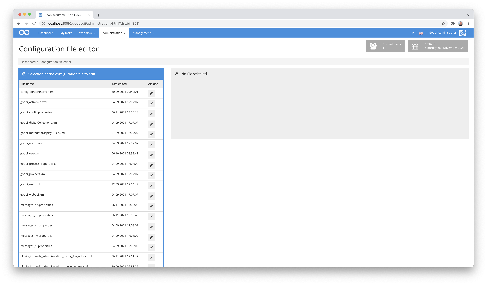
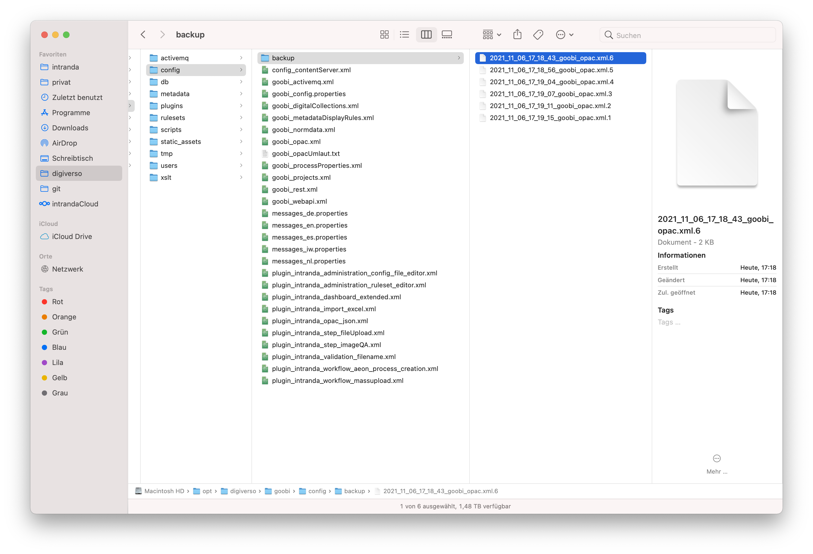
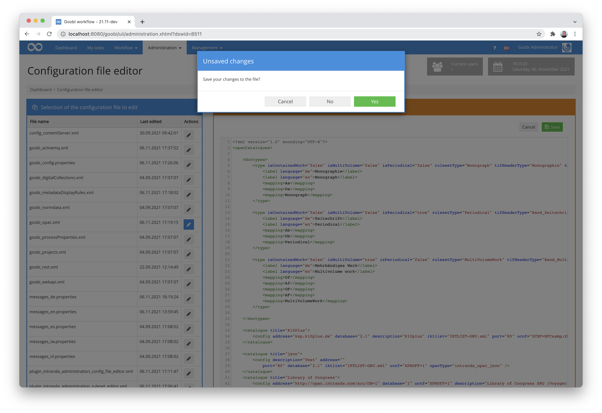

# Configuration editor

## Overview

Name                     | Wert
-------------------------|-----------
Identifier               | intranda_administration_config_file_editor
Repository               | [https://github.com/intranda/goobi-plugin-administration-config-file-editor](https://github.com/intranda/goobi-plugin-administration-config-file-editor)
Licence              | GPL 2.0 or newer 
Last change    | 25.07.2024 11:43:22


## Introduction
This plugin is used to directly edit the various configuration files of Goobi workflow directly from the user interface within the web browser.


## Installation
The plugin consists in total of the following files to be installed:

```bash
plugin_intranda_administration_config_file_editor_base-base.jar
plugin_intranda_administration_config_file_editor-gui.jar
plugin_intranda_administration_config_file_editor.xml
```

These files must be installed in the correct directories so that they are available under the following paths after installation:

```bash
/opt/digiverso/goobi/plugins/administration/plugin_intranda_administration_config_file_editor-base.jar
/opt/digiverso/goobi/plugins/GUI/plugin_intranda_administration_config_file_editor-gui.jar
/opt/digiverso/goobi/config/plugin_intranda_administration_config_file_editor.xml
```

This plugin has its own permission level for use. For this reason, users must have the necessary rights.


Therefore, please assign the following right to the user group of the corresponding users:

```bash
Plugin_administration_config_file_editor
```


## Overview and functionality
After installation, the plugin can be found in its own entry in the `Administration` menu, from where it can be opened.



After opening, all Goobi configuration files are listed on the left-hand side. These can be opened by clicking on the respective icon in order to edit them.

Please note that the configuration file of this plugin does not appear in the list by default for security reasons and is editable only by super administrators.

Also, no hidden files and no files from hidden folders are displayed.


If you open a file, a text editor appears on the right-hand side in which the file can be edited. If you edit and save a file, a backup is automatically created in the defined backup directory.


According to the value set in the configuration file, a certain number of older backups are retained here before they are replaced by newer ones.



If a file has been changed and an attempt is made to change to another file without saving it, the operator is asked how to proceed with the changes.



Within Goobi, help texts can be defined for configuration files, which can be helpful for editing in this editor. The stored help texts are displayed in the left-hand area depending on the file currently open and also have the option of working with formatting here.


## Configuration
The plugin is configured via the configuration file `plugin_intranda_administration_config_file_editor.xml` and can be adapted during operation. The following is an example configuration file:

```xml
<?xml version="1.0" encoding="UTF-8" ?>
<config_plugin>
    <!--
    The configFileDirectories element contains a list of directories
    that are used to collect all displayed files in the browser interface.

    Each directory should be an absolute path that contains xml or properties files.
    Other file types are not supported until now.
    The directory name may end with a slash (/), otherwise it will be added automatically.

    Backups are automatically created in a subfolder called "backup/".
    You can override this with the optional attribute backupFolder="myOwnBackupPath/".
    IMPORTANT: The directory must be an absolute path while the backupFolder parameter must be a relative path.
    The backup directory name may end with a slash (/), otherwise it will be added automatically.
    To save backup files in the selected configuration directory, overwrite the backup folder with backupFolder="".

    By default 8 backup files are kept, older files will be deleted.
    You can override this with the optional attribute backupFiles="".

    You can filter the displayed configuration files in a directory with the fileRegex="" parameter.
    If the parameter is not used or is empty, it will be ignored.
    -->

    <configFileDirectories>
        <directory backupFiles="16">/opt/digiverso/goobi/config/</directory>
        <directory backupFolder="wizzardBackup/" backupFiles="4">/opt/digiverso/layoutwizzard/</directory>
        <directory backupFolder="itmPluginsBackup/" backupFiles="4" fileRegex=".*\.xml">/opt/digiverso/itm/plugins/config/</directory>
        <directory backupFolder="itmBackup/" fileRegex=".*\.xml">/opt/digiverso/itm/config/</directory>
        <!--
        Example:
        <directory backupFolder="exampleBackup/" backupFiles="12" fileRegex="*\.xml">/opt/digiverso/example/config/</directory>
        -->
    </configFileDirectories>

</config_plugin>

```

The parameters within this configuration file have the following meanings:

Parameter           |  Description
------------------- | -----------------------------------------------------
`configFileDirectories`       | This is the list that contains all selected configuration file paths. The configuration file path preset in Goobi Workflow is always used.
`directory`                   | Configuration files from the absolute path specified here are displayed in the user interface. The path is ignored if it does not exist.
`backupFolder`                | This parameter specifies a relative path in `directory` where the backup files should be stored. By default, `backup/` is used if the parameter is not specified. To have backup files stored in the same directory as `directory`, override the value with `backupFolder=""`.
`backupFiles`                 | This integer value specifies how many backup files are kept per configuration file before they are overwritten by new backups. The default value is 8.
`fileRegex`                   | This parameter enables filtering of the displayed configuration files in the corresponding folder. Any regex expression can be entered. If this parameter is not used or an empty text is specified, all files are displayed.

If help texts for individual configuration files are to be displayed, these must be stored within the messages files. For this purpose, an adjustment is made in these files, for example:

```bash
/opt/digiverso/goobi/config/messages_de.properties
/opt/digiverso/goobi/config/messages_en.properties
```

For each configuration file, a value like the following can be entered there in the respective file.

German version within the file `messages_de.properties`:

```properties
plugin_administration_config_file_editor_help_goobi_projects.xml = Dies ist ein Hilfetext für die Konfiguration der Anlegemaske. <br/>Hier kann eine <i>Beschreibung</i>, die <b>formatiert</b> ist.<br/><br/><pre>Und auch Quellcode kann hier stehen</pre>
```

English version within the file `messages_en.properties`:

```properties
plugin_administration_config_file_editor_help_goobi_projects.xml = This is a help text for the creation mask. <br/>You can add a <i>Description</i> here, which is <b>formatted</b>.<br/><br/><pre>And you can put source code here as well</pre>
```

Note that the prefix `plugin_administration_config_file_editor_help_` is added before the name of the configuration file.