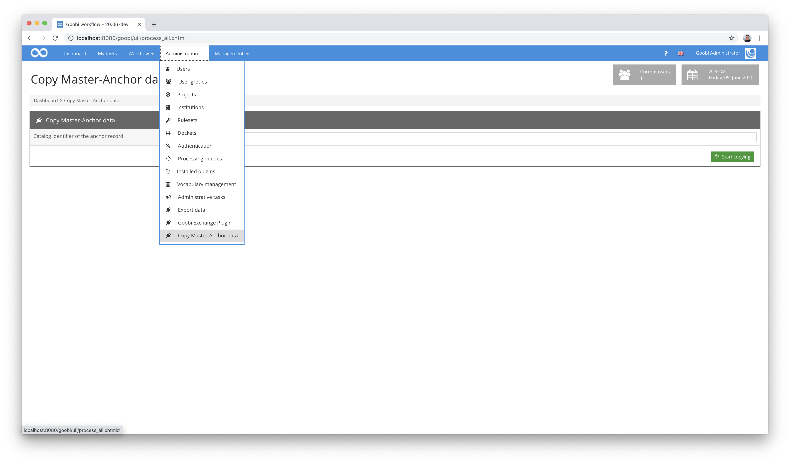
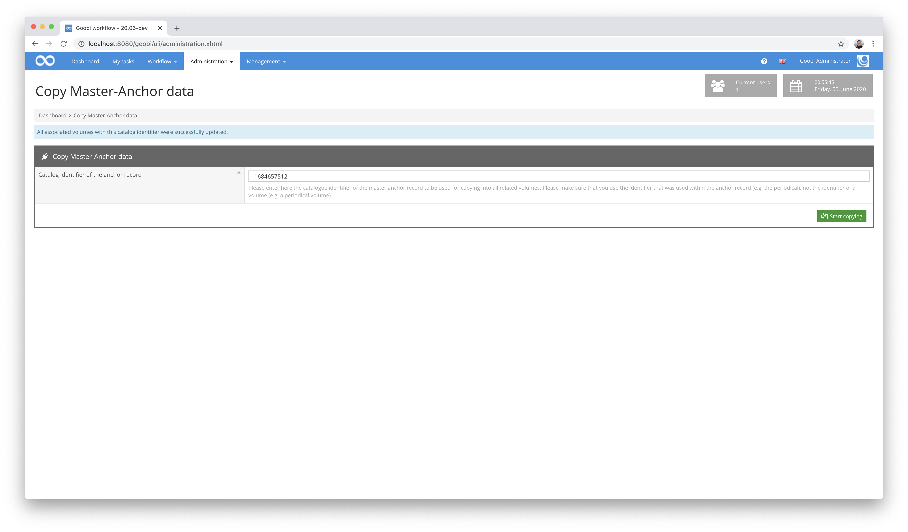

# Copy Master-Anchor

## Overview

Name                     | Wert
-------------------------|-----------
Identifier               | intranda_administration_copymasteranchor
Repository               | [https://github.com/intranda/goobi-plugin-administration-copyanchor](https://github.com/intranda/goobi-plugin-administration-copyanchor)
Licence              | GPL 2.0 or newer 
Last change    | 20.07.2024 19:04:29


## Introduction
This documentation describes the installation, configuration and use of the Administration Plugin for the automated transfer of a central anchor file of a volume (e.g. from journals or multi-volume works) to other volumes within Goobi workflow.


## Installation
To be able to use the plugin, the following files must be installed:

```bash
/opt/digiverso/goobi/plugins/administration/plugin-administration-copyanchor-base.jar
/opt/digiverso/goobi/plugins/GUI/plugin-administration-copyanchor-gui.jar
```

There is currently no configuration file for this plugin.


## Overview and functionality
If the plugin has been installed and configured correctly, it can be found under the menu item `Administration`.


### Definition of a master anchor
Once the plugin has been fully set up, it can be used. To do this, first add the newly defined metadata `InternalNote` within the tape that is to be marked as the master anchor and enter `AnchorMaster` as the value. This is illustrated in the following screenshot:


The adapted journal volume was defined as the master with this change. From now on, the metadata of the parent work (e.g. the journal) used there will serve as the default for all other associated volumes. Changes that are to be made for all volumes within the anchor files will therefore be made within this data record from now on.


### Transfer of metadata for all associated volumes
As soon as a volume has been defined as the master within a Goobi process, the plugin can be used to transfer all metadata from the master to all associated volumes. To do this, proceed as follows:

First open the plugin using the `Administration` menu and then the `Copy master anchor data` menu item.



Enter the catalogue identifier of the parent work in the input field of the plugin (e.g. the ID of the journal) and then click on the `Start copying process` button. This starts the copying process, which automatically copies the metadata of the master anchor data record to all associated volumes (e.g. all volumes of the journal).




## Configuration
The plugin does not have its own configuration file. Nevertheless, customisation of the rule set used is a mandatory requirement for the operation of the plugin. This is shown by way of example using a rule set that can be found under the following path:

```bash
/opt/digiverso/goobi/rulesets/ruleset.xml
```

The metadata `InternalNote` must be defined within the rule set:

```xml
<MetadataType>
  <Name>InternalNote</Name>
  <language name="de">Interne Goobi-Anmerkung</language>
  <language name="en">Internal Note for Goobi</language>
</MetadataType>
```

This metadata must now be allowed within the definition of the volumes. This is done using a journal volume as an example:

```xml
<DocStrctType topStruct="true">
  <Name>PeriodicalVolume</Name>
  <language name="de">Zeitschriftenband</language>
  <language name="en">Periodical volume</language>
  <!-- Definitions of other metadata and structure elemtents skipped here -->
  <metadata num="*">InternalNote</metadata>
</DocStrctType>
```

With this adjustment to the rule set, the preparations for using the plugin are already complete.