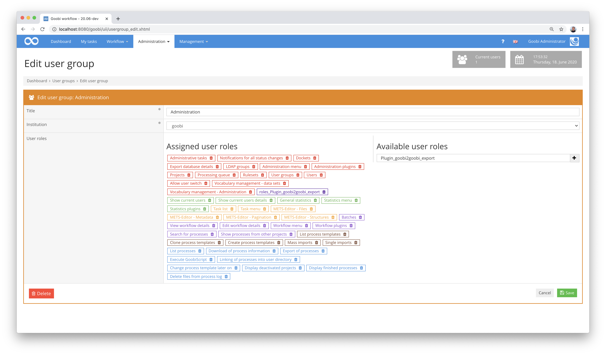

To start up the Goobi-to-Goobi mechanism, various plugins must be installed and configured on both the source and target systems. These are described in detail here.

## 1. Source system

First of all, the source system must be prepared for export. This includes first of all the installation of the correct plugin. Afterwards, only a permission for the appropriate users has to be configured to allow the export.

### 1.1 Installation

On the source system, the plugin `plugin_intranda_administration_goobi2goobi_export` must first be installed to create the export directories. To do this, the following two files must be copied to the appropriate paths:

```bash
/opt/digiverso/goobi/plugins/administration/plugin_intranda_administration_goobi2goobi_export.jar
/opt/digiverso/goobi/plugins/GUI/plugin_intranda_administration_goobi2goobi_export-GUI.jar
```

Please note that these files must be readable by the user `tomcat`.

### 1.2 Configuration

To enable the user to export data, the user must have the following roles:

```text
Export database details
Plugin_goobi2goobi_export
```

These roles can be configured within the Goobi workflow user groups. To do this, simply select the roles on the right-hand side or enter them in the input field and then click on the plus icon.



With this configuration the preparation on the side of the initial system is already completed.

## 2. Target system

The target system must also be prepared for the import. After the installation of the corresponding plugin and the corresponding configuration files, some configurations have to be checked or made.

### 2.1 Installation

On the target system, the plugin `plugin_intranda_administration_goobi2goobi_import` must first be installed to import the export directories. To do this, the following two files must be copied to the appropriate paths:

```bash
/opt/digiverso/goobi/plugins/administration/plugin_intranda_administration_goobi2goobi_import.jar
/opt/digiverso/goobi/plugins/GUI/plugin_intranda_administration_goobi2goobi_import-GUI.jar
```

After the installation of the actual plugin, the corresponding configuration files must also be installed. These can be found under the following paths:

```bash
/opt/digiverso/goobi/config/plugin_intranda_administration_goobi2goobi_import_data.xml
/opt/digiverso/goobi/config/plugin_intranda_administration_goobi2goobi_import_infrastructure.xml
```

Again, please note that the installed files must all be readable for the user `tomcat`.

### 2.2 General configuration

To enable a user to perform the import, the user must have the following role:

```text
Plugin_goobi2goobi_import
```

This role can be configured within the Goobi workflow user groups by entering it in the input field on the right-hand side and clicking on the plus icon.


### 2.3 Configuration for importing the infrastructure

To influence the data to be imported during the import of the infrastructure, the configuration file `plugin_intranda_administration_goobi2goobi_import_infrastructure.xml` can be adapted. This configuration can look like the following example:

```xml
<config_plugin>
    <config>
        <project name="intranda test project">
            <newProjectName>new project name</newProjectName>
            <!-- filegroups -->
            <filegroup name="SDB">
                <newFilegroupName>OBJECTS</newFilegroupName>
                <path>file:///opt/digiverso/viewer/media/$(meta.CatalogIDDigital)/</path>
                <mimeType>image/jp2</mimeType>
                <fileSuffix>jp2</fileSuffix>
                <folderValidation></folderValidation>
            </filegroup>
            <fileFormatInternal>Mets</fileFormatInternal>
            <fileFormatDmsExport>Mets</fileFormatDmsExport>
            <exportConfiguration useDmsImport="true" dmsImportCreateProcessFolder="false" dmsImportTimeOut="0" dmsImportRootPath="/opt/digiverso/viewer/hotfolder" dmsImportImagesPath="/opt/digiverso/viewer/hotfolder" dmsImportSuccessPath="/opt/digiverso/viewer/success" dmsImportErrorPath="/opt/digiverso/viewer/error" />
            <metsConfiguration metsRightsOwnerLogo="" metsRightsOwnerSite="" metsRightsOwnerMail="" metsDigiprovReference="" metsDigiprovPresentation="" metsDigiprovReferenceAnchor="" metsPointerPath="" metsPointerPathAnchor="" metsPurl="" metsContentIDs="" metsRightsSponsor="" metsRightsSponsorLogo="" metsRightsSponsorSiteURL="" metsRightsLicense="" />
        </project>

        <docket name="example docket">
            <newDocketName>first docket</newDocketName>
            <newFileName>docket.xsl</newFileName>
        </docket>

        <ruleset name="example ruleset">
            <newRulesetName>default ruleset</newRulesetName>
            <newFileName>ruleset.xml</newFileName>
        <ruleset>

        <ldap name="default ldap">
            <newLdapName>default ldap</newLdapName>
            <ldapConfiguration homeDirectory="" gidNumber="" dn="" objectClass="" sambaSID="" sn="" uid="" description="" displayName="" gecos="" loginShell="" sambaAcctFlags="" sambaLogonScript="" sambaPrimaryGroupSID="" sambaPwdMustChange="" sambaPasswordHistory="" sambaLogonHours="" sambaKickoffTime="" />
        </ldap>

        <usergroup name="Administration">
            <newUsergroupName>Admin</newUsergroupName>
            <addRole>administration_import_data</addRole>
            <removeRole>administration_export_data</removeRole>
            <addUser>johndoe</addUser>
            <removeUser>testadmin</removeUser>
        </usergroup>

        <user name="testadmin">
            <addAssignedProject>test project</addAssignedProject>
            <removeAssignedProject>example project</removeAssignedProject>
            <configuration place="" ldapgroup="" tablesize="" shortcut="" displayDeactivatedProjects="" displayFinishedProcesses="" displaySelectBoxes="" displayIdColumn="" displayBatchColumn="" displayProcessDateColumn="" displayLocksColumn="" displaySwappingColumn="" displayModulesColumn="" displayMetadataColumn="" displayThumbColumn="" displayGridView="" displayAutomaticTasks="" hideCorrectionTasks="" displayOnlySelectedTasks="" displayOnlyOpenTasks="" displayOtherTasks="" metsDisplayTitle="" metsLinkImage="" metsDisplayPageAssignments="" metsDisplayHierarchy="" metsDisplayProcessID="" customColumns="" customCss=""/>
        </user>
    </config>
</config_plugin>
```

In this configuration file all fields are optional. If a field is missing, its value is not overwritten during configuration. If the field is empty, it will be imported empty, otherwise it will be overwritten with the value from this configuration file. The fields for adding or removing are basically repeatable.

### 2.4 Configuration for the import of data

To import the data to the target system, you can specify in the configuration file `plugin_intranda_administration_goobi2goobi_import_infrastructure.xml` where the data is located and how it should be processed during the import. This configuration can look like the following example:

```xml
<?xml version="1.0"?>
<config_plugin>
    <globalConfig>
        <dbExportPrefix>import/</dbExportPrefix>
        <importPath>/opt/digiverso/goobi/metadata/</importPath>
        <bucket>example-workflow-data</bucket>
        <createNewProcessIds>true</createNewProcessIds>
        <temporaryImportFolder>/opt/digiverso/transfer/</temporaryImportFolder>
    </globalConfig>
    <config>
        <rulename>Project A</rulename>
        <rulename>Project B</rulename>
        <step name="Example to delete" type="delete" />
        <step name="Example to change" type="change">
            <newStepName>New step name</newStepName>
            <priority>5</priority>
            <order>3</order>
            <useHomeDirectory>0</useHomeDirectory>
            <stepStatus>0</stepStatus>
            <types metadata="true" automatic="false" readImages="false" writeImages="false" export="false" validateOnExit="true" finalizeOnAccept="false" delayStep="false" updateMetadataIndex="false" generateDocket="false" batchStep="false" stepPlugin="" validationPlugin="" />
            <scriptStep scriptStep="true" scriptName1="script 1" scriptPath1="/bin/bash ..." scriptName2="" scriptPath2="" scriptName3="" scriptPath3="" scriptName4="" scriptPath4="" scriptName5="" scriptPath5="" />
            <httpStep httpStep="true" httpMethod="POST" httpUrl="http://itm.example.com/itm/service" httpJsonBody="{ .... } " httpCloseStep="false" />
            <usergroup>Administration</usergroup>
            <usergroup>AutomaticTasks</usergroup>
        </step>
        <step name="Example to change" type="insertAfter" >
            <newStepName>Export task</newStepName>
            <order>120</order>
            <stepStatus>0</stepStatus>
            <types automatic="true" export="true" stepPlugin="special_export_plugin" />
            <usergroup>AutomaticTasks</usergroup>
        </step>
        <docket name="Default docket">
            <newDocketName>docket</newDocketName>
            <newFileName>docket.xsl</newFileName>
        </docket>
        <project name="Project A">
            <newProjectName>Project B</newProjectName>
        </project>
        <property name="CollectionName">
            <oldPropertyValue>Digitised</oldPropertyValue>
            <newPropertyName>Collection</newPropertyName>
            <newPropertyValue>default_collection</newPropertyValue>
        </property>
        <ruleset name="Default">
            <newRulesetName>default ruleset</newRulesetName>
            <newFileName>ruleset.xml</newFileName>
        </ruleset>
        <metadata name="CatalogIDDigital" type="change">
            <valueConditionRegex>/b\d+(?:_\d+)?/</valueConditionRegex>
            <valueReplacementRegex>s/^(.+)$/IMPORT_$1/g</valueReplacementRegex>
            <position>all</position>
        </metadata>
        <metadata name="PhysicalLocation" type="delete">
            <position>top</position>
        </metadata>
        <metadata name="Testmetatda" type="add">
            <valueReplacementRegex>example text</valueReplacementRegex>
            <position>top</position>
        </metadata>
        <skipProcesslog>true</skipProcesslog>
        <skipUserImport>true</skipUserImport>
    </config>
</config_plugin>
```

In the upper part of the file, some general settings are made that apply to all imports. These general settings are followed by the individual configured rules.

#### General settings: globalConfig

| Element | Example | Meaning |  |
| :--- | :--- | :--- | :--- |
| `dbExportPrefix` | `import/` | This specification is required if the database information to be imported is not located as xml files in the respective process folder. The specification contains the path to the database information within an s3 bucket and is not required when importing into a local file system. |  |
| `importPath` | `/opt/digiverso/goobi/metadata/` | Target directory into which the data is to be imported. |  |
| `bucket` |  | `example-workflow-data` | Name of the s3-bucket in which the data to be imported is located. This value is not required for imports into a local file system. |
| `createNewProcessIds` | `false` | This parameter defines whether the process identifiers from the old system should be reused or whether new IDs should be created. |  |
| `temporaryImportFolder` | `/opt/digiverso/transfer/` | This parameter specifies the path to the folder containing the data to be imported. The value only needs to be configured if it differs from the value within `importPath`. |  |

The individual rules for the import operations will be defined within the `<config>` element. The name of the rule is defined in `<rulename>`. If no rule is explicitly selected during the import, it will be determined by the project name of the processes. The field is repeatable, so that several identical rules can be created, for example if the same workflow is used in different projects.

### Workflow steps within the workflows: step

By means of `<step>` individual steps of the process can be manipulated. All fields are optional. If they are not specified, the original value is used. Otherwise the field is overwritten with the configured field content. If the field is of type String, it can also be specified empty to empty it.

| Element | Example | Meaning |  |
| :--- | :--- | :--- | :--- |
| `@name` | `Example task` | Contains the name of the step to be changed. |  |
| `@type` | `delete` | This value contains the type of manipulation. Possible values are `delete`, `change`, `insertBefore`, `insertAfter`. |  |
| `NewStepName` | `New step name` | New name of the step. |  |
| `priority` | `5` | New priority of the step. |  |
| `order` | `10` | Order of the step. |  |
|  | `useHomeDirectory` | `0` | Controls whether to link to the user's home directory. |
| `stepStatus` | `0` | Sets the step status. Allowed values are `0` (locked), `1` (open), `2` (inwork), `3` (done), `4` (error) and `5` (deactivated). |  |
| `types` | `automatic="true"` | Contains in attributes the different settings of a step. |  |
| `scriptStep` | `scriptStep="true" scriptName1="script 1" scriptPath1="/bin/true"` | Defines scripts for the workflow steps |  |
| `httpStep` | `httpStep="true" httpMethod="POST" httpUrl="http://itm.example.com/itm/service"` | Defines the configuration of the HTTP call for the step. |  |
| `usergroup` | `Administration` | Name of the assigned user group. This value can be repeated to define multiple user groups. |  |

### Docket: docket

In this element, the assigned docket can be replaced. The xsl file to be used must exist on the server. If a docket has already been defined with the new specifications, it will be used, otherwise a new docket will be defined and stored in the database.

| Element | Example | Meaning |  |
| :--- | :--- | :--- | :--- |
| `@name` |  | `Default docket` | Name of the previously used docket. The change is only made if the process has previously used a docket with this name. |
|  | `newDocketName` | `docket` | New name of the ticket. |
| `newFileName` | `docket.xsl` | New file name for the docket. |  |

### Project: project

This rule can be used to change the assigned project. The project must already exist. Changes to the projects themselves can be made using `Import infrastructure`.

\| Element \| Example \| Meaning \| \| :--- \| :--- \| :— \| \| `@name` \| \| `Project A` \| Old Project \| \| \| `newProjectName` \| `Project B` \| New Project \|

### Properties: property

This rule is used to manipulate process properties.

\| Element \| Example \| Meaning \| \| :--- \| :--- \| :— \| \| `@name` \| `CollectionName` \| Name of the property to be adjusted. \| \| `oldPropertyValue` \| `Digitised` \| Value of the property to be adjusted. If a value is specified, the property must contain this value. \| \| `newPropertyName` \| `Collection` \| New name of the property. Optional. \| \| `newPropertyValue` \| `default collection` \| New value of the property. Optional. \|

### Ruleset: ruleset

This rule can be used to change the assigned rule set. If the ruleset does not yet exist, it is created and saved in the database. The file must exist on the server.

\| Element \| Example \| Meaning \| \| :--- \| :--- \| :— \| \| `@name` \| `Default` \| Name of the ruleset used so far. \| \| `newRulesetName` \| `default ruleset` \| New name for the ruleset. \| \| `newFileName` \| `ruleset.xml` \| New file name for the ruleset. This must exist on the target system. \|

### Metadata: metadata

With this rule the metadata can be changed. Values of existing metadata can be changed, new metadata added or existing metadata deleted.

| Element | Example | Meaning |
| :--- | :--- | :--- |
| `@name` | `CatalogIDDigital` | Internal name of the metadata. |
| `@type` | `change` | Type of change. Allowed values are `add`, `change` and `delete`. |
| `position` | `top` | Describes the position at which the change is to be made. Allowed values are `all`, `anchor`, `top` and `physical`. |
| `valueConditionRegex` | `/PPN\d+\w?(?:_\d+)?/` | This regular expression checks whether the previous field content matches a defined value. This specification can be a fixed value or a regular expression. |
| `valueReplacementRegex` | `s/^PPN(.+)$/$1/g` | If the value `change` was used as `@type`, this parameter contains a regular expression for manipulating the previous metadata. If `@type` is set to `add`, the field content is used as the value of the metadata. |

### Further configurations

Further general settings can be defined within a rule.

| Element | Example | Meaning |
| :--- | :--- | :--- |
| `skipProcesslog` | `true` | Determines whether the process log of the source system should be transferred (`false`) or ignored (`true`). |
| `skipUserImport` | `true` | Specifies whether the users of imported tasks in a workflow within Goobi should be created as deleted users (`false`) or whether the information about execution by specific persons should be ignored and thus made anonymous. (`true`). |