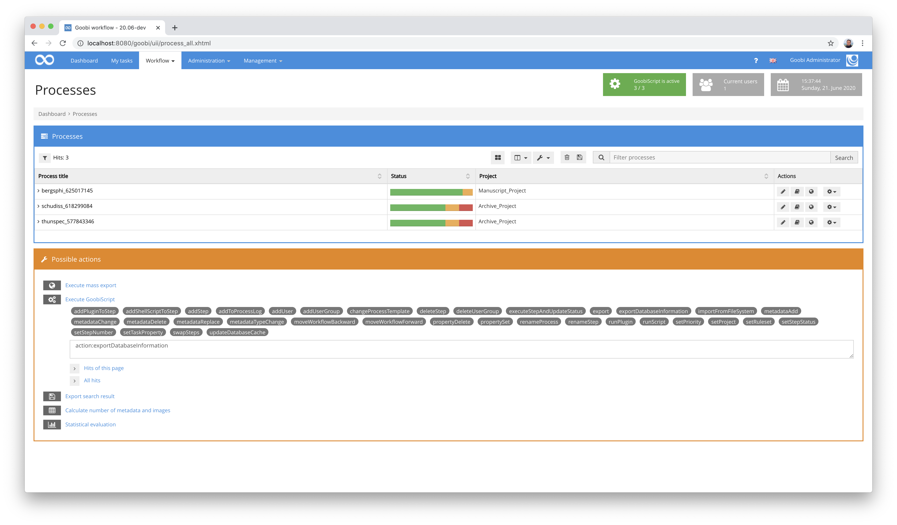
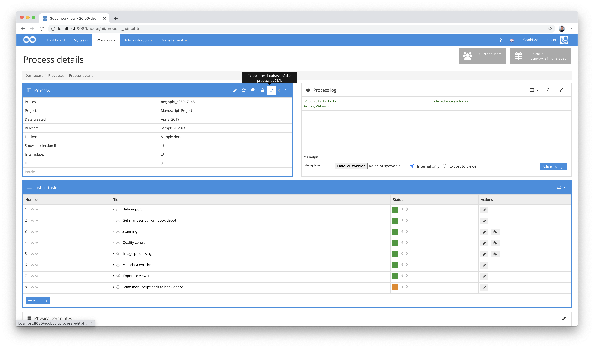
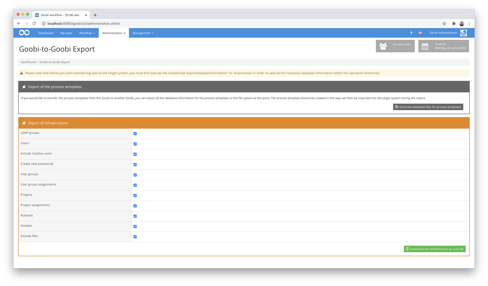
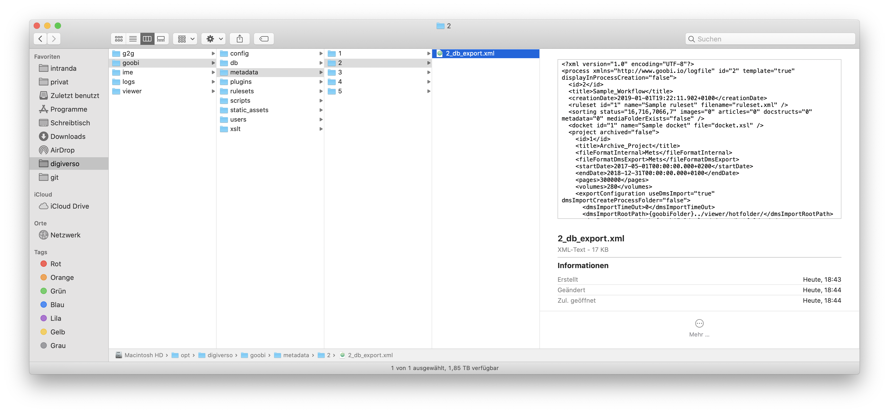
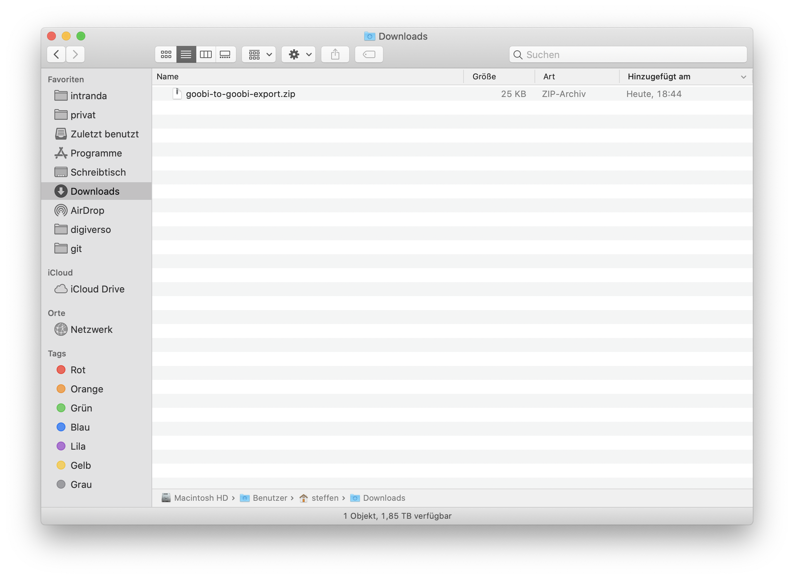

The export from the source system consists of up to three sub-steps. However, before the export can take place, it must first be specified within the role system of Goobi workflow that the user must have export permissions. Information on the configurations to be made can be found here:

[Installation](goobi-plugin-administration-goobi2goobi-import_page_01_00_en.md)

After configuring the required user rights, the actual export can begin. In most cases, only the first of the following three steps will be necessary.

## 1st sub-step: Creating the export files for processes

For most purposes, only this sub-step is required to generate the export files for all desired processes. For all selected processes within the file system, an xml file with all relevant information about the process is generated from the database in the folder of each selected process.


### Export using GoobiScript

To perform such an export for several processes together, you can start it using GoobiScript. The following GoobiScript command is required for this:

```text
action:exportDatabaseInformation
```



When you run this GoobiScript, you will find the relevant export xml file (e.g. `5_db_export.xml`) in each process folder.

### Manual export for individual processes

To perform such an export for a single process, it is possible to start it within the details of a process. To do this, simply click on the corresponding icon for the export.



Unlike exporting via GoobiScript, this starts a download of the xml file that contains the database information.

## 2nd sub-step: Exporting the process templates

**Notice:** This substep is optional and is only required in rare cases.

If you want to transfer more than just processes from one Goobi workflow to another, you can also generate export data for process templates. However, as GoobiScript is not available within the process template area, this export can be done from the provided `Goobi-to-Goobi Export` plugin within the `Administration` menu.



Now click on the button `Generate database files for process templates`. This will also save an xml file with the database information for each process template in the file system and can be used for the transfer to the target system.



## 3rd sub-step: Export of the infrastructure

**Notice:** This substep is optional and is only required in rare cases.

If, in addition to the actual Goobi processes, you also want to transfer more detailed information about the infrastructure from one Goobi workflow to another, you can also have this exported within the export plugin. To do this, select the checkboxes provided within the `Goobi-to-Goobi Export` plugin to influence the export in a targeted manner. The following parameters are available for this:

| Option | Meaning |
| :--- | :--- |
| `LDAP groups` | Exports the existing LDAP groups. |
| `Users` | Export of active users. |
| `Include inactive users` | In addition to the active users also export the deactivated users. |
| `Create new passwords` | Determines whether the existing passwords of the users should be exported as well. If the checkbox is set, new passwords must be set on the target system for the imported users after the import. |
| `User groups` | Export of user groups, permissions and additional roles. |
| `User group assignments` | Export all groups assigned to the user. |
| `Projects` | Export of the projects. |
| `Project assignments` | Export of all projects assigned to the user. |
| `Rulesets` | Export of rule set information. |
| `Dockets` | Export of the docket information. |
| `Include files` | Determine whether the exported zip file should include the rulesets and dockets. |

Once you have selected the desired information and clicked on the `Download infrastructure as a zip file` button, Goobi generates a zip file and offers it for download under the name `goobi-to-goobi-export.zip`. This zip file now contains all the information selected from the Goobi database for transfer to the target system.

