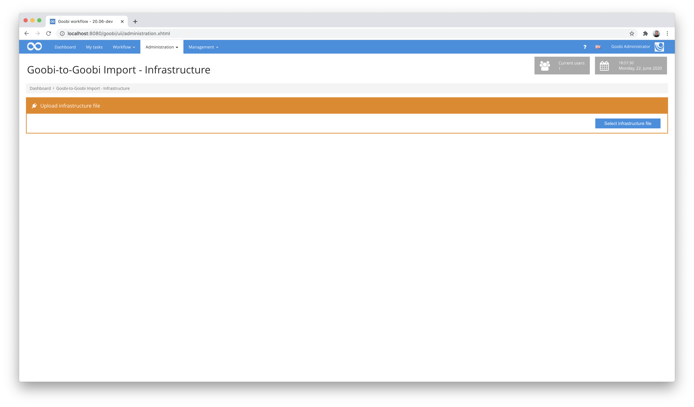
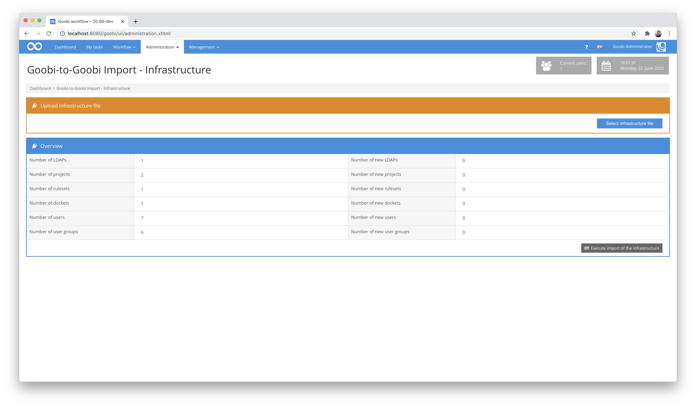
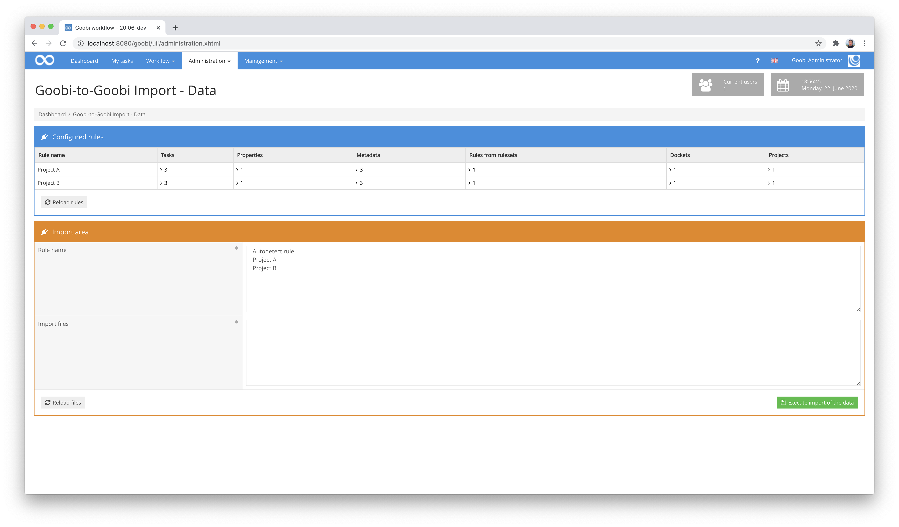
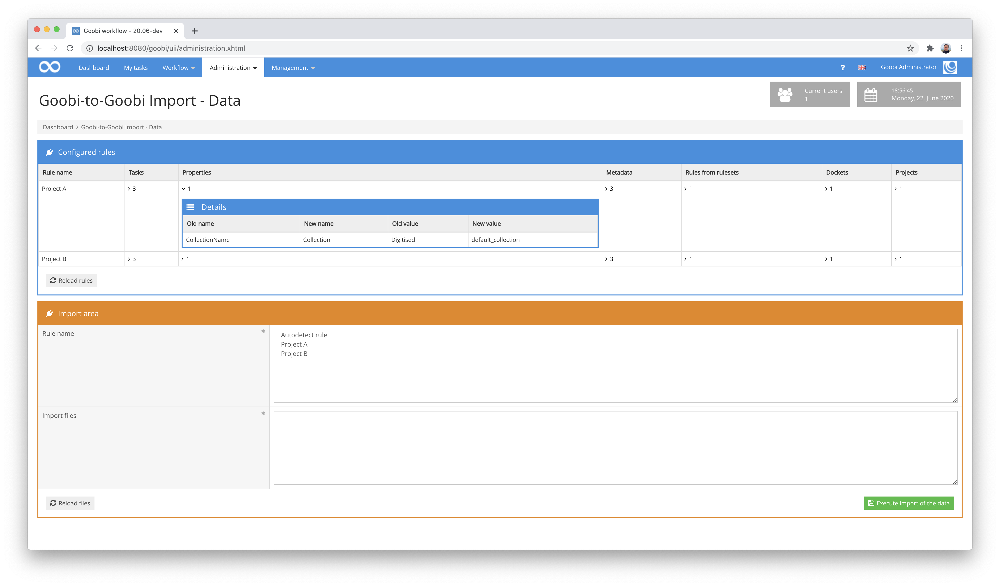

# Importing the export directories

## Overview

Name                     | Wert
-------------------------|-----------
Identifier               | intranda_administration_goobi2goobi_export intranda_administration_goobi2goobi_import_infrastructure intranda_administration_goobi2goobi_import_data
Repository               | [https://github.com/intranda/goobi-plugin-administration-goobi2goobi-import](https://github.com/intranda/goobi-plugin-administration-goobi2goobi-import)
Licence              | GPL 2.0 or newer 
Last change    | 25.07.2024 11:11:13

The import of data on the target system takes place using two different plugins. These must first be installed and configured accordingly. More information about their installation and configuration can be found here:

[Installation](goobi-plugin-administration-goobi2goobi-import_page_01_00_en.md)

After the successful installation, you can continue with the actual import. A distinction must be made here between the pure import of processes and the import of an exported infrastructure. Depending on the project, the import of the infrastructure may be necessary as the first step.

## 1. Import of the infrastructure

In the area for importing the infrastructure, the previously exported infrastructure of the source system can be imported. To do this, first open the plugin `Goobi-to-Goobi Import - Infrastructure` in the `Administration` menu.

At this point you can now upload a zip file that was previously created on the source system. After the successful upload, the file is unpacked on the server and analyzed. The user then receives a summary of the data to be imported.

If users, projects, groups, etc. already exist in the target system with the same name as the data to be imported, they do not count as new data to be imported and cannot be overwritten. After selecting the importing data, the import can be started by clicking on `Execute import of infrastructure`.

If desired, the data can be manipulated during the import. This is possible by adapting the configuration file `plugin_intranda_administration_goobi2goobi_import_infrastructure.xml`. More details can be found in the section `Configuration for importing the infrastructure` here:

[Installation](goobi-plugin-administration-goobi2goobi-import_page_01_00_en.md)

## 2. Import of processes

To import the processes from the source system, they must first be successfully exported and transferred to the target system. How the transfer of the sometimes very large amounts of data can take place is described here:

[Transfer of export directories](goobi-plugin-administration-goobi2goobi-import_page_03_00_en.md)

Once the data has been completely transferred to the target system, you can start the import of the data. To do this, open the plugin `Goobi-to-Goobi Import - Data` in the `Administration` menu. There the configured rules for the import are displayed in the upper part of the user interface. If these rules are edited on the target system, they can be reloaded at any time by clicking on the `Reload rules` button.

The actual import takes place in the lower area of the user interface. There the user can first search for the data to be imported by clicking on `Reload files`. If this search takes longer than 10 seconds due to the large amount of data, the further search takes place in the background and the user gets the feedback that he should please update the page again after some time.

If files are successfully listed after the search of the data to be imported, they can now be selected. To do this, you can either select them individually or let Goobi select them all by clicking on `Select all`. To do this, you need to select the rule that you want to apply to the import. This can either be selected directly or determined using `Autodetect rule`. In this case, the system checks whether there is a rule that corresponds to the name of the project to which the process was assigned.

A click on the button `Perform import of data` then starts the actual import. During this import, an internal Goobi ticket is created for each selected process and sent to the internal queue (Message Queue). The individual tickets are processed in the background and the processes are thus imported successively.

You can configure the import and the underlying rules in detail in the configuration file `plugin_intranda_administration_goobi2goobi_import_data.xml`. Further information about this configuration can be found in the section `Configuration for import of data`:

[Installation](goobi-plugin-administration-goobi2goobi-import_page_01_00_en.md)