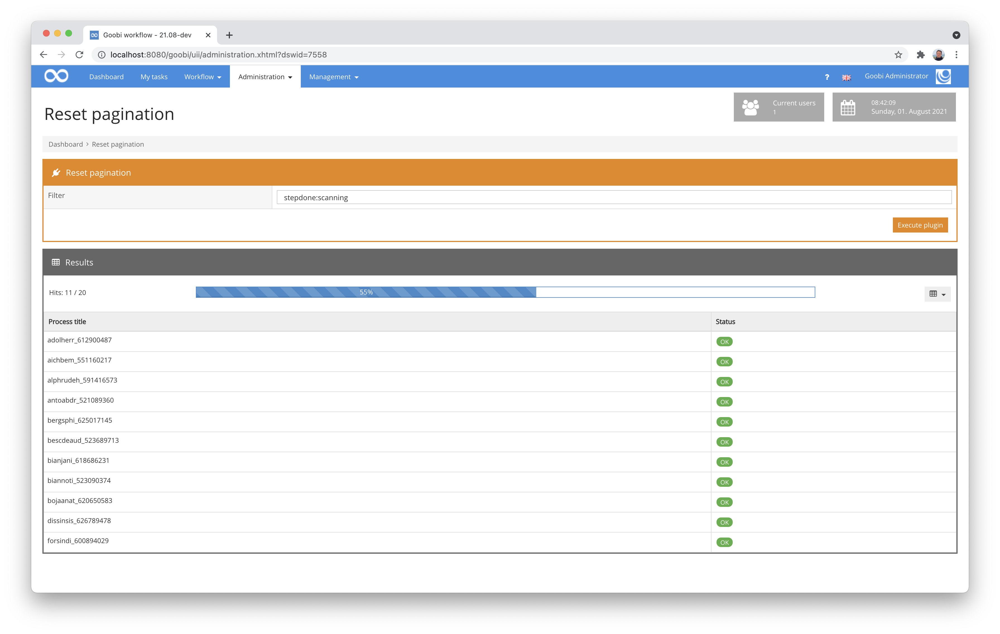
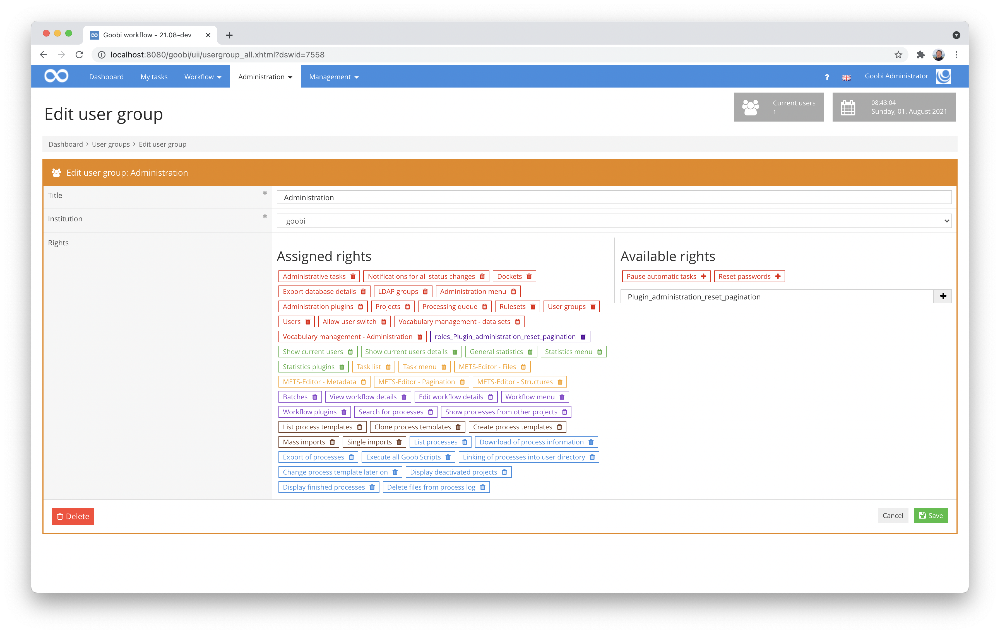

# Reset pagination

## Overview

Name                     | Wert
-------------------------|-----------
Identifier               | intranda_administration_reset_pagination
Repository               | [https://github.com/intranda/goobi-plugin-administration-reset-pagination](https://github.com/intranda/goobi-plugin-administration-reset-pagination)
Licence              | GPL 2.0 or newer 
Last change    | 25.07.2024 11:13:09


## Introduction
This documentation describes the installation, configuration and use of the Administration Plugin for automated pagination resetting within a large number of processes within Goobi workflow.


## Installation
The plugin consists of the following files to be installed:

```bash
plugin-intranda-administration-reset-pagination-base.jar
plugin-intranda-administration-reset-pagination-gui.jar
plugin_intranda_administration_reset_pagination.xml
```

These files must be installed in the correct directories so that they are available in the following paths after installation:

```bash
/opt/digiverso/goobi/plugins/administration/plugin-intranda-administration-reset-pagination-base.jar
/opt/digiverso/goobi/plugins/GUI/plugin-intranda-administration-reset-pagination-gui.jar
/opt/digiverso/goobi/config/plugin_intranda_administration_reset_pagination.xml
```


## Overview and functionality
If the plugin has been installed and configured correctly, it can be found within the menu item `Administration`. After entering, the parameters described above can once again be individually adjusted in the interface.



After clicking on the button `Execute plugin` the update of the METS files starts. A progress bar informs about the progress. Within the table, the processes already processed are listed and the respective status about the success of the execution is displayed.


## Configuration
The plugin is configured via the configuration file `plugin_intranda_administration_reset_pagination.xml` and can be adapted during operation. The following is an example configuration file:

```xml
<config_plugin>
	
	<!-- default filter to use -->
	<filter>stepdone:export</filter>
	
</config_plugin>

```

| Parameter | Explanation |
| :--- | :--- |
| `filter` | With this parameter, a filter can be set as the default. This is automatically pre-filled when entering the plugin, but can then be adjusted as desired each time the plugin is used within the user interface. |

To use this plugin, the user must have the correct role authorisation. Therefore, please assign the role `Plugin_administration_reset_pagination` to the user group.

