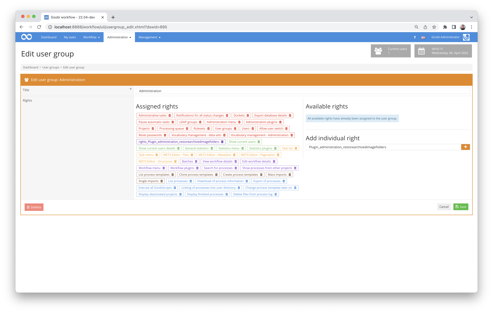
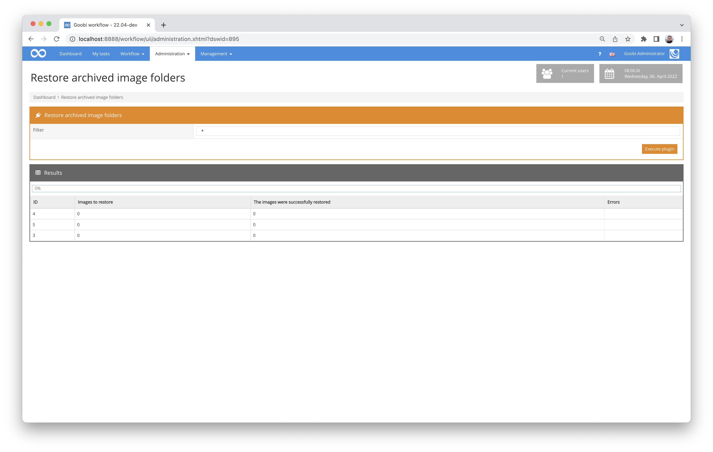

# Restoring archived image folders

## Overview

Name                     | Wert
-------------------------|-----------
Identifier               | intranda_administration_restorearchivedimagefolders
Repository               | [https://github.com/intranda/goobi-plugin-administration-restore-archived-image-folders](https://github.com/intranda/goobi-plugin-administration-restore-archived-image-folders)
Licence              | GPL 2.0 or newer 
Last change    | 25.07.2024 11:16:07


## Introduction
This plugin for Goobi workflow restores image folders that were previously archived with the plugin `goobi-plugin-step-archiveimagefolder`.


## Installation
The plugin consists of the following files to be installed:

```bash
goobi-plugin-administration-restorearchivedimagefolders-base.jar
goobi-plugin-administration-restorearchivedimagefolders-gui.jar
plugin_intranda_administration_restorearchivedimagefolders.xml
```

These files must be installed in the correct directories so that they are available in the following paths after installation:

```bash
/opt/digiverso/goobi/plugins/administration/plugin-intranda-administration-restorearchivedimagefolders-base.jar
/opt/digiverso/goobi/plugins/GUI/plugin-intranda-administration-restorearchivedimagefolders-gui.jar
/opt/digiverso/goobi/config/plugin_intranda_administration_restorearchivedimagefolders.xml
```

To use this plugin, the user must have the correct role authorisation. Therefore, please assign the role `Plugin_administration_restorearchivedimagefolders` to the user group.




## Overview and functionality
The plugin offers a graphical user interface that can be opened via the menu `Administration`. There, a search filter can be used, as it is used in other parts of Goobi workflow (e.g. for the task list). Clicking on 'Run Plugin' will then restore the images for the tasks found via the filter entered. The user interface updates automatically.




## Configuration
The configuration file is empty at the moment, but must still be present.

```xml
<config_plugin>
  <!-- currently no configuration is needed -->
</config_plugin>
```

The information from where the data is to be fetched is stored in the respective process folder in an XML file by the archiving plug-in.

For authentication on ssh servers, public keys are searched for in the usual places (`$USER_HOME/.ssh`). Other authentication methods such as username/password are not provided.