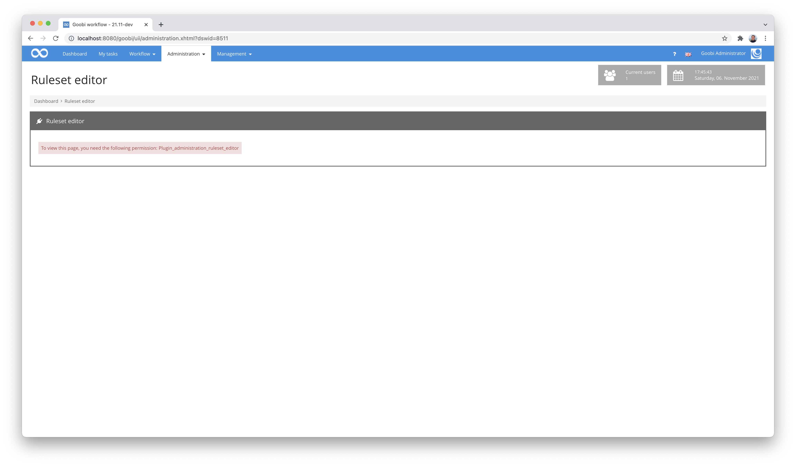
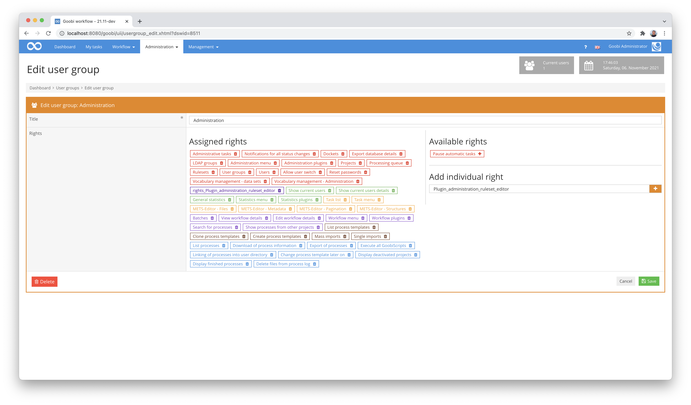
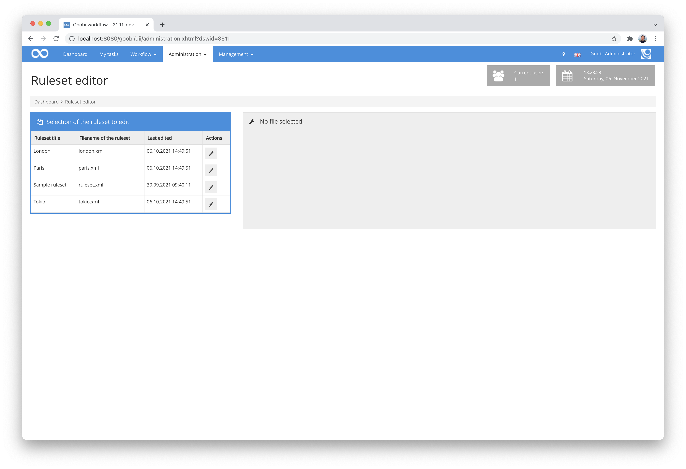
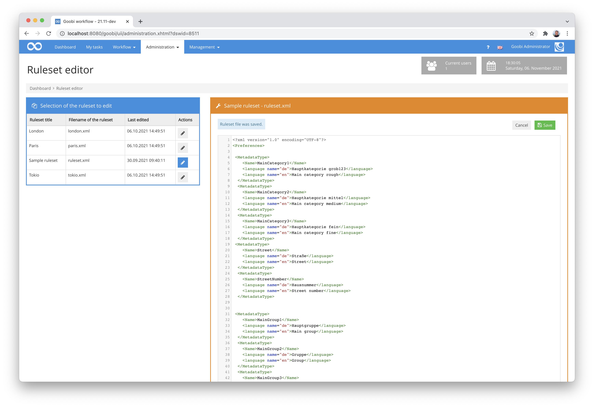
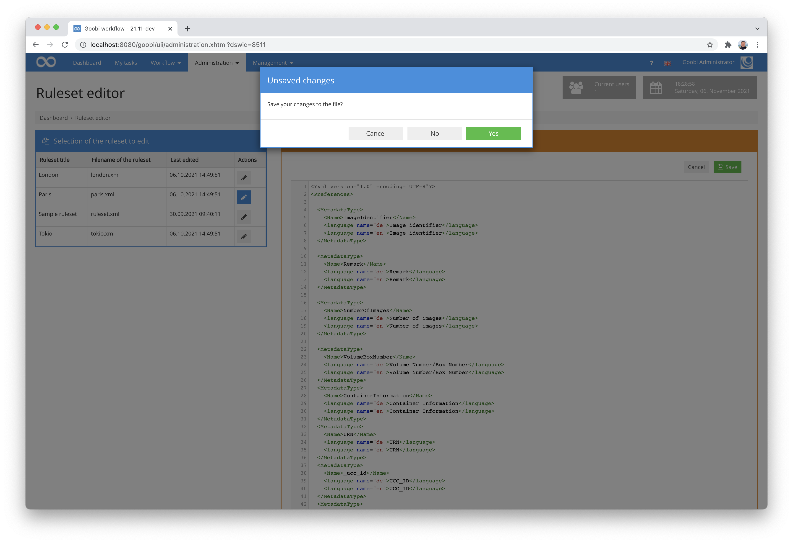

# Ruleset editor

## Overview

Name                     | Wert
-------------------------|-----------
Identifier               | intranda_administration_ruleset_editor
Repository               | [https://github.com/intranda/goobi-plugin-administration-ruleset-editor](https://github.com/intranda/goobi-plugin-administration-ruleset-editor)
Licence              | GPL 2.0 or newer 
Last change    | 25.07.2024 11:09:29


## Introduction
This plugin is used to directly edit the ruleset files of Goobi workflow directly from the user interface within the web browser.


## Installation
The plugin consists in total of the following files to be installed:

```bash
plugin_intranda_administration_ruleset_editor-base.jar
plugin_intranda_administration_ruleset_editor-gui.jar
plugin_intranda_administration_ruleset_editor.xml
```

These files must be installed in the correct directories so that they are available under the following paths after installation:

```bash
/opt/digiverso/goobi/plugins/administration/plugin_intranda_administration_ruleset_editor-base.jar
/opt/digiverso/goobi/plugins/GUI/plugin_intranda_administration_ruleset_editor-gui.jar
/opt/digiverso/goobi/config/plugin_intranda_administration_ruleset_editor.xml
```

This plugin has its own permission level for use. For this reason, users must have the necessary rights.



Therefore, please assign the following right to the user group of the corresponding users:

```
Plugin_administration_ruleset_editor
```




## Overview and functionality
After installation, the plugin can be found in its own entry in the `Administration` menu, from where it can be opened.



After opening, all Goobi ruleset files are listed on the left-hand side. These can be opened by clicking on the respective icon in order to edit them.


If you open a file, a text editor appears on the right-hand side in which the file can be edited. If you edit and save a file, a backup is automatically created in the defined backup directory.



According to the value set in the configuration file, a certain number of older backups are retained here before they are replaced by newer ones.


If a file has been changed and an attempt is made to change to another file without saving it, the operator is asked how to proceed with the changes.




## Configuration
The plugin is configured via the configuration file `plugin_intranda_administration_ruleset_editor.xml` and can be adapted during operation. The following is an example configuration file:

```xml
<config_plugin>
	
	<!-- By editing a ruleset file in the browser GUI, a backup file will be stored in the backup directory -->
	<rulesetBackupDirectory>/opt/digiverso/goobi/rulesets/backup/</rulesetBackupDirectory>

	<!-- backup files will be stored as ruleset.xml.1, ruleset.xml.2, ..., ruleset.xml.n -->
	<numberOfBackupFiles>10</numberOfBackupFiles>
	
</config_plugin>
```

The parameters within this configuration file have the following meanings:

Parameter           |  Description
------------------- | -----------------------------------------------------
`rulesetBackupDirectory`   | This sets the path for the backup files where the backups of the ruleset files are to be saved after editing.
`numberOfBackupFiles`         | This integer value specifies how many backup files remain stored per ruleset file before they are overwritten by new backups.