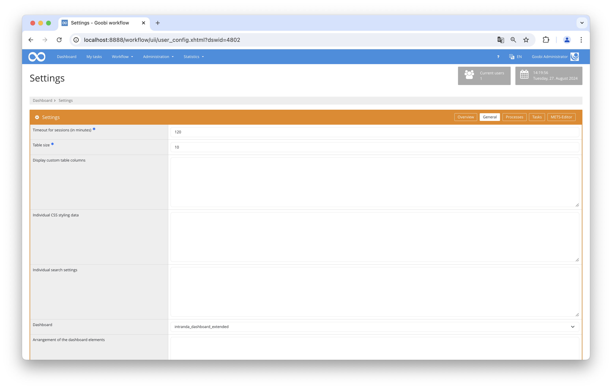

# Barcode scanner Dashboard

## Overview

Name                     | Wert
-------------------------|-----------
Identifier               | intranda_dashboard_barcode
Repository               | [https://github.com/intranda/goobi-plugin-dashboard-barcode](https://github.com/intranda/goobi-plugin-dashboard-barcode)
Licence              | GPL 2.0 or newer 
Last change    | 04.09.2024 09:33:25


## Introduction
This dashboard plugin was developed to facilitate the use of a barcode scanner in the Goobi Workflow. On the right side is a form for various actions, such as accepting and completing tasks or tracking the location of objects.

## Installation
In order to use the plugin, the following files must be installed:

```bash
/opt/digiverso/goobi/plugins/dashboard/plugin_intranda_dashboard_barcode.jar
/opt/digiverso/goobi/plugins/GUI/plugin_intranda_dashboard_barcode-GUI.jar
```

To configure how the plugin should behave, various values in the configuration file can be adjusted. The configuration file is usually located here: 


```bash
/opt/digiverso/goobi/config/plugin_intranda_dashboard_barcode.xml
```

To use this plugin, the user must select the `intranda_dashboard_barcode` value within the dashboard settings.



## Overview and functionality
To use this dashboard plugin, you first need to activate it via `Settings` -> `General` -> `Dashboard` and then log in again. If the plugin is correctly installed and configured, it should already be activated under the `Dashboard` menu item.


On the right side, there is a form with various actions. You can select one by clicking on it. If the action `Change Location Only` is chosen, an additional input field will appear, expecting the name of the new location. For all actions, there is a mandatory input field where the title of the Goobi process is expected. This field is automatically focused after loading to facilitate the use of a barcode scanner. By clicking the `Execute` button, the selected action will be performed, and messages regarding success will be displayed. The performed action and the input location are saved to facilitate further applications. They remain unchanged until a manual change is made.

## Configuration
The plugin is configured in the file `plugin_intranda_dashboard_barcode.xml` as shown here:

```xml
<?xml version="1.0" encoding="UTF-8"?>

<config_plugin>
	
	<!-- number of previous tasks that shall be shown -->
	<tasks-latestChanges-size>37</tasks-latestChanges-size>
	
	<!-- display the option to accept tasks -->
	<show-accept-option>true</show-accept-option>
	​
	<!-- display the option to finish tasks -->
	<show-finish-option>true</show-finish-option>
	​
	<!-- display the option to accept and finish tasks as one action -->
	<show-accept-and-finish-option>true</show-accept-and-finish-option>
	​
	<!-- display the option to change the location -->
	<show-change-location-option>true</show-change-location-option>
	
	<!-- define which filter shall be used to find the processes. Use {BARCODE} 
	as placeholder for the input field content (e.g. "meta:*:{BARCODE}" ) -->
	<filter>meta:*:{BARCODE}</filter>
	
</config_plugin>

```

The following table contains a summary of the parameters and their descriptions:

Parameter               | Explanation
------------------------|------------------------------------
| `tasks-latestChanges-size`      | This parameter defines how many completed tasks should be displayed in the left table. |
| `show-accept-option`            | This parameter determines whether the action button for accepting tasks should be enabled. Default is `false`. |
| `show-finish-option`            | This parameter determines whether the action button for finishing tasks should be enabled. Default is `false`. |
| `show-accept-and-finish-option` | This parameter determines whether the action button for accepting tasks and completing them should be enabled. Default is `false`. |
| `show-change-location-option`   | This parameter determines whether the action button for changing the location should be enabled. Default is `false`. |