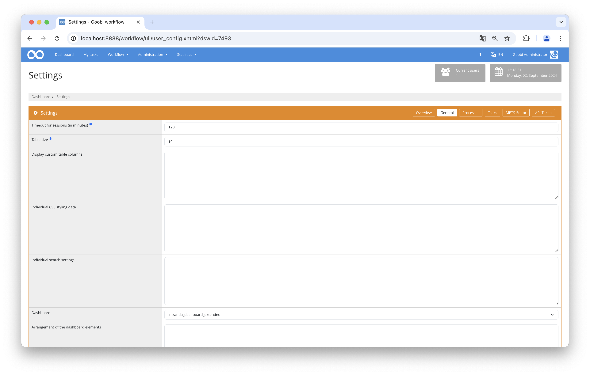

# Extended Dashboard

## Overview

Name                     | Wert
-------------------------|-----------
Identifier               | intranda_dashboard_extended
Repository               | [https://github.com/intranda/goobi-plugin-dashboard-extended](https://github.com/intranda/goobi-plugin-dashboard-extended)
Licence              | GPL 2.0 or newer 
Last change    | 04.09.2024 10:37:29


## Introduction
This dashboard plugin provides an improved overview through detailed display options. For example, the most recently edited tasks or relevant statistics can be shown.

## Installation
In order to use the plugin, the following files must be installed:

```bash
/opt/digiverso/goobi/plugins/dashboard/plugin-dashboard-extended-base.jar
/opt/digiverso/goobi/plugins/GUI/plugin-dashboard-extended-gui.jar
/opt/digiverso/goobi/config/plugin_intranda_dashboard_extended.xml
```

To use this plugin, the user must select the value `intranda_dashboard_extended` within the dashboard settings. 




## Overview and functionality
If the plugin is installed correctly and users have set it as their dashboard, it will be visible after logging into Goobi workflow instead of the start page.


## Configuration
The plugin is configured in the file `plugin_intranda_dashboard_extended.xml` as shown here:

```xml
<?xml version="1.0" encoding="UTF-8"?>

<config_plugin>
	
	<!-- intranda TaskManager -->
	<itm-show>false</itm-show>
	<itm-cache-time>180000</itm-cache-time>
	<itm-url>http://localhost:8080/itm/</itm-url>
	
	<!-- Nagios Monitoring -->
	<nagios-show>false</nagios-show>
	<nagios-cache-time>180000</nagios-cache-time>
	<nagios-host>host.example.org</nagios-host>
	<nagios-login>user</nagios-login>
	<nagios-password>pass</nagios-password>
	
	<!-- RSS-Feed e.g. of last imports -->
	<rss-show>false</rss-show>
	<rss-cache-time>900000</rss-cache-time>
	<rss-url>https://www.intranda.com/feed/</rss-url>
	<rss-title>News by intranda GmbH</rss-title>
	
	<!-- Search -->
	<search-show>true</search-show>
	
	<!-- Show tasks the user works on -->
    <tasks-show>true</tasks-show>
    <tasks-show-size>5</tasks-show-size>
    
    <!-- show recent history  -->
    <tasks-history>false</tasks-history>
    <!-- show history for configured tasks -->
    <tasks-history-title>Data import via Excel sheet</tasks-history-title>
    <tasks-history-title>Scanning</tasks-history-title>
    <tasks-history-title>Fileupload</tasks-history-title>
    <!-- include status changes for the last X days -->
    <tasks-history-period>7</tasks-history-period>
	
    <!-- show the last tasks of the user -->
    <tasks-latestChanges>true</tasks-latestChanges>
    <tasks-latestChanges-size>5</tasks-latestChanges-size>
    
    <!-- Statistics -->
	<statistics-show>true</statistics-show>
	
	<!-- Batches -->
	<batches-show>true</batches-show>
	<!-- define time range as months before and after the today date -->
	<batches-timerange-start>2</batches-timerange-start>
	<batches-timerange-end>4</batches-timerange-end>
	
	<!-- Process creation -->
	<processTemplates-show>true</processTemplates-show>
	<processTemplates-show-statusColumn>true</processTemplates-show-statusColumn>
	<processTemplates-show-projectColumn>true</processTemplates-show-projectColumn>
	<processTemplates-show-massImportButton>true</processTemplates-show-massImportButton>
	
    <!-- Message queue -->
    <queue-show>true</queue-show>

	<!-- HTML box -->
	<html-box-show>false</html-box-show>
	<html-box-title>Goobi to go - Sample accounts</html-box-title>
	<html-box-content><![CDATA[
		<p>This is the Goobi workflow instance inside of your Goobi-to-go environment. It contains some demonstration material as well as sample user accounts. In the following table you can see the list of all user accounts which are available inside of this Goobi-to-go package. <br/><br/>
		<table class="table table-hover table-nomargin dataTable table-bordered responsive">
			<thead>
				<tr>
					<th>Login</th>
					<th>Password</th>
					<th>User description</th>
				</tr>
			</thead>
			<tr>
				<td>testscanning</td>
				<td>test</td>
				<td>User account for uploading content</td>
			</tr>
			<tr>
				<td>testqc</td>
				<td>test</td>
				<td>User account for manual Image QA</td>
			</tr>
			<tr>
				<td>testmetadata</td>
				<td>test</td>
				<td>Account for metadata enrichment work</td>
			</tr>
			<tr>
				<td>testimaging</td>
				<td>test</td>
				<td>User account for manual image optimisation</td>
			</tr>
			<tr>
				<td>testprojectmanagement</td>
				<td>test</td>
				<td>Project manager account</td>
			</tr>
			<tr>
				<td>testadmin</td>
				<td>test</td>
				<td>Administrator account</td>
			</tr>
			<tr>
				<td>goobi</td>
				<td>goobi</td>
				<td>Administrator account</td>
			</tr>
			
		</table>
	]]></html-box-content>
	
</config_plugin>

```

The following table contains a summary of the parameters and their descriptions:

Parameter               | Explanation
------------------------|------------------------------------
`<itm-show>`            | This parameter defines whether the currently running jobs of the intranda Task Manager should be displayed. 
`<itm-cache-time>`      | This value is specified in milliseconds and defines how often the values from the intranda Task Manager should be updated.
`<itm-url>`             | The URL at which the intranda Task Manager can be accessed is specified here.
`<rss-show>`            | This parameter defines whether news that can be retrieved via RSS feed should be displayed.
`<rss-cache-time>`      | This value is specified in milliseconds and indicates how often the RSS feed should be updated.
`<rss-url>`             | This parameter specifies the website from which the RSS feed is to be loaded.
`<rss-title>`           | The title that is to appear above the news items is defined here.
`<search-show>`         | This parameter determines whether the `Search` form should be displayed.
`<tasks-show>`          | This parameter defines whether the `Recently completed tasks` area should be displayed.
`<tasks-show-size>`     | Here you can specify how many of the recently completed tasks should be displayed.
`<tasks-history>`       | This can be used to display the history of the last tasks. 
`<tasks-history-title>` | This parameter can be used to specify which task type is to be displayed.
`<tasks-history-period>` | This parameter defines the maximum length of time (in days) that may have passed since the last edit for it to still be displayed.
`<tasks-latestChanges>` | Here you can specify whether the most recently processed tasks should be displayed.
`<tasks-latestChanges-size>` | This parameter specifies the number of the last changes to be shown.
`<statistics-show>`     | Here you define whether statistics are to be displayed.
`<batches-show>`        | This parameter specifies whether the batches are to be displayed.
`<batches-timerange-start>` | Here you specify how many months ago the batches were started to be processed so that they are displayed.
`<batches-timerange-end>` | Here you can specify how many months after the start of processing the batches are displayed.
`<processTemplates-show>` | This parameter defines whether the production templates are to be displayed.
`<processTemplates-show-statusColumn>` | Here you can specify whether the status column should be displayed.
`<processTemplates-show-projectColumn>` | Here you can specify whether the project column should be displayed.
`<processTemplates-show-massImportButton>` | Here you can specify whether the bulk import button should be displayed.
`<queue-show>`.           | This parameter defines whether the dashboard should display how many processes are currently in the queue and what their status is.