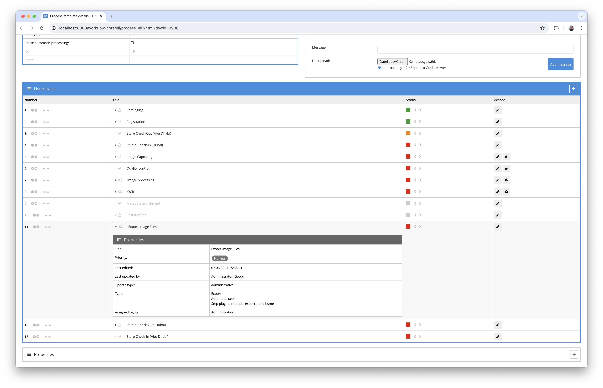
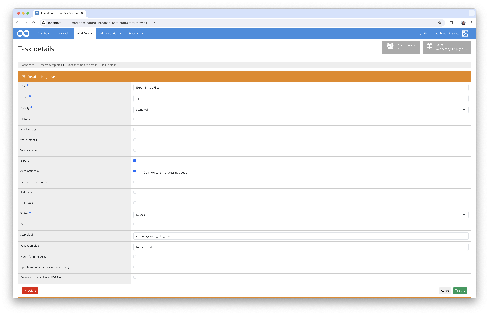
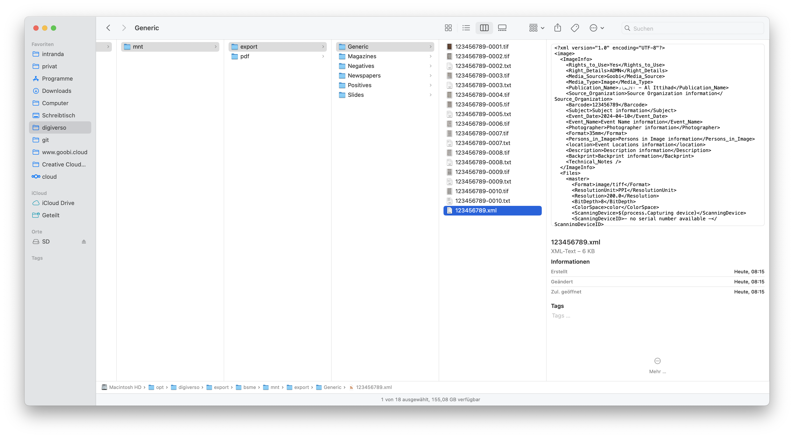

# Customised export for the DMS Imagen Media Archive Management

## Overview

Name                     | Wert
-------------------------|-----------
Identifier               | intranda_export_adm_bsme
Repository               | [https://github.com/intranda/goobi-plugin-export-adm-bsme](https://github.com/intranda/goobi-plugin-export-adm-bsme)
Licence              | GPL 2.0 or newer 
Last change    | 14.10.2024 09:27:36


## Introduction
This documentation describes the installation, configuration and use of the export plugin for the creation of special export packages for the Imagen Media Archive Management software. Within the plugin, 5 special publication types are currently taken into account and processed individually.

## Installation
To be able to use the plugin, the following files must be installed:

```bash
/opt/digiverso/goobi/plugins/export/plugin-export-adm-bsme-base.jar
/opt/digiverso/goobi/config/plugin_intranda_export_adm_bsme.xml
```

Once the plugin has been installed, it can be selected within the workflow for the respective work steps and thus executed automatically. A workflow could look like the following example:



To use the plugin, it must be selected in one step:




## Overview and functionality
This plugin is automatically executed as an export plugin within the workflow and generates the required data within a configured directory. Depending on the publication type, these are

- Image files
- Plain text files with OCR results
- ALTO files with OCR results
- METS files
- METS anchor files
- XML export files



The structure of the XML export files in particular varies greatly depending on the publication type. Here is an example of a `Generic Print` publication type:

```xml
<?xml version="1.0" encoding="UTF-8"?>
<image>
  <ImageInfo>
    <Rights_to_Use>Yes</Rights_to_Use>
    <Right_Details>ADMN</Right_Details>
    <Media_Source>Goobi</Media_Source>
    <Media_Type>Image</Media_Type>
    <Publication_Name>الاتحاد - Al Ittihad</Publication_Name>
    <Source_Organization>Source Organization information</Source_Organization>
    <Barcode>123456789</Barcode>
    <Subject>Subject information</Subject>
    <Event_Date>2024-04-10</Event_Date>
    <Event_Name>Event Name information</Event_Name>
    <Photographer>Photographer information</Photographer>
    <Format>35mm</Format>
    <Persons_in_Image>Persons in Image information</Persons_in_Image>
    <location>Event Locations information</location>
    <Description>Description information</Description>
    <Backprint>Backprint information</Backprint>
    <Technical_Notes />
  </ImageInfo>
  <Files>
    <master>
      <Format>image/tiff</Format>
      <ResolutionUnit>PPI</ResolutionUnit>
      <Resolution>200.0</Resolution>
      <BitDepth>8</BitDepth>
      <ColorSpace>color</ColorSpace>
      <ScanningDevice>Bookeye 5</ScanningDevice>
      <ScanningDeviceID />
      <Width>1272</Width>
      <Height>1680</Height>
      <file>123456789-0001.tif</file>
    </master>
    <master>
      <Format>image/tiff</Format>
      <ResolutionUnit>PPI</ResolutionUnit>
      <Resolution>200.0</Resolution>
      <BitDepth>8</BitDepth>
      <ColorSpace>color</ColorSpace>
      <ScanningDevice>Bookeye 5</ScanningDevice>
      <ScanningDeviceID />
      <Width>1272</Width>
      <Height>1680</Height>
      <file>123456789-0002.tif</file>
    </master>
    <text Format="text/plain">123456789-0002.txt</text>
    <master>
      <Format>image/tiff</Format>
      <ResolutionUnit>PPI</ResolutionUnit>
      <Resolution>200.0</Resolution>
      <BitDepth>8</BitDepth>
      <ColorSpace>color</ColorSpace>
      <ScanningDevice>Bookeye 5</ScanningDevice>
      <ScanningDeviceID />
      <Width>1192</Width>
      <Height>1608</Height>
      <file>123456789-0003.tif</file>
    </master>
    <text Format="text/plain">123456789-0003.txt</text>
  </Files>
</image>
```

## Configuration
The plugin is configured in the file `plugin_intranda_export_adm_bsme.xml` as shown here:

```xml
<config_plugin>

	<!-- directories where to export to -->
	<targetDirectoryNewspapers>/opt/digiverso/export/bsme/mnt/export/Newspapers/</targetDirectoryNewspapers>
	<targetDirectoryMagazines>/opt/digiverso/export/bsme/mnt/export/Magazines/</targetDirectoryMagazines>
	<targetDirectoryPositives>/opt/digiverso/export/bsme/mnt/export/Positives/</targetDirectoryPositives>
	<targetDirectoryNegatives>/opt/digiverso/export/bsme/mnt/export/Negatives/</targetDirectoryNegatives>
	<targetDirectorySlides>/opt/digiverso/export/bsme/mnt/export/Slides/</targetDirectorySlides>
	<targetDirectoryGeneric>/opt/digiverso/export/bsme/mnt/export/Generic/</targetDirectoryGeneric>

	<!-- additional PDF copy directory, leave empty if not needed -->
	<pdfCopyNewspapers>/opt/digiverso/export/bsme/mnt/pdf/Newspapers/</pdfCopyNewspapers>
	<pdfCopyMagazines>/opt/digiverso/export/bsme/mnt/pdf/Magazines/</pdfCopyMagazines>

	<!-- main viewer url -->
	<viewerUrl>https://adm.goobi.cloud/viewer</viewerUrl>

	<!-- configured values to be used inside of the export xml, 
	    you can use variable replacer expressions here like e.g.: 
		- $(meta.CatalogIDDigital) 
		- $(meta.topstruct.TitleDocMain) 
		- $(process.Template) -->
	<volumeNumber>$(meta.CurrentNo)</volumeNumber>
	<rightsToUse>$(meta.AdmRightToUse)</rightsToUse>
	<rightsDetails>$(meta.AdmRightDetails)</rightsDetails>
	<source>Goobi</source>
	<mediaType>$(meta.AdmMediaType)</mediaType>
	<mediaGroup>$(meta.AdmMediaGroup)</mediaGroup>
	<sourceOrganisation>$(meta.AdmSourceOrganization)</sourceOrganisation>
	<frequency>$(meta.AdmIssueFrequency)</frequency>
	<eventName>$(meta.AdmEventName)</eventName>
	<eventNameEnglish>$(meta.AdmEventNameEnglish)</eventNameEnglish>
	<eventDate>$(meta.AdmEventDate)</eventDate>
	<eventTime>$(meta.AdmEventTime)</eventTime>
	<subject>$(meta.Subject)</subject>
	<subjectArabic>$(meta.AdmSubjectArabic)</subjectArabic>
	<subjectEnglish>$(meta.AdmSubjectEnglish)</subjectEnglish>
	<photographer>$(meta.AdmPhotographer)</photographer>
	<personsInImage>$(meta.AdmPersonsInImage)</personsInImage>
	<locations>$(meta.AdmEventLocations)</locations>
	<description>$(meta.Description)</description>
	<descriptionArabic>$(meta.AdmEventDescriptionArabic)</descriptionArabic>
	<editorInChief>$(meta.AdmEditorInChief)</editorInChief>
	<format>$(meta.Format)</format>
	<envelopeNumber>$(meta.AdmEnvelopeNumber)</envelopeNumber>
	<backprint>$(meta.AdmBackprint)</backprint>

	<!-- mets parameter -->
	<!-- if a field is empty or missing, project configuration is used -->
	<metsUrl addFileExtension="true">https://adm.goobi.cloud/viewer/sourcefile?id=
	</metsUrl>
	<resolverUrl>https://adm.goobi.cloud/viewer/piresolver?id=
	</resolverUrl>
	<metsPointerPath>https://adm.goobi.cloud/viewer/sourcefile?id=$(meta.topstruct.CatalogIDDigital).xml
	</metsPointerPath>
	<metsPointerPathAnchor>https://adm.goobi.cloud/viewer/sourcefile?id=$(meta.CatalogIDDigital).xml
	</metsPointerPathAnchor>
	<metsPointerAddFileExtension>true</metsPointerAddFileExtension>
	<rightsOwner>Abu Dhabi Media Company</rightsOwner>
	<rightsOwnerLogo>https://adm.goobi.cloud/viewer/resources/themes/reference/images/dfg_viewer_logo.png
	</rightsOwnerLogo>
	<rightsOwnerSiteURL />
	<rightsOwnerContact />
	<digiprovPresentation>https://adm.goobi.cloud/viewer/piresolver?id=$(meta.CatalogIDDigital)
	</digiprovPresentation>
	<digiprovReference />
	<digiprovPresentationAnchor>https://adm.goobi.cloud/viewer/piresolver?id=$(meta.topstruct.CatalogIDDigital)
	</digiprovPresentationAnchor>
	<digiprovReferenceAnchor />
	<rightsLicense />
	<rightsSponsor />
	<rightsSponsorLogo />
	<rightsSponsorSiteURL />
	<purl />
	<contentIds />

	<!-- global metadata settings -->
	<metadata>
		<purl>_purl</purl>
		<identifier>CatalogIDDigital</identifier>
		<issueDate>DateIssued</issueDate>
		<dateOfOrigin>DateOfOrigin</dateOfOrigin>
		<yearDate>CurrentNoSorting</yearDate>
		<titleLabel>TitleDocMain</titleLabel>
		<modsTitle>MainTitle</modsTitle>
		<issueNumber>CurrentNo</issueNumber>
		<issueName>IssueName</issueName>
		<issueNotes>AdmIssueNote</issueNotes>
		<sortNumber>CurrentNoSorting</sortNumber>
		<language>DocLanguage</language>
		<location>PhysicalLocation</location>
		<resourceType>TypeOfResource</resourceType>
		<anchorId>AnchorID</anchorId>
		<anchorTitle>AnchorTitle</anchorTitle>
		<accessConditionUse>AccessConditionUse</accessConditionUse>
		<accessConditionDetails>AccessConditionDetails
		</accessConditionDetails>
		<frequency>Frequency</frequency>
	</metadata>

	<docstruct>
		<newspaper>Newspaper</newspaper>
		<year>Year</year>
		<month>Month</month>
		<day>Day</day>
		<issue>NewspaperIssue</issue>
		<supplement>NewspaperSupplement</supplement>
		<newspaperStub>NewspaperStub</newspaperStub>
	</docstruct>

</config_plugin>

```

The parameters used are detailed here: 

Parameter                   | Explanation
----------------------------|----------------------------------------
`targetDirectoryNewspapers` | Target directory for Newspapers
`targetDirectoryMagazines`  | Target directory for Magazines
`targetDirectoryPositives`  | Target directory for Positives
`targetDirectoryNegatives`  | Destination directory for Negatives
`targetDirectorySlides`     | Target directory for Slides
`targetDirectoryGeneric`    | Target directory for Generic Prints
`pdfCopyNewspapers`         | Target directory for generating PDF files for Newspapers
`pdfCopyMagazines`          | Target directory for generating PDF files for Magazines
`viewerUrl`                 | URL for the Goobi viewer
`rightsToUse`               | Indication of rights of use
`rightsDetails`             | Details about the rights of use
`source`                    | Indication of the source of the digitised material
`mediaType`                 | Type of media
`sourceOrganisation`        | Organisation responsible for the content
`frequency`                 | Frequency of publication
`eventName`                 | Naming the documented event
`eventDate`                 | Indication of the date when the event took place
`eventTime`                 | Indication of the time when the event took place
`subject`                   | General keywords
`subjectArabic`             | Indication of keywords in Arabic
`subjectEnglish`            | Specification of keywords in English
`photographer`              | Information about the photographer of the picture
`personsInImage`            | People shown in the picture
`locations`                 | Information on the location of the recording
`description`               | Explanations and descriptions of the recording
`editorInChief`             | Responsible Editor
`format`                    | Format information
`envelopeNumber`            | Identifier of the envelope in which the documents are stored
`backprint`                 | Information about contents on the back


Für eine einfachere Inbetriebnahme befindet sich in `install`-Ordner des Plugins einn Verzeichnis mit den zwei passende Regelsätze als Referenz, die zu der hier aufgeführte Konfigurationsdatei passen.