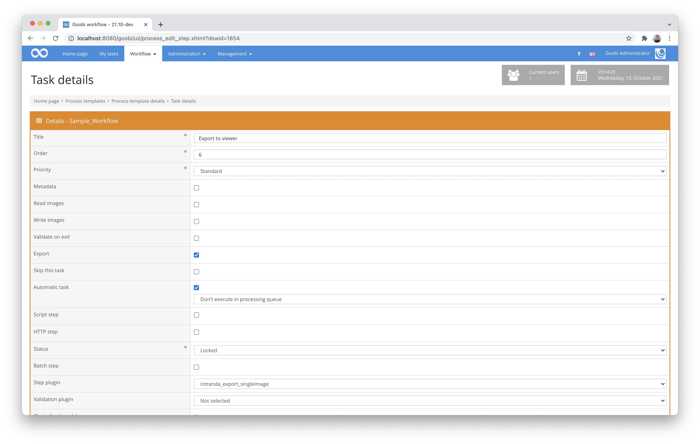

# Single Page Export

## Overview

Name                     | Wert
-------------------------|-----------
Identifier               | intranda_export_singleImage
Repository               | [https://github.com/intranda/goobi-plugin-export-bda-single-image](https://github.com/intranda/goobi-plugin-export-bda-single-image)
Licence              | GPL 2.0 or newer 
Last change    | 25.07.2024 12:04:29


## Introduction
This plugin is used for a special export of multiple METS files per process. From a single METS file within Goobi workflow, a separate METS file with the associated image files is created during the export for each structural element contained.

This plugin was developed for the Federal Office for the Protection of Monuments in Austria and is functionally geared to their needs and therefore may not be directly applicable to other use cases.


## Installation
The plugin consists of the following files to be installed:

```bash
plugin_intranda_export_bdaSingleImage-base.jar
```

This file must be installed in the following directory:

```bash
/opt/digiverso/goobi/plugins/export/plugin_intranda_export_bdaSingleImage-base.jar
```


## Overview and functionality
To put the plugin into operation, it must be activated for one or more desired tasks in the workflow. This is done as shown in the following screenshot by selecting the plugin `intranda_export_singleImage` from the list of installed plugins.



Since this plugin should usually be executed automatically, the workflow step should be configured as `automatic`. In addition, the task must be marked as an export step.

Once the plugin has been fully installed and set up, it is usually run automatically within the workflow, so there is no manual interaction with the user. Instead, calling the plugin through the workflow in the background does the following: 

For each structural element within the METS file, an independent METS file is created during the export, to which the respective image files are exported along with it. The entire METS file is not exported. The number of METS files created in this way differs accordingly from the number of Goobi processes and corresponds to the number of existing structural elements.


## Configuration
This plugin does not have its own configuration file.