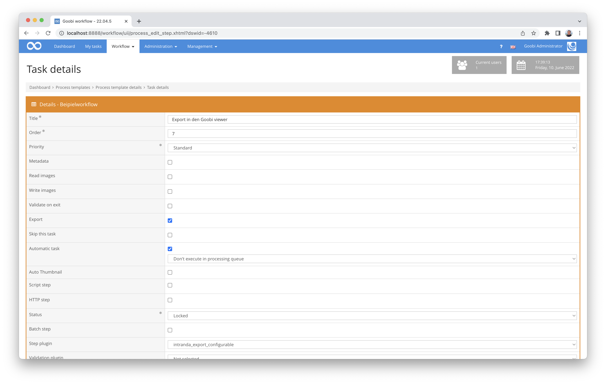
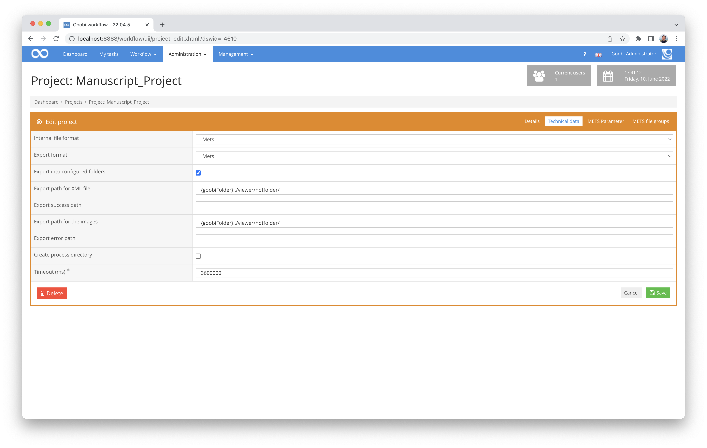

# Configurable export

## Overview

Name                     | Wert
-------------------------|-----------
Identifier               | intranda_export_configurable
Repository               | [https://github.com/intranda/goobi-plugin-export-configurable](https://github.com/intranda/goobi-plugin-export-configurable)
Licence              | GPL 2.0 or newer 
Last change    | 25.07.2024 12:04:21


## Introduction
This documentation describes how to install, configure and use an export plugin in Goobi.

Using this export plugin for Goobi, Goobi operations can be exported to multiple locations simultaneously within one operation.


## Installation
This plugin is integrated into the workflow in such a way that it is executed automatically. Manual interaction with the plugin is not necessary. For use within a work step of the workflow, it should be configured as shown in the screenshot below.



The plugin must first be copied into the following directory:

```bash
/opt/digiverso/goobi/plugins/export/plugin_intranda_export_configurable-base.jar
```

In addition, there is a configuration file that must be located in the following place:

```bash
/opt/digiverso/goobi/config/plugin_intranda_export_configurable.xml
```


## Configuration
The plugin is configured via the configuration file `plugin_intranda_export_configurable-base.jar` and via the project settings. The configuration can be adjusted during operation. The following is an example configuration file:

```xml
<?xml version="1.0" encoding="UTF-8"?>
<config_plugin>
	<!-- order of configuration is: 
	1.) project name matches 
	2.) project is * -->
	<config>
		<project>Manuscript_Project</project>
		<!-- List of folders that are included in the export. Each option can be included with the element attribute. -->
		<includeFolders>
			<!-- By default, all images in media will be exported to a _media folder, in master to a _master, etc. -->
			<media enabled="true" />
			<master enabled="true" />
			<source enabled="false" />
			<import enabled="false" />
			<export enabled="false" />
			<itm enabled="false" />
			<!-- By default all ocr folders are exported. If the optional and repeatable sub-element 'sourceFolderSuffix' is specified, only the folders 
			with the explicitly configured suffix will be copied. -->
			<ocr enabled="true">
				<!-- Export ocr folders whose names end with 'txt' or 'alto'. -->
				<sourceFolderSuffix>txt</sourceFolderSuffix>
				<sourceFolderSuffix>alto</sourceFolderSuffix>
			</ocr>
			<validation enabled="false" />
		</includeFolders>
	</config>
	
	<config>
		<project>Archive_Project</project>
		<!-- For all folders except 'ocr' configured inside the element 'includeFolders', one can use a sub-element 'destinationFolder' to configure whether a default export
		or a configured export should be used. For 'ocr' folders this does not apply, since 'ocr' folder may contain folders in itself, which makes this configuration nonsense. -->
		<includeFolders>
			<!-- If any sub-element 'destinationFolder' is configured, then the default export will be replaced with a configured export. -->
			<!-- The sub-element 'destinationFolder' is optional and repeatable. -->
			<!-- For any configured sub-element 'destinationFolder', the attribute '@name' is MANDATORY, while the attribute '@exportFileRegex' is optional. -->
			<media enabled="true">
				<!-- If the sub-element 'destinationFolder' has no '@exportFileRegex' attribute, then an empty folder with the configured '@name' will be created if it does not exist yet. -->
				<destinationFolder name="Images" />
				<!--
				<destinationFolder name="Survey Forms" exportFileRegex=".*Survey Form.*" />
				<destinationFolder name="Images/PLINExterior" exportFileRegex=".*Exterior.*" />
				-->
			</media>
			<master enabled="true" >
				<!-- If the sub-element 'destinationFolder' has both attributes configured, then a folder with the configured '@name' will be created if it does not exist yet,
				and all files whose names match the configured regular expression will be copied into that new folder. -->
				<destinationFolder name="Files_ending_with_1/files" exportFileRegex=".*1\..*" />
				<!-- ATTENTION: the regular expression configured here should be of JAVA style. -->
				<destinationFolder name="Files containing 7" exportFileRegex=".*7.*" />
			</master>
			<source enabled="false" />
			<import enabled="false" />
			<export enabled="false" />
			<itm enabled="false" />
			<!-- By default all ocr folders are exported. If the optional and repeatable sub-element 'sourceFolderSuffix' is specified, only the folders 
			with the explicitly configured suffix will be copied. -->
			<ocr enabled="false">
				<!--
				<sourceFolderSuffix>txt</sourceFolderSuffix>
				<sourceFolderSuffix>alto</sourceFolderSuffix>
				-->
			</ocr>
			<validation enabled="false" />
			<!-- To make a generic folder configuration work, one also has to configure the goobi_config.properties. -->
			<!-- The element 'genericFolder' is optional and repeatable. -->
			<!-- ATTENTION: all folders configured inside 'genericFolder' will be exported, and there is no '@enabled' attribute to configure that. Make sure that all folders are
			also correctly configured in the goobi_config.properties, otherwise it would be problematic. -->
			<genericFolder>
				<!-- In order to use 'some_folder' to configure a generic folder, say 'some_image_folder', one has to configure the goobi_config.properties in the following way: -->
				<!-- process.folder.images.some_folder=some_image_folder -->
				<!-- The path to this 'some_image_folder' should be '{imagepath}/some_image_folder', e.g. /opt/digiverso/goobi/metadata/27/images/some_image_folder -->
				some_folder
				<!-- No attribute '@exportFileRegex' configured, create an empty folder with '@name' if it does not exist yet. -->
				<destinationFolder name="empty_folder" />
				<destinationFolder name="first" exportFileRegex="^1.*" />
				<destinationFolder name="second" exportFileRegex="^2.*" />
				<destinationFolder name="txt" exportFileRegex=".*\.txt" />
			</genericFolder>
			<genericFolder>
				anotherFolder
				<destinationFolder name="third" exportFileRegex="3.*" />
			</genericFolder>
		</includeFolders>
	</config>
	
	<config>
		<project>*</project>
		<!-- An export is triggered for each 'target' condition that applies. If no 'target' condition is set, then a normal export will be performed. -->
		<!-- The 'target' element is optional, but if configured, then all three attributes are MANDATORY: -->
		<!-- 1. The '@key' attribute accepts a Goobi variable of the form '{meta.metadata name}'. -->
		<!-- 2. The '@value' attribute will be used to specify the desired value of '@key'. If set "", then the condition will be met if the metadata is empty or not set. -->
		<!-- 3. The '@projectName' attribute should contain the name of the export project with whose settings the export is to take place. If set "", then the settings
		of the project of the operation will be used for export. -->
		<target key="{meta.ViewerInstance}" value="eivfaanddigihub" projectName="eivfExportProject" />
		<target key="{meta.ViewerInstance}" value="eivfaanddigihub" projectName="gihubExportProject" />
		<target key="{meta.ViewerInstance}" value="" projectName="" />
		<!-- Whether any existing MARC-XML data should be embedded in the exported metafile. If not configured, then the default value false will be used. -->
		<includeMarcXml>false</includeMarcXml>
		<!-- List of folders that are included in the export. Each option can be included with the element attribute. -->
		<includeFolders>
			<media enabled="false" />
			<master enabled="false" />
			<source enabled="false" />
			<import enabled="false" />
			<export enabled="false" />
			<itm enabled="false" />
			<!-- Use default settings to export all ocr folders. -->
			<ocr enabled="true" />
			<validation enabled="false" />
		</includeFolders>
	</config>
</config_plugin>
```

| Parameter | Explanation |
| :--- | :--- |
| `project` | This parameter determines for which project the current block `<config>` should apply. The name of the project is used here. The `<config>` block with the `project` `*` is always used if no other block matches the project name.  
| `target` | This parameter has 3 mandatory attributes: In the `key` parameter, a Goobi variable of the form `{meta.metadata name}` should be used. The attribute `value` can then be used to specify the desired value. If `value=""` is set, the condition will be met if the metadata is empty or not set. The attribute `projectName` should contain the name of the export project with whose settings the export is to take place. If an empty string is assigned to the attribute `projectName=""`, the settings of the project of the operation will be used for export. If no target condition is set, a normal export will be performed. An export is triggered for each target condition that applies.  |
|`includeMarcXml`| This parameter determines whether any existing MARC-XML data should be embedded in the exported metafile. The default value is `false`.|


### The config block
The block `<config>` is repeatable and can thus define different metadata in different projects. The block with `<project>*</project>` is applied if no block with the project name of the project exists.


### The includeFolders block
The `includeFolders` block is located inside each `config` element. It controls which directories are to be taken into account for the export.

| Parameter | Explanation |
| :--- | :--- |
| `media` | Here you can define whether and how the media folder should be exported. |
| `master` | Here you can define whether and how the master folder should be exported. |
| `ocr` | Here you can define whether and how the ocr folder should be exported. |
| `source` | Here you can define whether and how the source folder should be exported. |
| `import` | Here you can define whether and how the import folder should be exported. |
| `export` | Here you can define whether and how the export folder should be exported. |
| `itm` | Here you can define whether and how the TaskManager folder should be exported. |
| `validation` | Here you can define whether and how the validation folder should be exported. |
| `genericFolder` | Here you can define a folder free configurable that should be exported. |
| `sourceFolderSuffix` | This sub-element of the `ocr` element is needed when using OCR folders with different suffixes. It specifies which OCR folders should be exported. If not specified, then all OCR folders will be exported. |
| `destinationFolder` | This sub-element of all folder elements except `ocr` allows you to configure which files are to be exported to which folder using its two attributes `name` and `exportFileRegex` |

If the attribute `enabled` is set to `false`, then no export of the corresponding folder will take place.

The configuration of the destination folder can be done within the project settings in the Goobi workflow user interface. If the checkbox for `Create task folder` is set there, the task will be stored in a subfolder with its title as name in the target folder.

