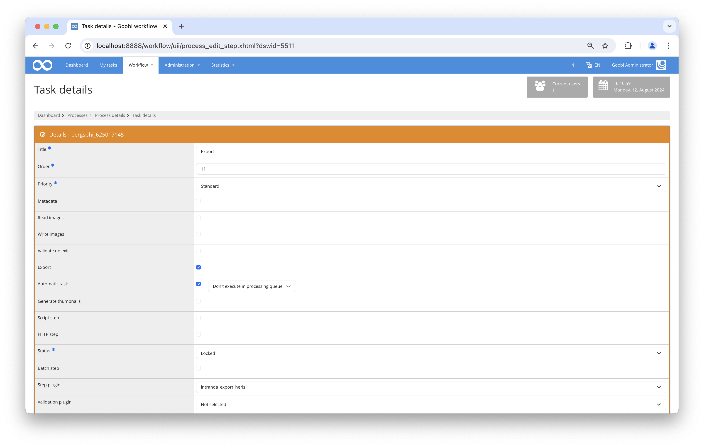

# Heris Export

## Overview

Name                     | Wert
-------------------------|-----------
Identifier               | intranda_export_heris
Repository               | [https://github.com/intranda/goobi-plugin-export-heris](https://github.com/intranda/goobi-plugin-export-heris)
Licence              | GPL 2.0 or newer 
Last change    | 13.08.2024 14:38:49


## Introduction
This documentation describes the installation, configuration and use of the Heris export plugin in Goobi.

This plugin for Goobi workflow can be used to export the images and associated metadata selected in a previous step to a JSON file. The export is then carried out via SFTP to an external server.


## Installation
The following files must be installed in order to use Heris Export:



```bash
/opt/digiverso/goobi/plugins/export/plugin_intranda_export_heris-base.jar
/opt/digiverso/goobi/config/plugin_intranda_export_heris.xml
```

An automatic step must be inserted in the workflow in which the `intranda_export_heris` plugin has been selected. This step must be carried out after the step with the "Image Selection" plugin, in which the images to be exported are selected.


## Overview and functionality
When the plugin is executed, it first checks whether at least one image has been selected in the step with the `Image Selection` plugin. If this is the case, the following tasks are carried out:

* Copying the selected images to a temporary folder
* Check whether there is already an older export for the current HERIS ID
    * If yes, create a backup of the old JSON file, download the old JSON file
    * Check whether the selected files correspond to the image names in the old JSON file
        * For each image that remains the same, the old image identifier is determined so that it can be reused in the new JSON.
        * every image that has already been exported and is no longer present in the new export is deleted remotely
        * each new image that did not exist in the old export is treated as a completely new export
* Determination of the metadata for the selected images
* Creation of the JSON file from the determined metadata, retaining the old image IDs if necessary
* Copy the generated data to the destination
* Deleting the temporary data


## Configuration
The configuration takes place in the file `plugin_intranda_export_heris.xml` as shown here:

```xml
<config_plugin>
    <config>
        <project>*</project>
        <step>*</step>
        <propertyName>plugin_intranda_step_image_selection</propertyName>

        <herisId>HERIS-ID</herisId>
        <jsonRootElement>Bilder</jsonRootElement>

        <json_format>
            <field type="identifier" name="Id"><!-- re-use old existing id --></field>
            <field type="metadata" name="Titel">TitleDocMain</field>
            <field type="metadata" name="alt_text">TitleDocMain</field>
            <field type="representative" name="Symbolbild"></field>
            <field type="static" name="media_type">JPEG</field>
            <field type="metadata" name="Aufnahmedatum">DateRecorded</field>
            <field type="metadata" name="Copyright BDA">Copyright</field>
            <field type="filename" name="Dateiinformation"></field>
            <field type="metadata" name="publikationsfähig">Published</field>
            <field type="metadata" name="Migrierte Information"></field>
        </json_format>

        <!-- sftp credentials for username + password authentication -->
        <sftp use="true">
            <username>username</username>
            <password>password</password>
            <hostname>localhost</hostname>
            <knownHosts>~/.ssh/known_hosts</knownHosts>
            <sftpFolder>/path/to/remote/folder/</sftpFolder>
            <port>22</port>
        </sftp>

        <!-- sftp credentials for username + public/private key authentication -->
        <!-- 
        <sftp use="true">
            <username>username</username>
            <keyfile>/path/to/private/key</keyfile>
            <hostname>localhost</hostname>
            <knownHosts>~/.ssh/known_hosts</knownHosts>
            <sftpFolder>/path/to/remote/folder/</sftpFolder>
            <port>22</port>
        </sftp> 
        -->

        <!-- sftp credentials for password protected public/private key authentication -->
        <!-- 
        <sftp use="true">
            <username>username</username>
            <keyfile>/path/to/private/key</keyfile>
            <password>password</password>
            <hostname>localhost</hostname>
            <knownHosts>~/.ssh/known_hosts</knownHosts>
            <sftpFolder>/path/to/remote/folder/</sftpFolder>
            <port>22</port>
        </sftp> 
        -->
    </config>
</config_plugin>
```

The `<config>` area can be repeated, allowing different exports for different projects or steps.

The `<propertyName>` field defines the property in which the selected images are saved. This value must match the configuration of the image selection plugin.

The JSON file is then described. The `<herisId>` field contains the metadata in which the HERIS ID is saved and the `<jsonRootElement>` is used to configure the name of the JSON object in which the individual images are described.

The individual fields of the image objects are described in the `<field>` list. Each field has three entries.
- The `name` attribute defines the name of the element within the JSON file.
- The value is described in the element itself.
- The `type` is used to specify what type it is. The value is interpreted differently depending on the type.

The following specifications are possible:

- `static`: The value is written unchanged as text in the JSON.
- `filename`: The image name is saved here.
- `representative`: Can contain the values `true/false`. The first image in the list is used as the representative.
- `identifier`: Contains the identifier of the image from the HERIS database. The previous identifier is reused during a re-export. The field remains empty for new exports.
- `metadata`: The value is interpreted as a metadata and determined from the metadata. The metadata is first searched for in the sub-element "photo" that was assigned to the image. If this does not exist, the metadata is expected in the main element 'Document'.

The SFTP connection is configured in the last block. Options are available here for authentication using user name and password, user name and key or user name and password-protected key.