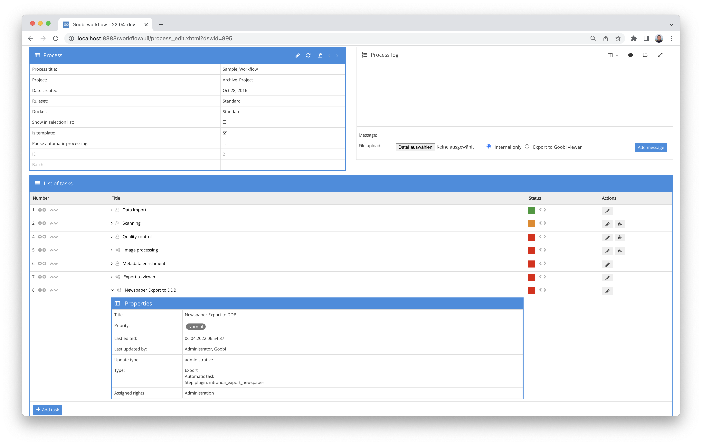

# Export for newspapers to the portal of the German Digital Library

## Overview

Name                     | Wert
-------------------------|-----------
Identifier               | intranda_export_newspaper
Repository               | [https://github.com/intranda/goobi-plugin-export-newspaper](https://github.com/intranda/goobi-plugin-export-newspaper)
Licence              | GPL 2.0 or newer 
Last change    | 25.07.2024 12:03:52


## Introduction
The plugin is used to create the METS structure for the import into the newspaper portal of the German Digital Library. A METS anchor file is created for the complete record of a newspaper, for each exported volume another METS anchor file is created and linked within the complete record. The year contains further structures for month and day.

Each output is created as individual METS files and linked in the METS anchor file of the vintage. The issue may contain further structural data such as article descriptions or supplements. The digitised images are also referenced here.

[https://wiki.deutsche-digitale-bibliothek.de/display/DFD/Gesamtaufnahme+Zeitung+1.0](https://wiki.deutsche-digitale-bibliothek.de/display/DFD/Gesamtaufnahme+Zeitung+1.0)

[https://wiki.deutsche-digitale-bibliothek.de/display/DFD/Jahrgang+Zeitung+1.0](https://wiki.deutsche-digitale-bibliothek.de/display/DFD/Jahrgang+Zeitung+1.0)

[https://wiki.deutsche-digitale-bibliothek.de/display/DFD/Ausgabe+Zeitung+1.0](https://wiki.deutsche-digitale-bibliothek.de/display/DFD/Ausgabe+Zeitung+1.0)


## Installation
The plugin consists of the following file:

```bash
plugin_intranda_export_newspaper-base.jar
```

This file must be installed in the correct directory so that it is available at the following path after installation:

```bash
/opt/digiverso/goobi/plugins/export/plugin_intranda_export_newspaper-base.jar
```

In addition, there is a configuration file that must be located in the following place:

```bash
/opt/digiverso/goobi/plugins/config/plugin_intranda_export_newspaper.xml
```


## Overview and functionality
Once the plugin has been fully installed and set up, it is usually run automatically within the workflow, so there is no manual interaction with the user. Instead, the workflow invokes the plugin in the background and performs the following tasks:

A separate METS file is created for each output, linking the images and OCR data associated with the output. The output can have further sub-elements such as articles or inserts.

The individual issues are then combined into one METS file for the year. The METS files of the issues are linked within a structure for month and day.

The last step is to check whether a record with the metadata of the entire issue exists in the target directory. If not, a METS file is created, otherwise the year is entered into the structure data of the overall recording.

To put the plugin into operation, it must be activated for a task in the workflow. This is done as shown in the following screenshot by selecting the `plugin intranda_export_newspaper` from the list of installed plugins.



Since this plugin is usually to be executed automatically, the task should be configured as automatic in the workflow. Furthermore, the task must be marked as an export step.

In addition, there must be another regular export step so that the linked images and ALTO files can be delivered via the Goobi viewer interfaces.


## Configuration
The configuration of the plugin is done via the configuration file `plugin_intranda_export_newspaper.xml` and can be adjusted during operation. The following is an example configuration file:

```xml
<?xml version="1.0" encoding="UTF-8"?>
<config_plugin>
    <export>
        <images>false</images>
        <subfolderPerIssue>false</subfolderPerIssue>
        <exportFolder>/tmp/export/</exportFolder>
        <metsUrl>https://viewer.example.org/viewer/metsresolver?id=</metsUrl>
        <resolverUrl>https://viewer.org/viewer/piresolver?id=</resolverUrl>
    </export>
    <metadata>
        <purl>_purl</purl>
        <zdbiddigital>CatalogIDPeriodicalDBDigital</zdbiddigital>
        <zdbidanalog>CatalogIDPeriodicalDB</zdbidanalog>
        <identifier>CatalogIDDigital</identifier>
        <issueDate>DateIssued</issueDate>
        <yearDate>CurrentNoSorting</yearDate>
        <titleLabel>TitleDocMain</titleLabel>
        <modsTitle>MainTitle</modsTitle>
        <volumeNumber>VolumeNo</volumeNumber>
        <issueNumber>CurrentNo</issueNumber>
        <sortNumber>CurrentNoSorting</sortNumber>
        <language>DocLanguage</language>
        <location>PhysicalLocation</location>
        <licence>UseAndReproductionLicense</licence>
        <resourceType>TypeOfResource</resourceType>
        <anchorId>AnchorID</anchorId>
        <anchorTitle>AnchorTitle</anchorTitle>
        <anchorZDBIdDigital>AnchorCatalogIDPeriodicalDBDigital</anchorZDBIdDigital>
    </metadata>
    <docstruct>
        <newspaper>Newspaper</newspaper>
        <year>Year</year>
        <month>Month</month>
        <day>Day</day>
        <issue>NewspaperIssue</issue>
        <newspaperStub>NewspaperStub</newspaperStub>
    </docstruct>
</config_plugin>
```

In the first section `<export>` some global parameters are set. Here it is determined whether images are to be exported in addition to the METS files (`<images>` `true`/`false`), whether these are to be exported per issue or per year and linked in the data sets (`<subfolderPerIssue>` `true`/`false`), to which directory the export should be made (`<exportFolder>`) and which resolvers should be written for the METS file (`<metsUrl>`) and the link to the published record (`<resolverUrl>`).

In the second section `<metadata>` a set of metadata is defined. These fields must exist in the rule set and are partly copied from the overall record to the individual outputs during the export.

The third section `<docstruct>` defines some structural elements to be generated. These must also be configured in the rule set.