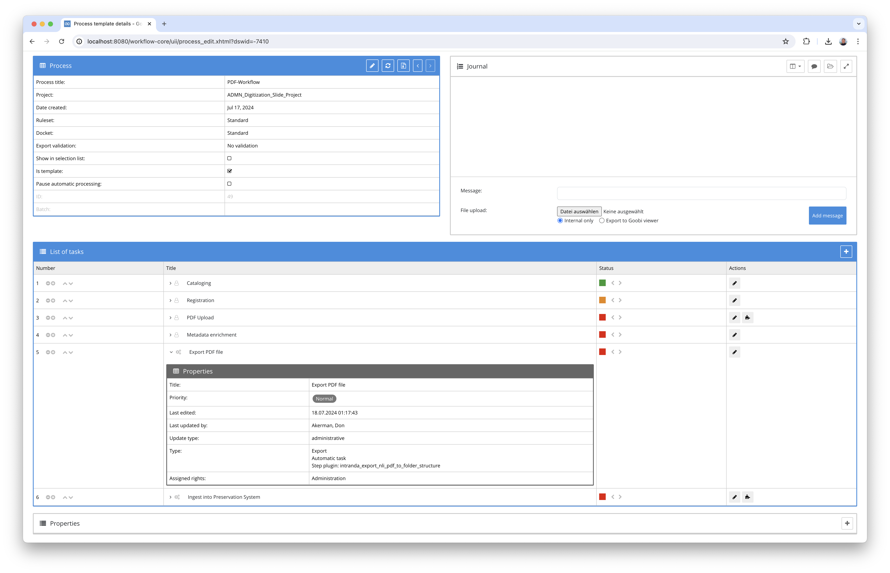
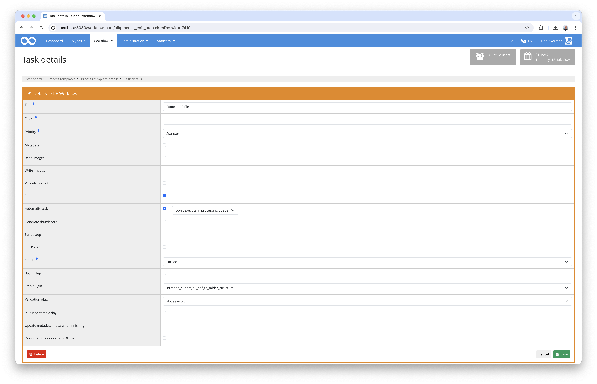

# PDF export to the NLI directory structure

## Overview

Name                     | Wert
-------------------------|-----------
Identifier               | intranda_export_nli_pdf_to_folder_structure
Repository               | [https://github.com/intranda/goobi-plugin-export-nli-pdf-to-folder-structure](https://github.com/intranda/goobi-plugin-export-nli-pdf-to-folder-structure)
Licence              | GPL 2.0 or newer 
Last change    | 18.07.2024 01:42:57


## Introduction
This documentation explains the plugin for exporting PDF files with special folder and file naming for the National Library of Israel. The plugin creates any required subfolders in a defined directory and saves an existing PDF file from the master folder with the desired name within the created folder structure.

## Installation
In order to use the plugin, the following files must be installed:

```bash
/opt/digiverso/goobi/plugins/export/plugin-export-nli-pdf-to-folder-structure-base.jar
/opt/digiverso/goobi/config/plugin_intranda_export_nli_pdf_to_folder_structure.xml
```

Once the plugin has been installed, it can be selected within the workflow for the respective workflow steps and thus executed automatically. A workflow could look like the following example:



To use the plugin, it must be selected in a workflow step:




## Overview and functionality
The plugin is executed automatically during the workflow and reads the parameters from the configuration file. On this basis, the plugin then determines metadata from the respective process. The information thus determined is then used to generate a directory path for the export and to create the directory if it does not already exist. The plugin then generates a file name that ends with a counter. The file name generated in this way is checked to see whether it is already in use, so that the counter is adjusted if necessary to obtain a file name that is not yet in use. The first PDF document is then determined from the master directory of the Goobi process and saved under the previously generated file name within the directory path.


## Configuration
The plugin is configured in the file `plugin_intranda_export_nli_pdf_to_folder_structure.xml` as shown here:

```xml
<config_plugin>
 
    <!-- export root folder (e.g. /opt/digiverso/export/nli) -->
	<exportFolder>/opt/digiverso/export/nli</exportFolder>
	
	<!-- metadata field with publication date information
		you can use variable replacer expressions here like e.g.: 
		- $(meta.CatalogIDDigital) 
		- $(meta.topstruct.TitleDocMain) 
		- $(process.Template) -->
	<metdataPublicationDate>$(meta.DateOfOrigin)</metdataPublicationDate>

	<!-- metadata field with code information 
		you can use variable replacer expressions here, too -->
	<metdataPublicationCode>$(meta.Type)</metdataPublicationCode>

	<!-- pattern to use for reading the date information -->
	<dateReadPattern>yyyy-MM-dd</dateReadPattern>

	<!-- pattern to use for writing the date information -->
	<dateWritePattern>yyyyMMdd</dateWritePattern>

</config_plugin>
```

The parameters used are described here: 

Parameter                | Explanation
-------------------------|------------------------------------
`exportFolder`           | Main directory for the export (e.g. `/opt/digiverso/export`)
`metdataPublicationDate` | Metadata for the publication date; the syntax for the VariableReplacer can be used here (e.g. `$(meta.DateOfOrigin)`)
`metdataPublicationCode` | Metadata for the publication code; the syntax for the VariableReplacer can be used here (e.g. `$(meta.Type)`)
`dateReadPattern`        | Pattern for reading the publication date (e.g. `yyyy-MM-dd`)
`dateWritePattern`       | Pattern for writing the current and publication date (e.g. `ddMMyyyy`)