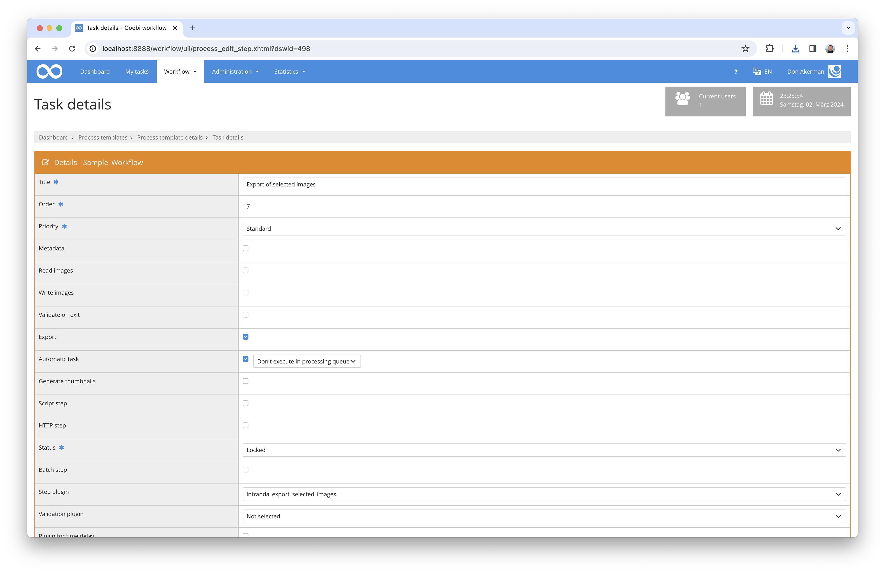

# Export of selected images

## Overview

Name                     | Wert
-------------------------|-----------
Identifier               | intranda_export_selected_images
Repository               | [https://github.com/intranda/goobi-plugin-export-selected-images](https://github.com/intranda/goobi-plugin-export-selected-images)
Licence              | GPL 2.0 or newer 
Last change    | 25.07.2024 12:03:45


## Introduction
This documentation describes the installation, configuration and use of the plugin for exporting selected images in Goobi workflow.

With the help of this plugin for Goobi workflow, Goobi processes can export the previously selected images and, if desired, the associated METS file to a configured location either in the file system or via SCP within a single work step.


## Installation
This plugin is integrated into the workflow in such a way that it is executed automatically. For use within a workflow step, it should be configured as shown in the screenshot below.



The plugin must first be copied to the following directory:

```bash
/opt/digiverso/goobi/plugins/export/plugin_intranda_export_selected_images-base.jar
```

In addition, there is a configuration file that must be located in the following place:

```bash
/opt/digiverso/goobi/config/plugin_intranda_export_selected_images.xml
```


## Configuration
The plugin is configured via the configuration file `plugin_intranda_export_selected_images.xml`. The configuration can be adjusted during operation. The following is an example configuration file:

```xml
<?xml version="1.0" encoding="UTF-8"?>
<config_plugin>
	<!-- 
	Order of configuration is: 
	1.) project name matches
	2.) project is * 
	-->

	<!-- There could be multiple config blocks. -->
	<!-- Please make sure that the project names of different config blocks are also different. -->
	<!-- Given two config blocks with the same project name, the settings of the first one will be taken. -->
	<config>
		<project>*</project>
		<step>*</step>
		<!-- whether or not to export a METS file, DEFAULT false -->
		<exportMetsFile>false</exportMetsFile>
		<!-- whether or not to create subfolders for the results in the target folder, DEFAULT false -->
		<createSubfolders>true</createSubfolders>
		<!-- the name of the process property which contains information of selected images -->
		<propertyName>plugin_intranda_step_image_selection</propertyName>
		<!-- name of the source folder, media | master | ... -->
		<sourceFolder>media</sourceFolder>
		<!-- absolute path to the target folder for the export, where there is no difference whether you append a '/' to the end or not -->
		<targetFolder>CHANGE_ME</targetFolder>
		
		<!-- whether or not to use scp for the export, DEFAULT false -->
		<useScp>false</useScp>
		<!-- name to login to the remote server via ssh, MANDATORY if useScp is set true  -->
		<scpLogin>CHANGE_ME</scpLogin>
		<!-- password to login to the remote server via ssh, MANDATORY if useScp is set true -->
		<scpPassword>CHANGE_ME</scpPassword>
		<!-- name or ip of the remote host that awaits the export, MANDATORY if useScp is set true -->
		<scpHostname>CHANGE_ME</scpHostname>
	</config>
        
	<config>
		<project>Manuscript_Project</project>
		<step>*</step>
		<exportMetsFile>false</exportMetsFile>
		<createSubfolders>true</createSubfolders>
		<!-- propertyName can also be set using a goobi variable -->
		<propertyName>{process.NAME}</propertyName>
		<!-- media | master | ... -->
		<sourceFolder>media</sourceFolder>
		<!-- path can also be set using a goobi variable, where there is no difference whether you add a '/' between '}' and '..' or not -->	
		<targetFolder>{goobiFolder}../viewer/hotfolder/</targetFolder>
		
		<useScp>false</useScp>
		<scpLogin>CHANGE_ME</scpLogin>
		<scpPassword>CHANGE_ME</scpPassword>
		<scpHostname>CHANGE_ME</scpHostname>
	</config>

</config_plugin>
```