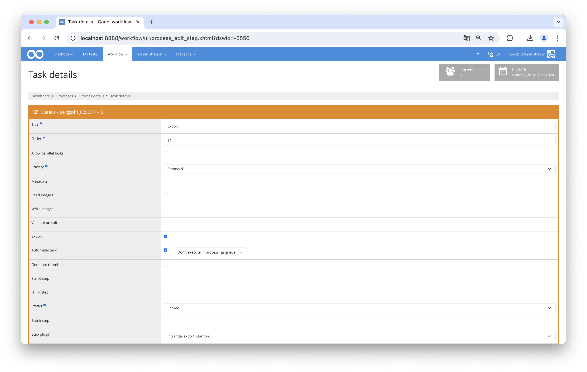

# Stanford Export

## Overview

Name                     | Wert
-------------------------|-----------
Identifier               | intranda_export_standford
Repository               | [https://github.com/intranda/goobi-plugin-export-stanford](https://github.com/intranda/goobi-plugin-export-stanford)
Licence              | GPL 2.0 or newer 
Last change    | 04.09.2024 08:59:05


## Introduction
The present documentation describes the installation, configuration, and use of the Stanford Export Plugin in Goobi workflow.

## Installation
To be able to use the plugin, the following files must be installed:

```bash
/opt/digiverso/goobi/plugins/export/plugin_intranda_export_stanford.jar
```

In addition, there is a configuration file that must be located at the following location:

```bash
/opt/digiverso/goobi/config/plugin_intranda_export_stanford.xml
```

To use the plugin, it must be selected in a workflow step:




## Overview and functionality
An export step must be configured:

* Export DMS
* Automatic task
* Plugin for workflow step: `intranda_export_stanford`

During the execution of the step, an export of the Goobi process (similar to exporting to the file system) is performed into the configured directory.

Within this directory, subfolders are created based on the identifier. For example, the identifier `qx797sg1405` would generate the following structure: `/path/to/folder/qx/797/sg/1405`. Within this folder, two additional folders are created: `metadata` and `content`.

In the `content` folder, all generated images, and if available, the ALTO files and single-page PDFs are stored. Additionally, a complete PDF file is generated from the single pages. The `metadata` folder contains an XML file with information about the files within the content folder.

Finally, the configured URL to the REST API is called to initiate the ingest into the system.


## Configuration
The plugin is configured in the file `plugin_intranda_export_stanford.xml` as shown here:

```xml
<?xml version="1.0" encoding="UTF-8"?>
<config_plugin>
	<!-- this additional temporary destination folder can stay empty to get ignored -->
	<tempDestination>/tmp</tempDestination>
	<!-- this is the main folder where the result is exported to -->
	<destination>/tmp</destination>
	<metadataFileName>stubContentMetadata.xml</metadataFileName>
	<apiBaseUrl>http://example.com/</apiBaseUrl>
    <delay>10</delay>
	<endpoint>accession</endpoint>	
    <accessToken>Bearer abcdefghijklmnopqrstuvwxyz</accessToken>
    <queryParameter name="description" value="reaccession-via-goobi" />
    <queryParameter name="opening_user_name" value="goobi" />
    <queryParameter name="significance" value="major" />
</config_plugin>

```

The following table contains a summary of the parameters and their descriptions:

Parameter               | Explanation
------------------------|------------------------------------
| `tempDestination`  | If this element is present and not empty, the metadata will be written to this folder as `dor_export_{objectId}`.xml`.                                |
| `destination`      | Root directory for the exported data.                                                                                                               |
| `metadataFileName` | Name of the metadata file, containing entries for each exported file.                                                                               |
| `dela`             | If this element is present and contains a number greater than 0, the configured number of seconds will be waited after successful export before calling the REST API. |
| `apiBaseUrl`       | Base URL for the REST API.                                                                                                                          |
| `endpoint`         | Endpoint for the REST API.                                                                                                                          |
| `accessToken`      | Contains the token required for authenticating the REST API.                                                                                        |
| `queryParameter`   | Contains a query parameter in the attributes `name` and `value`, which is appended to the URL as `&name=value`. This field is repeatable.           |