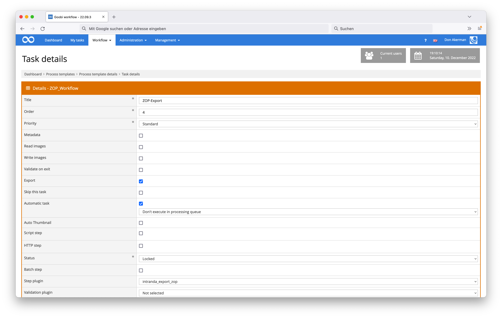

# ZOP Export

## Overview

Name                     | Wert
-------------------------|-----------
Identifier               | intranda_export_zop
Repository               | [https://github.com/intranda/goobi-plugin-export-zop](https://github.com/intranda/goobi-plugin-export-zop)
Licence              | GPL 2.0 or newer 
Last change    | 25.07.2024 12:03:26


## Introduction
This documentation describes the installation, configuration and use of the ZOP export plugin in Goobi.

Using this plugin for Goobi, Goobi operations can be exported to the configured location for ZOP within one step.


## Installation
This plugin is integrated into the workflow in such a way that it is executed automatically. For use within a workflow step, it should be configured as shown in the screenshot below.



The plugin must first be copied to the following directory:

```bash
/opt/digiverso/goobi/plugins/export/plugin_intranda_export_zop-base.jar
```

In addition, there is a configuration file that must be located in the following place:

```bash
/opt/digiverso/goobi/config/plugin_intranda_export_zop.xml
```


## Configuration
The plugin is configured via the configuration file `plugin_intranda_export_zop.xml`. The configuration can be adjusted during operation. The following is an example configuration file:

```xml
<?xml version="1.0" encoding="UTF-8"?>
<config_plugin>
	<!--
	Order of configuration is:
	1.) project name matches
	2.) project is *
	-->

	<!-- There could be multiple config blocks. -->
	<!-- Please make sure that the project names of different config blocks are also different. -->
	<!-- Given two config blocks with the same project name, the settings of the first one will be taken. -->
	<config>
		<!-- The name of the project. -->
		<!-- MANDATORY -->
		<project>Archive_Project</project>

		<!-- The name of the item identifier, e.g. CatalogIDDigital.  -->
		<!-- For one-volume works, the value of this Metadata field will be used as the folder's as well as the .ctl file's name. -->
		<!-- For multi-volume works, the value of this Metadata field will be used as the name's first part. -->
		<!-- MANDATORY -->
		<identifier>CatalogIDDigital</identifier>

		<!-- The name to be used to distinguish between different volumes of one book series. -->
		<!-- Alternatively one may also choose "TitleDocMain", just assure its difference between volumes. -->
		<!-- For one-volume works, the value of this Metadata field will not be used. BUT do NOT leave it blank anyway. -->
		<!-- For multi-volume works, the value of this Metadata field will be used as the second part of the folder's and the .ctl file's name. -->
		<!-- MANDATORY -->
		<volume>CurrentNoSorting</volume>

		<!-- The place you would like to use for the export. -->
		<!-- Absolute path expected. No difference whether you append the directory separator '/' to the end or not. -->
		<!-- If left blank, then the default setting '/opt/digiverso/viewer/hotfolder' will be used. -->
		<path></path>
		
		<!-- Whether or not use SFTP for the export. -->
		<!-- If true then use SFTP. If false then perform local export. -->
		<!-- If left blank, then the default setting 'false' will be used. -->
		<sftp>true</sftp>

		<!-- User name at the remote host. -->
		<!-- MANDATORY if sftp is set to be true. -->
		<username>CHANGE_ME</username>

		<!-- Name of the remote host. -->
		<!-- MANDATORY if sftp is set to be true. -->
		<hostname>CHANGE_ME</hostname>

		<!-- Path to the private key file, e.g. ~/.ssh/id_rsa -->
		<!-- The key is expected to be of PEM format, beginning with `BEGIN RSA PRIVATE KEY`. -->
		<!-- The OPENSSH format, beginning with `BEGIN OPENSSH PRIVATE KEY`, is not supported yet. -->
		<!-- MANDATORY if sftp is set to be true. -->
		<keyPath>CHANGE_ME</keyPath>
	</config>

	<config>
		<project>Manuscript_Project</project>
		<identifier>CatalogIDDigital</identifier>
		<volume>CurrentNoSorting</volume>
		<!-- Setting up path using a goobi variable. -->
		<!-- No difference whether you add a '/' between '}' and '..' or not. -->		
		<path>{goobiFolder}../viewer/hotfolder/</path>
		
		<sftp>false</sftp>
		<username></username>
		<hostname></hostname>
		<keyPath></keyPath>
	</config>

	<config>
		<project>*</project>
		<identifier>CatalogIDDigital</identifier>
		<volume>CurrentNoSorting</volume>
		<!-- Setting up path using an ABSOLUTE path. -->
		<path>/opt/digiverso/viewer/hotfolder</path>
		
		<!-- Use the default setting 'false'. -->
		<sftp></sftp>
		<username></username>
		<hostname></hostname>
		<keyPath></keyPath>
	</config>

</config_plugin>
```

| Parameter         | Explanation                                                                                                            |
|:----------------- |:---------------------------------------------------------------------------------------------------------------------- |
| `identifier`      | This parameter determines which metadatum is to be used as the folder name. |
| `volume`          | This parameter controls with which metadata the subdirectories for volumes are to be named. |
| `path`            | This parameter sets the export path where the data is to be exported. An absolute path is expected. |
| `sftp`       | This parameter determines whether to use SFTP for the export process or not. |
| `username`   | This parameter determines the user name to log into the remote host. |
| `hostname`   | This parameter determines the name of the remote host or its IP address. |
| `keyPath`   | This parameter determines the privte key to be used to log into the remote host as `username`@`hostname`. |