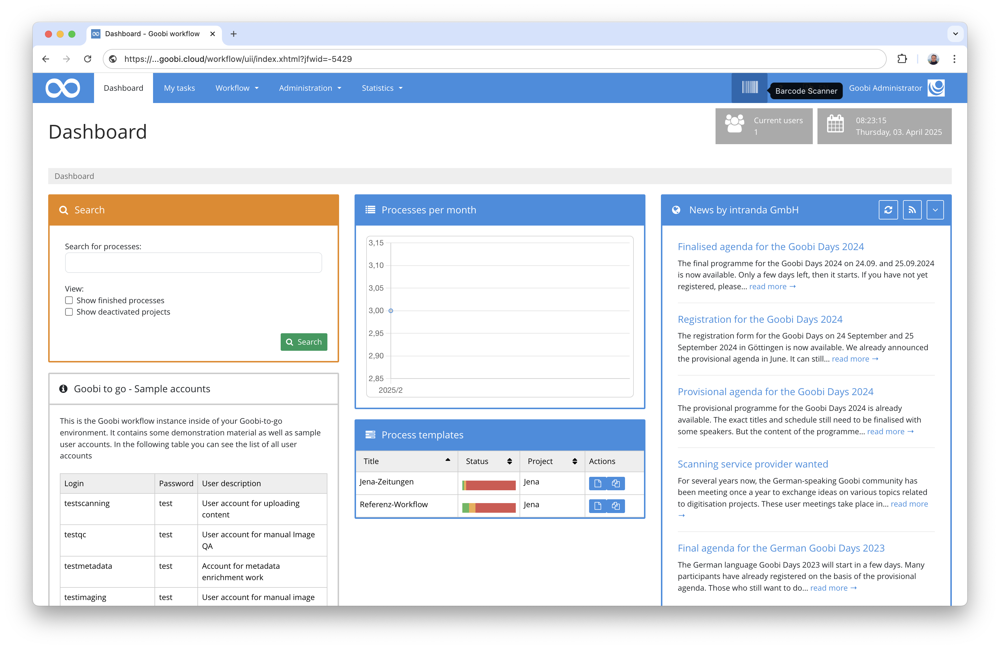
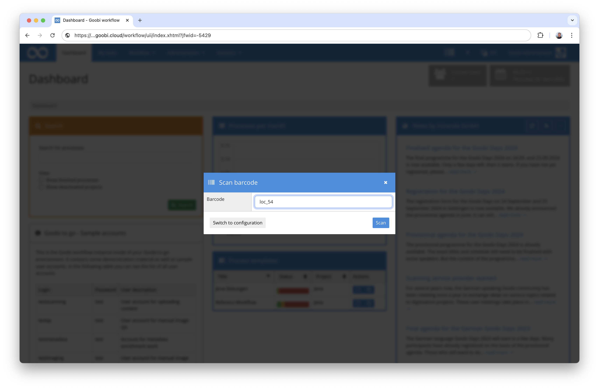
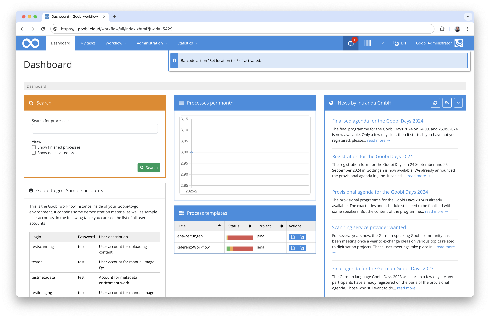
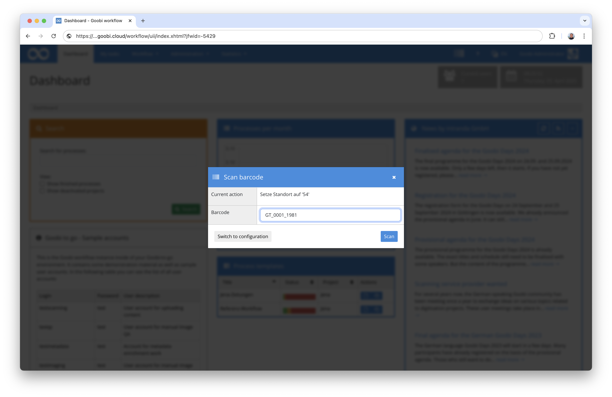
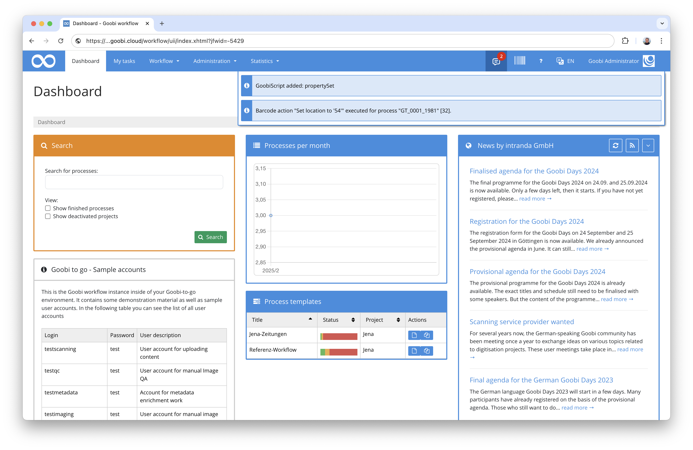
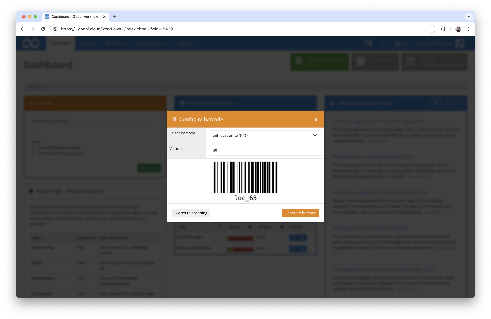

# Barcode Scanner

## Overview

Name                     | Wert
-------------------------|-----------
Identifier               | intranda_generic_barcodeScanner
Repository               | [https://github.com/intranda/goobi-plugin-generic-barcode-scanner](https://github.com/intranda/goobi-plugin-generic-barcode-scanner)
Licence              | GPL 2.0 or newer 
Last change    | 03.04.2025 15:11:37


## Introduction
This plugin allows you to execute any configurable GoobiScripts by scanning parameterised barcodes. 


## Installation
In order to use the plugin, the following files must be installed:

```bash
/opt/digiverso/goobi/plugins/generic/plugin-generic-barcode-scanner-base.jar
/opt/digiverso/goobi/plugins/GUI/plugin-generic-barcode-scanner-gui.jar
/opt/digiverso/goobi/config/plugin_intranda_generic_barcodeScanner.xml
```

Once the plugin has been installed, it can be integrated at various points in the user interface (for example as a barcode button in the menu bar).




## Overview and functionality
When entering the plugin, a dialogue window appears in which barcodes can be both scanned and generated.

### Scan view
In the scan view of the plugin, a barcode can then be entered manually in the ‘Barcode’ field or scanned using a barcode scanner.



If the barcode corresponds to a configured barcode format, the corresponding GoobiScript is activated.



If the plugin is re-entered and a process title is then scanned, the previously activated GoobiScript is applied to this process.





Batches can also be scanned instead of processes. In this case, the GoobiScript is executed for all processes in the batch.

### Configuration view
In the configuration view of the plugin, barcodes can be generated for configured barcode formats. To do this, select a barcode format
from the drop-down list. Values can then be entered for all parameters of the barcode format. You can then have the configured barcode generated so that it can be used in any other programme or printed out via drag-and-drop, for example.




## Configuration
The plugin is configured in the file `plugin_intranda_generic_barcodeScanner.xml` as shown here:

```xml
<config>
    <docking>MENU_BAR</docking>
    <barcode description="Setze Vorgangseigenschaft '{{1}}' auf '{{2}}'" pattern="ps_(.*)_(\d+)" sample="ps_Standort_54">
        ---
        action: propertySet
        name: {{1}}
        value: {{2}}
	</barcode>
</config>
```

### General parameters 
The `<config>` block contains parameters that can be used for all generic plugins: 

| Parameter | Explanation | 
| :-------- | :---------- | 
| `docking` | This element is used to control where the plugin is to be integrated. With `MENU_BAR`, for example, the plugin can be displayed in the main bar. The element can be repeated to integrate the plugin in several places. The values `FOOTER` and `MENU_BAR` can currently be selected to display the plugin either in the menu bar or in the footer bar. | 


### Weitere Parameter 
Neben den allgemeinen Parametern stehen die folgenden Parameter für die weitergehende Konfiguration zur Verfügung: 


Parameter               | Explanation
------------------------|------------------------------------
`barcode`               | The `barcode` element can be repeated as often as required to specify barcode formats. A barcode format has the attributes `description`, `pattern` and `sample`. <br /><br />The `description` is a textual description of the barcode format. If the barcode format can contain parameters, these can be included in the description with `{{n}}`. In this case, `n` must be replaced by the number of the parameter, starting with `1`.<br /><br />The `pattern` is a regular expression that describes the entire barcode. Groups can be defined with brackets in the regular expression. This can be used to define parts of the barcode as parameters. In the case of the example configuration, `(\d+)` is a group that describes a number with at least one digit. This group can then be used as `{{1}}` (the first parameter).<br /><br />The `sample` is a possible sample barcode. This is used during barcode generation to display possible sample barcodes. This sample barcode must match the regular expression.<br /><br />The content of the `barcode` element is any GoobiScript. Several GoobiScripts can also be entered in succession with `---`. With `{{n}}` the parameters of the barcode can be used in GoobiScript.

As the configuration is somewhat complex, we will explain it using the example of the second barcode format in the configuration:

The barcode has the description `Set operation property ‘{{1}}’ to ‘{{2}}’`. The regular expression is `ps_(.*)_(\d+)` and an example barcode could be `ps_location_54`.
The regular expression matches all inputs beginning with `ps_`, followed by anything, then again an underscore `_` followed by a number with at least one digit.
If such a barcode is scanned, for example `ps_location_54`, the following GoobiScript is activated:
```yaml
action: propertySet
name: Standort
value: 54
```
The two placeholders `{{1}}` and `{{2}}` have already been replaced here by the values `location` and `54` of the scanned barcode.

If a process title is now scanned, this GoobiScript is executed for the process. As a result, the process property ‘Location’ is set to the value ‘54’.