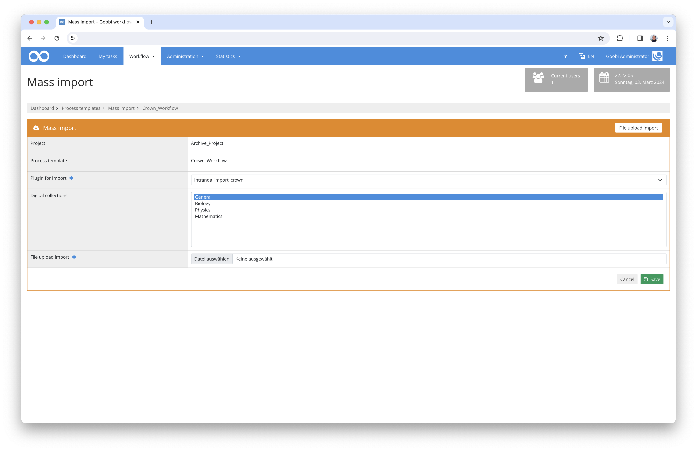

# Archive data import

## Overview

Name                     | Wert
-------------------------|-----------
Identifier               | intranda_import_crown
Repository               | [https://github.com/intranda/goobi-plugin-import-crown](https://github.com/intranda/goobi-plugin-import-crown)
Licence              | GPL 2.0 or newer 
Last change    | 25.07.2024 12:03:18


## Introduction
This documentation describes the installation, configuration and use of the import plugin for archive data from a hierarchically organised Excel file.

This plugin can be used to import data from an Excel file. The individual lines are converted to Goobi processes and images can be imported automatically. In addition, a hierarchical EAD tectonics is also created.


## Installation
To be able to use the plugin, the following files must be installed:

```bash
/opt/digiverso/goobi/plugins/import/plugin_intranda_import_crown-base.jar
/opt/digiverso/goobi/config/plugin_intranda_import_crown.xml
```

In addition, the XML database `BaseX` must be running in the background and set up correctly. The installation is described in detail [here](https://docs.goobi.io/goobi-workflow-plugins-en/administration/intranda_administration_archive_management/installation_for_productive_use).


## Overview and functionality
To use the import, the mass import area must be opened in the production templates and the plugin `intranda_import_crown` selected in the file upload import tab. An Excel file can then be uploaded and imported.



The Excel file to be imported must contain the following structure as an example:

|  |  |          |                       |                                |          |     |                                                  |
|:---|:---|:---|:---|:---|:---|:---|:---|
|  |  |          |                       |                                |                                                        |  Shelfmark       | Comment |
| **CR_1** | <font color="grey">Reichskrone</font> |          |                       |                                |                                                        | CR_1 | comment |
|      | **CR_1_A-H**    | <font color="grey">Kronreif</font> |                       |                                |                                                        | CR_1_A-H | another comment |
|      |             | **CR_1_A**   | <font color="grey">Platte A, Stirnplatte</font> |                                |                                                        |   |   |
|      |             |          | **CR_1_A_GrPl**           | <font color="grey">Grundplatte</font>                    |                                                        |   |   |
|      |             |          |                       | **CR_1_A_GrPl_1**                  | <font color="grey">Riss in Grundplatte (?)</font>                                |   |   |
|      |             |          |                       | **CR_1_A_GrPl_2**                  | <font color="grey">Riss in Grundplatte und Grundplattenperldrahtumsäumung</font> |   |   |
|      |             |          |                       | **CR_1_A_GrPl_3**                  | <font color="grey">Riss in Grundplatte</font>                                    |   |   |
|      |             |          |                       | **CR_1_A_GrPl_4**                  | <font color="grey">Riss in Grundplatte und Grundplattenperldrahtumsäumung</font> |   |   |
|      |             |          |                       | **CR_1_A_GrPl_5**                  | <font color="grey">Deformierung von Grundplatte</font>                           |   |   |
|      |             |          |                       | **CR_1_A_GrPl_6**                  | <font color="grey">Steg durch Öffnung in Grundplatte hinter Fa_4</font>          |   |   |
|      |             |          |                       | **CR_1_A_GrPl_7**                  | <font color="grey">4 Löcher in Grundplatte</font>                                |   |   |
|      |             |          |                       | **CR_1_A_GrPl_8**                  | <font color="grey">Löcher in Grundplatte</font>                                  |   |   |
|      |             |          |                       | **CR_1_A_GrPl_9**                  | <font color="grey">4 Löcher in Grundplatte</font>                                |   |   |
|      |             |          |                       | **CR_1_A_GrPl_10**                 | <font color="grey">angelöteter Span auf Grundplatte</font>                       |   |   |
|      |             |          | **CR_1_A_SchS**           | <font color="grey">Scharnierstift</font>                 |                                                        |   |   |
|      |             |          | CR_1_A_SchR           | <font color="grey">Scharnierrohre</font>                 |                                                        |   |   |
|      |             |          |                       | **CR_1_A_SchR_1**                  | <font color="grey">Scharnierrohr</font>                                          |   |   |
|      |             |          |                       | **CR_1_A_SchR_2**                  | <font color="grey">Scharnierrohr</font>                                          |   |   |
|      |             |          |                       | **CR_1_A_SchR_3**                  | <font color="grey">Scharnierrohr</font>                                          |   |   |
|      |             |          | **CR_1_A_GrUm**           | <font color="grey">Grundplattenperldrahtumsäumung</font> |                                                        |   |   |
|      |             |          |                       | **CR_1_A_GrUm_1**                  | <font color="grey">Grundplattenperldrahtumsäumung</font>                         |   |   |
|      |             |          |                       | **CR_1_A_GrUm_2**                  | <font color="grey">Grundplattenperldrahtumsäumung</font>                         |   |   |
|      |             |          | **CR_1_A_GrFi**           | <font color="grey">Grundplattenfiliigrandekor</font>     |                                                        |   |   |
|      |             |          | CR_1_A_RoeG           | <font color="grey">Röhrchen mit Granalien</font>         |                                                        |   |   |
|      |             |          |                       | **CR_1_A_RoeG_1**                  | <font color="grey">Röhrchen mit Kugelpyramide</font>                             |   |   |
|      |             |          |                       | **CR_1_A_RoeG_2**                  | <font color="grey">Röhrchen mit Kugelpyramide</font>                             |   |   |


This Excel file is read and analysed line by line during the import. It first checks how deeply the current row has been indented. If there is no indentation, the root element of the tectonics is present. Otherwise, these are sub-elements. The parent element of each row is the last element with a lower indentation.

Next, the content of the cells is read. Both the hierarchically indented cells and any existing fixed columns are taken into account.

Which content is imported for which EAD or metadata field is defined in the corresponding configuration file.

If the first piece of information within the Excel file is formatted **bold**, a process is also created for this row and a search is carried out for associated images. These images are expected within a configured folder in subfolders named after the inventory number. These can either be organised flat in a folder list or follow the same hierarchical structure as the tectonics.

If a folder is found, all the files it contains are listed and checked according to the following rules:

1. ignore all data that is not a `tif`, `jpg` or `wmv`.
2. ignore all files that contain the word `compressed`.
3. if a file without the suffix `_edited` is found, check if there is a file with the same name and the suffix `_edited`. If so, ignore the current file and use the version with `_edited`.
4. if an `jpg` file was found, check if there is a `tif` with the same name, if yes, ignore the `jpg` file and use the `tif`


## Configuration
The configuration is done in the file `plugin_intranda_import_crown.xml`:

```xml
<config_plugin>
	<config>
		<!-- which workflow template shall be used -->
		<template>*</template>

		<!-- define if import shall use GoobiScript to run in the background -->
		<runAsGoobiScript>false</runAsGoobiScript>
		
		<!-- first data row in excel file -->
		<startRow>7</startRow>

		<!-- basex database name and file name -->
        <basex>
            <database>EadStore</database>
            <filename>ead.xml</filename>
        </basex>

              <!-- metadata -->
        <metadata>
            <!-- document type for the process, can be a fixed value or a column header name -->
            <doctype>File</doctype>

            <!-- column header for the node type, leave it empty when a fixed type should be used (file for nodes with processes, folder for all other)  -->
            <nodetype></nodetype>
            
            <!-- process title metatada -->
            <!-- can be generated from other fields like "CatalogIDDigital + '_' + ContentDescription" , or use 'first' and 'second' to get the hierarchical information-->
            <title>first</title>

            <!--    
                - @eadField: name of the field in ead record
                - @metadataField: name of the metadata field in mets file
                - @identifier: one field must be marked as the identifier field
                - @level: metadata level, allowed values are 1-7:
                    * 1: metadata for Identity Statement Area 
                    * 2: Context Area 
                    * 3: Content and Structure Area
                    * 4: Condition of Access and Use Area
                    * 5: Allied Materials Area
                    * 6: Note Area
                    * 7: Description Control Area 
                    -->
            <firstField eadField="recordid" metadataField="CatalogIDDigital" level="1" identifier="true" />

            <!-- if enabled is set to false, the field is not searched in the hierarchical part. In this case, a
            separate configuration for the fixed area can exist -->
            <secondField enabled="true" metadataField="TitleDocMain" eadField="unittitle" level="1"/>

            <!-- fixed metadata columns-->
            <additionalField column="Shelfmark" eadField="Shelfmark" metadataField="shelfmarksource" level="1"/>
            <additionalField column="Comment" eadField="oddnote" metadataField="Odd" level="6"/>

        <!-- image folder name. Sub folder are organized by the identifier metadata -->
        <images>/opt/digiverso/import/crown/</images>


	</config>
</config_plugin>
```

The `<template>` field defines the production template for which the current configuration is to be used. As the `<config>` element is repeatable, different configurations are possible for different production templates. For example, there may be a different configuration for the imperial crown than for the imperial orb.

The `<runAsGoobiScript>` field controls whether the import is executed directly in the user session or in the background as GoobiScript. The use of GoobiScript is recommended for larger Excel files.

`<startRow>` determines which row is the first data row of the Excel file. This allows further information such as headers, descriptions or help texts to be specified above it, which are then ignored by the import.

The `<basex>` area defines where the EAD tectonics are saved. The sub-element `<database>` contains the name of the BaseX database, which must already exist. The name of the EAD file is defined in `<filename>`. If this name is already used, existing data is overwritten.

The root folder of the images is defined in the `<images>` element. `<metadata>` contains the metadata to be used. The structure type is defined using `<doctype>` and the fields `<title>`, `<identifier>` and `<description>` contain the names of the metadata for title, inventory number and description text.

The mapping of the metadata takes place within the `<metadata>` block. The publication type to be used for the individual METS files is defined here in `<doctype>`.

The node type to be used can then be defined if it is available as an Excel column. This is done in `<nodetype>`. If this is not the case, the field can be left empty. In this case, `file` is used for all nodes for which a process has been created; all other nodes are assigned the type `folder`. 

The generation of task titles is configured in `<title>`. The same rules apply here as in the normal creation mask. In addition, the two keywords `first` and `second` are available to access the content of the two hierarchical fields.

The metadata mapping to EAD and METS/MODS is then configured. The first hierarchical field is defined in `<firstField>`, `<secondField>` optionally contains the content of the second field. If only one field is used, it can be deactivated using `enabled="false"`. Additional, permanently defined columns can be configured using `<additionalField>`. Here, the heading of the column must be specified in the `column` attribute. The other configuration options are identical to the other two. The `metadataField` field defines the metadata to be used within the METS/MODS file. The corresponding field in the EAD node is defined in `eadField` and `level` specifies the area in which the metadata is located. 

In addition, a field must be marked as `identifier="true"`. The content of this field must be unique for each line within the document and is used for the `id` of the EAD nodes and the metadata `NodeId`. It is used to link EAD nodes and Goobi processes.