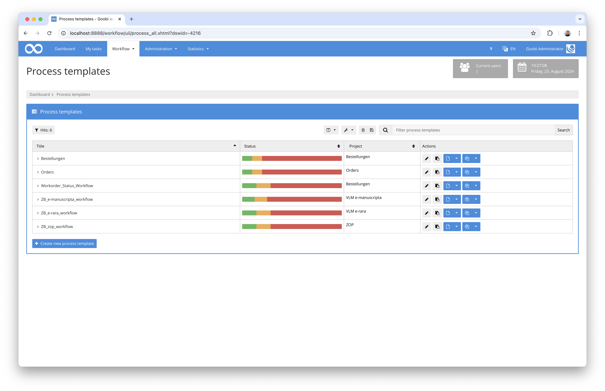
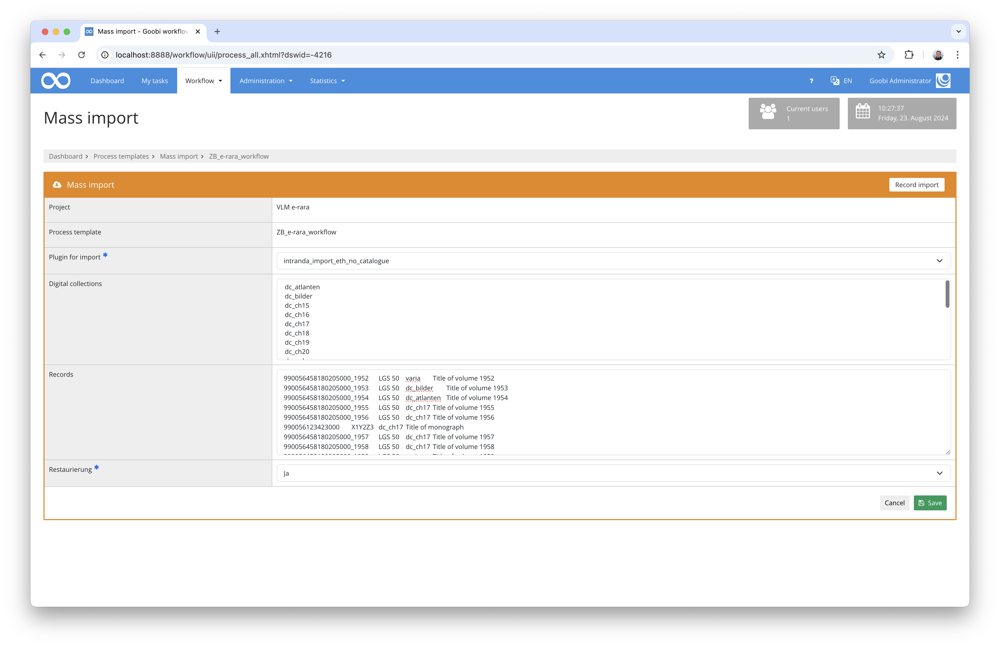

# Data import without catalogue query for ETH Zurich

## Overview

Name                     | Wert
-------------------------|-----------
Identifier               | intranda_import_eth_no_catalogue
Repository               | [https://github.com/intranda/goobi-plugin-import-eth-no-catalogue](https://github.com/intranda/goobi-plugin-import-eth-no-catalogue)
Licence              | GPL 2.0 or newer 
Last change    | 18.11.2024 16:38:04


## Introduction
This import plugin allows data to be imported without a previous catalogue query. It inserts data into the user interface that has previously been copied from an Excel file and where the columns are separated from each other using `TAB`.

## Installation
To be able to use the plugin, the following files must be installed:

```bash
/opt/digiverso/goobi/plugins/import/plugin-import-eth-no-catalogue-base.jar
/opt/digiverso/goobi/config/plugin_intranda_import_eth_no_catalogue.xml
```

Once the plugin has been installed, it can be accessed from the overview of production templates by using the second blue button next to the selected production template.



Once the plugin has been entered, a user interface is available in which the data to be imported can be selected or uploaded.




## Overview and functionality
After selecting the correct plugin, the data, which is either available as TAB-separated CSV data or copied from an Excel file, can be inserted into the `Records` field in the user interface. The data has the following structure:

Column    | Metadata        | Explanation
----------|-----------------|-------------------------
`1`       | `MMS-ID`        | If this contains an underscore, a multi-volume work is created, otherwise a monograph. This is a mandatory entry.
`2`       | `Shelfmark`     | This is a mandatory entry.
`3`       | `Collection`    | Specification of the collection to be assigned. This is a mandatory entry.
`4`       | `Title`         | This is an optional specification.

Immediately after inserting the data and clicking on `Save`, the creation of the processes starts without a catalogue being requested.


## Configuration
The plugin is configured in the file `plugin_intranda_import_eth_no_catalogue.xml` as shown here:

```xml
<config_plugin>
	<config>

		<!-- which workflow template shall be used -->
		<template>*</template>

		<!-- which digital collection to use 
		<collection>General</collection> 
		-->

		<!-- define if import shall use GoobiScript to run in the background -->
		<runAsGoobiScript>true</runAsGoobiScript>

	</config>
</config_plugin>

```

The following table contains a summary of the parameters and their descriptions:

Parameter               | Explanation
------------------------|------------------------------------
`template`              | This can be used to define which production template the respective `config` block should apply to. 
`runAsGoobiScript`      | This parameter can be used to specify whether the import should take place as GoobiScript in the background.