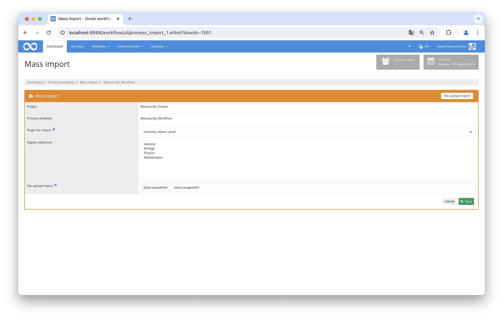

# Importing records from an Excel file

## Overview

Name                     | Wert
-------------------------|-----------
Identifier               | intranda_import_excel
Repository               | [https://github.com/intranda/goobi-plugin-import-excel](https://github.com/intranda/goobi-plugin-import-excel)
Licence              | GPL 2.0 or newer 
Last change    | 13.08.2024 14:33:43


## Introduction
This documentation describes the installation, configuration and use of the plugin for mass importing data sets from Excel files.


## Installation
The plugin must be installed in the following folder:

```bash
/opt/digiverso/goobi/plugins/import/plugin_intranda_import_excel-base.jar
```

There is also a configuration file, which must be located at the following place:

```bash
/opt/digiverso/goobi/config/plugin_intranda_import_excel.xml
```

## Overview and functionality
To use the import, the mass import area must be opened in the production templates and the plugin `intranda_import_excel` selected in the File upload import tab. An Excel file can then be uploaded and imported.

The import then takes place line by line. A new process is created for each line and the configured rules are applied. If a valid data record has been created and the generated task title has not yet been assigned, the task is actually created and saved.



## Configuration
The configuration is done via the file `plugin_intranda_import_excel.xml`. This file can be adapted during operation.

```xml
<config_plugin>
    <config>
        <!-- which workflow template shall be used -->
        <template>*</template>

        <!-- publication type to create -->
        <publicationType>Monograph</publicationType>

        <!-- which digital collection to use -->
        <collection>mycollection</collection>

        <!-- define if a catalogue shall get requested to import metadata -->
        <useOpac>true</useOpac>
        <!-- which catalogue to use (as default) -->
        <opacName>GBV PICA</opacName>
        <!-- which catalogue to use per record; if missing the default will be used -->
        <opacHeader>Catalogue</opacHeader>
        <searchField>12</searchField>

        <!-- define in which row the header is written, usually 1 -->
        <rowHeader>1</rowHeader>
        <!-- define in which row the data starts, usually 2 -->
        <rowDataStart>2</rowDataStart>
        <!-- define in which row the data ends, usually 20000 -->
        <rowDataEnd>20000</rowDataEnd>

        <!-- define which column is the one to use for catalogue requests -->
        <identifierHeaderName>PPN-A</identifierHeaderName>

        <!-- Rules to generate the process title, the same syntax as in goobi_projects.xml can be used.
            Use the column names to get the right metadata values.
            If the field is missing or empty, the value of CatalogIDDigital is used. -->
        <processTitleRule>2-Titel+'_'+PPN-O</processTitleRule>

        <!-- prefix path to the image folder. Can be empty or missing if the import doesn't contain images or if the excel field contains absolute path  -->
        <imageFolderPath>/opt/digiverso/images/</imageFolderPath>
        <!-- define which column contains the image folder name. Can be combined with <imageFolderPath> prefix or an absolute path.
        If the field is missing, empty or does not contain an existing directory, no images will be imported -->
        <imageFolderHeaderName>images</imageFolderHeaderName>

        <!-- defines, if images are moved from the source folder to the destination (true) or copied (false) -->
        <moveFiles>true</moveFiles>

        <!-- Run the import as GoobiScript -->
        <runAsGoobiScript>true</runAsGoobiScript>

        <!-- Overwrite any existing processes -->
        <replaceExistingProcesses>true</replaceExistingProcesses>

        <!-- define here which columns shall be mapped to which ugh metadata
            ugh: name of the metadata to use. if it is empty or missing, no metadata is generated
            headerName: title inside of the header column
            property: name of the process property. if it is empty or missing, no process property gets generated
            normdataHeaderName: title of the header column to use for a gnd authority identifier
            docType: define if the metadata should be added to the anchor or child element. Gets ignored, when the
            record is no multivolume. Default is 'child', valid values are 'child' and 'anchor' -->
        <metadata ugh="CatalogIDSource" headerName="PPN-A" />
        <metadata ugh="CatalogIDDigital" headerName="PPN-O" />
        <metadata ugh="TitleDocMain" headerName="2-Titel" />
        <metadata ugh="PlaceOfPublication" property="Ort" normdataHeaderName="4-GND-ORT" headerName="3-Ort" docType="anchor" />
        <metadata ugh="DocLanguage" headerName="10-DocLanguage" />

        <!-- a configuration for a person might look like this -->
        <person ugh="Author" normdataHeaderName="7-GND-Person" docType="child">
            <!-- use this field if the column contains the complete name -->
            <nameFieldHeader>11-Person</nameFieldHeader>
            <!-- set this field to true, if the name must be splitted into first- and lastname. The complete name gets written into lastname -->
            <splitName>true</splitName>
            <!-- define at which character the name is separated. @firstNameIsFirstPart defines, if the firstname is the first or last part of the name -->
            <splitChar firstNameIsFirstPart="false">, </splitChar>

            <!-- use this fields, if the firstname and lastname are in different columns -->
            <!--
            <firstname>5-Vorname</firstname>
            <lastname>6-Nachname</lastname>
            -->
        </person>

    </config>

    <config>
        <!-- which workflow template shall be used -->
        <template>json_opac_import</template>

        <!-- publication type to create -->
        <publicationType>Monograph</publicationType>
        <collection>DefaultCollection</collection>

        <useOpac>true</useOpac>
        <opacName>ArchiveSpace</opacName>
        <opacHeader>Catalogue Name</opacHeader>

        <!-- define in which row the header is written, usually 1 -->
        <rowHeader>1</rowHeader>
        <!-- define in which row the data starts, usually 2 -->
        <rowDataStart>2</rowDataStart>
        <!-- define in which row the data ends, usually 20000 -->
        <rowDataEnd>20000</rowDataEnd>

        <processTitleRule>aspace_uri+bib_id+'_'+barcode+holdings+item</processTitleRule>

        <!-- Run the import as GoobiScript -->
        <runAsGoobiScript>false</runAsGoobiScript>

        <metadata opacSearchField="ao" headerName="aspace_uri" />
        <metadata opacSearchField="bib" headerName="bib_id" />
        <metadata opacSearchField="type" headerName="barcode" />
        <metadata opacSearchField="type" headerName="holdings" />
        <metadata opacSearchField="type" headerName="item" />
    </config>
</config_plugin>
```


### Individual configurability
It is possible to create a global configuration for all production templates as well as individual settings for individual production templates. The element `config` can be repeated in the XML file. If mass import has been selected in Goobi, the system always searches for the configuration block with the name of the selected production template in the `template` element. If such an entry does not exist, the `default` configuration is used. This is marked with `*`.

```xml
<!-- which workflow template shall be used -->
<template>*</template>
```


### Collection
With the optional element `collection` it is possible to define a collection to be inserted into all records. In addition, collections can also be selected from the interface, or the collection can be imported as part of the Excel file or from the catalog.

```xml
<!-- which digital collection to use -->
<collection>Example collection</collection>
```


### Catalogue import
The next four elements `use-Opac`, `opacName`, `opacHeader` and `searchField` control whether a catalogue query should be performed during the import. If `useOpac` contains the value `true`, such a query is performed. The catalogue and the search field configured in the fields are used for this. The name of the catalogue must correspond to an entry in the Goobi configuration file `goobi_projects.xml`. It can either be permanently defined in the `opacName` parameter or used dynamically from a line of the relevant record (the `opacHeader`). The structure type is automatically recognised by the OPAC data.

```xml
<!-- define if an opac request is made -->
<useOpac>true</useOpac>
<!-- name of the configured catalogue -->
<opacName>K10Plus</opacName>
<!-- which catalogue to use per record; if missing the default will be used -->
<opacHeader>Catalogue</opacHeader>
<!-- field to search in -->
<searchField>12</searchField>
```

However, if no OPAC is used, the structure type of the operations to be created must be specified in the `publicationType` field. The name used here must exist within the ruleset. If the OPAC is to be used, this field is not evaluated.

```xml
<!-- publication type to create -->
<publicationType>Monograph</publicationType>
```


### Line range
The following elements describe the structure of the Excel file to be imported.

`rowHeader` defines the row in which the column headings that are later relevant for the mapping were entered. This is usually the first line. However, this can also differ for multi-line entries.

```xml
<!-- define in which row the header is written, usually 1 -->
<rowHeader>1</rowHeader>
```

`rowDataStart` and `rowDataEnd` describe the area that contains the data. Usually, these are the lines that follow the `rowHeader` directly, but special formatting can also contain blank lines that can be removed using this.

```xml
<!-- define in which row the data starts, usually 2 -->
<rowDataStart>2</rowDataStart>
<!-- define in which row the data ends, usually 20000 -->
<rowDataEnd>20000</rowDataEnd>
```


### Identifier
The `identifierHeaderName` entry contains the heading of the column in which an identifier is contained. This field is used internally to identify the rows. This value is used for an OPAC query. In addition, this value is also used to generate the transaction title if no other generation has been specified for the transaction title.

```xml
<!-- define which column is the one to use for catalogue requests and to identify the row during the import -->
<identifierHeaderName>Identifier</identifierHeaderName>
```


### Process title
The element `processTitleRule` is used to generate the operation title. The same options are available here that can also be used in the Goobi configuration file `goobi_projects.xml`.

```xml
<!-- Rules to generate the process title, the same syntax as in goobi_projects.xml can be used.
     Use the column names to get the right metadata values.
     If the field is missing or empty, the value of the identifier column is used.
-->
<processTitleRule>'StaticPrefix_'+Identifier</processTitleRule>
```

The `processTitleRule` can be provided with the additional parameter `replacewith`. The character specified here (e. g. `replacewith="_"`) replaces all special characters with this character.


### Transfer of images
The elements `imageFolderHeaderName`, `imageFolderPath` and `moveFiles` can be used to import images in addition to metadata. In `imageFolderHeaderName` the column name is entered, in which the folder names containing the images can be found in the Excel file. Either an absolute path or a relative path can be specified there.

If a relative path is specified, the element `imageFolderPath` must contain the root path to the images. The element `moveFiles` can be used to control whether the images should be copied or moved.

```xml
<!-- define which column contains the image folder name. Can be combined with <imageFolderPath> prefix or an absolute path.
      If the field is missing, empty or does not contain an existing directory, no images will be imported -->
<imageFolderHeaderName>image folder</imageFolderHeaderName>

<!-- prefix path to the image folder. Can be empty or missing if the import doesn't contain images or if the excel field contains absolute path  -->
<imageFolderPath>/mnt/images/</imageFolderPath>

<!-- defines, if images are moved from the source folder to the destination (true) or copied (false) -->
<moveFiles>true</moveFiles>
```


### Execution using GoobiScript
The element `runAsGoobiScript` controls whether an import should be processed asynchronously in the background via the GoobiScript queue or whether the import should be processed directly within the user session. Here you have to consider which setting makes sense. If an import including images is to take place or if the Excel file contains a lot of data records, it probably makes more sense to perform this import as GoobiScript.

```xml
<!-- Run the import as GoobiScript -->
<runAsGoobiScript>true</runAsGoobiScript>
```

`Note:` If the `identifierHeaderName` column does not contain a unique identifier or has not been configured, the `runAsGoobiScript` option cannot be used.


### Configuration of the individual Excel columns
The fields `metadata`, `person` and `group` can be used to import individual columns as metadata or as process properties. Each field contains a number of attributes and sub-elements.

### Import metadata
The `metadata` element is used to generate descriptive metadata..

| Name | Type | Description |
| :--- | :--- | :--- |
| `headerName` | Attribut | Column header in the Excel file |
| `ugh` | Attribut | Name of the metadata |
| `property` | Attribut | Name of the property |
| `docType` | Attribut | `anchor` or `child` |
| `normdataHeaderName` | Attribut | Column header of a column with associated identifiers |
| `opacSearchField` | Attribut | Definition of which search field should be used for the catalogue query. This is necessary for the use of the JSON-Opac-Plugin. |

The `headerName` attribute contains the column header. The rule only applies if the Excel file contains a column with this title and the cell is not empty. At least one of the two attributes `ugh` and `name` must exist. The `ugh` field can contain the name of a metadata. If this is the case (and the metadata is allowed for the configured publication type), a new metadata is created. `name` creates a property with this name.

The `docType` attribute becomes relevant if a multi-volume work or journal has been imported from the catalog. This can be used to control whether the field should belong to the entire recording or to the volume.

If, in addition to the content, there is another column with standard data identifiers or URIs, this column can be added to the `normdataHeaderName` attribute.


### Import of persons
The `person` element can be used to automatically create persons.

| Name | Type | Description |
| :--- | :--- | :--- |
| `ugh` | Attribut | Name of the person role |
| `docType` | Attribut | `anchor` or `child` |
| `normdataHeaderName` | Attribut | Column header of a column with associated identifiers |
| `firstnameFieldHeader` | Element | Column header of field for first name |
| `lastnameFieldHeader` | Element | Column header for surnames |
| `nameFieldHeader` | Element | Column header for the complete name |
| `splitName` | Element | Defines whether the value in `nameFieldHeader` should be split. |
| `splitChar` | Element | Element at which splitting takes place. Default is the first space character. |
| `firstNameIsFirstPart` | Attribut | Defines the order in which the data was entered. |

Persons differ from normal metadata in that they consist of first and last names. This specification can be in two different columns, then the elements `firstnameFieldHeader` and `lastnameFieldHeader` are used. If the names are only in one column, the field `nameFieldHeader` is used. In this case, the system checks whether the specifications should only contain the surname or whether the content must be split. With `splitChar` you can set the character/sequence at which the splitting should take place. The attribute `firstNameIsFirstPart` contains the information whether the name is to be imported as `First name Last name` or `Last name First name`.


### Import of metadata groups
Metadata groups can be created using the `group` element.

| Name | Type | Description |
| :--- | :--- | :--- |
| `ugh` | Attribut | Name of the metadata group |
| `docType` | Attribut | `anchor` or `child` |
| `metadata` | Element | Metadata within the group |
| `person` | Element | Person within the group |

A metadata group consists of several metadata and persons. The configuration of the individual sub-elements is identical to that of the individual metadata and persons.